# 计算机系统概述

概述考纲

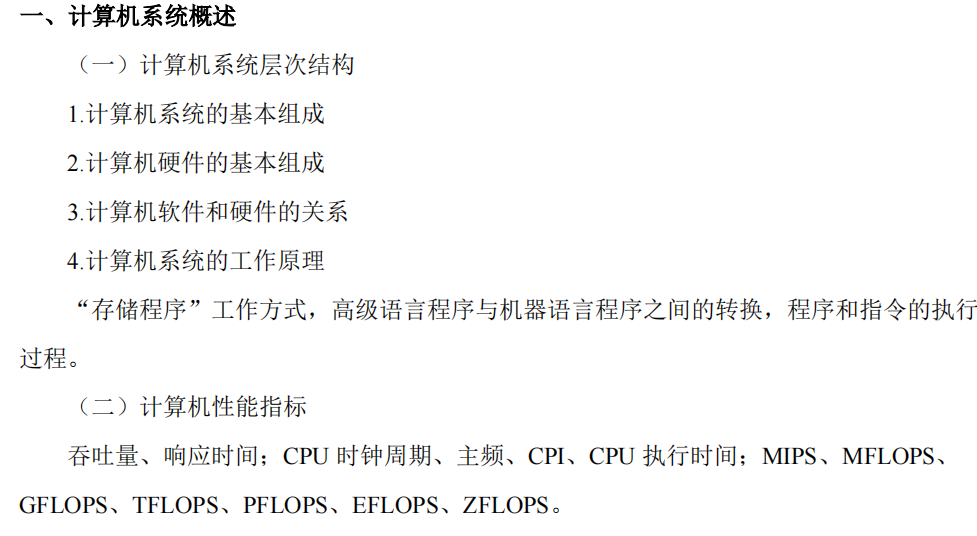

计算机系统的组成：
- 硬件：**物理装置**。
- 软件：**程序、数据、文档**。

## 冯诺依曼机

计算机硬件的组成：（冯诺依曼机、五大组成部件）
- **运算器**：进行算术运算和逻辑运算。核心为 **算术逻辑单元 ALU** ，它包含以下寄存器：**ACC、MQ(乘商寄存器)、X、IX(变址寄存器)、BR(基址寄存器)、PSW(程序状态寄存器、标志寄存器)** 。
- **控制器**：控制计算机各部件协调工作。由 **指令寄存器 IR** 和 **程序计数器 PC** 及 **控制单元 CU** 组成。
- **存储器**：存放程序和数据。分为 **内存** 和 **外存** 两种。
- **输入设备**：将外部信息转换为计算机可识别的形式。
- **输出设备**：将计算机处理结果转换为人类可识别的形式。

**运算器＋控制器=CPU，CPU+主存=主机，主机+外设=计算机系统。外设：除主机外的所有硬件设备，如输入输出设备、外存等。**

**计算机软件和硬件的逻辑功能具有等价性。**

## 计算机系统的层次结构

计算机系统的层次结构

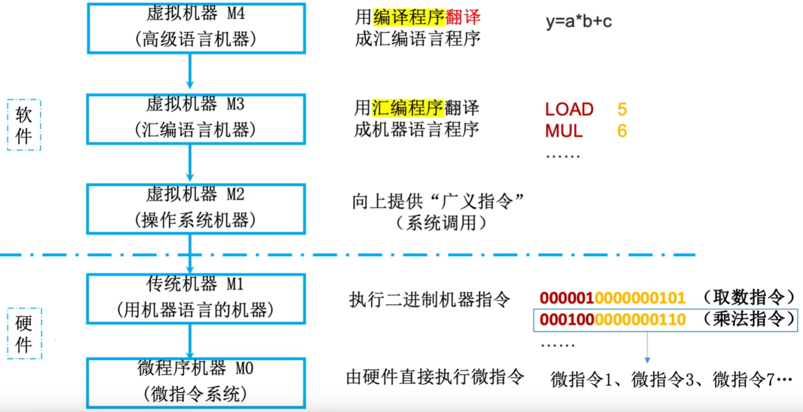

仅有最低两层层的系统为 裸机，即没有软件。高三层称为虚拟机，软件实现的机器，**只对其观察者存在**。

软硬之间的界面就是 **指令集体系结构 ISA** 。

计组课主要探讨低两层，即裸机部分。

## 工作原理

- 存储程序：执行前把指令和数据调入主存，执行时自动逐条完成指令，无需人工干预。
- 源程序到可执行程序：预处理、编译、汇编、链接
- 指令的执行过程，后面会详细介绍。

冯诺依曼机的基本工作方式是 **控制流驱动** 方式。

## 性能指标

| 指标   | 含义                                               |
| ------ | -------------------------------------------------- |
| 吞吐量 | 单位时间内处理请求的数量，主要取决于主存的存储周期 |
| 主频   | 每秒的时钟周期数                                   |
| CPI    | 执行一条指令所需的时钟周期数（或者平均值           |
| IPS    | 每秒执行的指令数                                   |
| MIPS   | 每秒执行的百万条指令数                             |
| FLOPS  | 每秒执行的浮点运算次数(Floating-point Operations)  |

> 机器脉冲源发出的脉冲信号经 整形 和 分频 后形成时钟脉冲信号。

时钟周期的确定：
- 以相邻状态单元间组合逻辑电路的最长传输延迟为基准确定
- 以指令流水线的每个流水段的最长传输延迟为基准确定

升序的数量级字母：K、M、G、T、P、E、Z、Y。相差 $2^{10}$ 或 $10^3$ 倍。

## 一些杂记

- 固件：将程序固化在ROM中组成的部件，具有软件性质的的硬件。
- 寄存器由触发器构成
- **指令寄存器对用户不可见**，即透明的
- **CPI与时钟频率无关，但可加快指令的执行时间**，与指令集体系结构有关
- 逻辑电路相同说明平均CPI相同
- 一台机器是否具备乘法指令是一个结构的问题，**如何实现**是个组成的问题 

# 数据的表示和运算

数据的表示和运算24大纲

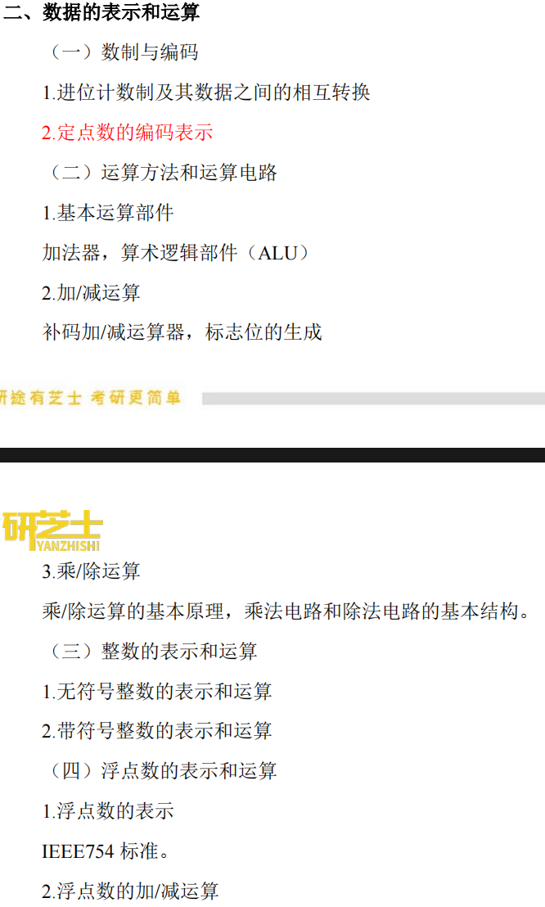

## 数制与编码

后缀B表示二进制，O表示八进制，D表示十进制，H表示十六进制。

前缀0b表示二进制，0表示八进制，0x表示十六进制。

r进制数的十进制表示：

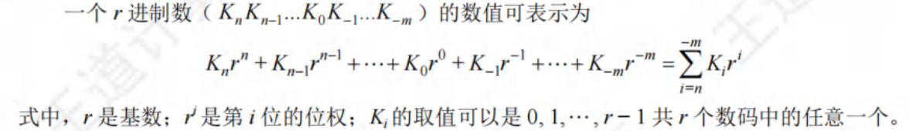

知道了这个表示就可以理解十进制转其他进制的两个过程了：对整数使用 **除基取余法**，对小数使用 **乘基取整法**。

带有 `+、-` 符号的数称为 **真值**（正号可以省略）；**将符号数字化**，例如用0表示正号，1表示负号，称为 **机器数**

定点小数是纯小数，定点整数是纯整数。

四个数轴描述 **原码、补码、反码、移码**：

四大编码

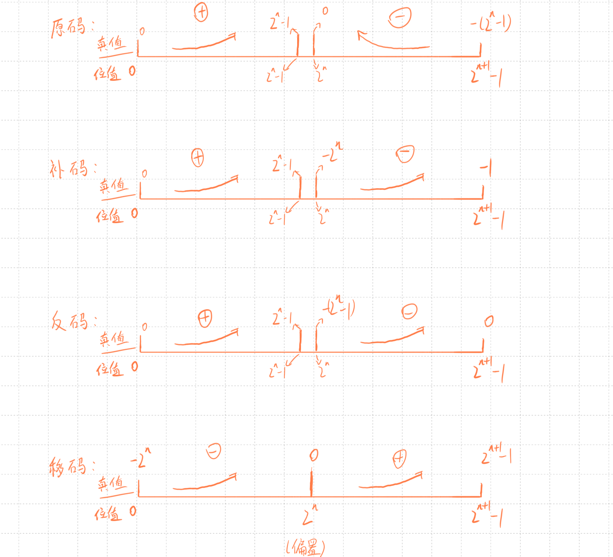

**要注意移码的偏置可选。**

取反的本质就是获得当前数与最大数的差值，有助于理解各种编码的运算。

变形补码是一种采用双符号位的补码，也称 模4补码。用于ALU的运算，只在运算过程中使用，不存储。

C 语言中数据类型的位数：

| char | short 或 short int | int | long 或 long int               |
| ---- | ------------------ | --- | ------------------------------ |
| 8    | 16                 | 32  | 32位机器32位数，64位机器64位数 |

- 除了 char 外，其他类型的数据都默认为**有符号数**。无论是有符号数还是无符号数，都是用 **补码** 表示的。
- 强制类型转换保持**位值不变，改变解释方式**。
- 有符号和无符号同时参与运算，C规定按**无符号运算**。
- 大字长转小字长，直接截断高位；小字长转大字长，高位**补符号位**。

## 运算电路和定点数的运算方法

基本部件有 加法器 和 算术逻辑单元。 算术逻辑单元的核心部件就是加法器。

> 逻辑移位、算术移位、补码定点数加减运算。

定点数加减电路

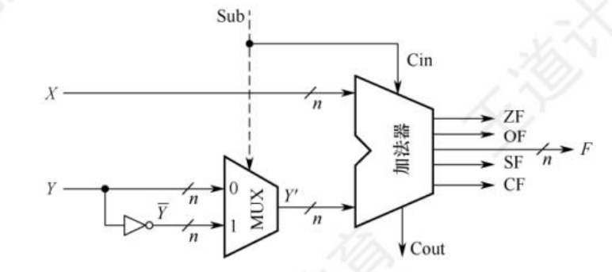

**减法都是用 被减数 + 减数的负数的补码（$\overline{Y}+1$）实现的。**

上图电路说明，加减电路接受 $X,Y,\text{Sub}$，根据 $\text{Sub}$ 选择 $Y' =Y \text{or}\  \overline{Y}$，把 $\text{Sub}$ 作为加法器的进位输入，最后计算 $X+Y'+\text{Sub}$。 

> 如果了解具体运算电路会发现，不仅仅只是做相应的运算的，还会有其他运算都做，比如与或非等，然后通过一个多路选择器（MUX）选择需要的结果，MUX接收控制器传来的信号选择输出。

补码定点数加减法判断溢出有3种方法：1. 采用一位符号位 2. 采用两位符号位 3. 采用一位符号位根据符号位的进位及最高数值位的进位判断。

图中四种标志信息的含义：
- ZF 零标志位：顾名思义，F=0时ZF=1
- OF 溢出标志位：符号位进位与最高数值位进位的异或结果，即第3种溢出判断方法，$\text{OF}=C_n\oplus C_{n-1}$。显然，对于无符号数，OF没有意义。
- SF 符号标志位：表示结果的符号位，显然，对于无符号数，SF没有意义。
- CF 进/借位标志位：用以**无符号数运算的判溢**。加法时若最有高位有进位则溢出，减法时若最高位无进位则溢出，即 $\text{CF}=\text{Sub}\oplus C_{out}$ （因为是补码）。

### 乘除运算

两个电路图：

32位无符号乘法

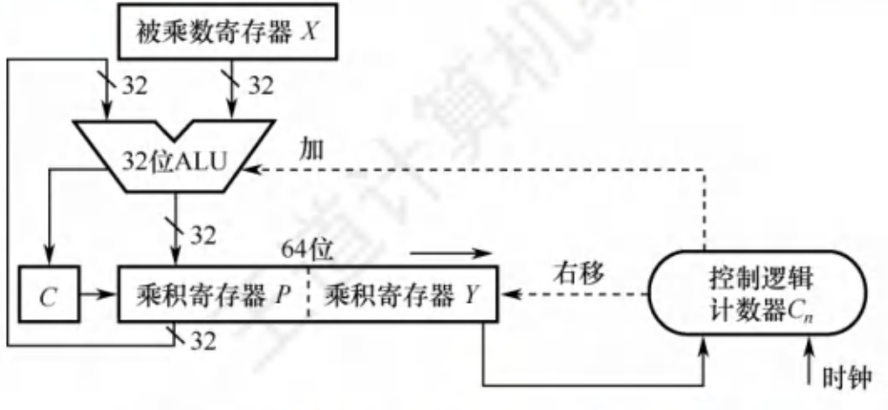

$X\times Y$。初始$P$置零，$Y$ 逐位右移交与控制逻辑计算器判断是否为1，若为1则 $P=P+X$。$P、X$ 同步右移以实现 $X$ 升到高位进行加法。

32位无符号除法

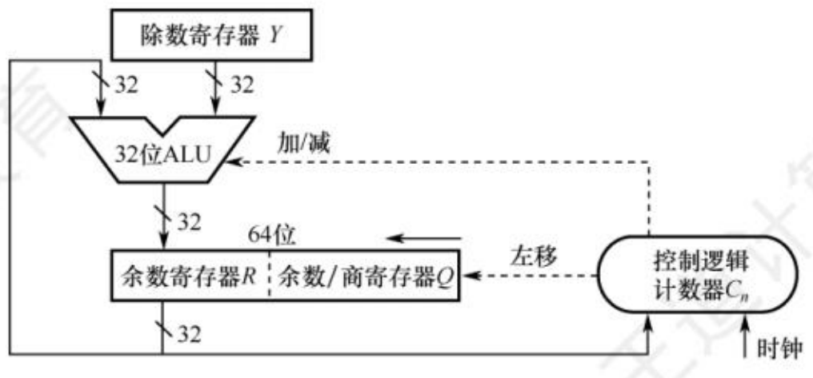

$X/Y$。 $X$ 扩充为64位，高位为 $R$，低位为 $Q$。首先执行 $R-Y$ 的减法，若结果为正则上商1，即 $RQ$ 左移一位，低位补1；否则恢复余数，即执行 $R+Y$ 的加法，$RQ$ 左移一位，低位补0。

> 上面的乘除运算都是原码的

## 浮点数

浮点数格式

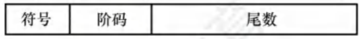

阶码决定范围，尾数决定精度。浮点数规格化是为了保留尽可能多的有效数字，即应使得尾数真值满足： $1/2\le |M| <1$ 。

### IEEE754浮点数

IEEE754浮点数格式

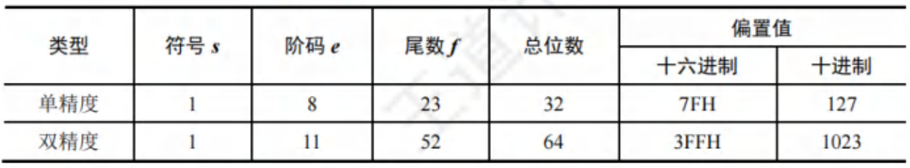

尾数用 **原码** 表示，由于规格化的浮点数尾数的最高位必为1，IEEE754为了表示多一位有效数字，将尾数的最高位1隐藏，称为 **隐藏位** ，而且规定隐藏位**位于小数点之前**（更大）；故尾数的实际表示了 23+1=24 或 52+1=53 位有效位。

阶码用 **移码** 表示，但注意 **偏置值**，单精度偏置值为127，双精度偏置值为1023。且 **阶码全为0和全为1有特殊含义**：

阶码全0或全1的含义

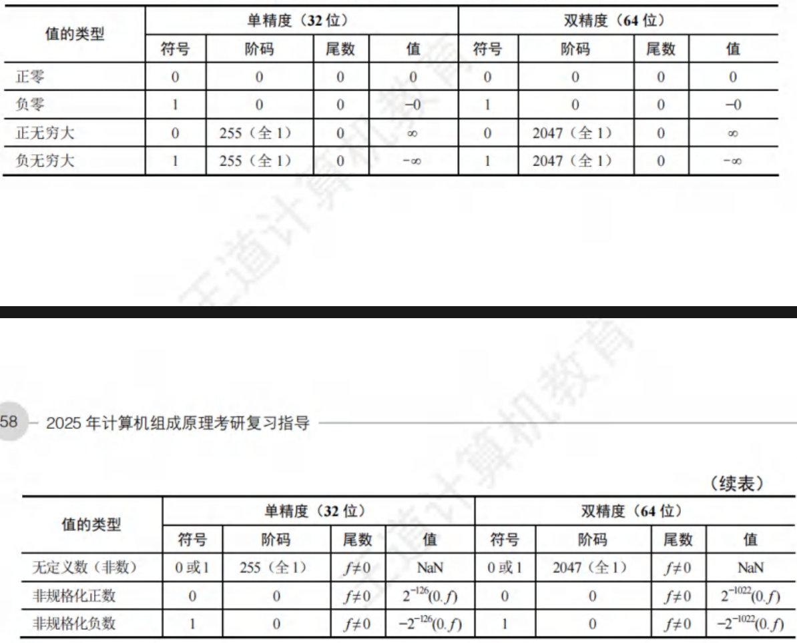

### 加减运算

> 对阶、尾数加减、尾数规格化、舍入、溢出判断。

#### 对阶

小阶码向大阶码对齐，尾数右移（移出的低位保留参与后续运算），阶码增加。（对阶阶码只会变大）

对阶操作尾数右移会有误差产生，因此需要结合 **舍入** 操作。

> 若是大阶码向小阶码对齐，尾数左移，一旦最高有效位被移出会导致结果出错。

#### 尾数加减

**还原隐藏位**，按 **定点原码小数** 进行加减运算。

> 原码的加减可以转为补码进行后再转回原码；也可以直接用原码运算，符号位和数值位分开运算。

#### 规格化

- 右规，阶码增加，考虑 **舍入**。
- 左规，阶码减少，由于移出的都是无效0，不需要考虑舍入。

> IEEE754标准要注意 隐藏位

#### 舍入

IEEE754规定了4种舍入方式：

- 就近舍入，舍入为最近的可表示的数，中间值舍入为偶数。
- 正向舍入，舍入为最接近的大数。
- 负向舍入，舍入为最接近的小数。
- 截断舍入，直接截断。

#### 溢出判断

浮点数的溢出判断是通过 **阶码** 来判断的，即阶码是否超出了表示范围。

- 右规和尾数舍入。右规会导致阶码变大；尾数舍入可能由于需要末尾加1致使尾数溢出，从而又导致右规，即也会导致阶码变大。所以这两个操作需要判断是否阶码溢出——**指数上溢**。
- 左规。左规会导致阶码变小，所以需要判断是否阶码溢出——**指数下溢**，通常按0处理。

## 数据大小端和对齐存储

对于内容 **01H 23H 45H 67H**，存储方式有两种：

大小端存储

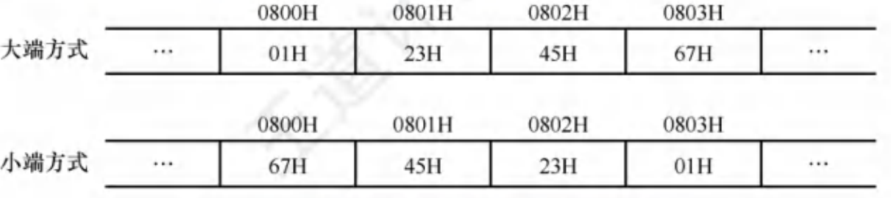

- 大端：先存高位字节，后存低位字节。字中字节顺序与原字节顺序 相同。
- 小端：先存低位字节，后存高位字节。字中字节顺序与原字节顺序 **相反**。

**边界对齐** 存储方式。

> 结构体成员按定义顺序存储。

## 杂

- 舍入是浮点数的概念，定点数没有舍入的概念。
- 移码比较大小容易

# 存储系统

存储系统大纲

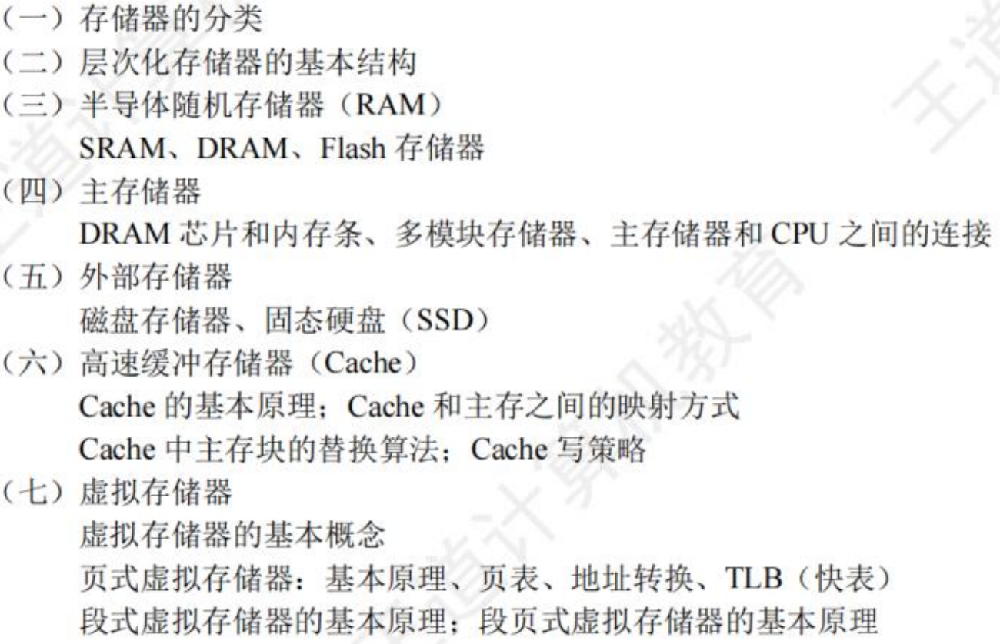

 

**存储元（0、1） -> 存储单元（字节、字） -> 存储体（存储单元的集合、多个位平面） -> 存储芯片（加上其他电路） -> 存储模块（容量扩展，内存条） -> 存储器（多模块技术）**

## 概述

### RAM、ROM、串行存储器

- 随机存储器（Random Access Memory，RAM）：具有随机存取的特性，即存取时间与存取位置无关。常用作 **主存、高速缓冲存储器** 。
- 只读存储器（Read Only Memory，ROM）：随机读，不能写。**断电内容不丢失** 。
- 串行存储器：存取时间与存取位置有关，需寻址。包括 顺序存取存储器（磁带）和 **直接存取存储器**（**磁盘、光盘**）。

> 易失存储器、非易失存储器；破坏性读出、非破坏性读出。
>
> RAM 和 ROM 属于半导体存储器

### 性能指标

- 存储容量
- 单位成本：每位价格 = 总价格 / 总容量
- 存储速度：**数据传输速率（带宽）** ：数据宽度 / 存取**周期**

注意存取周期和存取时间的区别：

存取周期

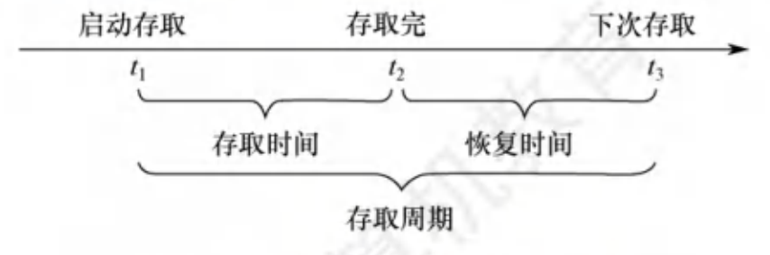

### 层次

存储器层次

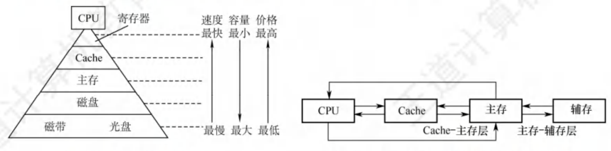

 

- 上一层是低一层的高速缓存
- 主存与Cache之间的数据调动由 **硬件** 自动完成。

## 主存储器

### SRAM 和 DRAM

- SRAM。静态RAM，利用双稳态触发器（六晶体管MOS）存储二进制位信息；**非破坏性读出**、集成度**低**、功耗大、一般用作 **高速缓冲存储器**。
- DRAM。动态RAM，利用栅极电容上的电荷存储信息，通常只有一个晶体管；所以集成度**高**、功耗低、**破坏性读出**、存储速度**较慢**。一般用于大容量主存。

DRAM的刷新周期通常取 **2ms**。三种刷新方式：（刷新是读出重新写入实现的，读后再生）

- 集中刷新，统一全部刷新，此时无法访存（死时间、死区）。
- 分散刷新，把刷新操作并入存储周期，无死时间。
- 异步刷新，一次刷新一行，分散死时间。每间隔 刷新周期/行数 产生一个刷新请求。

刷新对CPU透明、单位是**行**，行地址由存储芯片生成、刷新不用选片（都要刷新、同时）。

> 再生是仅恢复读取的数据，与刷新完全相同。

- SDRAM。同步DRAM，CPU不用等待存取时间、支持 **突发传输方式**，给首地址取一行至行缓冲器（SRAM实现）。

> DRAM读写周期，主要是等待电信号稳定的同步问题。

SRAM和DRAM对比

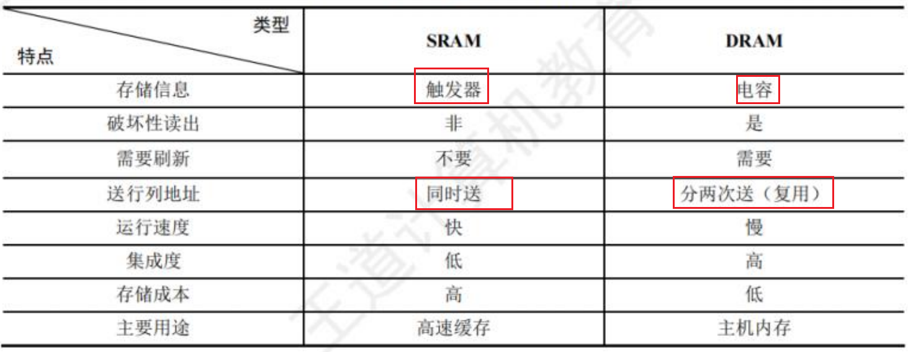

### ROM

ROM 的密度**更高**，具有**非易失性**。

- 掩模式只读存储器（MROM）：生产时固化，**不可改变**。
- 一次可编程只读存储器（PROM）：允许用户一次性写入，写入后**不可改变**。
- 可擦除可编程只读存储器（EPROM）：编程**次数有限**，写入**时间长**。（Erase）
- 电可擦除可编程只读存储器（EEPROM）：编程**次数多**，写入**时间短**。
- 闪存（Flash）：EEPROM的一种，**擦除重写快**。（U盘）
- 固态硬盘（Solid State Drive, SSD）：基于闪存技术，**速度快、功耗低、但价格贵**。

> ROM 通常用来存放 系统程序、标准子程序和各类常数；RAM 则是为用户编程、用户程序和数据服务。

### 存储芯片

存储芯片

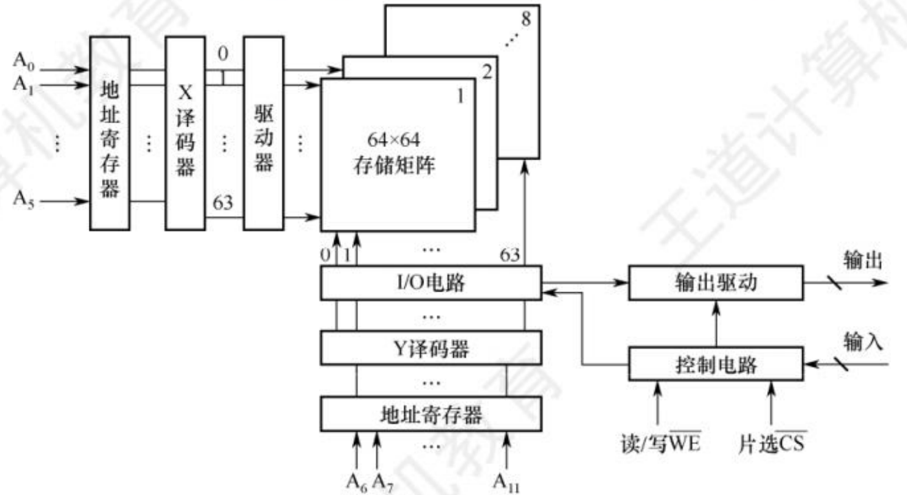

 

- 存储矩阵就是存储体，存储单元的集合，相同行列地址的多位（**位平面数**）被同时读出。
- 片选信号：是否选中该芯片。

### 主存储器基本组成

主存储器组成

 

假定有一个 $2^n\times b$ 位的 DRAM 芯片，行数为 $r$，列数为 $c$，则 $r\times c=2^n$，芯片存储阵列的地址位数为 $n$ 位，其中行地址 $\log_2 r$ 位，列地址 $\log_2 c$ 位。由于DRAM采用**地址引脚复用技术**，为减少地址引脚数，应尽量使**行列位数相同**，即最小 $|r-c|$；由于DRAM按行刷新，为减少刷新开销，应使行少，即 $r\le c$。

### 多模块存储器

**空间并行技术，每个模块可以独立地进行读写操作。**

> 模块可以由一个存储芯片，或多个存储芯片经过扩展技术合并构成。

- 单体多字存储器：存储单元存储多个字，这样CPU一次可读出多个字（多个指令）。这要求指令和数据在主存中**连续存放**才能提升效率。
- 多体并行存储器：多个存储体并行工作，提高存取速度。每个模块都有相同的容量和存取速度，**独立的结构**，即可并行也可交叉工作。
  - 高位交叉编址（顺序方式）：**模块号**位于高地址位，导致连续地址访问时总是在一个模块内访问，所以无法并行访问，仍是个顺序存储器。
  - 低位交叉编址（交叉方式）：模块号位于低地址位，信息连续存放在相邻模块中（模块号 = 地址 % 模块数），可以并行访问。

其中对于多体低位交叉存储器有两种启动方式

#### 轮流启动

**每个模块**一次读写的位数正好等于数据总线的位数。模块存储周期为 $T$，总线周期为 $r$，为实现轮流启动，模块数量应满足：

$$
m\ge \frac{T}{r}
$$

例如一个4体交叉轮流启动的时间关系图：

交叉启动

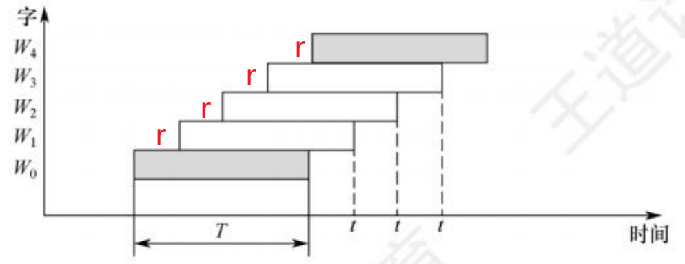

当地址送到时，选好模块号后交由对于模块处理；此时其他模块是可以工作的，所以经由一个总线周期后，下个地址送到，另一个模块可以开始工作；依次循环。所以模块经过 $m\times r$ 时间后再次启动，此时需保证它的存储周期结束了，即 $m\times r\ge T$。

> 这里的总线周期应该说的是地址总线周期（个人猜测）

#### 同时启动

**所有模块**依次读写的总位数之和等于数据总线的位数，则可以同时启动所有模块进行读写。

## 主存储器与CPU的连接

> 这里主要是讲容量的扩展。前文的多模块存储器解决的问题是速度的提升（并行），而这里解决的是容量的扩展。

**位扩展** ：叠加存储芯片的数据位数以增加存储字长，如 8 片 8k×1 位的存储芯片组成 8k×8 位的存储器。让扩展后的数据位数等于CPU的数据线位数。如下图，把 8 片芯片的同一个地址存储单元同时取出来构成一个字。（和存储体的多位平面类似）

位扩展

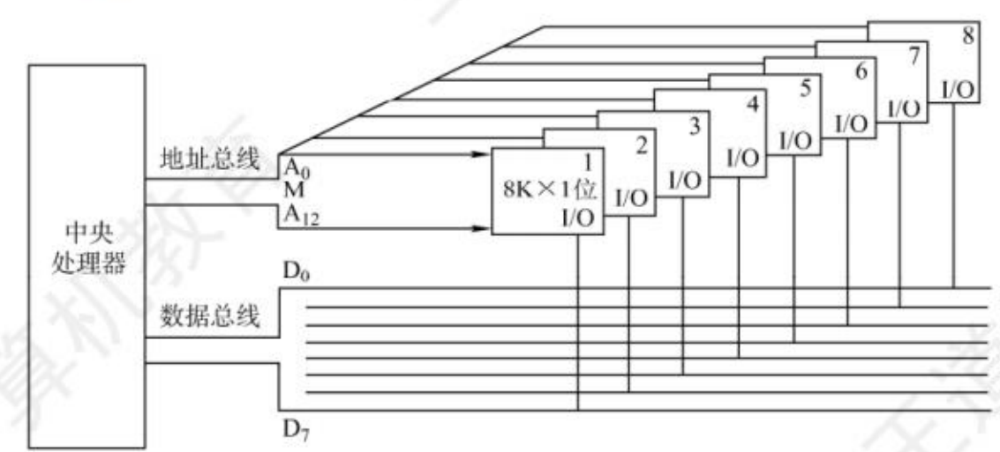

 

**字扩展** ：每个芯片的数据位数已经和CPU的数据线位数（字的位数）相同，但想要更多的字容量，如 4 片 16k×8 位的存储芯片组成 64k×8 位的存储器。如下图，通过部分高位译码片选指定芯片，再根据低位地址在该芯片取出一个字。（通常都是用高位作为译码器的输入，与多模块存储器的低位交叉编址不同）

字扩展

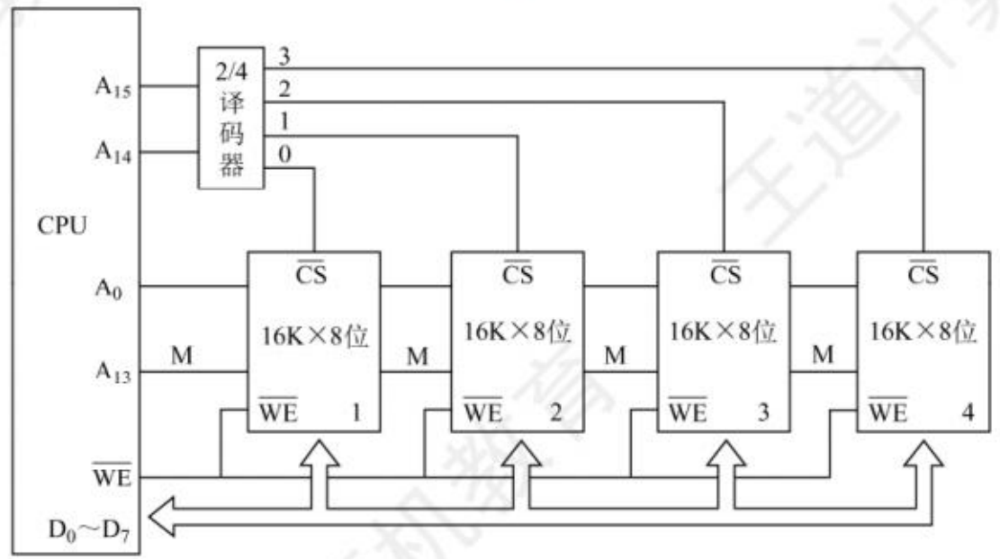

 

**字位扩展** ：两者的结合。

字位扩展

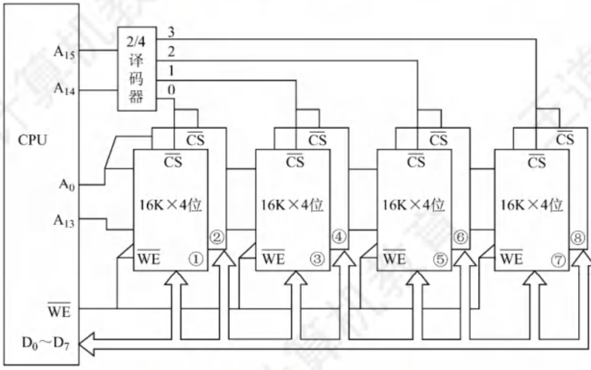

 

> 上图片选信号都是采用译码器产生，其实还有一种方法是 **线选法** （4位就只能选4片），但会导致地址空间不连续且浪费。

## 外部存储器

### 磁盘

> 串行

组成

- 磁盘驱动器：驱动磁盘转动、磁头读写操作。
- 磁盘控制器：驱动器与主机的接口，接收和解释CPU发来的命令，向驱动器发生控制信号，还负责检查驱动器状态。
- 盘片。

存储区域划分：（柱面号、磁头号、扇区号）

性能指标：

- 记录密度
  - 道密度：沿半径方向单位长度上的磁道数
  - 位密度：磁道上单位长度上能记录的位数
  - 面密度：道密度 × 位密度
- 容量
  - 非格式化容量：柱面数 × 磁头数 × 每条磁道的所含的磁化单元数
  - 格式化容量：柱面数 × 磁头数 × 扇区数 × 每个扇区的容量
- 存取时间：寻道时间 + 旋转延迟时间 + 传输时间

**RAID（独立冗余磁盘阵列）** ：通过将**多个磁盘**组合在一起，提高数据的可靠性和性能。

- RAID0：条带化，几个磁盘交叉并行读写，扩大容量同时提高读写速度，但**不具备冗余性**。
- RAID1：镜像化，两个当一个，互为备份，**提高了数据的可靠性**。
- ……

### 固态硬盘

> 跟 U 盘差不多，半导体存储器。

固态硬盘

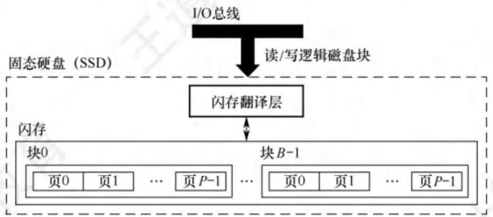

 

如图，一个闪存由 B 个块组成，每个块由 P 个页组成。**数据读写以页为单位，擦除以块为单位，仅整个块被擦除后里面的页才能写，所有读比写快，但还是比磁盘快。**

- 动态磨损均衡：写入数据时自动选择较新的块。
- 静态磨损均衡（更先进）：就是没有写入操作也会自动监测并自动进行分配，让老的块无须写的同时也让新的块腾出空间。

## 高速缓冲存储器

> 通常由 SRAM 组成，通常直接集成到 CPU 中。

**程序访问的局部性原理**：时间局部性、空间局部性。

**Cache和主存都被划分为大小相等的块（若干字节），Cache与主存之间的数据交换以块为单位，Cache与CPU之间的数据交换以字为单位。**

工作原理

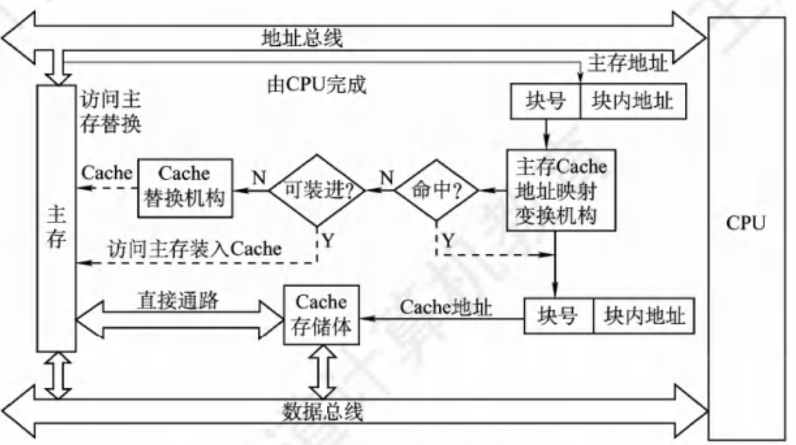

 

### 与主存的映射方式

CPU给来的地址：

| 块号 | 块内地址 |
| ---- | -------- |

一个 Cache 行：

| 标记项 | 数据 |
| ------ | ---- |

其中标记项必须含有 **标记位** 与地址映射的标记对应，**一个有效位** 用于标记该行是否有效。（计算容量时一定要记得这个有效位，当采用一些特殊替换策略和写入策略时，还有其他位要考虑）

所有标记项构成 **标记阵列** 用于查找是否命中。当查找锁定到行时，根据有效位确定是否有效后，比较 **地址中的标记** 和 **标记项中的标记位** 是否一致，以确定是否命中。

#### 直接映射

直接映射将CPU给来的地址映射成：

| 标记 | Cache行号 | 块内地址 |
| ---- | --------- | -------- |

其中计算方式：

- **Cache行号 = 主存块号 % Cache行数**；主存块号就是CPU给来的块号。
- 标记：假设Cache有 $2^c$ 行，主存有 $2^m$ 个块。显然主存块号有 $m$ 位，其中 **低 $c$ 位** 就是其对应的Cache行号，所以用剩余的 **高 $t=m-c$ 位** 作为标记。

#### 全相联映射

| 标记 | 块内地址 |
| ---- | -------- |

其中标记就是CPU给来的地址的块号，所有其长度就是 log2(主存块数) 位。

由于查找过程不再是用行号作索引，而是直接用标记进行查找，所以无法定位某一行，通常需要为 **每行都设置一个比较器**，可以同时对所有行进行标记比较，所以时间和硬件开销都很大，不适合大容量Cache。

> 显然上面的查找就是一种 **按内容访问** 的方式，即是一种 **相联存储器**。

#### 组相联映射

| 标记 | 组号 | 块内地址 |
| ---- | ---- | -------- |

**组号 = 主存块号 % 组数**； 标记的映射方式类似直接映射。

组间采用直接映射，组内采用全相联映射。（注意比较器的数量计算）

假设**每组有 $r$ 个 Cache 行**，就称为 **$r$ 路组相联映射**。！！！

### 替换策略

> Cache映射的对应位置已经被占用，从主存读数据到Cache时，再

采用直接映射时，由于会直接定位到某行，故若改行已被占用直接替换即可，不需要考虑替换策略。

对于剩余的两者映射，替换策略有：随机替换（RAND）、先进先出（FIFO）、最近最少使用（LRU）、最不常用（LFU）。

#### 最近最少使用（LRU）

假设每组有 $r$ 个 Cache 行，为每一个的标记项新增一个 **计数器**，位数**占用 $\log_2 r$ 位**，因为该算法的会维护计算器值范围为 $0 \sim r-1$。

> 类似于对 $0 \sim r-1$ 这 $r$ 个数进行插入排序的思想。访问命中值修改为0，原来比它小的值都加1；访问未命中但有空闲，值为0，其他都加1；访问未命中且无空闲，**值最大的替换**，值修改为0，其他都加1。

#### 最不常用（LFU）

同样为每行设置计数器但取值范围不加限制，且是**被访问的行才加1，替换是取小的换**。

> 那这个计算器位数怎么确定呢？？？ <!-- todo -->

### 一致性问题（写策略）

CPU 弄好了一份数据，现需要写进主存。对于 Cache，以下情况

- 写操作命中，即要写的地址在 Cache 中命中
  - 全写法（直写法）：写操作同时写入 Cache 和主存，保证一致性。通常采用 **写缓冲**，CPU同时写入 Cache 和写缓冲，写缓冲再写入主存。
  - 回写法：写入Cache，只有当此块被替换出才写回主存。为此，Cache 的行标记项中增加 **修改位（脏位）**，若修改位为1则表示该行已被修改，替换时需要写回主存。
- 写操作未命中
  - 写分配法：将主存块读入 Cache，再写入 Cache 和主存。（考虑程序的空间局部性）
  - 非写分配法：直接写入主存，不读入 Cache。

> 指令 Cache 和数据 Cache 分离。
>
> 某些计算机采用 同时访问Cache和主存 的方式。

## 虚拟存储器

> **主存和辅存** 共同组成虚拟存储器。

- 虚拟存储器将主存和辅存 **统一编址**，形成一个庞大的地址空间。

- 由于访问辅存的代价很大，故虚拟存储器的主存和辅存之间采用 **全相联映射 和 回写法**。

### 页式虚拟存储器

页表为了实现地址映射及服务于替换算法，除了页号和页内地址外，还需要

- 一个 **有效位** 用来表示该页是否在主存中；
- 一个 **修改位** 用来表示该页是否被修改过；
-  **引用位** 配合替换策略。

页表也在主存，每次访存都得查找页表才能访问主存拿数据，导致访存次数增加，故引入 **快表**（TLB）。

快表是一个类似 Cache 的 **硬件**，也是 SRAM 实现，通常采用 **全相联映射 或 组相联映射**。

> 和 Cache 一样，快表和页表也可同时查找。
>
> 注意这些所有分层的高速缓冲，高层都是底层的 **副本**。

页式虚拟存储器

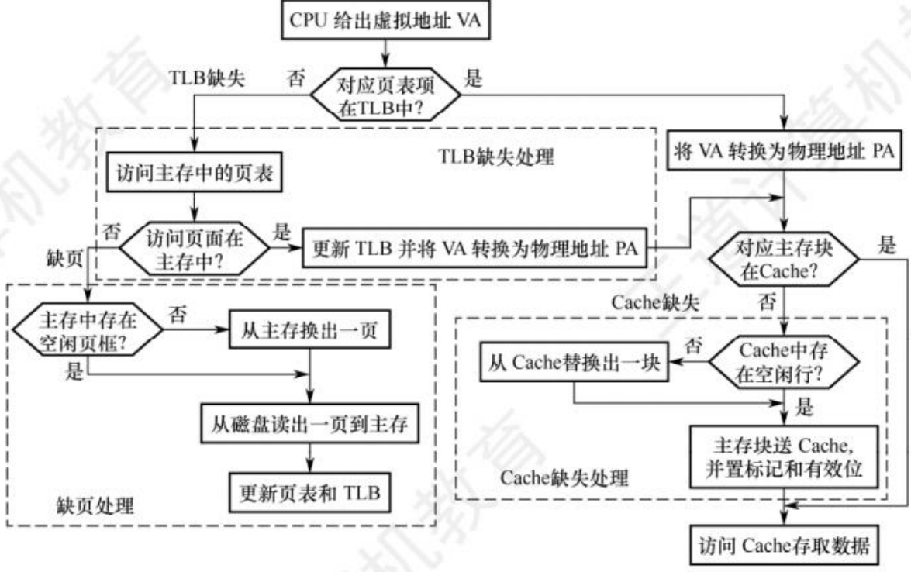

### 段式虚拟存储器

段表除了需要 **段首地址 和 段长** 外，还需要 **装入位** 用来表示该段是否在主存中。（页表的有效位）

### 段页式虚拟存储器（还是页作交换单位）

段页式虚拟存储器

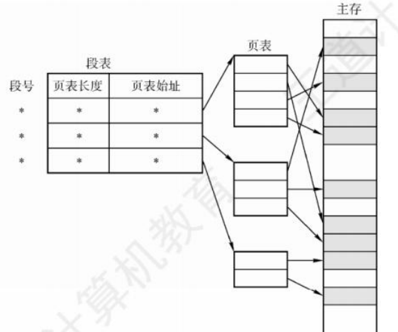

> 虚拟存储器这部分操作系统讲的更多。

## 杂

- 主存是由 RAM 和 ROM 两者构成的。
- RAM 和 ROM 都是支持随机访问的。
- 传统 DRAM 与 CPU 采用 **异步方式** 交换数据，即两者的时钟信号不同步。
- 磁盘扇区中包含 数据、地址、校验等信息。
- 指令 Cache 通常比数据 Cache 具有更好的空间局部性，因为指令通常是顺序执行的。
- Cache 的缺失处理由硬件完成，快表（虽然也是硬件部件）的缺失处理则 **软硬皆可**。
- 虚拟存储器的实际容量 $\le$ 主存容量 + 辅存容量。
- 低级语言程序员需使用段号编程，所以分段方式对其 **不是透明的**。
- 虚拟存储器是 **软硬结合** 的技术。

# 指令系统

指令系统考纲

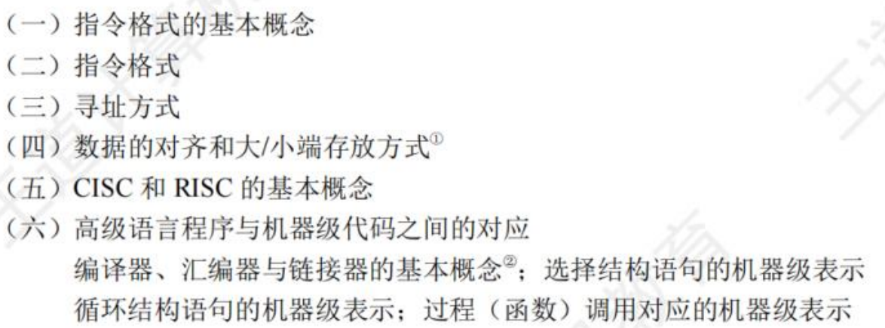

 

指令集体系结构 ISA 完整定义了硬件和软件接口，是硬件和软件之间的桥梁。主要包括：

- 指令格式，指令的寻址方式，操作类型及每种操作对应的操作数的相关规定
- 操作数类型，操作数的寻址方式，确定大小端存储方式
- 寄存器组织，存储空间的大小和编址方式
- 指令执行过程的控制方式。PC和条件码定义等。

## 指令格式

指令类型通常有以下几种：

- 数据传送
- 算术和逻辑运算
- 移位操作
- 转移操作
- 输入输出操作

指令格式包括 **操作码** 和 **地址码** 两部分。

- 零地址指令：不需要操作数的指令；若是运算指令只存在于 **堆栈计算机** 中。
- 一地址指令：有时隐含约定另一个操作数位于 **ACC 累加器** 中，结果也存入 ACC。
- 二地址指令：OP(A1, A2) -> A1
- 三地址指令：OP(A1, A2, A3) -> A3——
- 四地址指令：OP(A1, A2, A3, A4) -> A3，A4是下一条指令的地址。

### 扩展操作码

扩展操作码

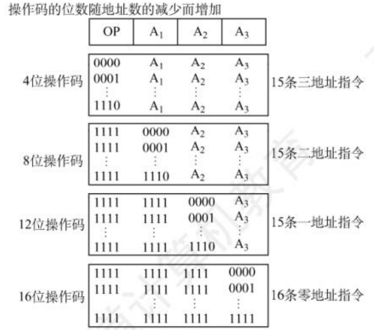

 

除了上图的扩展外，也可以是 15 条三址指令、12 条二址指令、63 条一址指令、16 条零址指令，共 106 条指令。

## 指令的寻址方式

指令寻址：

- 顺序寻址：程序计数器 PC 加 "1"（1个指令字长） 自动形成下一条指令地址。
- 跳跃寻址：根据指令中的地址码，跳转到指定地址。（绝对和相对）（通过修改 PC 实现）

### 数据寻址

方式较多，通常在指令中添加 **寻址特征** 字段区分。

设要寻的操作数是 N，真实地址是 EA 即 N=(EA)，指令中的地址码是 A，那么寻址方式可以表示为：

- 隐含寻址：操作数在指令中隐含，如累加器操作。
- 立即寻址：操作数在指令中，用补码表示。A = N。
- 直接寻址：EA = A。
- 间接寻址：EA = (A)。
- 寄存器寻址：指令给出寄存器编号 R，EA = R。
- 寄存器间接寻址：EA = (R)。
- 相对寻址：EA = A + (PC)。A 用补码表示，是偏移量，可正可负。
- 基址寻址：EA = A + (BR)。BR 是基址寄存器。A动BR不动。多道程序设计。（特地给个寄存器存基址，用户可以指定哪个，但内容由OS决定）
- 变址寻址：EA = A + (IX)。IX 是变址寄存器。面向用户的，如数组访问，**改变 IX 而 A 不动**。（内容可由用户改变）
- 堆栈寻址：EA = (SP)。SP 是堆栈指针寄存器。

> 每取出一条指令后 PC 就自动 + "1"，故对于指令地址为 X 偏移量为 A 的转移指令，取出该指令时 (PC) = X + "1"，故执行时会跳转到 (PC)+A= X+"1"+A。

## x86 指令系统

x86主要寄存器

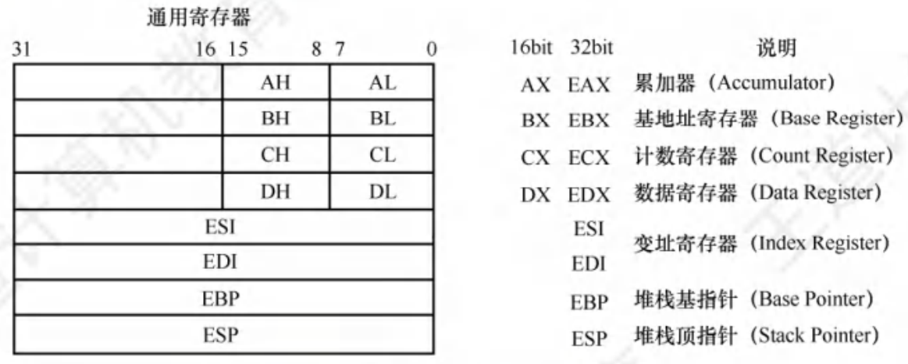

 

> E 表示 Extended，32 位。
>
> A、B、C、D 寄存器为了向后兼容，高两位字节和低两位字节可以独立使用。例如 EAX 的低 16 位是 AX，其中的高 8 位是 AH，低 8 位是 AL。

两者汇编格式

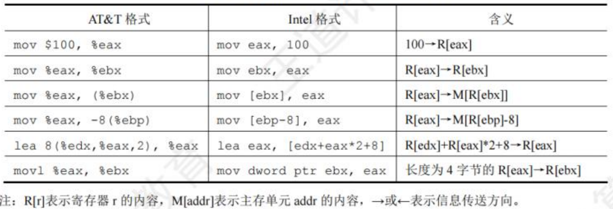

 

> 历年真题都是 Intel 格式，后面以其作示例。

主要区别：

| AT&T                     | Intel                                      |
| ------------------------ | ------------------------------------------ |
| 小写                     | 不敏感                                     |
| 源，目                   | **目，源**                                     |
| 寄存器前缀%，立即数前缀$ | 无                                         |
| ()寻址                   | []寻址                                     |
| 复杂地址寻址看上图例子   | 复杂地址寻址看上图例子                     |
| 操作码加后缀b、w、l      | 操作码后注明 byte ptr、word ptr、dword ptr | F |

> 注意：这里的 word 表示的 **16** 位。

### 选择语句的机器级表示

选择语句

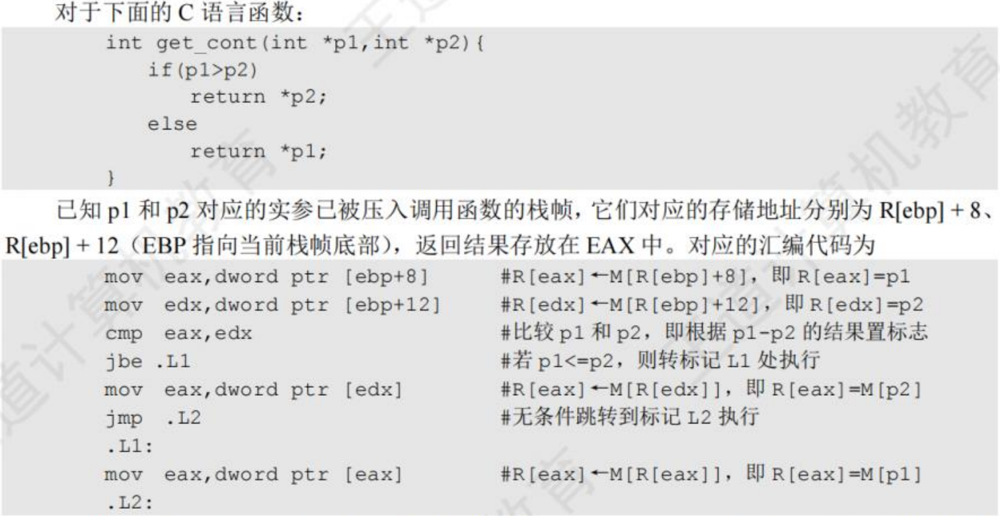

### 循环语句的机器级表示

循环语句

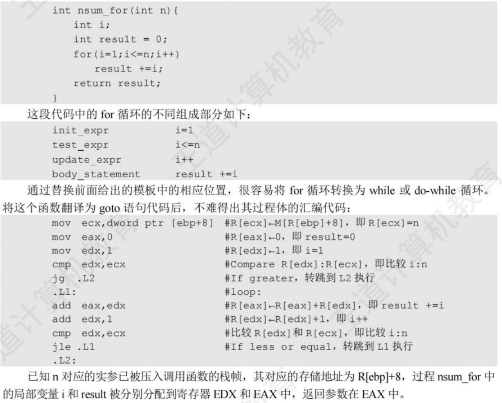

### 过程调用的机器级表示

- EAX、ECX、EDX 由 **调用者** 利用栈保存和恢复。
- EBX、ESI、EDI 由 **被调用者** 利用栈保存和恢复。（基址、变址寄存器）

**每个过程都有自己的栈区——栈帧。**（规定是16字节的倍数）

**栈从高地址向低地址生长。**

过程调用

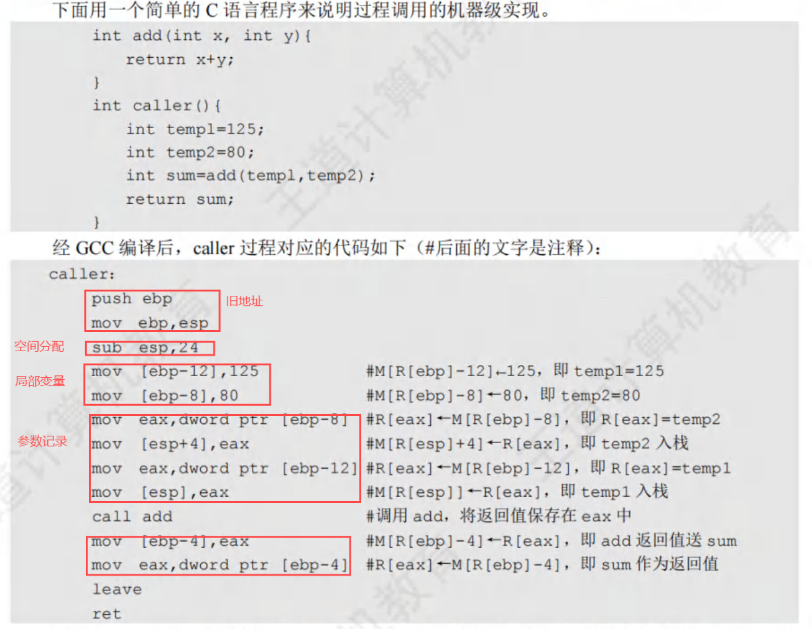

> call 指令会把返回地址压入栈中，此时 ESP 会减少 4，ret 指令会弹出栈顶的地址，此时 ESP 会增加 4。

被调用函数的指令

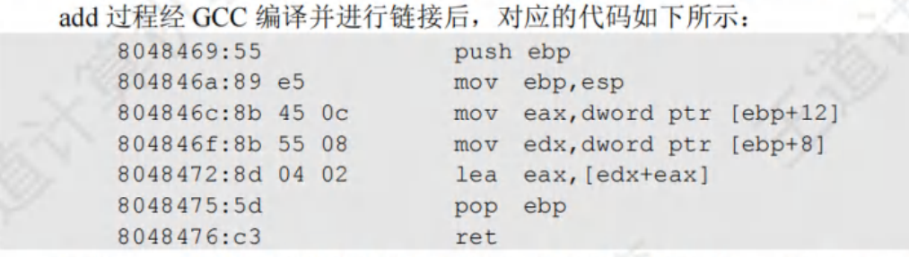

> 由于 call 指令会把返回地址压入栈中，所以 ESP 减少了 4，函数进来又把 EBP 压入栈中，所以 ESP 再减少 4。故参数应该在 EBP+8 位置往后。

## CISC 和 RISC

两大指令系统的发展方向，CISC 是 **复杂指令集计算机**，RISC 是 **精简指令集计算机**。

CISC和RISC比较

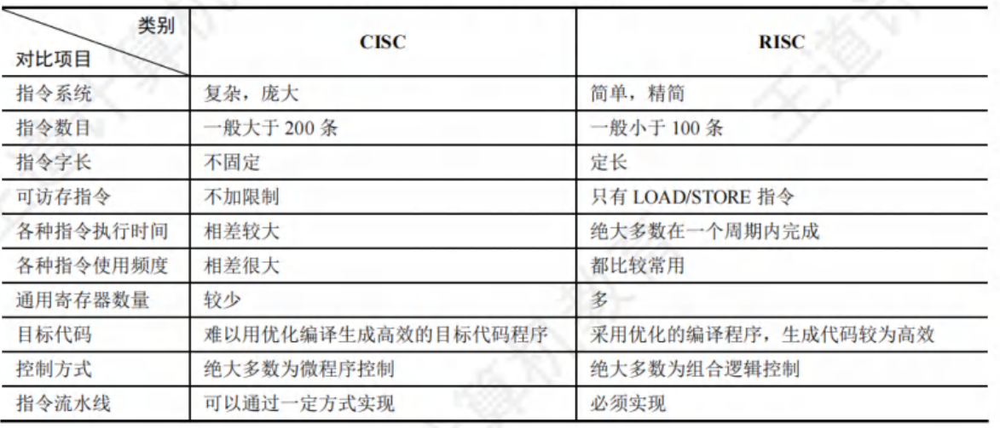

 

highlight：

- 指令字长是否固定
- 访存指令
- 通用寄存器数量
- 控制方式（微程序控制、硬布线组合逻辑控制）
- 指令流水线
- RISC 更能利用超大规模集成电路（VLSI）技术

## 杂

- 无论是什么类型的数进行运算，条件码（CF、ZF、SF、OF）都会被设置。有无意义要看具体指令。
- 溢出自陷指令：查询溢出标志 OF，当 OF=1 时调出 OS 的溢出处理程序。

# 中央处理器

CPU考纲

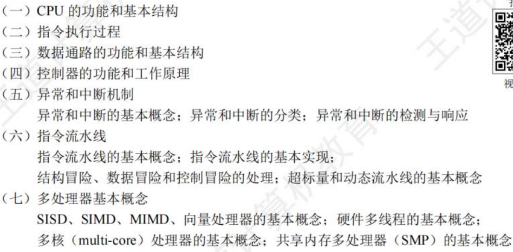

## CPU功能和基本结构

**CPU = 运算器 + 控制器**

- 指令控制：取指、译码、执行。即 **程序的执行控制**。
- 操作控制：产生 **操作信号**，并送到相应部件。
- 时间控制：严格控制各种操作信号的 **出现和持续时间** 以及 **出现的顺序**。
- 数据加工：进行 **算术运算** 和 **逻辑运算**。
- 中断处理

### 运算器的寄存器

- 通用寄存器 GPRs
- 累加寄存器 ACC
- 移位寄存器 SR：即可存放数据，也可对数据进行移位操作。
- 暂存寄存器————透明
- 程序状态字寄存器 PSW：存放 **条件码**，如 CF、ZF、SF、OF。

### 控制器的寄存器

- 程序计数器 PC
- 指令寄存器 IR————透明
- 地址寄存器 MAR————透明
- 数据寄存器 MBR————透明

## 指令执行过程

- **指令周期** ：**取出并执行** 一条指令所需的时间。

> 指令周期通常可由若干机器周期组成，机器周期是 CPU 执行一个基本操作所需的时间，即CPU周期。

**取指、间址（取有效地址）、执行、中断。**

### 取值周期数据流

取指周期数据流

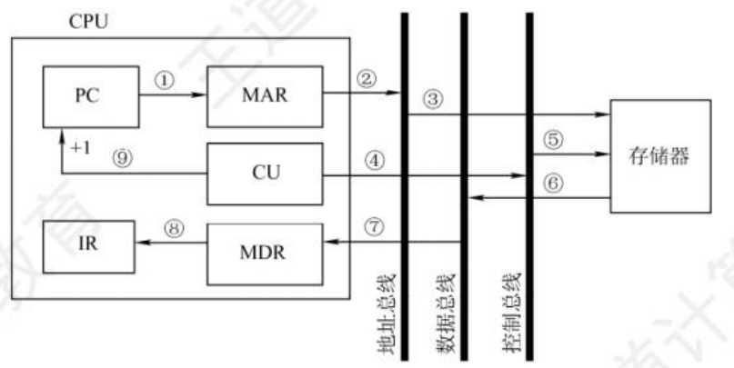

> 多字指令得取多次。

### 一次间址周期数据流

> 先判断是否有间接寻址再进入该周期。

一次间址周期数据流

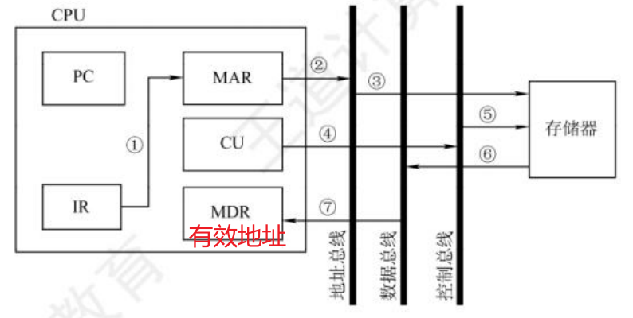

 

### 执行周期数据流

**取操作数、译码操作码、ALU运算**

### 中断周期数据流

> 先判断是否有中断再进入该周期。

中断周期数据流

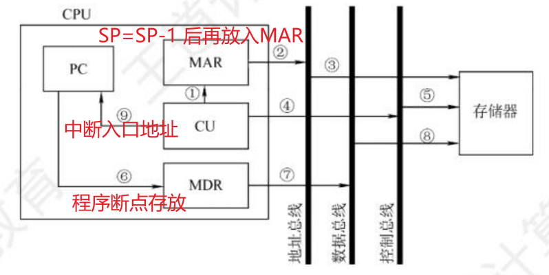

### 指令执行方案

- **单周期执行方案**：每条指令在一个时钟周期内完成。长度取决于最长的指令。
- **多周期执行方案**：时钟周期按需分配。
- **流水线执行方案**：**并行**，每个时钟周期启动一条指令，让它们各自处于不同的执行步骤。（理想情况下CPI=1）

## 数据通路

- **数据通路**：指令执行过程 **数据** 所经过的 **路径及其相应的部件**。

### 两类元件

#### 组合逻辑元件（操作元件）

任何时刻的输出仅取决于当前的输入，不受过去的输入影响，所以 **不含记忆单元**，也 **不受时钟控制**，输入与输出之间无反馈、单向。如 加法器、ALU、译码器、MUX、三态门。

#### 时序逻辑元件（状态元件）

输出不仅取决于当前输入，还取决于过去的输入，所以 **含有记忆单元**，此外必须 **受时钟控制**。如 通用寄存器、程序计数器、状态寄存器等等。

### 数据通路的结构

CPU内部单总线结构

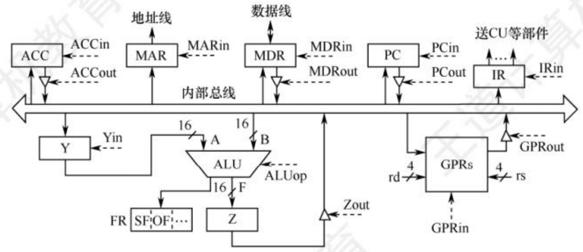

 

图中，rs、rd是读、写寄存器的编号；Y、Z是暂存寄存器；FR为标志寄存器。带虚线的箭头表示 **控制信号**。能输出到总线的部件均通过一个 **三态门** 与内部总线相连，即输出信号控制的是三态门。

> **单周期处理器无法采用单总线结构** ，因为单个时钟周期只允许一个操作，无法完成多个操作。
>
> 执行过程就是控制器控制相应的信号是否有效，使得相应部件工作。
>
> 由于 ALU 是组合逻辑元件，**没有存储能力**，所以要在其输入输出端加入暂存寄存器，不然数据的流动会乱。

#### 多内部总线结构

所以寄存器的输入输出端 **都接到多条总线上** ，这样就可以同时进行多个操作。

> 还有一种 专用数据通路方式
>
> 注意上面讲得都是CPU内部总线，而不是系统总线。

## 控制器功能原理

### 硬布线控制器

也叫 **组合逻辑控制器**

硬布线控制器

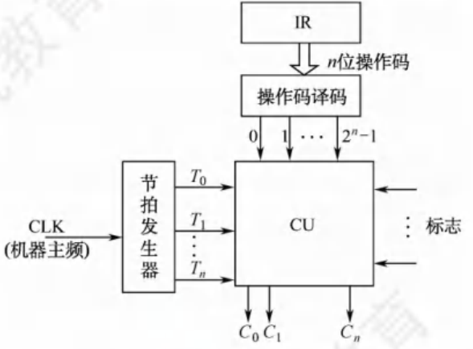

 

事先列出根据操作码译码信号和标记信号得出输出信号的逻辑表达式，然后用电路实现。根据节拍信号先后发出，控制各个部件的工作。显然电路会很复杂且难以维护，但速度快，RISC一般采用这种方式。

### 微程序控制器

执行一条指令就是执行一个微程序。微程序存储在 **控制存储器** 中。

**微程序 -> 微指令 -> 微操作命令**

**微操作命令**

- 微命令：控制序列的最小单位，类似上面的 ACCin、ACCout 这种控制信号。
- 微操作：执行部件收到微命令后的动作，与微命令一一对应。

**微指令与微周期**

微指令是若干微命令的集合，微周期是取出并执行一个微指令所需的时间，通常为一个时钟周期。

微指令通常包含两大部分信息：

- 操作控制字段，即 **微操作码字段**：产生某一步操作所需的各种微命令。
- 顺序控制字段，即 **微地址码字段**：指出下一条要执行的微指令的地址。

**控制存储器（CM）位于CPU内部，用 ROM 实现。微指令存放在其中，存放的地址叫微地址。**

**微程序是微指令的 *有序* 集合；微程序实际是及机器指令的实时解释器，事先编制好存放于CM中，用户不可见。**

#### 微程序控制器的工作过程

微程序控制器的工作过程

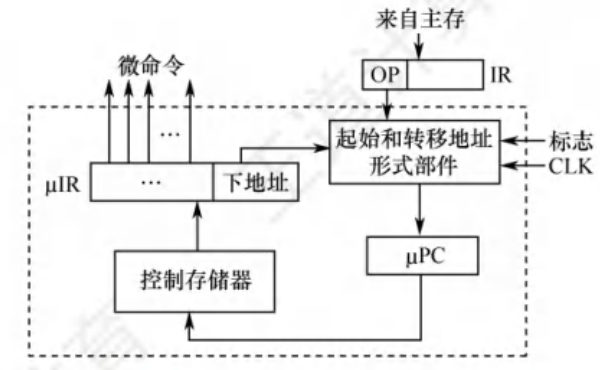

 

- 对于取机器指令操作。是在开始时自动地把 **取值微程序** 入口地址放入 uPC ，一般为 CM 的 0 号单元地址。**取值微程序** 完成后，机器指令就在 IR 中了。
- 获得机器指令后，由 OP 字段通过微地址形成部件产生该机器指令对于微程序的入口地址，送入 uPC。
- 从 CM 中逐条取出对应微指令执行

> 取值、间址、中断动作统一，分别对应一个微程序。各个指令对应一个微程序。

#### 微指令编码方式

- 直接编码：一位对应一个微命令
- 字段编码：将操作控制字段分段，互斥放一起，相容分开；**每段独立编码**，每段需 **留出一个状态** 表示不发出任何微指令
- 字段间接编码：一个字段的某些微命令需要另一字段中的某些来解释。（隐式编码）

#### 微指令地址形成方式

根据工作原理，有以下几种类型。

- 硬件直接产生，比如取值微程序的入口地址。
- 根据操作码产生
- uPC 自增
- 微指令的下地址字段直接给出—— **断定方式**
- 根据各种标志决定

#### 微指令的格式

水平型

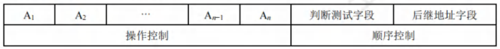

 

> 前面三种编码方式都是水平型的。

垂直型

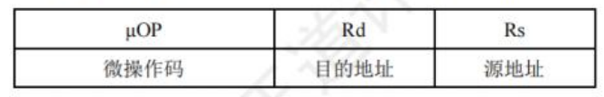

 

- 水平的 **并行、效率、灵活性** 都强，**运行快** 
- 垂直的 **指令短** 与机器指令类似，易于掌握。

最后，两类控制器的比较：

硬布线和微程序控制器的比较

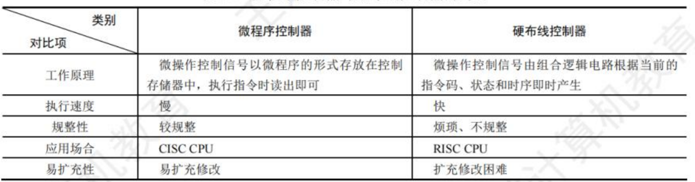

## 异常和中断

### 异常和中断分类

- 异常（内部）
  - 故障（Fault）：非法操作码、缺段缺页、除数为0
  - 自陷（Trap）：断点设置单步跟踪、系统调用
  - 终止（Abort）：硬件故障，如校验错、总线错误
- 中断（外部）
  - 可屏蔽中断：可屏蔽中断请求线 INTR (Interrupt Request)
  - 不可屏蔽中断：不可屏蔽中断请求线 NMI (Non-Maskable Interrupt)，如 电源掉电、时钟中断等紧急情况

> 中断不与任何指令相关，也不阻止任何指令的执行。

所有异常和中断均由 **硬件检测** 发现。

### 异常和中断处理过程

1. 关中断
2. 保持断点和程序状态（断点就是返回地址，这里就是保持 PC 和 PSW；通用寄存器的保护是在中断服务程序中进行的）
3. 识别异常或中断并转到相应处理程序
   - 软件识别：设置一个 **异常状态寄存器**，操作系统使用一个查询查询按一定顺序查询异常状态寄存器，然后转到相应处理程序。（异常通常采用的处理）
   - 硬件识别：处理 **程序的首地址** 叫 **中断向量**，根据 **中断类型号** 在 **中断向量表** 中找到对应的中断处理程序的首地址。

整个处理过程是 **不可打断、软硬结合** 的。

## 指令流水线

- 时间上的并行：任务分解成子阶段，各子阶段在不同的功能部件上并行执行。
- 空间上的并行：设置多个相同的功能部件，并让它们并行工作。（超标量处理机）

据历年统考真题，通常划分为 **取指（IF）**、**译码（ID）**、**执行（EX）**、**访存（MEM）**、**写回（WB）** 五个阶段。

- **流水段寄存器**：用于锁存 **本段** 处理完的所有数据。

流水线时空图

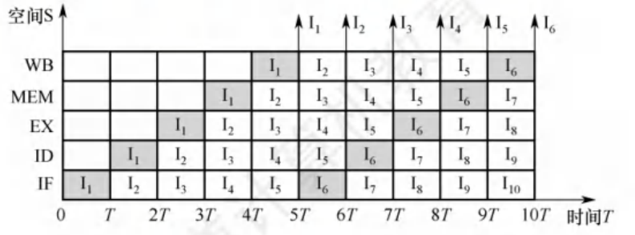

 

### 流水线的冒险与处理

- **流水线冒险**：由于流水线的并行性，导致遇到一些情况使得后续指令无法正常执行而引起阻塞的问题。

首先要明确各类型指令在各流水段中的操作：

不同类型指令在流水线中的操作

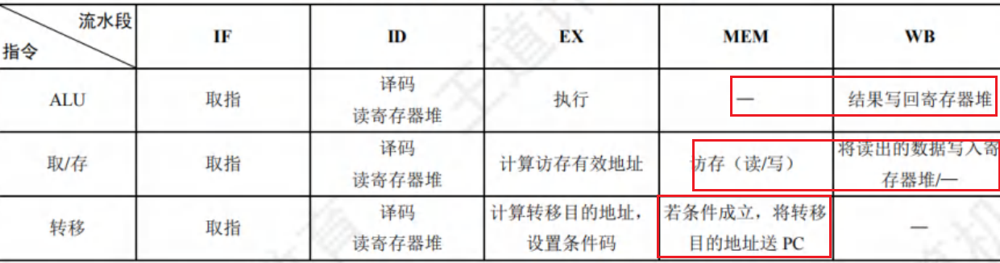

 

highlights：

- ALU 运算类指令 没有访存MEM阶段，要在 WB 阶段才能将结果写回寄存器；但其实在 EX 阶段后就可以知道结果了。
- 取/存 类指令**在 MEM 阶段后知道结果**，但要在 WB 阶段才能写回寄存器。
- 转移 类指令 **在 访存MEM 阶段 就把结果送去 PC了**，没有WB阶段。

#### 结构冒险

- 硬件资源竞争，不同指令同时争用同一功能部件。如 某指令在 访存 阶段时下一指令的 取指 阶段到来。

解决方法：

- 使用相关指令暂停一个周期。
- 增加硬件资源。对应寄存器的访问冲突可读写口分离设计；对于访存冲突可单独设置 数据存储器 和 指令存储器。

#### 数据冒险

- 也叫 **数据相关**，后面要用前面的结果，但前面的结果还没出来。

对于 **非乱序执行** 的流水线中，所有的数据冒险均是由于 写指令 在 读指令 之前，且写指令没有写回数据读指令就要取数据。统称为 **写后读（RAW）** 冲突。

对于一条写 R1，一条读 R1 的指令，可见冲突如下：

写后读冲突

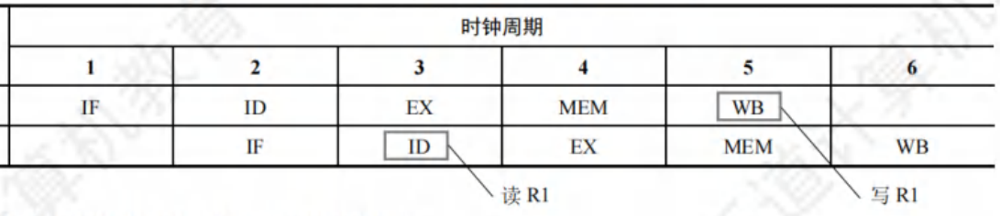

 

- 软件插入空操作 nop 指令或硬件阻塞（stall）一个周期。

延迟指令解决RAW冲突

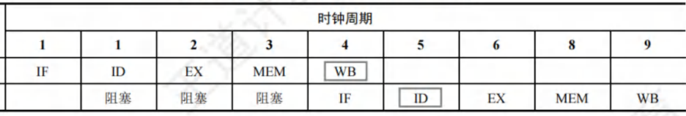

> 若采用寄存器读写口分离，分别控制前半个时钟周期写入的 R1 在后半个时钟周期可被直接读取。这样上图中就可以让 WB 和 ID 同时进行了，少一个阻塞周期。

- 采用转发（旁路）技术。直接从上一指令的执行阶段的 **流水线寄存器** 中取数据到 ALU 中。

转发技术解决RAW

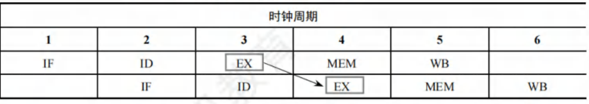

 

> 对于 load 指令后接运算 这种冲突称为 load-use 数据冒险。不想前面是两条运算类指令，EX 后就知道结果，load 指令要在 MEM 才知道结果，所有单纯的转发技术解决不了，需要结合延迟插入 nop 指令和转发技术。但最后的办法还是在出现编译时进行优化调整指令顺序避免这种情况。

#### 控制冒险

- 也叫 **控制冲突**，遇到改变 PC 值的情况，流水线断流。

最简单就是类似前面一样，推迟执行后续指令。推迟的时钟周期数叫 **延迟损失时间片**。

还有方法就是进行预测：

- 静态预测，总是假定条件满足或不满足。
- 动态预测，根据历史记录动态调整。

### 流水线的性能指标

- **吞吐率** ：单位时间内完成的任务数。
- **加速比** ：不使用流水线的总时间 / 使用流水线的总时间。

### 高级流水线技术

#### 多发技术

**设置多个相同的功能部件**，让它们并行工作。那么处理机便可一次发生多条指令。

- 超标量流水线技术，也称动态流水线技术。以并行方式执行多条指令。多数为 **乱序执行**。——涉及动态流水线调度技术，动态分支预测技术。
- 超长指令字技术，也称静态流水线技术。由编译程序挖掘并行指令合并成一个多操作码字段的指令。

#### 超流水技术

增加流水线级数。段就越短、时钟周期也就越短。

显然多发技术的 CPI < 1，而超流水技术的 CPI = 1。

## 多处理机

- SISD 单指令流单数据流
- SIMD 单指令流多数据流，向量处理机是它的一个变体
- MISD 多指令流单数据流——实际不存在
- MIMD 多指令流多数据流
  - 信息传递MIMD —— 多计算机
  - 共享存储MIMD —— 多处理机（共享存储多处理器，SMP）

### 硬件多线程

为每个线程提供单独的通用寄存器和程序计数器，线程切换只需激活相应的寄存器。

- 细粒度多线程：每个时钟周期切换线程
- 粗粒度多线程：仅在当前线程出现较大阻塞时切换线程，如 Cache 缺失；切换要清理被阻塞的流水线和重载新线程的流水线，开销大。
- 同时多线程（SMT）：同一个时钟周期内发射多个不同线程的多条指令执行。 —— 超线程（Hyper-Threading）

> 前两者都是指令级并行，后者是线程级并行。

### 多核处理器

- 将多个 **处理单元** 集成到单个 CPU 中；每个处理单元称为一个 **核**；每个核既可以有自己的 Cache，也可以共享 Cache。

> 显然，在多和处理器上采用多线程技术可以实现线程真正物理上的并行；而不是单核里的交错执行。

### 共享存储多处理器，SMP

- 统一存储访问（UMA）：访问时间与 哪个处理器提出的 和 访问哪个地址 无关。
- 非统一存储访问（NUMA）：与 UMA 相反。

> 在 SMP 的一致性维护中，不仅要维护 Cache 和主存的一致性，还要维护各个处理器的 Cache 之间的一致性。

## 杂

- **数据** 总线的位数与CPU的位数保持一致
- 通用寄存器的长度取决于 **机器字长**
- 指令译码是对 **操作码字段** 进行译码
- CPU周期（机器周期）是CPU执行一个基本操作所需的时间，通常由多个时钟周期组成。CPU操作的基本单位是 **时钟周期**。
- 取指周期由控制器自动进行，控制器无需得到相应的指令。
- **控制器可以区分存储单元存放得是指令还是数据。**
- 微程序控制器的时序系统比硬布线的简单。
- 同一CPU周期，可以同时出现的微命令叫 **相容性微命令**。
- 微处理器 与 微程序控制器 是不同的概念，没有关系。
- 内部异常不能被屏蔽，一旦出现就必须立即处理。
- 数据通路 不包含 控制部件
- 双核技术是将两个一样的CPU集成封装；而超线程技术是在一个CPU中内复制仅必要的资源以让多个线程并行执行。
- 多核处理器集成的是多个 **执行内核** 。

# 总线

总线考纲

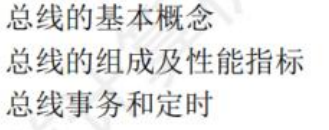

分时 和 共享 是总线的两个特点。

- 分时：同一时刻只允许一个设备向总线 **发送** 信息。
- 共享：多个部件分时共享发送，可同时接收。

设备

- 主设备：发出请求并获得总线控制权的设备。
- 从设备：被主设备访问的设备，只能响应命令。

## 总线分类

### 功能分类

- 片内总线，内部总线
- 系统总线
  - 数据总线，传 **数据、指令、中断类型号** 等。
  - 地址总线，传 **主存单元地址 或 I/O 端口地址**，单向。
  - 控制总线，传 **总线请求/允许、中断请求/回到、读写信号** 等。
- I/O 总线，如 USB、PCI总线。
- 通信总线，外部总线，远程通信。

### 时序控制方式分类

- 同步总线：时钟统一。
- 异步总线：无统一时钟，通过 **握手信号** 控制。

### 传输方式分类

- 串行总线：逐位传输。适合长距离传输。
- 并行总线：多比特并行传输。适合短距离传输。

> 并行不一定比串行快。

## 总线结构

单总线结构

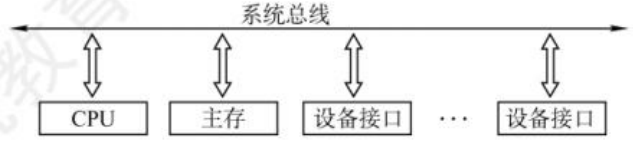
 

双总线结构

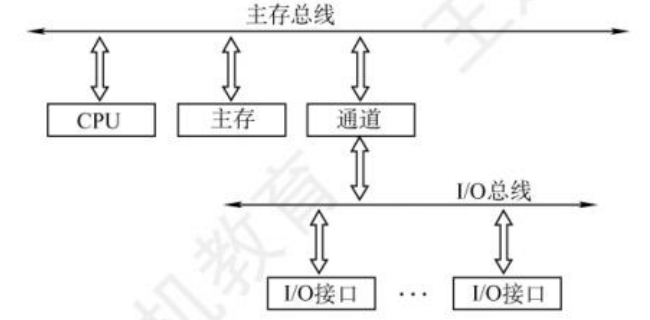
 

三总线结构

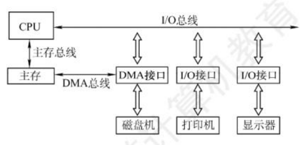

## 总线的性能指标

- 传输周期：一次总线操作的时间；申请、寻址、传输、结束。若干总线时钟周期构成。
- 工作频率：总线周期的倒数。
- 总线宽度，总线位宽
- 总线带宽：单位时间内可传输的 **最多** 数据位数。工作频率 * 总线位宽。
- 总线复用
- 信号线数：总线数。

## 总线事务

从 请求到完成使用 的 操作序列 称为 **总线事务**。典型的总线事务包括：

- 请求阶段
- 仲裁阶段
- 寻址阶段：主设备通过总线给出要访问的从设备地址及有关命令，启动从模块。
- 传输阶段
- 释放阶段

非突发与突发传送方式

- 非突发传送：每个周期内都先送地址后送数据，传完一个字长数据 后释放总线。
- 突发传送：寻址阶段传首地址，传输阶段传多个连续数据，每个周期还是传一个字长数据，但不用释放总线。

## 总线定时

- 同步定时方式：仅在整个数据块的头尾增加开始和结束标志即可。**同步串行通信 发送方时钟 控制 接收方时钟。**
- 异步定时方式：**每个字符** 都有开始和结束标志。（**握手** 信号）（速度差异很大之间交换信息）
  - 不互锁：主设备请求，不必等待回答过段时间自动撤销。
  - 半互锁：主设备请求，从设备回答，但不必等待获知主设备是否撤销请求
  - 全互锁：主设备请求，从设备回答，主设备收到回答撤销，从设备获知主设备撤销后才撤销。
- 半同步定时方式：增设 Wait 响应信号线；每个时钟周期都采用 Wait 信号看是否数据是否准备好。（前面两者的结合）
- 分离式定时方式：请求和应答分离，主从变换。

## 杂

- 多通道总线 就是多个独立的总线。

# 输入/输出系统

IO考纲

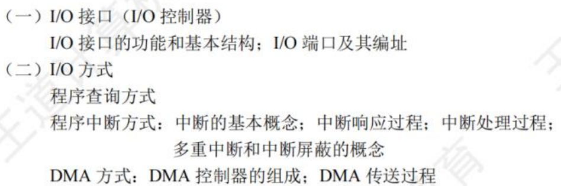

## I/O 接口

- **I/O 接口**（**I/O 控制器**）：实现主机与外设之间的信息交换。

主要功能：

- 地址译码和设备选择
- 通信联络控制：时序问题，协调速度
- 数据缓冲
- 信号格式转换：如电平转换、串并或并串转换等
- 传送控制命令和状态信息：命令寄存器/状态寄存器

通用结构

 

> 注意：**I/O 接口 没有 地址寄存器。**

类型

- 并行、串行
- 程序控制、中断、DMA
- 可编程、不可编程

## I/O 端口及其编址

- **I/O 端口**：I/O 接口电路中可被 CPU 访问的 **寄存器** 。

### 独立编址

也称 **I/O 映射方式**，地址空间与主存空间独立，需设置专门的 **I/O 指令** 表明访问的是 I/O 地址空间。

### 统一编址

也称 **存储器编址方式**，把主存地址一部分划出来给它，感觉 **地址范围** 就能区分。统一了访存指令。

## I/O 方式

### 程序查询方式

程序查询方式

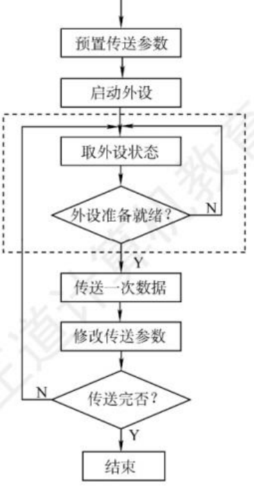

 

- 独占查询：CPU 一直持续查询接口状态
- 定时查询：CPU 周期性查询接口状态，满足条件才进行一个数据传送

### 程序中断方式

程序中断方式

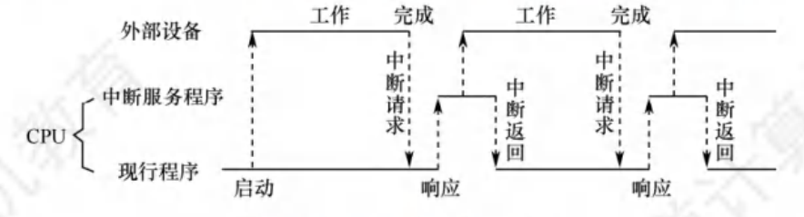

 

#### 中断请求

- 每个中断源都有一个 **中断请求标记触发器**，它们组成  **中断请求标记寄存器**。

#### 中断响应判优

- **硬件排队器** 或 **中断查询查询** 实现。

一般来说：

- 不可屏蔽中断 > 内部异常 > 可屏蔽中断
- 硬件故障 > 软件中断
- **DMA 中断请求 > I/O 中断请求**
- 高速设备 > 低速设备； **输入设备 > 输出设备**；实时设备 > 普通设备

> 不可屏蔽中断即使在关中断模式下也被响应。
>
> 这里属于中断的 **响应优先级**，不可动态改变。后面提到的中断屏蔽属于 **处理优先级**，可以动态改变。

#### CPU响应中断的条件

3个条件：

- 有中断请求
- CPU允许中断及开中断（异常和不可屏蔽中断除外）
- 一条指令执行完毕（异常除外），且没有更紧迫的事情

#### 中断响应过程

- **中断隐指令**，一系列的硬件操作，并不是真正的指令。经过中断隐指令后CPU转去执行 **中断服务程序**

中断隐指令的操作

- 关中断
- 保持断点和程序状态
- 识别异常或中断并转到相应处理程序

> 可跳转至 [异常和中断处理过程](#异常和中断处理过程) 部分。

#### 中断处理过程

可嵌套的中断请求处理过程

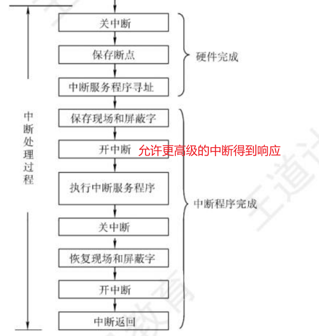

 

> 中断返回中最后一条指令通常是 **中断返回指令**，修改 PC 值，恢复寄存器。

#### 中断屏蔽

- 每个中断源有一个 **屏蔽触发器（Mask）**，1表示屏蔽，它们组合成 **屏蔽字寄存器**。

### DMA方式

**完全由硬件完成的方式**，仅在 **故障和传送完成时** 才使用 **中断**。

DMA控制器

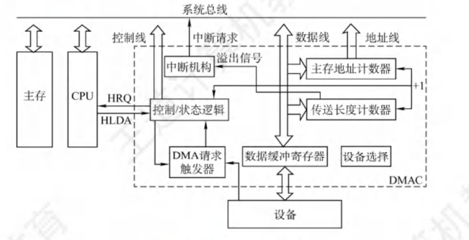

 

> 可以看到，外设与与CPU和主存之间是通过 **DMA控制器** 连接的。
>
> 注意：DMA与主存之间传送单位是 **字**，而DMA与外设之间传送单位是 **字节或位**。

**！！！DMA请求是由设备发出的，DMA响应后向CPU发出的总线控制权请求。**

#### DMA的传送方式

DMA使得外设与主存直接传送数据；但当CPU也同时访问主存时，可能会出现冲突。

##### 停止CPU访存

DMA要工作时，向CPU发送一个停止信号，让CPU停止访存。

##### 周期挪用

周期挪用

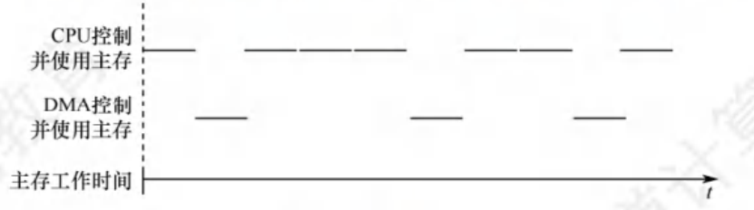

> 注意是使用主存的情况

##### 交替访存

将一个CPU工作周期分成两个时间片。

交替访存

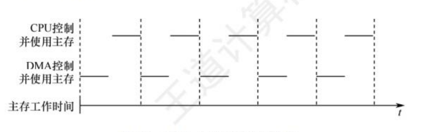

#### DMA的传送过程

DMA传送过程

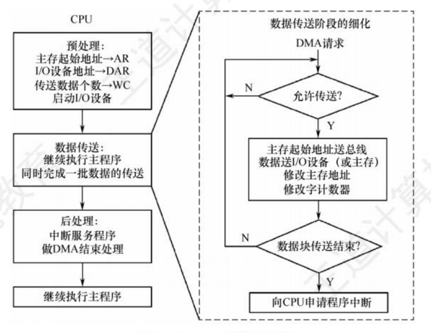

> **对DMA请求的响应可以发生在任意一个机器周期结束时。（取指、间址、执行后均可）**

## 杂

- 中断请求信号：I/O 接口 -> 中断控制器 -> CPU
- CPU和主存——I/O总线——I/O接口——通信总线（电缆）——外设
- 中断返回指令与无条件转移指令不同。
- DMA请求比外中断（非屏蔽和可屏蔽）优先级都要高。
- 若检测到某中断请求，开中断状态下的CPU立即响应。（因为只要检测到了说明它的优先级更高）
- 无需外设发生中断结束信号
