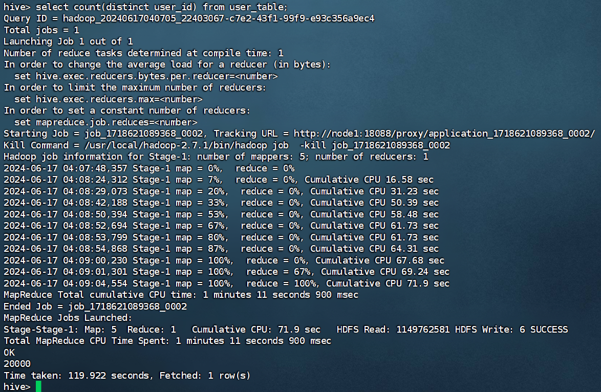

# 机器环境配置

3台Linux Ubuntu16.04。

使用平台是 VMware。

## 配置网络和ssh免密

为了虚拟机之间的通信，VMware 进入虚拟网络编辑器，编辑VMnet8，

- 子网IP改成 `192.168.88.0`
- 网关改成 `192.168.88.2` （NAT设置里面）
- 子网掩码为 `255.255.255.0` 。

---

每台虚拟机在系统设置——网络——IPv4设置中改成 **手动** 方式，配置对应的地址、掩码、网关、DNS服务器。

其中三台虚拟机的地址分别设为 192.168.88.101、192.168.88.102、192.168.88.103。掩码和网关与VMware对应，DNS服务器用网关地址。

重启虚拟机，查看网络ip。

---

修改主机名：

```
# 设置roo密码
sudo passwd root

# 进入root
su -

# 修改主机名
hostnamectl set-hostname node1	# 对应名字node2、node3
```

---

三台虚拟机启动ssh服务：

```
# 安装
sudo apt-get install openssh-server
# 启动
service sshd start
```

修改ssh配置文件 `/etc/ssh/sshd_config`， 允许root用户登录：

```
# PermitRootLogin prohibit-password
PermitRootLogin yes
```

重启ssh服务：

```
service sshd restart
```

---

配置主机名映射：

window的 `C:\Windows\System32\drivers\etc\hosts` 和3台 Linux 的 `/etc/hosts` 文件中添加：

```
192.168.88.101 node1
192.168.88.102 node2
192.168.88.103 node3
```

至此，可以利用远程工具如 FinalShell 连接虚拟机进行操作了。

ping 一下，看看是否通。

---

配置ssh免密登录：

```
# 生成密钥
ssh-keygen -t rsa -b 4094
# 拷贝公钥到其他机器
ssh-copy-id node1
ssh-copy-id node2
ssh-copy-id node3
```
---

创建 hadoop 用户：

```
# 创建用户
useradd hadoop
# 转入hadoop用户
su - hadoop
```

在 hadoop 用户下，再次配置ssh免密登录。 ssh-copy-id hadoop@node1

## JDK

下载JDK，解压到 `/usr/lib/jvm` 目录下：

```
mkdir /usr/lib/jvm
tar -zxvf jdk-8u162-linux-x64.tar.gz -C /usr/lib/jvm
```

<!-- 修改hadoop用户的环境变量： `vim ~/.bashrc`，添加：

```
export JAVA_HOME=/usr/lib/jvm/jdk1.8.0_162
export JRE_HOME=${JAVA_HOME}/jre
export CLASSPATH=.:${JAVA_HOME}/lib:${JRE_HOME}/lib
export PATH=${JAVA_HOME}/bin:$PATH
```

使环境变量生效：

```
source ~/.bashrc
```

检查Java是否安装成功。 -->


# 安装Hadoop2.7.1

> node1 既是主节点也是从节点，node2 和 node3 是从节点。

我们选择将 Hadoop 安装至 `/usr/local/` 中

```
tar -zxvf hadoop-2.7.1.tar.gz -C /usr/local/

cd /usr/local/
ln -s hadoop-2.7.1 hadoop # 创建软链接
```

## Hadoop配置

为了便于管理，给NameNode、DataNode及临时文件创建目录：

- /data/hdfs/name
- /data/hdfs/data
- /data/hdfs/tmp

`hadoop/etc/hadoop` 目录下依次修改`hadoop-env.sh` 、`core-site.xml`、`hdfs-site.xml`、`mapred-site.xml`、`yarn-site.xml`以及`slaves`文件。


配置 slaves 文件指明 DataNode：

```
# 删掉原来的localhost
node1
node2
node3
```

配置 hadoop-env.sh 文件指明 JAVA_HOME：

```
export JAVA_HOME=/usr/lib/jvm/jdk1.8.0_162
```

### core-site.xml

```xml
...

<configuration>
<property>
  <name>hadoop.tmp.dir</name>
  <value>file:/data/hdfs/tmp</value>
  <description>A base for other temporary directories.</description>
</property>
<property>
  <name>io.file.buffer.size</name>
  <value>131072</value>
  <description>Buffer size for file system I/O.</description>
</property>
<property>
  <name>fs.default.name</name>
  <value>hdfs://node1:9000</value>
</property>
<property>
  <name>hadoop.proxyuser.hadoop.hosts</name>
  <value>*</value>
  <description>允许hadoop用户代理所有主机</description>
</property>
<property>
  <name>hadoop.proxyuser.hadoop.groups</name>
  <value>*</value>
  <description>允许hadoop用户代理所有组</description>
</property>

<property>
  <name>ha.zookeeper.quorum</name>
  <value>node1:2181,node2:2181,node3:2181</value>
</property>

</configuration>
```

### hdfs-site.xml

```xml
...

<configuration>
<property>
<name>dfs.replication</name>
  <value>2</value>
</property>
<property>
  <name>dfs.namenode.name.dir</name>
  <value>file:/data/hdfs/name</value>
  <final>true</final>
</property>
<property>
  <name>dfs.datanode.data.dir</name>
  <value>file:/data/hdfs/data</value>
  <final>true</final>
</property>
<property>
  <name>dfs.namenode.secondary.http-address</name>
  <value>node1:9001</value>
</property>
<property>
  <name>dfs.webhdfs.enabled</name>
  <value>true</value>
</property>
<property>
  <name>dfs.permissions</name>
  <value>false</value>
  <description>是否开启权限检查</description>
</property>
<property>
<name>ha.zookeeper.quorum</name>
  <value>node1:2181,node2:2181,node3:2181</value>
</property>
</configuration>
```

### mapred-site.xml

这个要复制一份模板文件： `cp mapred-site.xml.template mapred-site.xml`。

```xml
...

<configuration>

<property>
  <name>mapreduce.framework.name</name>
  <value>yarn</value>
</property>

</configuration>
```

### yarn-site.xml

```xml
...

<configuration>
<property>
<name>yarn.resourcemanager.address</name>
  <value>node1:18040</value>
</property>
<property>
  <name>yarn.resourcemanager.scheduler.address</name>
  <value>node1:18030</value>
</property>
<property>
  <name>yarn.resourcemanager.webapp.address</name>
  <value>node1:18088</value>
</property>
<property>
  <name>yarn.resourcemanager.resource-tracker.address</name>
  <value>node1:18025</value>
</property>
<property>
  <name>yarn.resourcemanager.admin.address</name>
  <value>node1:18141</value>
</property>
<property>
  <name>yarn.nodemanager.aux-services</name>
  <value>mapreduce_shuffle</value>
  <description>shuffle服务，这里如果是mapreduce.shuffle会报错</description>
</property>
<property>
  <name>yarn.nodemanager.aux-services.mapreduce.shuffle.class</name>
  <value>org.apache.hadoop.mapred.ShuffleHandler</value>
</property>

<property>
  <name>yarn.resourcemanager.zk-address</name>
  <value>node1:2181,node2:2181,node3:2181</value>
</property>
</configuration>
```

---

分发这些文件到另外两台机器，同时创建好对应目录。

格式化 nameNode： `hadoop namenode -format`。

启动 Hadoop： `start-dfs.sh`，启动yarn： `start-yarn.sh`。

## 查看是否正常

jps 查看进程是否正常。

`node1:50070` 网页查看 HDFS 是否正常：

<center>overview</center>

<center></center>

执行 `hadoop jar share/hadoop/mapreduce/hadoop-mapreduce-examples-2.7.1.jar pi 5 10` 测试 yarn 是否正常。

<center>算pi</center>

<center></center>

进入 `node1:18088` 查看 yarn 状态：

<center>yarn状态</center>

<center></center>

一切正常，进入 Hive 安装环节。

# Hive 1.2.1 安装

下载 Hive 1.2.1 ，解压到 `/usr/local/` 中：

```
tar -zxvf apache-hive-1.2.1-bin.tar.gz -C /usr/local/
ln -s apache-hive-1.2.1-bin hive # 创建软链接
```

## MySQL 安装

root 用户下 安装 MySQL5.7：

```bash
sudo apt-get install mysql-server
# 安装过程中会提示设置root密码，设为123456

# 查看MySQL状态，安装完成后会自动启动
systemctl status mysql
# 如果没有则手动启动MySQL
sudo systemctl start mysql
# 设置MySQL开机启动
sudo systemctl enable mysql
```

修改 MySQL 配置

```bash
# 登录MySQL
mysql -uroot -p

# 授权远程登录
GRANT ALL PRIVILEGES ON *.* TO 'root'@'%' IDENTIFIED BY '123456' WITH GRANT OPTION;
FLUSH PRIVILEGES; # 刷新权限
```

## Hive 配置

修改 `/usr/local/hive/conf/hive-env.sh` 文件：

```bash
mv hive-env.sh.template hive-env.sh
vim hive-env.sh
```

添加如下内容：

```bash
export HADOOP_HOME=/usr/local/hadoop
export HIVE_CONF_DIR=/usr/local/hive/conf
export HIVE_AUX_JARS_PATH=/usr/local/hive/lib
```

下载 MySQL 驱动包 5.1.47 ，解压到 `/usr/local/hive/lib` 中。

```bash
tar -zxvf mysql-connector-java-5.1.47.tar.gz
mv mysql-connector-java-5.1.47-bin.jar /usr/local/hive/lib
```

修改 `/usr/local/hive/conf/hive-site.xml` 文件： 

```bash
mv hive-default.xml.template hive-site.xml
vim hive-site.xml
```
添加如下内容：

```xml
<configuration>
  <property>
    <name>javax.jdo.option.ConnectionURL</name>
    <value>jdbc:mysql://localhost:3306/hive?createDatabaseIfNotExist=true</value>
    <description>JDBC connect string for a JDBC metastore</description>
  </property>
  <property>
    <name>javax.jdo.option.ConnectionDriverName</name>
    <value>com.mysql.jdbc.Driver</value>
    <description>Driver class name for a JDBC metastore</description>
  </property>
  <property>
    <name>javax.jdo.option.ConnectionUserName</name>
    <value>root</value>
    <description>username to use against metastore database</description>
  </property>
  <property>
    <name>javax.jdo.option.ConnectionPassword</name>
    <value>123456</value>
    <description>password to use against metastore database</description>
  </property>
  
  <!-- 指定 hiveserver2 连接的 host -->
<property>
	<name>hive.server2.thrift.bind.host</name>
	<value>node1</value>
</property>

<!-- 指定 hiveserver2 连接的端口号 -->
<property>
	<name>hive.server2.thrift.port</name>
	<value>10000</value>
</property>


</configuration>
```
  <!-- <property>
    <name>hive.server2.thrift.host</name>
    <value>node1</value>
    <description>hive thrift server host</description>
  </property>
  <property>
    <name>hive.metastore.uris</name>
    <value>thrift://node1:9083</value>
    <description>连接hive元数据服务的地址</description>
  </property>
  <property>
    <name>hive.metastore.event.db.notification.api.auth</name> -->


初始化元数据：

```bash
mysql -uroot -p # 登录MySQL
create database hive character set utf8; # 创建数据库
show databases; # 查看数据库
```

```bash
# 进入hive目录
cd /usr/local/hive
# 初始化元数据
bin/schematool -dbType mysql -initSchema -verbose
```

权限修改：

```bash
# 修改权限
chown -R hadoop:hadoop /usr/local/apache-hive-1.2.1-bin /usr/local/hive
su - hadoop
```

创建日志目录：

```bash
mkdir /usr/local/hive/logs
```

## 启动 Hive

```bash
# 进入hive目录
cd /usr/local/hive
# 启动hive元数据管理服务，日志输出到logs目录
nohup bin/hive --service metastore > /usr/local/hive/logs/metastore.log 2>&1 &
# 启动 hive shell 客户端
bin/hive
# 若要启动 hiveserver2 服务，日志输出到logs目录
nohup bin/hive --service hiveserver2 > /usr/local/hive/logs/hiveserver2.log 2>&1 &
```

<center>hiveshell</center>

<center></center>

---

至此，Hadoop 和 Hive 都已经安装完毕，下面进入 HBase 安装环节。

# HBase 1.2.1

下载 HBase 1.2.1 ，解压到 `/usr/local/` 中：

```bash
tar -zxvf hbase-1.2.1-bin.tar.gz -C /usr/local/
cd /usr/local/
ln -s hbase-1.2.1 hbase
cd /usr/local/hbase/conf
```

修改 `hbase-env.sh` 文件：

```sh
export JAVA_HOME=/usr/lib/jvm/jdk1.8.0_162
export HBASE_HOME=/usr/local/hbase

export HBASE_MANAGES_ZK=false
```


修改 `hbase-site.xml` 文件：


添加如下内容：

```xml
<configuration>
  <property>
    <name>hbase.rootdir</name>
    <value>hdfs://node1:9000/hbase</value>
    <description>指定hbase在HDFS上存储的路径, 端口要和Hadoop的fs.defaultFS端口一致</description>
  </property>
  <property>
    <name>hbase.cluster.distributed</name>
    <value>true</value>
  </property>
  <property>
    <name>hbase.zookeeper.property.dataDir</name>
    <value>/usr/local/zookeeper/data</value>
  </property>
  <property>
    <name>hbase.zookeeper.property.clientPort</name>
    <value>2181</value>
  </property>

  <property>
    <name>hbase.zookeeper.quorum</name>
    <value>node1,node2,node3</value>
  </property>
</configuration>
```

修改 `regionservers` 文件：

```
node1
node2
node3
```

分发到其他两台机器。修改好权限。

启动 HBase：

```bash
cd /usr/local/hbase
bin/start-hbase.sh
```

主节点会有 HMaster 和 HRegionServer 以及 HQuorumPeer，从节点只有 HRegionServer 和 HQuorumPeer。进入 HDFS 文件系统可以看到 HBase 的文件夹。

```bash
bin/hbase shell  # 进入hbase shell，如果可以进入说明HBase安装成功了
  status
  quit
```

一切正常。

# zookeeper 3.4.6 安装

下载 zookeeper 3.4.6 ，解压到 `/usr/local/` 中：

```bash
tar -zxvf zookeeper-3.4.6.tar.gz -C /usr/local/
cd /usr/local/
ln -s zookeeper-3.4.6 zookeeper
cd /usr/local/zookeeper/conf
cp zoo_sample.cfg zoo.cfg # 复制配置文件
vim zoo.cfg
```

修改 `zoo.cfg` 文件：

```
dataDir=/usr/local/zookeeper/data
dataLogDir=/usr/local/zookeeper/logs

server.1=node1:2888:3888
server.2=node2:2888:3888
server.3=node3:2888:3888
```

创建 `data` 和 `logs` 目录：

```bash
mkdir /usr/local/zookeeper/data
mkdir /usr/local/zookeeper/logs
```

分发到其他两台机器。

```
scp -r /usr/local/zookeeper-3.4.6 node2:/usr/local/
scp -r /usr/local/zookeeper-3.4.6 node3:/usr/local/
```

在 `node1`、`node2`、`node3` 分别创建 `myid` 文件：

```
echo 1 > /usr/local/zookeeper/data/myid
echo 2 > /usr/local/zookeeper/data/myid
echo 3 > /usr/local/zookeeper/data/myid
```

启动 zookeeper，每台机器都要启动：

```bash
cd /usr/local/zookeeper
bin/zkServer.sh start
bin/zkServer.sh status
```


# Sqoop 1.4.6

下载 Sqoop 1.4.6 ，解压到 `/usr/local/` 中：

```bash
tar -zxvf sqoop-1.4.7.bin__hadoop-2.6.0.tar.gz -C /usr/local/
cd /usr/local/
ln -s sqoop-1.4.7.bin__hadoop-2.6.0 sqoop
cd /usr/local/sqoop/conf
mv sqoop-env-template.sh sqoop-env.sh
vim sqoop-env.sh
```

修改 `sqoop-env.sh` 文件：

```sh
export HADOOP_COMMON_HOME=/usr/local/hadoop
export HADOOP_MAPRED_HOME=/usr/local/hadoop
export HIVE_HOME=/usr/local/hive
export HBASE_HOME=/usr/local/hbase
export ZOOKEEPER_HOME=/usr/local/zookeeper
```

复制 MySQL 驱动包到 Sqoop 的 lib 目录下：

```bash
cp /usr/local/hive/lib/mysql-connector-java-5.1.47-bin.jar /usr/local/sqoop/lib
```

启动验证：

```bash
cd /usr/local/sqoop
bin/sqoop help
```

测试数据库连接：

```bash
bin/sqoop list-databases --connect jdbc:mysql://localhost:3306 --username root --password 123456
```

没有问题。

<!-- # R 安装

```bash
sudo apt-get install r-base
R
``` -->


---
---


# 数据集预处理

数据字段及描述：

| 字段名        | 描述                                                     | 例子          |
| ------------- | -------------------------------------------------------- | ------------- |
| user_id       | 用户ID                                                   | 10001082      |
| item_id       | 商品ID                                                   | 285259775     |
| behavior_type | 包括浏览、收藏、加购物车、购买，对应取值分别是1、2、3、4 | 1             |
| user_geohash  | 用户地理位置哈希值，有些记录中没有这个字段值             | wx4g0sn       |
| item_category | 商品分类ID                                               | 4076          |
| time          | 行为时间，都是2014年                                     | 2014-12-06 18 |

预处理包括为每行记录增加一个 `id` 字段，删除无关字段 `user_geohash` ，截取 `time` 字段分解成`month`、`day`、`hour` 字段。预处理的操作通过 Python 进行：

```python
import pandas as pd
import random

class UserDataOperator:
    # 变量声明
    dataSetPath = "./user/raw_user.csv"  # 输入Path raw_user
    dataTablePath = "./user/user_table.txt"  # 输出Path
    naValues = {'null', 'NULL', ''}  # 空值判断列表
    engine = 'python'  # 导入引擎
    encoding = 'utf-8'  # 指定编码
    sep = '\t'  # 指定分隔符

    def init(self,uri,na,eng,encoding):
        #uri:"./user/raw_user.csv"
        #na:{'null', 'NULL', ''}
        #eng:'python'
        self.user_data = pd.read_csv(uri,na_values=na,engine=eng,encoding = encoding)

    # def rm_line(self,i):
    def describe(self):
        print(self.user_data)

    # 该方法用作df.apply的参数，针对每一行数据，返回一个随机省份
    def getRandomProvince(self):
        return self.provice[random.randint(0, 33)]
      
    def getMonth(self, x):
        return x[5:7]
    
    def getDay(self, x):
        return x[8:10]
    
    def getHour(self, x):
        return x[11:13]

    # 数据导出csv并保存
    def toCsv(self,uri,index,encoding,sep):
        # index指明是否将索引也存入 header为none表示不写入表头
        self.user_data.to_csv(uri,index = index,header = None,encoding = encoding,sep = sep)


if __name__ == '__main__':
    userDataOperator = UserDataOperator()  # 初始化 数据操作对象
    # 对象初始化
    userDataOperator.init(userDataOperator.dataSetPath, userDataOperator.naValues, userDataOperator.engine, userDataOperator.encoding)

    # 删除user_geohash字段，后面不需要该字段
    userDataOperator.user_data.drop(['user_geohash'], axis=1, inplace=True)

    # 添加名为id的新列，用作主键区分 | 或者直接不用生成该列，使用dataframe的index导出即可
    # userDataOperator.user_data['id'] = userDataOperator.user_data.index

    # 对原来的time列作处理：分解为month、day、hour四个字段
    userDataOperator.user_data['month'] = userDataOperator.user_data.apply(
        lambda x: userDataOperator.getMonth(x.time), axis=1)
    userDataOperator.user_data['day'] = userDataOperator.user_data.apply(
        lambda x: userDataOperator.getDay(x.time), axis=1)
    userDataOperator.user_data['hour'] = userDataOperator.user_data.apply(
        lambda x: userDataOperator.getHour(x.time), axis=1)
    userDataOperator.user_data.drop(['time'], axis=1, inplace=True)
    
    userDataOperator.describe()
    userDataOperator.toCsv(userDataOperator.dataTablePath, True, userDataOperator.encoding, userDataOperator.sep)
```

<center>数据处理后预览</center>

<center></center>

本地宿主机进行数据预处理后，将数据上传至虚拟机，进入下一步。

# 数据集导入 HDFS

`user_table.txt` 位于 `/home/hadoop/Downloads` 目录下。

```bash
hdfs dfs -mkdir -p /bigdata/dataset
hdfs dfs -put /home/hadoop/Downloads/user_table.txt /bigdata/dataset
hdfs dfs -ls /bigdata/dataset
hdfs dfs -cat /bigdata/dataset/user_table.txt | head -n 10
```

<center>数据导入HDFS</center>

<center></center>

# Hive 进行 SQL 查询分析

## 创建数据库和表

创建数据库：

```sql
create database bigdata;
use bigdata;
```

创建 hive 外部表：

```sql
create external table user_table(
    id string,
    user_id string,
    item_id string,
    behavior_type int,
    item_category string,
    month string,
    day string,
    hour string
)
row format delimited fields terminated by '\t'
stored as textfile
location '/bigdata/dataset';

select * from user_table limit 10;
```

<center>创建表</center>

<center></center>

## 数据分析

<!--  简单查询分析；4. 查询条数统计分析；5. 关键字条件查询分析；6. 根据用户行为分析；7. 用户实时查询分析
 -->

**查询前10位用户购买商品的种类**

```sql
select item_category from user_table limit 10;
```

<center>前10位用户购买商品的种类</center>

<center></center>

**查询表内数据的数量**

```sql
select count(*) from user_table;
```

yarn 界面查看任务执行情况：

<center>查询数据量的yarn</center>

<center></center>

<center>表内数据的数量</center>

<center></center>

数据量为 **23,291,027** 条。

**用户数量**

```sql
select count(distinct user_id) from user_table;
```

<center>用户数量</center>

<center></center>

用户数量为 **20,000** 人。

**各月份记录分布**


```sql
select  month, count(*) as num from user_table group by month;
```

<center>月份分布</center>

<center></center>

11 月有 **8,951,103** 条记录，12 月有 **14,339,924** 条记录。

**12-12号当天所有的购买行为数量**

```sql
select count(*) from user_table where behavior_type = 4 and month = '12' and day = '12';
```

<center>购买数量</center>

<center></center>


**统计12月10日到12月13日有多少人浏览了商品**

```sql
select count(distinct user_id) from user_table where behavior_type = 1 and month = '12' and day between '10' and '13';
```

<center>统计浏览商品</center>

<center></center>


**统计用户27152719在12-12的行为**

```sql
select behavior_type, count(*) as num from user_table where user_id = '27152719' and month = '12' and day = '12' group by behavior_type;
```

<center>用户27152719在12-12的行为</center>

<center></center>

**统计12-10那天下午14点到15点的各种行为数量**

```sql
select behavior_type, count(*) as num from user_table where month = '12' and day = '10' and hour between '14' and '15' group by behavior_type;
```

<center>各行为数量</center>

<center></center>

**查询12-11号当天的商品购买与浏览比例**

```sql
select 100* (buy / click) from (select count(*) as buy from user_table where month = '12' and day = '11' and behavior_type='4')t1, (select count(*) as click from user_table where month = '12' and day = '11')t2;
```

<center>比例1</center>

<center></center>

<center>比例2</center>

<center></center>


# Sqoop 使用

## hive 导入 MySQL

hive创建内部表，把原来的外部表数据导入到内部表中：

```sql
create table user_table_mysql(
    id string,
    user_id string,
    item_id string,
    behavior_type string,
    item_category string,
    month string,
    day string,
    hour string
)
row format delimited fields terminated by '\t'
stored as textfile;

insert overwrite table user_table_mysql select * from user_table;

select * from user_table_mysql limit 5;
```

<center>内部表</center>

<center></center>

进入hdfs可以看到生成的对应的文件位于 `/user/hive/warehouse/bigdata.db/user_table_mysql`。

<center>hdfs内部表</center>

<center></center>

进入MySQL，也创建一个表：

```sql
create database bigdata;
use bigdata;
create table user_table_mysql(
    id varchar(255),
    user_id varchar(255),
    item_id varchar(255),
    behavior_type varchar(255),
    item_category varchar(255),
    month varchar(255),
    day varchar(255),
    hour varchar(255)
) engine=innodb default charset=utf8;
```

使用Sqoop导入数据：

```bash
cd /usr/local/sqoop
bin/sqoop export --connect 'jdbc:mysql://192.168.88.101:3306/bigdata?useUnicode=true&characterEncoding=utf-8' --username root --password 123456 --table user_table_mysql --export-dir /user/hive/warehouse/bigdata.db/user_table_mysql --input-fields-terminated-by '\t'
```

<center>hive2mysql</center>

<center></center>

进入MySQL查看：

<center>mysql查看</center>

<center></center>

## MySQL 导入 hbase

进入hbase创建表：

```bash
cd /usr/local/hbase
bin/start-hbase.sh # 没有启动的话先启动

bin/hbase shell
```

```sql
create 'user_table_hbase', {NAME => 'userinfo',VERSIONS => 5}
```

使用Sqoop导入数据：

```bash
cd /usr/local/sqoop
bin/sqoop import --connect 'jdbc:mysql://192.168.88.101:3306/bigdata?useUnicode=true&characterEncoding=utf-8' --username root --password 123456 --table user_table_mysql --hbase-table user_table_hbase --column-family userinfo --hbase-row-key id --hbase-create-table -m 1
```

<center>mysql2hbase</center>

<center></center>

进入hbase查看：

```bash
cd /usr/local/hbase
bin/hbase shell
  scan 'user_table_hbase' , {LIMIT=>5}
```

<center>hbase查看</center>

<center></center>

# HBase Java API

```java
import org.apache.hadoop.hbase.client.Put;
import org.apache.hadoop.hbase.util.Bytes;

public class UserAction {
    public static String columnFamily = "userinfo";
    public static String[] cols = {"id","user_id","item_id","behavior_type","item_category","month","day","hour"};

    public static Put parse(String line){
        if(line == null || "".equals(line)){
            return null;
        }else{
            String[] strs = line.split("\t");
            Put put = new Put(Bytes.toBytes(strs[0]));
            for(int i = 1;i < strs.length;i ++){
                put.addColumn(Bytes.toBytes(columnFamily),Bytes.toBytes(cols[i]),Bytes.toBytes(strs[i]));
            }
            return put;
        }

    }
}
```

```java
package org.example;

import org.apache.hadoop.conf.Configuration;
import org.apache.hadoop.hbase.HBaseConfiguration;
import org.apache.hadoop.hbase.TableName;
import org.apache.hadoop.hbase.client.*;
import org.apache.hadoop.hbase.util.Bytes;

import java.io.*;

public class Main {
    private static Configuration conf;
    private static Connection conn;
    private static Admin admin;

    public static void main(String args[]) throws IOException {
        Main.init();
        String localPath = "D:\\repo\\script\\user\\small_user_table.txt";
        String tableName = "user_table_hbase";
        Main.loadFromLocal(localPath,tableName);
        Main.close();
    }

    public static void init(){
        conf = HBaseConfiguration.create();
        // 设置连接参数：HBase服务地址
        conf.set("hbase.rootdir", "hdfs://node1:9000/hbase");
        conf.set("hbase.zookeeper.quorum", "node1,node2,node3");
        conf.set("hbase.zookeeper.property.clientPort", "2181");
        
        try {
            conn = ConnectionFactory.createConnection(conf);
            admin = conn.getAdmin();
        } catch (IOException e) {
            e.printStackTrace();
        }
    }

    public static void loadFromLocal(String localPath,String tableName) throws IOException {
        BufferedReader reader = new BufferedReader(new FileReader(new File(localPath)));
        Table table = conn.getTable(TableName.valueOf(tableName));
        String line = null;
        while ((line = reader.readLine()) != null){
            Put put = UserAction.parse(line);
            if(put != null){
                table.put(put);
            }
        }
        table.close();
    }

    public static void close(){
        try {
            if(admin != null){
                admin.close();
            }
            if(conn != null) {
                conn.close();
            }
        } catch (IOException e) {
            e.printStackTrace();
        }
    }
}
```

hbase shell 查看：

```bash
cd /usr/local/hbase
bin/hbase shell
  scan 'user_table_hbase' , {LIMIT=>10}
```

<center>api上传</center>

<center></center>


# python 可视化

## 查看行为分布

```python
behavior_sql = "select behavior_type, count(behavior_type) as num from user_table_mysql group by behavior_type"
behavior_df = pd.read_sql(behavior_sql, conn)

labels = ['Click', 'Add to Favorite', 'Add to Shopping Cart', 'Purchase']

plt.figure(figsize=(6,6))
plt.pie(behavior_df['num'], labels=labels, autopct='%1.1f%%')
plt.show()
```

<center>行为分布</center>

<center></center>

## 分析被购买次数最多的10个商品

```python
top_ten_sql = "select item_id, count(id) as num from small_user where behavior_type = '4' group by item_id order by num desc limit 10"
top_ten_df = pd.read_sql(top_ten_sql, conn)

plt.figure(figsize=(6,6))
plt.bar(top_ten_df['item_id'], top_ten_df['num'])
plt.xlabel('Item ID')
plt.ylabel('Number of Purchases')
plt.title('Top 10 Most Popular Items')
plt.xticks(rotation=45)
plt.show()
```

<center>最受欢迎的商品</center>

<center></center>


## 分析各时间段的点击量

时间段划分为：0-6, 6-12, 12-18, 18-24

```python
hour_sql = "select hour, count(id) as num from small_user where behavior_type = '1' group by hour"
hour_df = pd.read_sql(hour_sql, conn)
# 转成整型
hour_df['hour'] = hour_df['hour'].astype(int)
hour_df['time'] = pd.cut(hour_df['hour'], bins=[0, 6, 12, 18, 24], labels=['0-6', '6-12', '12-18', '18-24'])
hour_grouped = hour_df.groupby('time').sum()

plt.figure(figsize=(6,6))
plt.bar(hour_grouped.index, hour_grouped['num'])
plt.xlabel('Time Period')
plt.ylabel('Number of Clicks')
plt.title('Number of Clicks in Different Time Periods')
plt.show()
```

<center>点击量分布</center>

<center></center>
