# 顺序表

## 有序表删除所有值为 x 的元素

```cpp
void DeleteX(SqList &L, ElemType x) {
    int k = 0;  // 记录不等于 x 的元素个数
    for (int i = 0; i < L.length; i++) {
        if (L.data[i] != x) {
            L.data[k] = L.data[i];
            k++;
        }
    }
    L.length = k;  // 重新设置顺序表长度
}
```

# 链表

## 链表逆置（头插法

```cpp
ListNode* reverseList(ListNode* head) {
    ListNode *dummy = new ListNode(-1); // 虚拟头节点
    while (head) {
        ListNode *next = head->next; // 保存下一个节点
        head->next = dummy->next;    // 头插法
        dummy->next = head;
        head = next; // 当前节点后移
    }
    return dummy->next;
}
```


## 判断链表是否有环并找到环的入口

```cpp
ListNode* detectCycle(ListNode *head) {
    ListNode *slow = head, *fast = head; // 快慢指针
    while (fast && fast->next) {    // 快指针走两步，慢指针走一步
        slow = slow->next;
        fast = fast->next->next;
        if (slow == fast) {         // 快慢指针相遇，有环
            // 且头节点到环入口的距离等于 相遇点到环入口的距离+整数倍的环长
            ListNode *ptr = head;
            while (ptr != slow) {
                ptr = ptr->next;
                slow = slow->next;
            }
            return ptr;
        }
    }
    return nullptr;
}
```


==链式存储结构比顺式存储结构更能方便地表示各种逻辑结构。==

# 栈、队列、数组

$n$ 个不同元素进栈得到的出栈序列数： 卡特兰数，

$$
\frac{1}{n+1}C_{2n}^{n}
$$

## 算法表达式求值

```cpp
int evaluate(const string &exp) {
    stack<int> values; // 操作数栈
    stack<char> ops;   // 操作符栈
    
    for (int i = 0; i < exp.length(); i++) {
        if (isdigit(exp[i])) { // 如果是数字
            int val = 0;
            while (i < exp.length() && isdigit(exp[i])) // 转数字
                val = val * 10 + (exp[i++] - '0');
            values.push(val);
            i--; // 调整索引，上面的for循环，有个i++
        } else if (exp[i] == '(') { // 左括号，直接入栈
            ops.push(exp[i]);
        } else if (exp[i] == ')') { // 右括号，计算括号内的表达式
            while (!ops.empty() && ops.top() != '(') {
                int val2 = values.top(); values.pop();
                int val1 = values.top(); values.pop();
                char op = ops.top(); ops.pop();
                values.push(applyOperation(val1, val2, op));
            }
            ops.pop(); // 弹出左括号
        } else if (isOperator(exp[i])) { // 操作符，之前保存的高优先级操作符可以先运算了
            while (!ops.empty() && precedence(ops.top()) >= precedence(exp[i])) {
                int val2 = values.top(); values.pop();
                int val1 = values.top(); values.pop();
                char op = ops.top(); ops.pop();
                values.push(applyOperation(val1, val2, op));
            }
            ops.push(exp[i]); // 当前操作符入栈
        }
    }
    
    // 处理剩余的操作符
    while (!ops.empty()) {
        int val2 = values.top(); values.pop();
        int val1 = values.top(); values.pop();
        char op = ops.top(); ops.pop();
        values.push(applyOperation(val1, val2, op));
    }
    
    return values.top(); // 最终结果
}
```

## 循环队列

==牺牲一个单元来区分队空和队满。== 

# KMP

$\text{next}[j]=k$ 表示模式串 $T$ 在 $j$ 处失配（$S[i]\not=T[j]$），需要将模式串回退到位置 $k$ 重新比较 $S[i]$ 和 $T[k]$ 。

- 特殊情况1：在模式串第一个字符就失配了（$j=1$），显然就要比较 $S[i+1]$ 和 $T[1]$ 。规定 $\text{next}[1]=0$ ，相当于假设匹配成功；后面会一起后移
- 特殊情况2：前面全部相同的情况，此时要比较 $S[i]$ 和 $T[j-1]$ ，故令 $\text{next}[j]=j-1$ 。

现在去掉特殊情况，失配情况下 $S[i]\not=T[j]$  ，会有 $T[1,\cdots,最长相同的前后缀长度]==T[j-最长相同的前后缀长度,\cdots,j-1]$ ，那么下次只需从比较 $S[i]$ 和 $T[最长相同前后缀长度+1]$ 。即 $\text{next}[j]$ 就是部分模式串 $T[1,\cdots,j-1]$​  ==最长的相同前后缀其长度+1== (加1是因为前后缀已知相等了没必要再比较，要进行新的比较。) 。即有如下关系：
$$
T[1,\cdots,\text{next}[j]-1]==T[j-\text{next}[j]+1,\cdots,j-1]
$$
显然特殊情况2也是满足上述等式的。而当 $j=2$ 时，部分模式串就是一个字符，属特殊情况2，故 $\text{next}[2]=1$ 。

归纳，当 $\text{next}[j]=k$ 时，求 $\text{next}[j+1]$ ：
$$
\text{next}[j+1] =
    \begin{cases*}
        k+1, & $T[k]==T[j]$ \\
        \text{next}[k]+1, & else if $T[\text{next}[k]]==T[j]$\\
        \text{next}[\text{next}\cdots[k]]+1=k'+1,& else... \\
    \end{cases*}
$$
第一种情况很容易理解，第二种情况就是 **找更短相等前后缀**：

目标是找一个前缀 $T[1,\cdots]$ 和后缀 $T[\cdots,j]$ 相等，此时的情况是 $T[1,\cdots,k-1]==T[j-k+1,\cdots,j-1]$ ，但 $T[k]\not=T[j]$ ，根据定义式： $T[1,\cdots,\text{next}[k]-1]==T[k-\text{next}[k]+1,\cdots,k-1]$ ，故 $T[1,\cdots,\text{next}[k]-1]=T[k-\text{next}[k]+1,\cdots,k-1]=T[j-\text{next}[k]+1,\cdots,j-1]$ ，进而需要比较 $T[\text{next}[k]]$ 与 $T[j]$ ，若还不相等，递归继续。终点是索引值为 0，即没有相同前后缀，此时得到的 $\text{next}$ 应为 1。

```c++
void get_next(String T, int next[]){
    int k=1, j=1;
    next[1] = 0;	// 特殊情况1，第一个就不匹配
    while (j < T.length){
        if (k==0 || T.ch[k] == T.ch[j]){	// next[j+1]=k+1
            next[j+1] = k + 1;
            k++; j++;
        }
        else	// T[k]!=T[j], k'=next[k]，递归比较 T[next[k]] 和 T[j]
            k = next[k];
    }
}
```

总结：

- 两个特殊情况：①第一个就失配；②前面全部相同
- 归纳出 $\text{next}$ 数组的递推式。
    - 主要用到定义式子联系出 ： $T[1,\cdots,\text{next}[k]-1]=T[k-\text{next}[k]+1,\cdots,k-1]=T[j-\text{next}[k]+1,\cdots,j-1]$ 

时间复杂度是 $O(m+n)$ ，其实暴力虽然是 $O(mn)$ ，但一般情况可以近似前者。仅在主串和模式串有很多“部分匹配”的情况下才比暴力快很多。

## 改进

由于 $\text{next}[j+1]=k'+1$ 的目的是 $S[i]\not=T[j+1]$ 时将模式串回退到位置 $k'+1$ 重新比较 $S[i]$ 和 $T[k'+1]$ 。**如果本来 $T[j+1]==T[k'+1]$ 那么，就没必要进行这个比较了，到时候还会失配**，失配位置为 $k'+1$ ，那么直接让它回到到 $\text{next}[k'+1]$ 位置比较。

由于 $k'\le j$ 的，故当走到求 $\text{next}[j+1]$ 时，$\text{next}[k'+1]$ 是已经完全确定了的。故加入分支判断，让 $\text{next}[j+1]=\text{next}[k'+1]$ 。

```c++
void get_next_val(String T, int next_val[]){
    int k=1, j=1;
    next_val[1] = 0;	// 特殊情况1，第一个就不匹配
    while (j < T.length){
        if (k==0 || T.ch[k] == T.ch[j]){
            if (T.ch[k+1] == T.ch[j+1])	// 新加分支
                next_val[j+1] = next_val[k+1]
            else
	            next_val[j+1] = k + 1;
            k++; j++;
        }
        else	// T[k]!=T[j], k'=next[k]，递归比较 T[next[k]] 和 T[j]
            k = next[k];
    }
}
```

# 树

- 二叉树的左右节点顺序是确定的，交换了就是另一颗树。
- 正则二叉树：每个节点的度为0或2。
- **二叉树是逻辑结构 而 线索二叉树是存储结构(它涉及高级语言的指针)**
- 依据二叉树前序和中序递归算法的工作栈变化得出：前序序列和中序序列的关系相当于以前序序列为入栈顺序，中序序列为出栈顺序的栈操作。由于前序和中序唯一确定一颗二叉树，所以当确定前序时，有 **卡特兰数** 中不同二叉树，进而可以知道 ==n 个节点的二叉树有参数为 n 的卡特兰数那么多种形态。== 

满 m 叉树从 1 开始编号，对编号 $i$ 的结点，各性质计算推导：

设 $a_1=1,q=m$ 的等比数列和函数是 $S(n)$ 。

对于第 $n$ 层的最后一个结点 A ，其编号为 $S(n)$ ，而第 $n+1$ 层的最后一个结点 B 编号为 $S(n+1)$ ，我们知道 B 是 A 的最后一个孩子，即第 m 个孩子。

而据等比数列性质 $mS(n)=S(n+1)-1$ ，故 $B=mA+1$ 。

推广到编号为 $i$ 个结点，其最后一个孩子为 $mi+1$ ，第一个为 $mi-(m-1)+1=(i-1)m+2$ 。

## 森林、树


### 树转二叉树

利用孩子兄弟表示法。**显然转换得到的二叉树根节点没有右子树**。

### 森林转二叉树：

把森林的第二棵树作为第一棵树的**右子树**，第三棵树作为第二棵树的右子树，以此类推。

### 遍历

树：

- 先根遍历
- 后根遍历

森林：（递归）

- 先序遍历：访问第一棵树的根、先序遍历第一棵树的子树森林、先序遍历除去第一棵树的森林。
- 中序遍历（也称后序遍历）：中序遍历第一棵树的子树森林、访问第一棵树的根、中序遍历除去第一棵树的森林。

**树和森林的后根或中序遍历 对应 二叉树的 中序遍历。**

## 二叉树数据结构定义及常见算法

```c
typedef struct BiTNode{
    int data;
    struct BiTNode *lchild, *rchild;
} BiTNode, *BiTree;
```

**判断二叉树是否为二叉排序树** 

```c
// 中序遍历是否为升序序列
bool InOrder(BiTree T, int *k){ // 中序前继 k
    if (T == NULL) return true;
    if (!InOrder(T->lchild, k)) return false; // 左子树不满足
    if (T->data < k) return false; // 不递增
    k = T->data;  // 传递前一个元素 k
    return InOrder(T->right, k); // 判断右子树
}
```

**求根结点到给定结点的路径**：

```cpp
bool getPath(TreeNode* root, TreeNode* target, vector<TreeNode*>& path) {
    if (!root) return false;
    path.push_back(root);   // 将当前结点进栈，当前走的路

    if (root == target) return true;  // 找到目标结点，不用找了

    // 没有找到目标结点，递归查找左右子树
    bool isfound = false;
    if (root->left) isfound = getPath(root->left, target, path); // 找左边
    if (!isfound && root->right) isfound = getPath(root->right, target, path);// 如果左边没找到，找右边

    if (!isfound) path.pop_back();	// 如果左右子树都没找到，说明当前结点不在路径上，出栈
    return isfound;
}
```

**层次遍历的数据统计（能递归就递归，尽量别用，像判断是否为完全二叉树这种就知道用层次遍历了）** 

```cpp
void levelOrder(TreeNode* root) {
    TreeNode* q[MAXSIEZ];
    int front = 0, rear = 0;
    q[rear++] = root;
    int num = 1; // 每层的最后一个节点
    while (front != rear    !q.empty()) {
        TreeNode *node = q[front++];
        cout << node->val << " ";   // 访问
        if (node->left)
            q[rear++] = node->left;
        if (node->right)
            q[rear++] = node->right;
        
        if (front == num){  // 当前层的结点已经访问完
            // 这个位置是层与层之间的分隔符，可以用来求层结点个数、树高、树宽等
            cout << endl;
            num = rear;	// 下一层的最后一个节点
        } 
    }
}

```

**后序遍历的非递归算法**

关键在于要用一个指针记录最近访问的结点。

```cpp
void postOrder(TreeNode* root) {
    stack<TreeNode*> s;
    TreeNode *cur = root, *pre = nullptr;
    while (cur || !s.empty()) {
        while (cur) {       // 一直走到最左边
            s.push(cur);
            cur = cur->left;
        }
        // 此时 s.top() 无左子树
        cur = s.top();
        if (cur->right == nullptr || cur->right == pre) {   // 如果右子树为空或已经访问   
            // cout << cur->val << " ";   // 访问
            s.pop();					// 访问
            pre = cur;      // 记录上一个访问的结点
            cur = nullptr;      // 置空让下一次循环继续访问栈顶，即回溯
        } else {        // 让右子树重复上述过程
            cur = cur->right;
        }
    }
}
```

## 并查集

```cpp
int UFSet[MAXSIZE];  // 并查集数组
// 初始化并查集
void Initial(int S[], int n) {  
    for (int i = 0; i < n; i++) S[i] = -1; // 每个元素都是一个单独的集合 -1
}
int Find(int S[], int x) {
    while (S[x] >= 0) x = S[x]; // 找到根节点
    return x;
    /* 优化版本——路径压缩 */
    int root = x;
    while (S[root] >= 0) root = S[root]; // 找到根节点
    while (x != root) {  // 路径压缩，路上所有的x直接指向根节点
        int parent = S[x];
        S[x] = root;
        x = parent;
    }
    return root;
}
void Union(int S[], int Root1, int Root2) {
    S[Root2] = Root1; // 将Root2并入Root1
    /* 优化版本——按秩归并 */
    if (S[Root1] < S[Root2]) {  // Root1的结点数更多
        S[Root1] += S[Root2];  // 更新Root1的结点数
        S[Root2] = Root1;  // 将Root2并入Root1
    } else {
        S[Root2] += S[Root1];  // 更新Root2的结点数
        S[Root1] = Root2;  // 将Root1并入Root2
    }

}
```

# 图

> 存储、遍历、最小生成树、最短路径、拓扑排序、关键路径。

- 建立图的邻接表需要遍历所有的顶点和边，为每个顶点创建顶点表节点，为每条边创建边表节点并插入到相应顶点的边表中，共需 $n+2e$ 次操作，所以时间复杂度为 $O(n+e)$。

- 对邻接表存储的图遍历时，无论是 DFS 还是 BFS，都需要对每个顶点表结点和边表结点访问一次，所以时间复杂度为 $O(n+e)$。空间复杂度为 $O(n)$。

- DFS 可以用来判断有向图是否有环。

- 当图中各边权值互不相等时，最小生成树一定唯一。

- **连通分量都是极大子图** 。

- 简单路径：不重复

- 简单回路：仅在起始和结束处重复。

## 存储

**十字链表（有向图）**

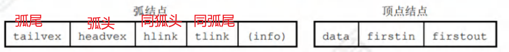

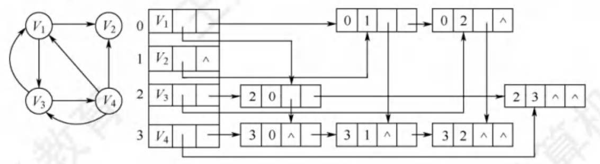

> 其实就是一个**邻接矩阵**，但是零元素不存储，每个非零元素指向它的行列下一个非零。所以同弧头边指针就是同一列，同弧尾就是同一行。

**邻接多重表（无向图）** 

> **相较于邻接表，其边结点每条边仅有一个**。删除方便。

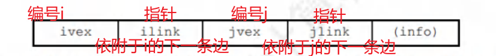

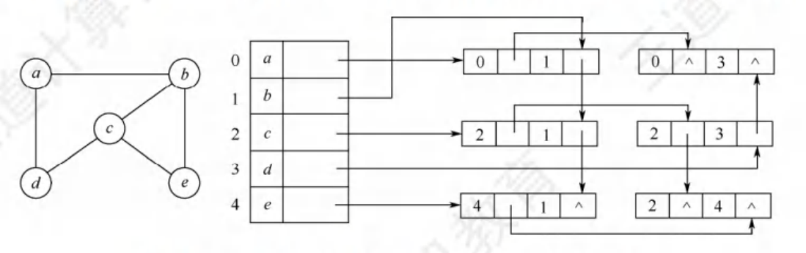


## 最小生成树

prim

```cpp
// 使用Prim算法求解最小生成树
void primMST(vector<vector<int>>& Mgraph, int V) {
    vector<int> parent(V); // 保存最小生成树
    vector<int> key(V, INT_MAX); // 用于选择最小权值边
    vector<bool> mstSet(V, false); // 标记已包含在MST中的顶点

    key[0] = 0; // 从第一个顶点开始
    parent[0] = -1; // 第一个顶点是MST的根

    // V-1 次
    for (int count = 0; count < V - 1; count++) {
        int u = minKey(key, mstSet, V); // 选择权值最小的顶点
        mstSet[u] = true; // 将选中的顶点加入MST

        // 更新选中顶点的邻接顶点的权值和父节点
        for (int v = 0; v < V; v++) {
            if (Mgraph[u][v] && !mstSet[v] && Mgraph[u][v] < key[v]) {
                parent[v] = u;
                key[v] = Mgraph[u][v];
            }
        }
    }
}
// 辅助函数：找到权值最小的未包含在MST中的顶点
int minKey(vector<int>& key, vector<bool>& mstSet, int V) {
    int min = INT_MAX, min_index;
    for (int v = 0; v < V; v++) {
        if (!mstSet[v] && key[v] < min) {
            min = key[v];
            min_index = v;
        }
    }
    return min_index;
}
```

kruskal

```cpp
void kruskalMST(vector<vector<int>>& graphAdj, int V) {
    vector<vector<int>> result; // 保存最小生成树
    vector<int> parent(V); // 保存每个顶点的父节点

    // 取出所有边
    vector<vector<int>> edges;
    for (int i = 0; i < V; i++) {
        for (int j = i; j < graphAdj[i].size(); j++) 
            if (graphAdj[i][j] != 0) 
                edges.push_back({graphAdj[i][j], i, j});

    sort(edges.begin(), edges.end()); // sort 会默认按第一个元素排序

    // 并查集初始化
    for (int i = 0; i < V; i++)
        parent[i] = -1;

    // 选取V-1条边
    for (int i = 0; i < edges.size() - 1; i++) {
        int x = find(parent, edges[i][1]);
        int y = find(parent, edges[i][2]);

        if (x != y) {
            result.push_back({edges[i][1], edges[i][2]});
            Union(parent, x, y);
        }
    }
}
```

## 最短路径

BFS < Dijkstra < Floyd

- BFS 只适用于 **无权** 图的最短路径问题。
- Dijkstra 不适用于 **负权边** 。
- Floyd 不适用于 **负权环** 。

Dijkstra

```cpp
void dijkstra(vector<vector<int>>& Mgraph, int src, int V) {
    vector<int> dist(V, INT_MAX); // 保存源点到各点的最短距离
    vector<bool> sptSet(V, false); // 标记已包含在最短路径树中的顶点

    dist[src] = 0; // 源点到自身的距离为0
	
    // V-1 次
    for (int count = 0; count < V - 1; count++) {
        int u = minDistance(dist, sptSet, V); // 选择未确定顶点中，距离最短的顶点
        sptSet[u] = true; // 将选中的顶点加入最短路径树

        // 更新选中顶点的邻接顶点的距离
        for (int v = 0; v < V; v++)
            if (!sptSet[v] && Mgraph[u][v] && dist[u] + Mgraph[u][v] < dist[v])
                dist[v] = dist[u] + Mgraph[u][v];
    }
}
```

Floyd

```cpp
void floydWarshall(vector<vector<int>>& Mgraph, int V) {
    vector<vector<int>> dist = Mgraph;

    for (int k = 0; k < V; k++) 
        for (int i = 0; i < V; i++) 
            for (int j = 0; j < V; j++)  
                dist[i][j] = min(dist[i][j], dist[i][k] + dist[k][j]);

}
```

## 拓扑排序

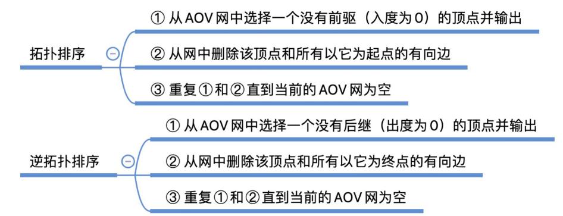


**如果一个有向图可以进行拓扑排序，就一定可以用上三角/下三角邻接矩阵存储。**

```cpp
void KahnTopologicalSort(vector<vector<int>>& Mgraph, int V) {
    vector<int> inDegree(V, 0); // 记录每个顶点的入度
    vector<int> result; // 保存拓扑排序结果
    // 计算每个顶点的入度
    for (int i = 0; i < V; i++) 
        for (int j = 0; j < V; j++) 
            if (Mgraph[i][j] != 0) 
                inDegree[j]++;
    // 将入度为0的顶点加入队列
    queue<int> q;
    for (int i = 0; i < V; i++) 
        if (inDegree[i] == 0) 
            q.push(i);
    // 拓扑排序
    while (!q.empty()) {
        int u = q.front(); q.pop();
        result.push_back(u);
        // 将所有u指向的顶点入度减1
        for (int v = 0; v < V; v++) {
            if (Mgraph[u][v] != 0) {
                inDegree[v]--;
                if (inDegree[v] == 0) 
                    q.push(v);
            }
        }
    }
}

/*==================================*/
void DFS(vector<vector<int>>& Mgraph, int V, int u, vector<bool>& visited, stack<int>& s) {
    visited[u] = true;
    for (int v = 0; v < V; v++) 
        if (Mgraph[u][v] != 0 && !visited[v]) 
            DFS(Mgraph, V, v, visited, s);
    s.push(u); // 这里如果不用栈，而是用vector保存或直接输出，那么最后得到的是逆拓扑排序。放递归前面就可以用vector
}
void DFSBasedTopologicalSort(vector<vector<int>>& Mgraph, int V) {
    vector<bool> visited(V, false);
    vector<int> result; // 保存拓扑排序结果

    stack<int> s; 
    for (int i = 0; i < V; i++) 
        if (!visited[i]) 
            DFS(Mgraph, V, i, visited, s);
    while (!s.empty()) {
        result.push_back(s.top());
        s.pop();
    }
}

```

# 查找


- 注意折半查找是在有序表基础上进行的；**而二叉排序树是根据输入的序列构建的，也称二叉查找树。** 

- 折半查找生成的判定树，根据折半查找中取中值的位置不同（**向上还是向下取整**），生成的判定树也不同。

## 分块查找

顺序与折半查找的结合。

**块内无序，块间有序。** 

**均匀分 $b$ 块**，块内块间都采用 **顺序查找** 时，每块取 $s=\sqrt{n}$ 个元素下 ASL 最小。

> $bs=n$ 

$$
\text{ASL}=\frac{b+1}{2}+\frac{s+1}{2}=\frac{n+s}{2s}+\frac{s^2+s}{2s}=\frac{s^2+2s+n}{2s}=1+\frac{1}{2}(s+\frac{n}{s})\ge1+\sqrt{n}
$$

## 平衡二叉树

平衡因子定义为 左子树高度 减 右子树高度。

设 $n_h$ 为构建一个高度为 $h$ 的平衡二叉树的 **最少结点数（所有平衡因子都是 1）**，有：

$$
n_1=1,n_2=2,\quad n_h=n_{h-1}+n_{h-2}+1
$$

<br>

**以关键字有序的的顺序插入构建AVL。若插入个数为 $2^k-1$ 则AVL必为满二叉树**

**红黑树与AVL查找、插入和删除的时间复杂度都是 $O(\log n)$**

- LL ：由于在节点A的 **左孩子(L)的左子树(L)** 上插入节点导致的不平衡。（右单旋）
- RR ：... （左单旋）
- LR ：...（先左后右的双旋转）
- RL ：...（先右后左的双旋转）

> 字母名称与定义相关，但动作不是与LLRR对应，而是行为。

**三者取中** 的三者是 上面的 L、R以及再自己。如LL：在A的左孩子（L）的左子树（L）插入导致不平衡，三者就是 **A、A的左孩子、A的左孩子的左子树**。

## 红黑树

还是 **二叉排序树（左小右大）**，但在平衡基础上放宽条件。定义如下：

**红黑节点、黑根、黑叶（虚构结点）、黑高同**

> 黑叶节是指虚构的外部节点。

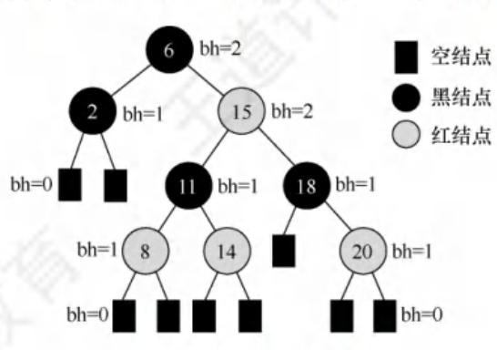

- 黑高同：从任一节点到其每个叶节点的所有路径都包含相同数目的黑节点。

> 放宽条件使得红黑树进行插入、删除操作时可以不用频繁调整，适用于经常插入、删除的场景。

根据其定义有以下结论：

1. 从根到叶的最长路径 **不超过** 最短路径的两倍。
   - 路径最短：全黑；路径最长：红黑交替。
2. n个内部节点的红黑树的高度 $h \le 2\log(n+1)$。
   - 当黑高确定时($h_1$)，树全黑时n最小($2^{h_1}-1$)；据1黑高至少为 $h/2$，故 $n \ge 2^{h_1}-1 \ge 2^{h/2}-1$。

**插入操作**

类似二叉排序树的插入，插入都为端点。假设将插入节点初始为黑色，插入后会破坏黑高，每次都要调整。**故将插入节点初始为红色**，插入后再调整。**注意，若插入位置为根节点，直接将其染黑即可。**

插入节点为红色，根据定义仅在出现两个连续红节点时需要调整，即插入时父节点为红色(**此时爷肯定是黑**)。**观察其叔节点**：

- 叔红；父、叔染黑，爷染红，再以爷为当前节点进行调整。——操作简单但要向上递归
- 叔黑；根据爷、父、插入节点位置进行相应的AVL调整的旋转操作，最后进行相应染色保证黑路同。——一次调整

注意在单旋转中，旋转后规定为 **一黑对二红**，而不是一红对二黑。感觉两者都能保证性质，但课本上是这样规定的。*后期想想为什么。*  <!-- todo -->

> 红黑树的约束高度的条件之一就是不能有连续的两个红节点，所以当红红出现时破坏了它的 “平衡” 性质，而旋转操作就是调整树的平衡性质。

**删除操作**

**删除可能导致多次旋转。** 

**红黑树与AVL两者的查找、插入、删除操作的时间复杂度都是 $O(\log n)$。** 


## B树和B+树

m阶B树定义如下：（B-树，非减号）（m叉）

**左右等高、m 叉、根至少两个子树、除根外子树个数 $\ge \lceil m/2 \rceil$、关键字左右开叉子树、关键字有序、信息在节点内。**

<center>25王道DS P319</center>

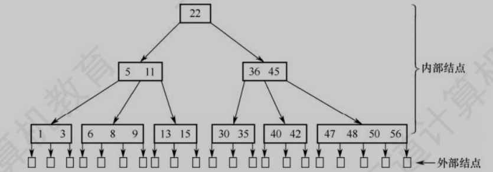

让B树的 **每个结点的关键字数最少** 是利用外部结点个数为 **n+1** （查找不成功）计算的，而外部结点位于第 h+1 层，再根据层数与关键字的关系找到 $n+1\ge 2(\lceil m/2\rceil)^{h-1}$ 得出最大层数 h。

408中规定B树高不包括外部节点，即根节点高度为1。


B树常用于磁盘查找，B树的节点大小一般等于一个磁盘页的大小，这样一次I/O操作就能读取一个节点。自顶向下找到结点后再进行关键字查找，路径上的所有内容基本都访问了（除了顺序不到）。而 B+ 树的非叶子节点仅有关键字信息，每次查找都会从根走到底，在叶节点中才有数据，非叶节点占内存非常少。

插入操作会破坏平衡性，调整策略为 取中间 $\lceil m/2 \rceil$ 关键字 **上升**，左右分裂，递归调整。

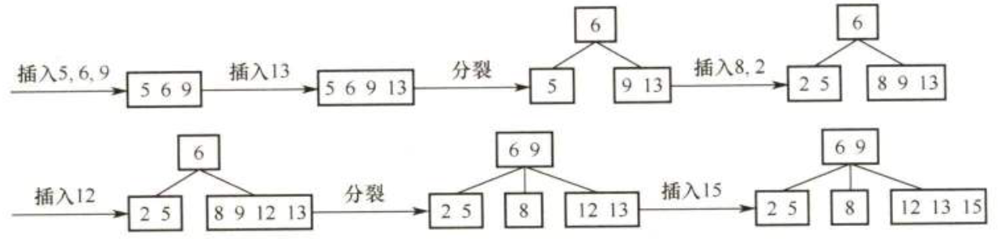

删除更复杂，首先采用前或后继替换到终端处，讨论终端节点关键数不够的情况：（==父节点都是下降==）

- 左右兄弟有多。父节点对应关键字下降，兄弟关键字上升。—— 父节点关键字数量不变
- 左右借不了。父节点对应关键字下降，与某个兄弟合并。 —— 父节点关键字数量变了，要考虑向上继续调整

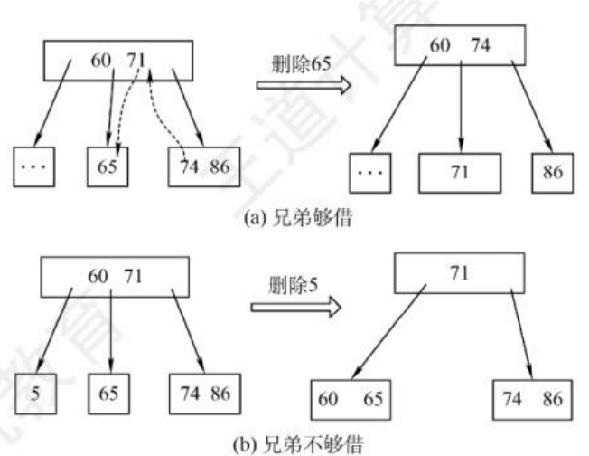

---

m阶B+树定义如下：

**左右等高、m 叉、根至少两个子树、除根外子树个数 $\ge \lceil m/2 \rceil$、关键字 *单射* 子树、关键字有序、信息在 *节点外* 、非叶节点存子树最大关键字 *副本* 。** 

- **叶节点包含所有关键字及其指向记录，叶节点之间有指针相连，关键字升序。** 
- 分支节点的关键字为其对应子树的 **最大** 关键字，便于查找。

<center>25王道DS P323</center>

<center>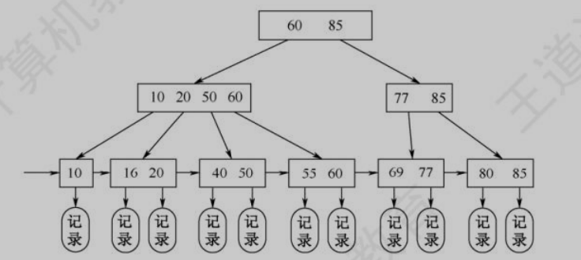</center>


> B+树没有内外节点的概念。

> 没找到又说B+树的叶节点要在同一层的资料。只在25王道DS P324 Q16 选项D中看到。（真题）

## 散列表

散列函数：把关键字映射成对应地址的函数。

构造散列函数：直接定址法、除留余数法、数字分析法、平方取中法等。

处理冲突：

- 开发地址法，用一个增量序列进行递推映射，增量序列取法：（==不能随便删除，只能标记删除，不然会导致搜索路径中断==）
  - 线性探测
  - 平方探测==（**右左** 横跳，也就是说先看后面再看前面）== 
  - 伪随机序列
- 拉链法
- 多重散列法

性能分析引入了装填因子 $\alpha = n/m$，n为关键字数，m为表长。反映了**散列表的装满程度** 。

**散列表的查找效率取决于三个因素：散列函数、处理冲突的方法、装填因子。** 装填因子越大越容易冲突。

> 散列表计算平均查找失败长度时，假设每个映射值出现的概率一样来计算。每检查一次位置算一次查找，不管位置里是否有关键字。

**散列表的平均查找长度不直接依赖于关键字数或表长，而是与装填因子有关。**


# 排序

<center>24年大纲</center>

<center>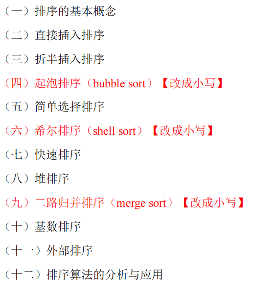</center>

排序算法的稳定性：排序前后相等关键字的相对位置不变。

**基于比较的排序，$O(n\log n)$ 时间复杂度的只有三个：快排(速度快)、堆排序(内存小)、归并(稳定)。** 它们当中快排通常更快；空间复杂度 $O(1)$ 的只有堆排序；稳定的只有归并排序。各占一个优点。

> 从时空效率看堆排序貌似最好的，但实际上堆排序作了更多的交换操作，以及它的访问不连续对缓存不友好，所以往往实际效率不如快排和归并，仅在空间上占优。
>
> 归并和快排：快排实际是数组原地排序，归并需要分配和取消新数组，故实际表现是快排更快。但归并有稳定以及外部排序条件的优势。

根据数据元素是否全部存放在内存中，排序算法分为内部排序和外部排序（一般是大文件）。

## 直接插入排序（稳定

```cpp
void InsertSort(ElemType A[], int n) {
    for (int i = 2; i <= n; i++) {  // 依次将A[2]~A[n]插入到前面已排序序列
        ElemType tmp = A[i];		// 待插入元素A[i]记录下来
        int j;
        for (j = i-1; j > 0 && tmp < A[j]; j--)	// 大于这个数的全部后移一位
            A[j+1] = A[j];
        A[j+1] = tmp;  // 插入正确位置
    }
}
```

**稳定** 且适用于顺序存储和链式存储结构。

## 折半插入排序（稳定

```cpp
void BInsertSort(ElemType A[], int n) {
    for (int i = 2; i <= n; i++) {
        ElemType tmp = A[i]; // 待插入元素A[i]记录下来
        int low = 1, high = i-1; // 折半查找有序表的插入位置
        while (low <= high) { // 之所以用 ≤ 是因为 A[low] 也要和tmp做一次比较
            int mid = (low + high) / 2;
            if (tmp < A[mid]) high = mid - 1;  // 这里知道 high的右边 ＞ 目标元素
            else low = mid + 1;  // 这里知道 low的左边 ≤ 目标元素，这里保证了算法的稳定性
        }
        // 出来时low=high+1，故目标应插入在 high 和 low 之间
        for (int j = i-1; j >= low; j--) A[j+1] = A[j]; // 
        A[low] = tmp;
    }
}
```

**折半插入排序的比较次数是确定的。** 

> 少些关键字比较罢了。

## 希尔排序（不稳定

<center>希尔排序示例</center>

<center>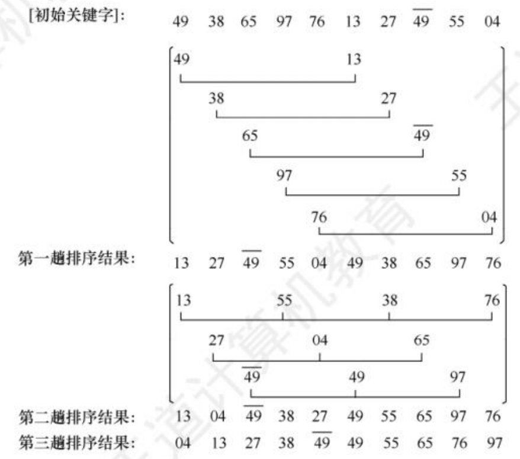</center>

```cpp
void ShellSort(ElemType A[], int n) {
    for (int dk = n/2; dk >= 1; dk /= 2) {  // 增量变化（无统一标准）
        for (int i = dk+1; i <= n; i++) {  // [1,dk]为各个序列的第一个元素， 故从dk+1开始
            // 对于i，在相应的序列进行插入排序操作。（每个序列每个元素交替进行）
            ElemType tmp = A[i];  // 待插入元素A[i]记录下来
            int j;
            for (j = i-dk; j > 0 && tmp < A[j]; j -= dk) // 增量为dk，索引边界为0
                A[j+dk] = A[j];
            A[j+dk] = tmp;
        }
    }
}
```
希尔排序的思想是分成子序列排序，让序列局部有序后加快插入排序的速度。时间复杂度难以分析，一般认为是 $O(n^{1.3})$，最坏情况下是 $O(n^2)$。

不稳定且只适用于顺序存储结构。

**上述的三种排序均是基于插入的思想，每次将一个待排序的记录插入到前面已经排好序的子序列中，直到整个序列有序。**

## 冒泡排序（稳定

```cpp
void BubbleSort(ElemType A[], int n) {
    for (int i = 1; i < n; i++) {  // n-1趟排序
        bool flag = false;  // 标记本趟是否发生交换
        for (int j = n; j > i; j--) {  // 从后往前，将最小的元素交换到前面
            if (A[j] < A[j-1]) {
                swap(A[j], A[j-1]);
                flag = true;
            }
        }
        if (!flag) return;  // 本趟未发生交换，说明已经有序
    }
}
```

稳定且适用于顺序存储和链式存储结构。

**注意，当序列有序时，冒泡排序还需要进行一趟无交换的遍历确定。**

## 快速排序（不稳定⭐

```cpp
void QuickSort(ElemType A[], int a, int b) { // A[a...b]快速排序
    if (a < b) {  // 区间长度大于1
        int pos = Partition(A, a, b); 
        QuickSort(A, a, pos-1);
        QuickSort(A, pos+1, b);
    }
}
void Partition(ElemType A[], int i, int j) {  // A[i...j]一次划分
    ElemType p = A[i];  // 用子表的第一个记录作枢轴记录
    while (i < j) { 
        while (i < j && A[j] >= p) j--;  // 右边找 ＜
        A[i] = A[j]; 
        while (i < j && A[i] < p) j++;    // 左边找 ≥
        A[j] = A[i];
    }
    A[i] = p; // 此时i=j，且明显知道A[i]是重复元素
    return i;
}
```

**快速排序是所有内部排序算法中最快的，平均时间复杂度为 $O(n\log n)$，最坏情况下为 $O(n^2)$。**，空间复杂度平均是 $O(\log n)$ 

但不稳定，适用于顺序存储结构。

**快排每次划分都确定一个元素位置。** 

> 趟数是按整个序列遍历次数计算的，所以对于快速排序，第一次的划分是一趟，==如果不是最坏情况，第二趟有两次划分==，以此类推。

## 简单选择排序（不稳定

```cpp
void SelectSort(ElemType A[], int n) {
    for (int i = 1; i < n; i++) {  // n-1趟排序
        int min = i;  // 记录最小元素位置
        for (int j = i+1; j <= n; j++) {  // 从后面找最小元素
            if (A[j] < A[min]) min = j;
        }
        if (min != i) swap(A[i], A[min]);  // 交换，直接交换，导致了不稳定性
    }
}
```

不稳定，但适用于顺序存储和链式存储结构。其关键字比较次数与记录的初始状态无关，始终是 $n(n-1)/2$。

## 堆排序（不稳定

按序 $[1\dots n]$ 编号的满二叉树中，对于任意节点i，其左孩子为 $2i$，右孩子为 $2i+1$，父节点为 $\lfloor i/2 \rfloor$。最后一个节点的父节点为 $\lfloor n/2 \rfloor$，故最后一个非叶节点为 $\lfloor n/2 \rfloor$。

**大根堆**：每个节点的值都不小于其孩子节点的值。

```cpp
void HeapSort(ElemType A[], int n) {
    for (int i = n/2; i > 0; i--) {  // 建立大根堆，注意是从n/2开始
        HeapAdjust(A, i, n);
    }
    for (int i = n; i > 1; i--) {	// 大根堆堆顶是最大值，把它们依次放到后面。
        // A[n]赋 最大值、A[n-1]赋 次大值、……
        swap(A[1], A[i]);  // 将最大即堆顶元素与堆中最后一个元素交换
        HeapAdjust(A, 1, i-1);  // 排除一个，调整堆
    }
}

// 对以 A[s] 为根的子树进行调整，使其成为大根堆
void HeapAdjust(ElemType A[], int s, int m) {
    A[0] = A[s];  // 暂存根节点
    for (int j = 2*s; j <= m; j *= 2) {  // A[j] 为孩子
        if (j < m && A[j] < A[j+1]) j++;  // A[j] 为较大的孩子
        if (A[0] >= A[j]) break;  // 没有大孩子，调整结束
        A[s] = A[j];  // 大孩子上移
        s = j;  // 向下继续调整
    }
    A[s] = A[0];  // 插入
}
```

> **建立大根堆排序结果是递增的，建立小根堆排序结果是递减的。**

不稳定，但时间复杂度为 $O(n\log n)$，仅适用于 **顺序** 存储结构。

## 归并排序（稳定

```cpp
ElemType *B = new ElemType[n];  // 辅助数组
void MergeSort(ElemType A[], int low, int high) {
    if (low < high) { // 要求两个元素及其以上
        int mid = (low + high) / 2;  // 从中间划分两个子序列
        MergeSort(A, low, mid);  // A[low...mid]
        MergeSort(A, mid+1, high);  // A[mid+1...high]
        Merge(A, low, mid, high);  // 合并
    }
}
void Merge(ElemType A[], int low, int mid, int high) { // [low...mid] [mid+1...high]
    int i = low, j = mid+1, k = low;  // [i...j] [k...high]
    int *B = (ElemType *)malloc((high+1)*sizeof(ElemType));  // 辅助数组
    while (i <= mid && j <= high) {  
        if (A[i] <= A[j]) B[k++] = A[i++];
        else B[k++] = A[j++];   
    }
    while (i <= mid) B[k++] = A[i++];  
    while (j <= high) B[k++] = A[j++]; 
    for (int i = low; i <= high; i++) A[i] = B[i];  // 将辅助数组复制回原数组
    
}
```

归并排序是一种 **稳定** 的排序算法，时间复杂度为 $O(n\log n)$，但需要额外的空间 $O(n)$。

适用于顺序存储和链式存储结构。

**比较次数的数量级与初始状态无关。** 

## 基数排序（稳定

分配有两种 MSD（Most Significant Digit first）和 LSD（Least Significant Digit first）。

升序排序 就小到大收集。

## *计数排序

统计小于待排元素的元素个数，直接确定待排元素的位置。

## 外部排序

常采用归并排序。

1. 根据内存缓冲区大小，将外存文件分成若干个子文件，依次读入内存并利用内部排序算法进行排序后写回外存，构成有序子文件——**初始归并段**。
2. 对这些归并段进行 **逐趟** 归并，使得归并段的长度逐渐增大，直到整个文件有序。

**外部排序总时间 = 内部排序时间（生成初始归并段的时候） + 外存读写时间 + 归并时间。**

一般地，对于 r 个初始归并段（第一步产生的归并段），做 k 路平衡归并。每趟归并可获得 $\lceil r_i/k \rceil$ 个归并段，其中 $r_i$ 为第 i 趟的归并前的归并段数，即 $r_1 = r$。设需要进行 S 趟归并，则有： $\lceil r/k^S \rceil = 1$，即 $S = \lceil \log_k r \rceil$。还有 S = 归并树的高度 - 1。

减少归并趟数 S 可以减少外存读写次数，由上文可知可以通过 **增大归并路数k** 或 **减少初始归并段数r** 来减少归并趟数。

### 增加归并路数——多路归并与败者树，优化步骤2

**败者树减少多路归并的比较次数。**

增加归并路数时，内部归并的时间又会增加。最坏情况下每趟归并 n 个元素需要做 $(n-1)(k-1)$ 次比较（在 k 个元素中选择最小要比较 k-1 次），故 S 趟的总比较次数为：
$$
S(n-1)(k-1)=\lceil \log_k r \rceil (n-1)(k-1)=\lceil \log_2 r \rceil (n-1)(k-1)/\lceil \log_2 k \rceil
$$

可见总比较次数与每趟归并元素个数 n、初始归并段数 r 以及归并路数 k 都呈正相关。引入败者树解决这个问题。

<center>败者树</center>

<center>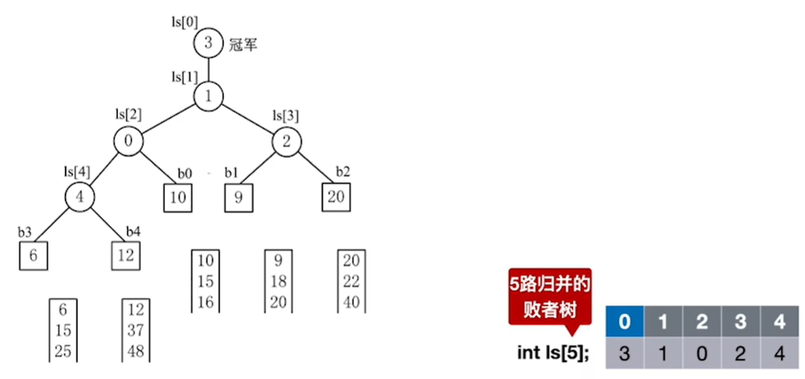</center>

败者树是一颗 **完全二叉树**，有 k 个叶节点对应 k 个归并段，存储在对于归并段当前参与比较的元素；每个分支节点则是记录着两子树的“失败者”——元素大为失败者，元素小为胜利者（**失败者留守关卡，新来的破关上升。**）。有 k 个叶节点的完全二叉树有 k-1 个分支节点，故构建败者树需要 k-1 次比较，需要 k 个存储空间（有一个存着冠军）。

构建好败者树后其高度为 $\lceil \log_2 k\rceil+1$，每次取完最小值需要进行 $\lceil \log_2 k\rceil$ 次比较调整， 故S趟的总比较次数为：

$$
k-1+S(n-1)\lceil \log_2 k\rceil= k-1+ \lceil \log_2 r \rceil (n-1)
$$

可见，使用败者树后总比较次数仅在构造败者树时与 k 有关，后续的比较次数与 k 无关。

### 减少初始归并段数——置换选择排序，优化步骤1

最常用方法是默认初始归并段长度一致，其实可以利用置换选择排序生成更长的初始归并段，从而减少归并段数。

一图胜千言：

<center>25王道DS P397</center>

<center>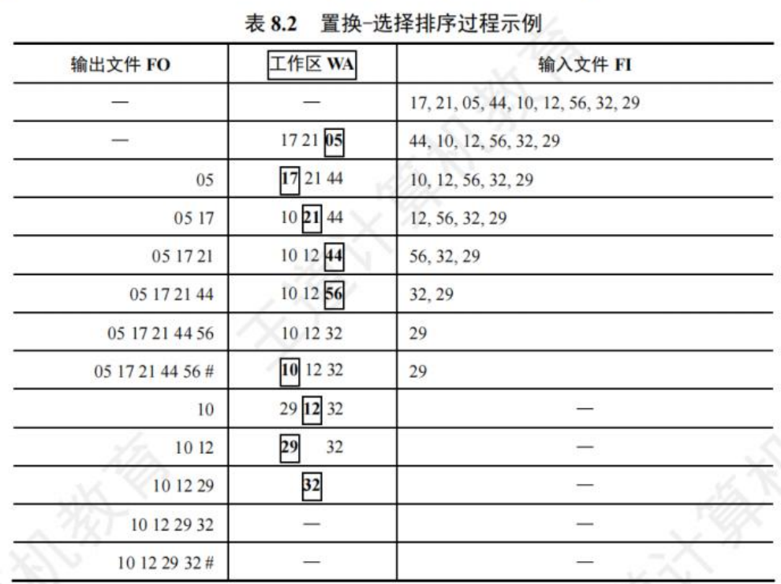</center>

在工作区WA中选择出 MINIMAX 也是用到了败者树的！。

### 配合置换选择排序的最佳归并树，优化步骤2

经过置换选择排序后，初始归并段的长度是不一致的，这时候如何组织归并段的合并使得外存读写次数最少是一个新的问题。

哈夫曼树在 k 叉树上的推广，构造算法是一样的，但要注意叶节点要求 **必须能够构造出一个严格的 k 叉树**，即树中只有度为 k 或 0 的结点，**若不足需要用添加权值（归并段长度）为 0 的虚拟节点（虚拟归并段）**。

哈夫曼树在 k 叉树上的推广应用与归并段归并组织就是一颗最佳归并树。（以归并段长度为权值）


</br></br></br></br></br></br></br></br></br></br></br></br></br></br>
</br></br></br></br></br></br></br></br></br></br></br></br></br></br>
</br></br></br></br></br></br></br></br></br></br></br></br></br></br>

---