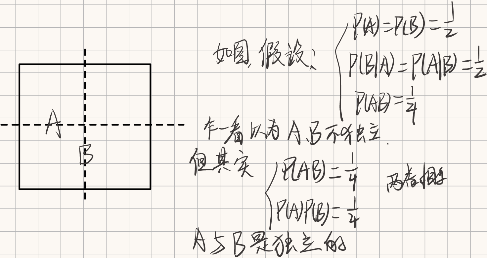
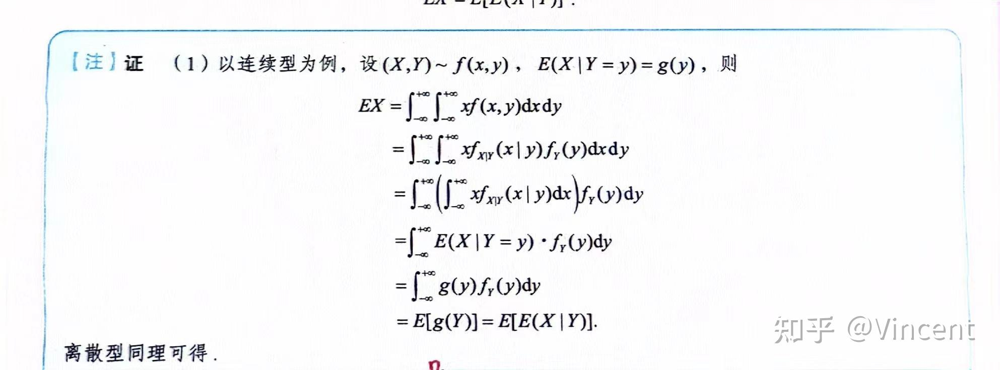
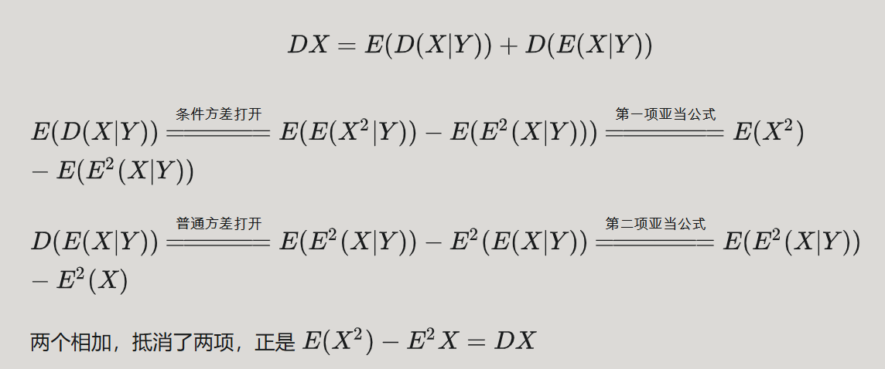
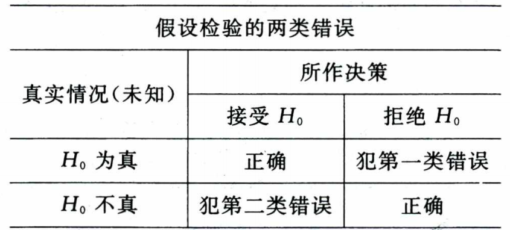
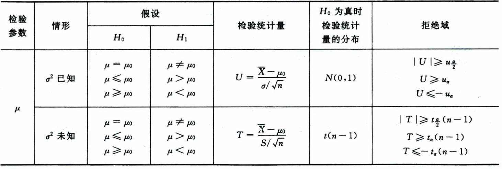
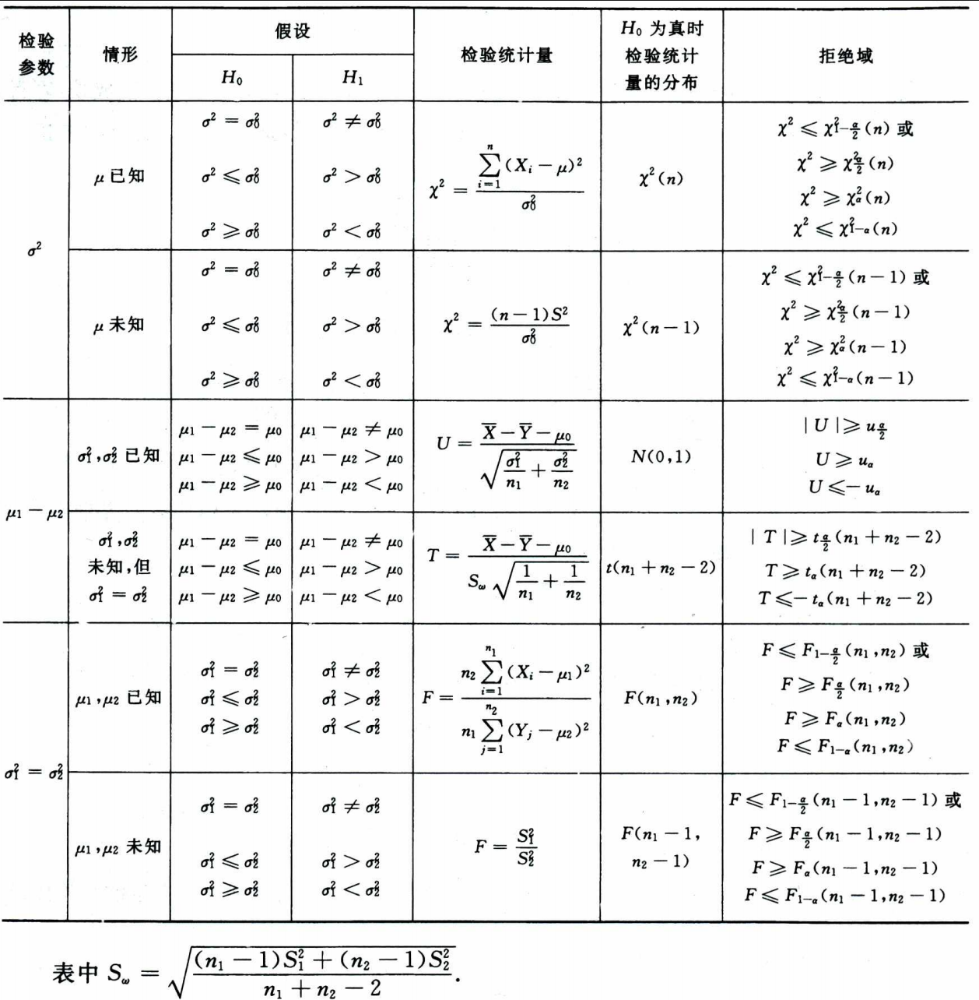
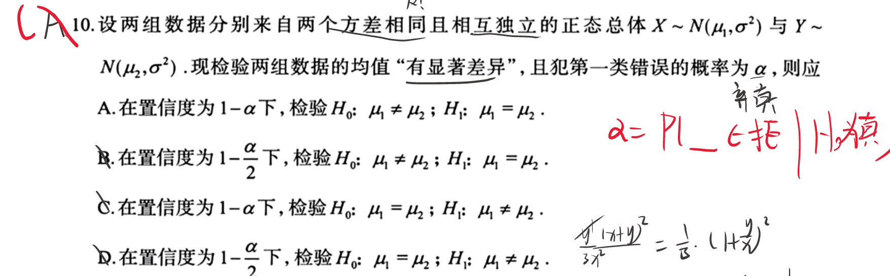

# 随机事件和概率

## 一些基本概念

- 样本点：随机试验的每一个可能结果，$\omega$ 
- 样本空间：所有样本点的集合，$\Omega$ 
- (随机)事件：样本空间的子集，$A \subset \Omega$ 

事件的关系

- 互斥事件（互不相容）：$A \cap B = \emptyset$
- 对立事件：$A \cup B = \Omega \land A \cap B = \emptyset$ 

> 显然 对立事件一定是互斥事件，但互斥事件不一定是对立事件

**德摩根律**
$$
\overline{A\cup B}=\overline{A}\cap\overline{B} \\
\overline{A\cap B}=\overline{A}\cup\overline{B}
$$

## 概率

条件概率定义：

$$
P(A|B) = \frac{P(AB)}{P(B)},\qquad P(B) \neq 0
$$

> 这是定义，随时可用。
>
> 审题注意是否要求的是条件概率。
>
> **计算条件概率除了公式法，还可以用缩减样本空间** 

与逆的转换：
$$
P(A|B)=1-P(\overline{A}|B)
$$
位置的变换（仅概率为0才能）：
$$
若P(A|B)=1\Rarr P(\overline{A}|B)=0 \Rarr P(\overline{A}B)=0 \Rarr P(B|\overline{A})=0
$$

### 独立

事件 $A$ 和 $B$ 独立，当且仅当 $P(AB) = P(A)P(B)$ 。

充要转化： $P(B|A)+P(\overline{B}|\overline{A})=1$ 。

> 事件独立是指，$B$ 是否发生与 $A$ 是否发生无关，即 $P\{A|B\}=P\{A|\overline{B}\}$ 。

设 $A_1, A_2, \cdots, A_n$ 为 $n$ 个事件，若对任意 $k(1 \leq k \leq n)$（个数），任意 $i_1, i_2, \cdots, i_k$（组合），有

$$
P(A_{i_1}A_{i_2}\cdots A_{i_k}) = P(A_{i_1})P(A_{i_2})\cdots P(A_{i_k})
$$

则称 $A_1, A_2, \cdots, A_n$ 为相互独立的事件。

**将 $n$ 个相互独立的事件中任意几个换成对立事件，这些事件仍然是相互独立的。**

> 注意这里不是两两满足两事件独立就可以了，而是对于 $n$ 个事件判断相互独立需要 $C_n^2 + C_n^3 + \cdots + C_n^n=2^n-n-1$ 个等式成立。而不是 $C_n^2$ 。两两独立不能保证多个事件相互独立。
>
> 独立性与互斥、对立性无关。两者是不同维度的问题。

举个例子：

> 独立也是概率，推不出事件

### 五大概率公式

- 加法公式
   - $P(A \cup B) = P(A) + P(B) - P(AB)$
- 减法公式
   - $P(A-B) = P(A) - P(AB)$
- 乘法公式
   - $P(AB) = P(A)P(B|A) = P(B)P(A|B)$
   - $P(A_1A_2\cdots A_n) = P(A_1)P(A_2|A_1)P(A_3|A_1A_2)\cdots P(A_n|A_1A_2\cdots A_{n-1})$
- 全概率公式
   - $P(B) = \sum_{i=1}^n P(A_i)P(B|A_i)$，其中 $A_i$ **两两互斥**，且 $\bigcup_{i=1}^n A_i = \Omega$（完备事件组）。
- 贝叶斯公式（条件同样是完备事件组，但是是求完备事件组当中个事件的概率）
$$
P(A_i|B) = \frac{P(A_i)P(B|A_i)}{P(B)}=  \frac{P(A_i)P(B|A_i)}{\sum_{j=1}^n P(A_j)P(B|A_j)}
$$

> **抓阄原理： $n$ 个人抓 $m$ 个阄，无论是否放回，无论第几个人抓，抓到的概率都是 $\frac{m}{n}$。**

==**重点注意：仅知道概率无法推断事件，而事件可推概率！！！！** 。== 

## 古典模型、几何模型、伯努利模型

- 古典模型 ：有限、等可能
- 几何模型：可能性与几何度量成正比

### 伯努利模型

- 独立重复试验：独立、重复若干次、各次实验的同一事件发生概率相同。

- 伯努利实验：每次试验只有两种的结果的独立重复试验。$A$ 和 $\overline{A}$

$n$ 重伯努利试验中，事件 $A$ 发生 $k$ 次的概率为（二项概率公式）：

$$
P_n(k) = C_n^k p^k(1-p)^{n-k}
$$

# 随机变量及其概率分布

## 随机变量及其分布函数

- 在 $\varOmega$ 上的 **实值函数** $X=X(\omega)$，称 $X$ 为 **随机变量**。

- **分布函数** ：$F(x) = P(X \leq x)$。注意是 $\le$。

- ==离散的概率和为1，连续的概率密度积分为1；常用来求解位置参数== 

### 离散型随机变量

- 随机变量取值是 **有限多个或者可列无穷多个** 的随机变量。

- 列出所有可能取值的概率，称为 **概率分布** 或 **分布律**。

### 连续型随机变量

存在 **非负可积** 函数 $f(x)$，使得对任意 $x$ 有

$$
F(x) = P(X \leq x) = \int_{-\infty}^x f(t)dt
$$

$X$ 为连续型随机变量，$f(x)$ 为 $X$ 的 **概率密度函数**。

也由此可知要求分布函数 $F(x)$ **连续、仅有有限个不可导点**。

## 常用分布

### 二项分布

$n$ 重伯努利试验中，每次试验事件 $A$ 发生的概率为 $p$，则发生次数 $X$ 服从二项分布，记为 $X \sim B(n, p)$。
$$
E(X)=np\quad,D(x)=np(1-p)
$$

> 可以叠加。比如n个相互独立的0-1分布相加就是n重伯努利分布

### 几何分布

$$
P(X=k) = (1-p)^{k-1}p,\quad k=1,\cdots,
$$

> 几何分布就是一系列伯努利试验中在 第 $k$ 次 才成功的概率。
>
> 遇到 $P(X=k) = (1-p)^{k}p,\quad k=0,1,\cdots,$ 时，$X+1$ 才是几何分布。

$$
E(X)=\frac{1}{p}\quad,D(X)=\frac{1-p}{p^2}
$$

### 超几何分布

$$
P(X=k) = \frac{C_M^k C_{N-M}^{n-k}}{C_N^n}
$$

### 泊松分布

$$
P(X=k) = \frac{\lambda^k}{k!}e^{-\lambda},\quad \lambda > 0 \\
E(x)=D(X)=\lambda
$$

记 $X\sim P(\lambda)$ 或 $X\sim \pi(\lambda)$。

**单位时间内稀有事件发生的次数。** 

> $\sum_{k=0}^\infty \frac{\lambda^k}{k!}e^{-\lambda} = e^{-\lambda}\sum_{k=0}^\infty \frac{\lambda^k}{k!} = e^{-\lambda}e^{\lambda} = 1$。
> 
> $e^{\lambda x}$ 的麦克劳林展开式，取 $x=1$。

> 泊松分布是用来近似计算二项分布的，当 $n$ 很大，$p$ 很小时，$np=\lambda$ 时，可以用泊松分布来近似。

---

下面是连续型随机变量的分布。

### 均匀分布

$$
f(x) = \begin{cases}
\frac{1}{b-a}, & a \leq x \leq b \\
0, & \text{其他}
\end{cases},
\qquad
F(x) = \begin{cases}
0, & x < a \\
\frac{x-a}{b-a}, & a \leq x \leq b \\
1, & x > b
\end{cases} \\
E(X)=\frac{a+b}{2}\quad,D(x)=\frac{(b-a)^2}{12}
$$

$X$ 在 $[a, b]$ 上服从均匀分布，记为 $X\sim U[a, b]$。

### 指数分布

$$
f(x) = \begin{cases}
\lambda e^{-\lambda x}, & x > 0 \\
0, & x \le 0
\end{cases},\quad \lambda > 0,
\qquad
F(x) = \begin{cases}
0, & x \le 0, \\
1-e^{-\lambda x}, & x > 0
\end{cases}\\
E(X)=\frac{1}{\lambda},\quad D(X)=\frac{1}{\lambda^2}
$$

$X$ 服从参数为 $\lambda$ 的指数分布，记为 $X\sim E(\lambda)$。

常用结论：

- 无记忆性：$P(X>s+t|X>s) = P(X>t)$。
- $X\sim E(\lambda_1),Y\sim E(\lambda_2)$ ，$X,Y$ 独立， 则 $\min(X,Y)\sim E(\lambda_1+\lambda_2)$ 。

### 正态分布

$$
f(x) = \frac{1}{\sqrt{2\pi}\sigma}e^{-\frac{(x-\mu)^2}{2\sigma^2}},
\qquad
当 \mu = 0, \sigma = 1 时,\quad
f(x) = \frac{1}{\sqrt{2\pi}}e^{-\frac{x^2}{2}}
$$

$X$ 服从参数为 $\mu, \sigma$ 的正态分布，记为 $X\sim N(\mu, \sigma^2)$。（注意这里参数是方差，而不是标准差）

3 $\sigma$ 原则：

- $P(\mu-\sigma \leq X \leq \mu+\sigma) \approx 0.6827$ 
- $P(\mu-2\sigma \leq X \leq \mu+2\sigma) \approx 0.9545$ 
- $P(\mu-3\sigma \leq X \leq \mu+3\sigma) \approx 0.9973$ 

## 随机变量 函数的分布

$$
Y = g(X)
$$

对于 离散型随机变量，其分布律为：

$$
P(Y=g(x_i)) = P(X=x_i)
$$

> 若 $g(x_i)$ 有相同值，需要合并。

对于 连续型随机变量，设其概率密度函数为 $f_X(x)$ ，两种方法计算 $Y$ 的概率密度函数：

### 公式法

条件： $y=g(x)$ **单调**、**可导**，且 $g'(x)\neq 0$。

取其反函数 $x=h(y)$，$y$ 的取值范围为 $[a, b]$，则

$$
f_Y(y) = \begin{cases}
f_X(h(y))|h'(y)|, & a \leq y \leq b \\
0, & \text{其他}
\end{cases}
$$

### 定义法

$$
F_Y(y) = P(Y \leq y) = P(g(X) \leq y) = \int_{g(x)\leq y} f_X(x)dx \overset{公式法条件}{=} \int_{-\infty}^{h(y)} f_X(x)dx \\
f_Y(y) = F_Y'(y)\overset{公式法条件}{=} f_X(h(y))|h'(y)|
$$

## 杂

- 关于概率不等式问题，遇到无穷积分带 $e^{-x^2}$  凑正态分布，遇到无穷积分带 $e^{-x}$ 凑 $\Gamma$ 函数。
- 显然对于分布函数的分布即 $Y=F(X)$ ，$F(X)$ 是 $X$ 的分布函数，则 $Y\sim U[0, 1]$ 。（用 $F$ 的反函数求证）

# 多维随机变量及其分布

## 二维随机变量

**分布函数：**

$$
F(x,y) = P(X \leq x, Y \leq y)
$$

显然有：

$$
F(-\infty, -\infty) = F(-\infty, y) = F(x, -\infty) = 0, \quad F(+\infty, +\infty) = 1
$$

**边缘分布函数：**

$$
\begin{align*}
F_X(x) &= P(X \leq x) = P(X \leq x, Y < +\infty) = F(x, +\infty) \\
F_Y(y) &= P(Y \leq y) = P(X < +\infty, Y \leq y) = F(+\infty, y)
\end{align*}
$$

**条件分布：** 

在条件 $Y=y$ 下 $X$ 的条件分布函数：

$$
\forall \varepsilon > 0, \quad P(y < Y \leq y + \varepsilon) > 0,
\\
\lim_{\varepsilon \to 0^+} \frac{P(X \leq x, y < Y \leq y + \varepsilon)}{P(y < Y \leq y + \varepsilon)} \qquad 存在
$$

记 $F_{X|Y}(x|y) = P(X \leq x|Y=y)$

### 连续型随机变量

$$
F(x,y)=\int_{-\infty}^x\int_{-\infty}^y f(u,v) \mathrm{d} u \mathrm{d} v \\
f_X(x)= \int_{-\infty}^{+\infty} f(x,y) \mathrm{d} y \\
f_Y(y)= \int_{-\infty}^{+\infty} f(x,y) \mathrm{d} x
$$

其条件分布：

$$
F_{X|Y}(x|y) = \int_{-\infty}^x \frac{f(s,y)}{f_Y(y)} \mathrm{d} s,\quad f(x,y)\ 在该点连续
$$

$$
f_{X|Y}(x|y)=\frac{f(x,y)}{f_Y(y)} \\

f(x,y)=f_{X|Y}(x|y)f_Y(y)
$$

> 上面要求连续是因为公式的推导是根据定义展开，然后利用拉格朗日中值定理，极限逼近于 $y$ 的。
> $$
> \lim_{\varepsilon \to 0^+} \int_y^{y+\varepsilon} f(x,y) \mathrm{d} y \overset{连续}{=} \lim_{\varepsilon \to 0^+}  \varepsilon f(x,y)
> $$

## 独立性

$$
P(X \leq x, Y \leq y) = P(X \leq x)P(Y \leq y),\\
即\quad F(x,y) = F_X(x)F_Y(y),\\
更有\quad f(x,y) = f_X(x)f_Y(y),\quad\text{几乎处处成立}
$$

证明不独立只需找到特殊值说明即可上式不成立即可。

- **遇到连续型二维随机变量最好画图理解！！！** 
- **常常也是转成多个事件的关系，然后利用事件的性质运算** 。比如 $P(X<1,Y<0)=a$ 改写成 $P(AB)=a$ 。

## 均匀分布和正态分布

### 二维均匀分布

$$
f(x,y) = \begin{cases}
\frac{1}{S}, & (x,y)\in D \\
0, & \text{其他}
\end{cases}
$$

其中 $S$ 为 $D$ 的面积。$P((X,Y)\in D_1)=\frac{D_1\text{的面积}}{S}$ 。

### 二维正态分布

$$
f(x,y) = \frac{1}{2\pi\sigma_1\sigma_2\sqrt{1-\rho^2}}\exp\left\{-\frac{1}{(1-\rho^2)}\left[\frac{(x-\mu_1)^2}{2\sigma_1^2}-2\rho\frac{(x-\mu_1)(y-\mu_2)}{2\sigma_1\sigma_2}+\frac{(y-\mu_2)^2}{2\sigma_2^2}\right]\right\},\\
f_X(x)=\frac{1}{\sqrt{2\pi}\sigma_1}\exp\left\{-\frac{(x-\mu_1)^2}{2\sigma_1^2}\right\},\quad f_Y(y)=\frac{1}{\sqrt{2\pi}\sigma_2}\exp\left\{-\frac{(y-\mu_2)^2}{2\sigma_2^2}\right\}
$$

> 辅助记忆： $x^2-2xy+y^2=(x-y)^2$

其中 $-1<\rho<1$。记为 $(X,Y)\sim N(\mu_1, \mu_2; \sigma_1^2, \sigma_2^2; \rho)$。

性质，若 $(X,Y)\sim N(\mu_1, \mu_2; \sigma_1^2, \sigma_2^2; \rho)$，则：（能构成二维正态的两个随机变量）：

1. $X\sim N(\mu_1, \sigma_1^2),\quad Y\sim N(\mu_2, \sigma_2^2)$ （注意这条反向不一定成立，**重点**）

2. $X$ 与 $Y$ 独立 $\Leftrightarrow \rho = 0$。 —— $f(x,y)=f_X(x)f_Y(y)$ —— 它的独立性与不相关性一致

3. $aX+bY\sim N(a\mu_1+b\mu_2,\ a^2\sigma_1^2+b^2\sigma_2^2+2ab\rho\sigma_1\sigma_2)$—— **能构成二维正态的正态分布变量函数的分布** 

4. 可逆变换 $\begin{vmatrix}a&b\\c&d\end{vmatrix}\begin{vmatrix}X\\Y\end{vmatrix}$，即 $(aX+bY,cX+dY)$  仍然服从二维正态分布。——原本可以构成二维正态分布的变量，经过线性变换后仍然是二维正态分布。 —— 推导其他二维正态分布。

> **二维正态分布一定是两个正态分布变量构成的，但随意两个正态分布变量构成的不一定是二维正态分布。** 

特别地，$\rho=0$ 时，

$$
f(x,y) = \frac{1}{2\pi\sigma_1\sigma_2}\exp\left\{-\frac{1}{2}\left[\frac{(x-\mu_1)^2}{\sigma_1^2}+\frac{(y-\mu_2)^2}{\sigma_2^2}\right]\right\}
$$

**可见两个独立的正态分布一定可以构成二维正态分布。** 常常结合 4 来推导其他的二维分布是否满足正态分布。

> 独立的正态分布线性组合仍是正态分布

==独立的条件很强，一般正态分布探讨独立都是，判断协方差为0，并且可以构成二维正态（常用4线性组合证明），那么独立。== 

## 两个随机变量函数的分布

离散比较简单，主要讨论连续的。

$Z=g(X,Y)$

### $X,Y$ 均为连续型随机变量

$$
F_Z(z)=P(Z\leq z)=P(g(X,Y)\leq z)=\iint_{g(x,y)\leq z}f(x,y)\mathrm{d}x\mathrm{d}y
$$

> 就是画图求面积。若是问概率密度可以先不用积出来，直接求导。

**卷积公式：** 
$$
f_Z(z)=\int_{-\infty}^{+\infty} f(x,h(x,z))|\frac{\partial h(x,z)}{\partial z}|\mathrm{d}x=\int_{-\infty}^{+\infty} f(h(y,z),y)|\frac{\partial h(y,z)}{\partial z}|\mathrm{d}y\\
以第一个等式为例，x\in D_x;h(x,z)\in D_y\rArr x 的卷积范围。
$$

要求反函数存在。大抵就是把 $y$ 用 $x,z$ 表示出来代入用来的二维概率密度函数再乘这个反函数 **对 $z$ 的偏导** 然后积分。然后根据 $z$ 的范围积分，分段写出概率密度函数。

**如果遇到是绝对值，也可以拆开分别卷积，然后求和即可。** 

本质其实就是二重积分换元法，涉及雅可比行列式。

### $X$ 为离散型，$Y$ 为连续型

$$
F_Z(z)=P(Z\leq z)=P(g(X,Y)\leq z)=\sum_{i}P(X=x_i)P(g(x_i,Y)\leq z|X=x_i)=独立=...
$$

### 最大值、最小值

$U=\max(X,Y)$ 

$$
F_U(u)=P(U\leq u)=P(\max(X,Y)\leq u)=P(X\leq u, Y\leq u)
$$

$V=\min(X,Y)$ 

$$
F_V(v)=P(V\leq v)=P(\min(X,Y)\leq v)=1-P(X>v, Y>v)
$$

注意有： $U=(X+Y+|X-Y|)/2$ ，$V=(X+Y-|X-Y|)/2$。

特别有：$U+V=X+Y$ , $UV=XY$ ，$U-V=|X-Y|$ 。

最大最小值它们两者之间还有：
$$
P(\max(X,Y)>a)=P((X>a)\bigcup(Y>a))=P(X>a)+P(Y>a)-P(X>a,Y>a)=\\
P(X>a)+P(Y>a)-P(\min(X,Y)>a)\\
P(\max(X,Y)>a)+P(\min(X,Y)>a)=P(X>a)+P(Y>a)
$$
这是从事件的角度看。

==所以当看到两者其中之一出现时，同时考虑另一个看能否简化问题。== 

$n$ 个相互独立的最大最小值：

$U=\max{X_i},\quad V=\min X_i$  
$$
F_U(u)=F^n(u);\quad f_U(u)=nF(u)^{(n-1)}f(u)\\
F_V(v)=1-[1-F(v)]^n;\quad f_V(v)=n[1-F(v)]^{(n-1)}f(v)
$$

# 随机变量的数字特征

## 期望和方差

### 期望

$$
P(X=x_k)=p_k,\qquad k=1,2,\cdots, \\
\sum_{k=1}^{+\infty} x_kp_k,\quad\text{绝对收敛},\\
E(X)=\sum_{k=1}^{+\infty} x_kp_k\\
$$

 

$$
\int_{-\infty}^{+\infty} xf(x)\mathrm{d}x \quad \text{绝对收敛},\\
E(X)=\int_{-\infty}^{+\infty} xf(x)\mathrm{d}x
$$

 

对任意 $X,Y$ ：

$$
E(X\pm Y)=E(X)\pm E(Y)
$$

 
$$
E(XY)=E(X)E(Y)\Leftrightarrow X,Y\text{不相关}
$$

> 注意这里是充要条件

### 方差

$$
D(X)=E\{[X-E(X)]^2\}=E(X^2)-[E(X)]^2
$$

> 易知 $E(X^2)\ge [E(X)]^2$

标准差、均方差： $\sigma(x)=\sqrt{D(X)}$ 。

- $C$ 是常数，$D(C)=0$。——反之不一定成立。（在某个0概率集合上，可以是其他数）
- $D(aX+b)=a^2D(x)$
- $D(X\pm Y)=D(X)+D(Y)\pm 2\text{Cov}(X,Y)$

### 常见分布的期望和方差

| 分布                             | 期望                | 方差                  |
| -------------------------------- | ------------------- | --------------------- |
| 二项分布 $X\sim B(n,p)$          | $np$                | $np(1-p)$             |
| 泊松分布 $X\sim P(\lambda)$      | $\lambda$           | $\lambda$             |
| **几何分布**                     | $\frac{1}{p}$       | $\frac{1-p}{p^2}$     |
| 均匀分布 $X\sim U(a,b)$          | $\frac{a+b}{2}$     | $\frac{(b-a)^2}{12}$  |
| 指数分布 $X\sim E(\lambda)$      | $\frac{1}{\lambda}$ | $\frac{1}{\lambda^2}$ |
| 正态分布 $X\sim N(\mu,\sigma^2)$ | $\mu$               | $\sigma^2$            |
| 卡方分布 $X\sim \chi^2(n)$       | $n$                 | $2n$                  |

贴个亚当公式：

贴个夏娃公式：

## 矩、协方差和相关系数

### 矩

- $k$ 阶 **原点矩**：$E(X^k)$
- $k$ 阶 **中心矩**：$E\{[X-E(X)]^k\}$ ， $k=2,3.\cdots$ 
- $X$ 和 $Y$ 的 $k+l$ 阶 **混合矩**：$E(X^kY^l)$
- $X$ 和 $Y$ 的 $k+l$ 阶 **混合中心矩**：$E\{[X-E(X)]^k[Y-E(Y)]^l\}$， $k,l=1,2,\cdots$

### 协方差

[终于明白协方差的意义了原创 - CSDN博客](https://blog.csdn.net/GoodShot/article/details/79940438)
$$
\text{Cov}(X,Y)=E\{[X-E(X)][Y-E(Y)]\}=E(XY)-E(X)E(Y)
$$

> 协方差是 $X$ 和 $Y$ 的 $1+1$ 阶混合中心矩。

- $\text{Cov}(X,X)=D(X)$ 
- $\text{Cov}(X,Y)=\text{Cov}(Y,X)$ —— 交换律
- $\text{Cov}(aX,bY)=ab\text{Cov}(X,Y)$ 
- $\text{Cov}(X_1+X_2,Y)=\text{Cov}(X_1,Y)+\text{Cov}(X_2,Y)$ —— 分配律

根据分配律特别地，有：

$$
D(X_1+X_2+\cdots+X_n)=\sum_{i=1}^n D(X_i)+2\sum_{1\le i<j \le n}\text{Cov}(X_i,X_j)
$$

> $\sum_{1\le i<j \le n} 1 = C_n^2$ 

### 相关系数

$$
\rho_{XY}=\frac{\text{Cov}(X,Y)}{\sqrt{D(X)D(Y)}}
$$

- 如果 $D(x)D(Y)=0$ ，则 $\rho_{XY}=0$。
- $-1\le \rho_{XY}\le 1$
- $\rho_{XY}=1$，$Y=aX+b$，$a>0$。 —— 正数就是正相关，特别等于 1 时是线性相关。
- $\rho_{XY}=-1$，$Y=aX+b$，$a<0$。
- $\rho_{XY}=0$，$X$ 和 $Y$ 不相关。

**独立的条件更强！！！** 

> 独立一定 不相关，但不相关不一定独立。（但对二维正态随机变量来说两者等价）

# 大数定律和中心极限定理

## 切比雪夫不等式

$$
\forall d > 0, \quad P\{|X-E(X)|\ge d\} \le \frac{D(X)}{d^2}
$$

含义：随机变量 $X$ 落在 **均值之外** 的概率不会超过 方差与该 **偏离值平方** 的比值。

---

随机变量序列 $X_1,X_2,\cdots$，常数 $A$ ，$\forall \varepsilon>0$，若

$$
\lim_{n\to\infty} P\{|X_n-A| < \varepsilon\} = 1
$$

则称 $X_n$ 依概率收敛于 $A$，记为 $X_n\overset{P}{\to}A$。

## 切比雪夫大数定律

随机变量序列 **两两不相关**，且存在常数 $C$，使得 $D(X_n)\le C$，则 （ **只需要不相关，对方差有限制，但变量不要求同分布和独立**）

$$
\forall \varepsilon > 0, \quad \lim_{n\to\infty} P\left\{\left|\frac{1}{n}\sum_{i=1}^n X_i-\frac{1}{n}\sum_{i=1}^n E(X_i)\right| < \varepsilon\right\} = 1
$$

含义：**不相关的**  **各变量求和再平均** 依概率收敛于 **各变量均值之均值** 。

## 伯努利大数定律

$$
X_n\sim B(n,p),\forall \varepsilon > 0, \quad \lim_{n\to\infty} P\left\{\left|\frac{1}{n}X_n-p\right| < \varepsilon\right\} = 1
$$

含义：大量伯努利试验中，事件发生的频率趋近于事件发生的概率。

## 辛钦大数定律

随机变量序列 **独立同分布**，具有 **相同数学期望** $E(X_i)=\mu$ （存在！），则 （**对方差没大小限制**，且不再限制于伯努利，要求是独立同分布）

$$
\forall \varepsilon > 0, \quad \lim_{n\to\infty} P\left\{\left|\frac{1}{n}\sum_{i=1}^n X_i-\mu\right| < \varepsilon\right\} = 1
$$

含义：大量独立同分布且期望相同的随机变量序列的均值依概率收敛于其数学期望。 **样本均值** 收敛于 **总体均值** 。

> 大数定理探讨的都是随机变量序列的均值，其依概率收敛的情况。
>
> 而后面的中心极限定理探讨的是随机变量序列的和，其概率分布服从正态分布。

## 棣莫弗-拉普拉斯中心极限定理

$$
X_n\sim B(n,p),\quad \forall x \in \R,\quad \lim_{n\to\infty} P\left\{\frac{X_n-np}{\sqrt{np(1-p)}}\le x\right\} = \varPhi(x)
$$

含义：大量伯努利试验中，事件发生的频率服从正态分布。 $X_n \sim N(np,\ np(1-p))$ 。

## 列维-林德伯格中心极限定理

随机变量序列 **独立同分布**，具有 **相同数学期望** $E(X_i)=\mu$，**相同方差** $D(X_i)=\sigma^2$，则 （前者的推广，不再限制于伯努利，要求是独立同分布）

$$
\forall x \in \R ,\quad \lim_{n\to\infty} P\left\{\frac{\sum_{i=1}^n X_i-n\mu}{\sqrt{n}\sigma}\le x\right\} = \varPhi(x)
$$

含义：大量独立同分布且期望方差相同的随机变量序列的和服从正态分布。

# 数理统计基本概念

- 总体：研究对象的某项数量指标 $X$ 的全体。
- 总体分布：$X$ 的概率分布。
- 总体数字特征：$X$ 的数字特征。
- 个体：总体中的一个元素。

如果随机变量序列 $X_1,X_2,\cdots,X_n$ 是从总体中抽取的 $n$ 个 **独立同分布** 的随机变量，则称为一个 **简单随机样本**，简称 **样本**。具体取值称为 **样本值** 或 **观测值**。

**样本是独立同分布的！！！！！** 

## 统计量

**统计量**：样本 **不含未知参数** 的函数。统计量也有 观察值 一说。

常用统计量

样本均值：

$$
\overline{X} = \frac{1}{n}\sum_{i=1}^n X_i
$$

样本方差：

$$
S^2 = \frac{1}{n-1}\sum_{i=1}^n (X_i-\overline{X})^2
$$

> $n-1$ 是规定，使得样本方差是总体方差无偏估计量。（后面可以知道）

样本的 $k$ 阶原点矩：

$$
A_k = \frac{1}{n}\sum_{i=1}^n X_i^k,\quad A_1=\overline{X}
$$

样本的 $k$ 阶中心矩：

$$
B_k = \frac{1}{n}\sum_{i=1}^n (X_i-\overline{X})^k,\quad k=2,3,\cdots,B_2=\frac{n-1}{n}S^2
$$

> 矩估计时，直接 $D(X)=\frac{1}{n}\sum_{i=1}^n (X_i-\overline{X})^2$ ，虽然不是无偏。但矩估计就是这么干的。
>
> 区别样本矩 和 总体矩。

 

**作为随机变量的函数，统计量也是随机变量。**

## 统计量与总体数字特征的关系

### 数学期望

如果总体的数学期望为 $E(X)=\mu$：

$$
E(\overline{X}) = E(X)=\mu
$$

### 方差

如果总体的方差为 $D(X)=\sigma^2$：

$$
D(\overline{X}) = \frac{D(X)}{n} = \frac{\sigma^2}{n},\quad E(S^2) = D(X)=\sigma^2 \\
注意： E(S)\not= \sigma
$$

### $k$ 阶原点矩

如果总体的 $k$ 阶原点矩为 $E(X^k)=\mu_k$：

$$
当 n \to \infty 时，\quad A_k \overset{P}{\to} \mu_k
$$

## 常用统计抽样分布

### $\chi^2$ 分布 —— 一堆正态分布

随机变量序列 $X_1,X_2,\cdots,X_n$ **独立同分布**，且服从标准正态分布 $X_i\sim N(0,1)$，则随机变量

$$
\chi^2 = \sum_{i=1}^n X_i^2
$$

服从 **自由度** 为 $n$ 的 $\chi^2$ 分布，记为 $\chi^2\sim\chi^2(n)$。

- 点 $\chi^2_\alpha(n)$ 使得 $P(\chi^2>\chi^2_\alpha)=\alpha$。称其为 上 $\alpha$ 分位数。
- $E(\chi^2)=n$，$D(\chi^2)=2n$。
- $\chi^2(n_1)+\chi^2(n_2)\sim\chi^2(n_1+n_2)$ ——前提是两个 $\chi^2$ 分布相互独立。

> 由第二条可知，一个标准的正态分布 $X\sim N(0,1)$ ，$E(X^2)=1,D(X^2)=2 \Rarr E(X^4)=3$ 。而不用硬算正态积分。

### $t$ 分布 —— 一个标准正态分布和一个 $\chi^2$ 分布

一个标准正态分布 $X\sim N(0,1)$ ，一个 $\chi^2$ 分布 $Y\sim\chi^2(n)$，它们 **相互独立**，则随机变量

$$
T = \frac{X}{\sqrt{Y/n}}
$$

服从 **自由度** 为 $n$ 的 $t$ 分布，记为 $T\sim t(n)$。

- 概率密度函数是 **偶函数**，且当 $n$ 足够大时，近似于 $N(0,1)$
- 由于它的 **对称性**，会有一个 双侧 $\alpha$ 分位点 $t_{\alpha/2}(n)$。 $P(|T|>t_{\alpha/2})=\alpha$。
- $T^2\sim F(1,n)$ 。
- $\frac{1}{\pi(1+t^2)}$ 是 $t(1)$ 的概率密度函数。

### $F$ 分布 —— 两个 $\chi^2$ 分布

两个 **相互独立** 的 $\chi^2$ 分布 $X\sim\chi^2(n_1),Y\sim\chi^2(n_2)$，则随机变量

$$
F = \frac{X/n_1}{Y/n_2}
$$

服从 **自由度** 为 $n_1,n_2$ 的 $F$ 分布，记为 $F\sim F(n_1,n_2)$。

- 显然，$\frac{1}{F}\sim F(n_2,n_1)$。可推出
$$
F_{1-\alpha}(n_1,n_2)=\frac{1}{F_\alpha(n_2,n_1)}
$$

> $F_{0.5}(n,n)=1$ 

## 正态总体的抽样分布

### 一个正态总体

一个总体 $X\sim N(\mu,\sigma^2)$，$X_1,X_2,\cdots,X_n$ 来自总体的一个样本，$\overline{X},S^2$ 分别是样本均值和样本方差，则

$$
\begin{align*}
   & \overline{X} \sim N(\mu,\frac{\sigma^2}{n}) ,\quad U=\frac{\overline{X}-\mu}{\sqrt{\sigma^2 / n}} \sim N(0,1) \\
   & \overline{X},S^2\ \text{相互独立，且}\quad \chi^2 = \frac{(n-1)S^2}{\sigma^2} \sim \chi^2(n-1)  \\
   & T = \frac{U}{\sqrt{\chi^2/(n-1)}} =\frac{\overline{X}-\mu}{S/\sqrt{n}} \sim t(n-1)\\
   & \chi^2_\_  = \frac{1}{\sigma^2}\sum_{i=1}^n (X_i-\mu)^2 \sim \chi^2(n) \\
\end{align*}
$$

> $\overline{X},S^2$ ==**是相互独立的。** —— 正态总体都满足！== 但要注意 $\overline{X}^2,S^2$ 并不独立。
> 
> 上述几个分布均可根据定义推导。特别留意 $\chi^2(n-1)$ ，自由度。
>
> 当总体数字特征是待定参数时：$U$ 含有 $\mu,\sigma$；$\chi^2$ 仅含有 $\sigma$；$T$ 仅含有 $\mu$。

### 两个正态总体

两个总体 $X\sim N(\mu_1,\sigma_1^2),Y\sim N(\mu_2,\sigma_2^2)$，$X_1,X_2,\cdots,X_{n_1}$ 和 $Y_1,Y_2,\cdots,Y_{n_2}$ 分别来自两个总体的样本且它们 **相互独立**，$\overline{X},\overline{Y},S_1^2,S_2^2$ 分别是两个样本的均值和方差，则

$$
\begin{align*}
   & \overline{X}-\overline{Y} \sim N(\mu_1-\mu_2,\sigma_1^2/n_1+\sigma_2^2/n_2),\quad U=\frac{(\overline{X}-\overline{Y})-(\mu_1-\mu_2)}{\sqrt{\sigma_1^2/n_1+\sigma_2^2/n_2}} \sim N(0,1) \\
   & \chi^2=\frac{(n_1-1)S_1^2}{\sigma_1^2}+\frac{(n_2-1)S_2^2}{\sigma_2^2} \sim \chi^2(n_1+n_2-2) \\
   & T=\frac{U}{\sqrt{\chi^2/(n_1+n_2-2)}} \sim t(n_1+n_2-2) \\
   & F=\frac{S_1^2/\sigma_1^2}{S_2^2/\sigma_2^2} \sim F(n_1-1,n_2-1) \\
\end{align*}
$$

> 上述几个分布均可根据定义推导。特别留意自由度。
>
> 根据上面几个统计量，可对 $T:\mu_1-\mu_2$ 及 $F:\sigma_1^2/\sigma_2^2$ 作估计。

特别地，当 $\sigma_1=\sigma_2,n_1=n_2$ 时：

$$
T=\frac{\sqrt{n} [(\overline{X}-\overline{Y})-(\mu_1-\mu_2)]}{\sqrt{2(S_1^2+S_2^2)}} \sim t(2n-2)
$$

# 参数估计

## 点估计

估计量也是统计量，即样本 无未知参数的函数映射。

- **点估计** ：对于某些关于样本的函数映射 $\theta$ （未知参数），可以利用估计量 $\hat{\theta}$ 来估计 $\theta$ 。

> 比如，总体的期望是未知参数，显然它是关于样本的一个函数映射；而样本均值可以作为一个统计量来估计总体的期望，所以样本均值是总体期望的一个估计量。

无偏估计量和更有效的估计量：

- **无偏估计量** ：$E(\hat{\theta})=\theta$ 
- **更有效的估计量**：$\hat{\theta}_1,\hat{\theta}_2$ 都是 **无偏估计量**，若 $D(\hat{\theta}_1)<D(\hat{\theta}_2)$，则称 $\hat{\theta}_1$ 比 $\hat{\theta}_2$ 更有效。

> 通过计算可以知道，样本的均值 $\overline{X}$ 是总体均值 $\mu$ 的无偏估计量，而样本方差 $S^2$ 是总体方差 $\sigma^2$ 的无偏估计量。（这里从方差无偏估计量的计算可以知道为什么前面样本方差的系数是 $1/(n-1)$）

- 一致估计量： $\hat{\theta}\overset{P}{\to}\theta$ 。样本标准差 S 是总体标准差 σ 的一致估计。

## 矩估计

**样本矩等于总体矩**，表示出未知参数。

可以是原点矩，可以是中心矩。

## 最大似然估计

利用对样本值，注意是是样本值，构造似然函数。

似然函数： 所有样本值对应的概率或概率密度值累乘。

令导函数等于零求得未知参数关于样本值的函数 $\hat\theta(x_1,\cdots,x_n)$ ，最后把 $x_i$ 换成 $X_i$ 得到 $\hat\theta(X_1,\cdots,X_n)$ 。

也不一定要求导，只要满足似然函数达到最大值就行。有时未知参数是位于似然函数的定义域中。

## 区间估计

对于给定 $\alpha$ ，如果两个统计量 $\hat{\theta}_1,\hat{\theta}_2$ 满足

$$
P\{\hat{\theta}_1<\theta<\hat{\theta}_2\}=1-\alpha
$$

称随机区间 $(\hat{\theta}_1,\hat{\theta}_2)$ 为 $\theta$ 的 **置信水平** 为 $1-\alpha$ 的 **置信区间（区间估计）**。

> $\alpha$ 其实就是度量置信区间的偏差程度。越小说明置信区间越准确。

利用 

$$
P\{\theta < \bar{\theta}\} = 1-\alpha \\
P\{\theta > \underline{\theta}\} = 1-\alpha
$$

可以求出参数 $\theta$ 的置信水平为 $1-\alpha$ 的单侧置信 **下限** $\underline{\theta}$ 和 **上限** $\bar{\theta}$。

### 一个正态总体的区间估计

总体 $N\sim (\mu, \sigma^2)$。设 $X_1,X_2,\cdots,X_n$ 是来自总体的一个样本，$\overline{X},S^2$ 分别是样本均值和样本方差。求以下情况下待定参数的 置信水平 为 $1-\alpha$ 的置信区间。

结合 [一个正态总体各种统计量的分布](#一个正态总体) 。

**待定参数 $\mu$；$\sigma$ 已知**：（利用统计量 $U$）
$$
\begin{align*}
   & U=\frac{\overline{X}-\mu}{\sqrt{\sigma^2 / n}} \sim N(0,1)\\
   \Rightarrow & P\{-u_{\alpha/2}<U<u_{\alpha/2}\}=1-\alpha \\
   \Rightarrow & P\{\overline{X}-u_{\alpha/2}\sqrt{\sigma^2 / n}<\mu<\overline{X}+u_{\alpha/2}\sqrt{\sigma^2 / n}\}=1-\alpha \\  
\end{align*}
$$

可见

$$
(\overline{X}-u_{\alpha/2}\sqrt{\sigma^2 / n},\quad \overline{X}+u_{\alpha/2}\sqrt{\sigma^2 / n})
$$

是 $\mu$ 的置信水平为 $1-\alpha$ 的置信区间。其中 $u_{\alpha/2}$ 是标准正态分布的上 $\alpha/2$ 分位数。

 

**待定参数 $\mu$；$\sigma$ 未知**：（利用统计量 $T$）

由于 $S^2$ 是 $\sigma^2$ 的无偏估计量，所有考虑用 $S$ 代替 $\sigma$，有：

$$
\begin{align*}
   & T=\frac{\overline{X}-\mu}{S/\sqrt{n}} \sim t(n-1)\\
   \Rightarrow & P\{-t_{\alpha/2}(n-1)<T<t_{\alpha/2}(n-1)\}=1-\alpha \\
   \Rightarrow & P\{\overline{X}-t_{\alpha/2}(n-1)S/\sqrt{n}<\mu<\overline{X}+t_{\alpha/2}(n-1)S/\sqrt{n}\}=1-\alpha \\
\end{align*}
$$

可见置信区间为：

$$
(\overline{X}-t_{\alpha/2}(n-1)S/\sqrt{n},\quad \overline{X}+t_{\alpha/2}(n-1)S/\sqrt{n})
$$

其中 $t_{\alpha/2}(n-1)$ 是自由度为 $n-1$ 的 $t$ 分布的上 $\alpha/2$ 分位数。

 

**待定参数 $\sigma^2$；$\mu$ 已知**：（利用统计量 $\chi^2$）

$$
\begin{align*}
   & \chi^2=\frac{(n-1)S^2}{\sigma^2} \sim \chi^2(n-1)\\
   \Rightarrow & P\{\chi^2_{1-\alpha/2}(n-1)<\chi^2<\chi^2_{\alpha/2}(n-1)\}=1-\alpha ,\quad \text{当}\ \chi^2_{1-\alpha/2}(n-1)<\chi^2_{\alpha/2}(n-1) \\
   \Rightarrow & P\{\frac{(n-1)S^2}{\chi^2_{\alpha/2}(n-1)}<\sigma^2<\frac{(n-1)S^2}{\chi^2_{1-\alpha/2}(n-1)}\}=1-\alpha \\
\end{align*}
$$

可见置信区间为：

$$
\left(\frac{(n-1)S^2}{\chi^2_{\alpha/2}(n-1)},\quad \frac{(n-1)S^2}{\chi^2_{1-\alpha/2}(n-1)}\right)
$$

> 注意这是当 $\chi^2_{1-\alpha/2}(n-1)<\chi^2_{\alpha/2}(n-1)$ 时的情况。

### 两个正态总体的区间估计

结合 [两个正态总体各种统计量的分布](#两个正态总体) 。

**求 $\mu_1-\mu_2$ 的置信区间；$\sigma_1,\sigma_2$ 已知**
$$
\begin{align*}
   & U=\frac{(\overline{X}-\overline{Y})-(\mu_1-\mu_2)}{\sqrt{\sigma_1^2/n_1+\sigma_2^2/n_2}} \sim N(0,1) \\
   \Rightarrow & P\{-u_{\alpha/2}<U<u_{\alpha/2}\}=1-\alpha \\
   \Rightarrow & P\{(\overline{X}-\overline{Y})-u_{\alpha/2}\sqrt{\sigma_1^2/n_1+\sigma_2^2/n_2}<\mu_1-\mu_2<(\overline{X}-\overline{Y})+u_{\alpha/2}\sqrt{\sigma_1^2/n_1+\sigma_2^2/n_2}\}=1-\alpha \\
\end{align*}
$$

可见置信区间为：

$$
\left((\overline{X}-\overline{Y})-u_{\alpha/2}\sqrt{\sigma_1^2/n_1+\sigma_2^2/n_2},\quad (\overline{X}-\overline{Y})+u_{\alpha/2}\sqrt{\sigma_1^2/n_1+\sigma_2^2/n_2}\right)
$$

 

**求 $\mu_1-\mu_2$ 的置信区间；$\sigma_1,\sigma_2$ 未知但 $\sigma_1^2=\sigma_2^2$**

$$
\begin{align*}
   & \chi^2=\frac{(n_1-1)S_1^2}{\sigma_1^2}+\frac{(n_2-1)S_2^2}{\sigma_2^2} = \frac{(n_1-1)S_1^2+(n_2-1)S_2^2}{\sigma^2} \sim \chi^2(n_1+n_2-2) \\
   \Rightarrow & T=\frac{U}{\sqrt{\chi^2/(n_1+n_2-2)}}=\frac{(\overline{X}-\overline{Y})-(\mu_1-\mu_2)}{\sqrt{\chi^2\sigma^2/(n_1+n_2-2)} \sqrt{1/n_1+1/n_2}} \sim t(n_1+n_2-2) \\
   \Rightarrow & P\{-t_{\alpha/2}(n_1+n_2-2)<T<t_{\alpha/2}(n_1+n_2-2)\}=1-\alpha \\
\end{align*}
$$

> $\chi^2\sigma^2$ 已经把 $\sigma$ 消掉了。

可见置信区间为：

$$
\text{太长了背它没意义}
$$

 

**求 $\sigma_1^2/\sigma_2^2$ 的置信区间；$\mu_1,\mu_2$ 未知**

$$
\begin{align*}
   & F=\frac{S_1^2/\sigma_1^2}{S_2^2/\sigma_2^2} \sim F(n_1-1,n_2-1) \\
   \Rightarrow & P\{F_{1-\alpha/2}(n_1-1,n_2-1)<F<F_{\alpha/2}(n_1-1,n_2-1)\}=1-\alpha \\
   \Rightarrow & P\{S_1^2/S_2^2/F_{\alpha/2}(n_1-1,n_2-1)<\sigma_1^2/\sigma_2^2<S_1^2/S_2^2/F_{1-\alpha/2}(n_1-1,n_2-1)\}=1-\alpha \\
\end{align*}
$$

可见置信区间为：

$$
\left(\frac{S_1^2/S_2^2}{F_{\alpha/2}(n_1-1,n_2-1)},\quad \frac{S_1^2/S_2^2}{F_{1-\alpha/2}(n_1-1,n_2-1)}\right)
$$

> 注意这是当 $F_{1-\alpha/2}(n_1-1,n_2-1)<F_{\alpha/2}(n_1-1,n_2-1)$ 时的情况。

# 假设检验

## 假设检验和两类错误

- **假设检验**：根据样本，按一定规则判断 **假设 $H_0$** 的真伪。

两类错误

> 弃真、纳伪。

## 显著性检验

- **显著性水平**：**允许** 犯第一类错误（弃真）的概率。记 $\alpha$ 。
- 显著性检验：控制 $\alpha$ 的统计检验。

## 正态总体参数的假设检验

同参数区间估计。

常见拒绝域。

正态总体均值方差的显著性检验1

正态总体均值方差的显著性检验2

 

核心思想：
$$
\alpha=P\{ \text{检验统计量}\in\text{拒绝域}\ |\ H_0 \text{为真} \}
$$
可见检验显著性水平越高，拒绝域越大。

**这里是测量值！！！，统计量的测量值！！！（代入原假设的参数）**

**统计量的测量值落在拒绝域，认为 原假备真（==一般这个是目标，即证明原假设不成立，或者说备选假设成立==），反之认为 原真备假。。**

> $\alpha$ 一般设置的很小（比如0.01），所以一旦发现检验统计量落于拒绝域，意味着小概率事件发生了，那么可以在认为99%概率 $H_0$ 是假的，相当于 99% 的概率 $H_1$ 是真的。
>
> 

弃真的概率计算是：

$$
P\{ \text{检验统计量}\in\text{拒绝域}\ |\ H_0 \text{为真} \}
$$

纳伪的概率计算是：

$$
P\{ \text{检验统计量}\notin\text{拒绝域}\ |\ H_0 \text{为假} \}
$$

**拒绝域一般是可以根据统计量的分布属性直接得出的，后续检查统计量的观测值与拒接域的关系。**

记不来的，一般方法就是：取好相应的检验统计量；假设是相等就利用 上 $\alpha/2$ 分位数算 **双侧置信区间** ；

- 大于小于的就利用 置信水平为 $1-\alpha$ 算 **统计量的单侧置信区间** ，判断 **统计量观测值** 是否 **大于上限，说明 $\overline{X}$ 很大，即真正的 $\mu$ 很大 ** 或 **小于下限，说明待检验参数偏小** 。
- 再一般的情况可以考虑上面的核心思想。

- 判断统计量是否位于置信区间内以决定拒绝域。**拒绝域是关于统计量的**！！！

**（上面第一条）拒绝域选左侧还是右侧，==看备选假设==。备选是小于就是左侧，备选是大于就右侧。**

**所以单双侧的判断只需看备选，不用管原假设。** 