# 行列式

一个排列中，一个大数排在一个小数后，这两个数构成一个 **逆序** 。一个排序的 **逆序总数** 就是这个排列的 **逆序数** ，记 $\tau(j_1,j_2,\cdots,j_n)$ 为排列 $j_1,j_2,\cdots,j_n$ 的逆序数。该数为偶数的排列称为 **偶排列** ，为奇数的称为 **奇排列** 。

行列式的值就是所有 不同行不同列 的元素的乘积的代数和。即每一行（列）都要选上 $(1,2,\cdot,n)$，列（行）下标自由排列 $(j_1,j_2,\cdots,j_n)$ 得到所有可能的乘积，然后加起来。系数为 $(-1)^{\tau(j_1,j_2,\cdots,j_n)}$ 。

## 性质

- 转置，行列式值不变

- 行（列）互换，行列式值**变号** 

- 某行（列）有公因子可以提出来（注意是一行一个，多行提多个）

- 把某行（列）的 k 倍加到另一行（列）上，行列式值不变。（行倍加） 

    
$$
\begin{vmatrix}
    a_1+c_1 & a_2+c_2 \\
    b_1 & b_2
\end{vmatrix}
=
\begin{vmatrix}
    a_1 & a_2 \\
    b_1 & b_2
\end{vmatrix}
+
\begin{vmatrix}
    c_1 & c_2 \\
    b_1 & b_2
\end{vmatrix}
$$

> 按前述的定义（排序）展开可以看出来，这个性质是成立的。

## 展开公式

分清 **余子式** 和 **代数余子式** 。代数余子式是余子式乘以 $(-1)^{i+j}$ ，其中 $i,j$ 是元素的下标。

**行列式的任一行（列）元素与另一行（列）元素的代数余子式乘积之和等于零。** 

> 本行的代数余子式只有与本行元素相乘才等于行列式的值，与其他行元素相乘都等于零。想想伴随矩阵。

 

副对角线行列式

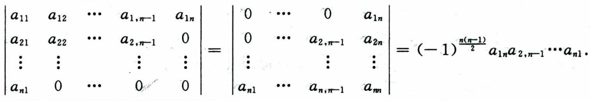

把最后一行向上逐步交换至第一行，需要 n-1 次交换，然后原来倒数第二行成为了最后一行，同样的方法换到第2行，需要 n-2 次交换，以此类推，共需要 $\sum_{i=1}^{n-1}i=\frac{n(n-1)}{2}$ 次交换（变多少次号）。最后变成主对角线行列式。

 

两个特殊的拉普拉斯展开式

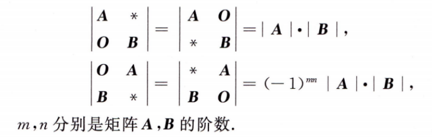

前者记忆（广义展开），后者同上转成前者，每往上依次行换 m 次，有 n 行需要这样换，所以进行了 mn 次行互换。

> 注意这个分块计算，若不满足有一块是 0，则不能如此计算。

还有一个二级结论：

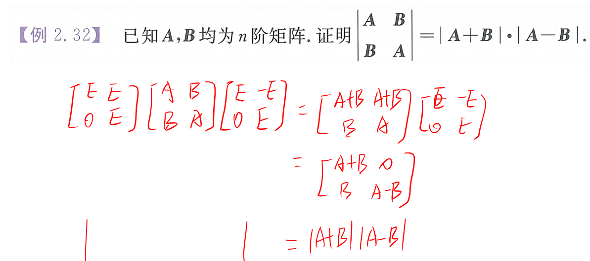

## 克莱默法则 Cramer

对非齐次线性方程组用向量表示，即 $\boldsymbol{A}\boldsymbol{x}=\boldsymbol{b}$ ，其中 $\boldsymbol{A}=(\boldsymbol{a}_1,\boldsymbol{a}_2,\cdots,\boldsymbol{a}_n)$ ，$\boldsymbol{a}_i$ 是系数矩阵的第 i 列，$\boldsymbol{x}=(x_1,x_2,\cdots,x_n)^T$ 是未知数向量，$\boldsymbol{b}$ 是常数向量。

**当方程有解时**：有 $\boldsymbol{b}=x_1\boldsymbol{a}_1+x_2\boldsymbol{a}_2+\cdots+x_n\boldsymbol{a}_n=\sum_{i=1}^{n}x_i\boldsymbol{a}_i$ ，即 $\boldsymbol{b}$ 是 $\boldsymbol{a}_i$ 的线性组合。若用 $\boldsymbol{A}_j$ 表示把 $\boldsymbol{b}$ 替换到 $\boldsymbol{a}_j$ 的位置得到的矩阵，即 $\boldsymbol{A}_j=(\boldsymbol{a}_1,\cdots,\boldsymbol{a}_{j-1},\sum_{i=1}^{n}x_i\boldsymbol{a}_i,\cdots,\boldsymbol{a}_n)$ 。根据行列式列倍加值不变的性质，消掉累加的，有（只要方程有解，都满足下式）
$$
|\boldsymbol{A}_j|=|\boldsymbol{a}_1,\cdots,\boldsymbol{a}_{j-1},x_j\boldsymbol{a}_j,\cdots,\boldsymbol{a}_n|=x_j|\boldsymbol{A}|
$$
 故当 $|\boldsymbol{A}|\neq 0$ 时，有
$$
x_j=\frac{|\boldsymbol{A}_j|}{|\boldsymbol{A}|}
$$

根据所有的解都满足这条式子 $|\boldsymbol{A}_j|=(\boldsymbol{a}_1,\cdots,\boldsymbol{a}_{j-1},x_j\boldsymbol{a}_j,\cdots,\boldsymbol{a}_n)=x_j|\boldsymbol{A}|$ ，对方程组的解有以下判断：

$$
\begin{cases}
    唯一解, & |\boldsymbol{A}|\neq 0 \\
    无穷多解, & |\boldsymbol{A}|=0, \forall\ |\boldsymbol{A}_j|=0\\
    无解， & |\boldsymbol{A}|=0, \exist\ |\boldsymbol{A}_j|\not=0
\end{cases}
$$

> 特别地，对于 $\boldsymbol{A}\boldsymbol{x}=\boldsymbol{0}$，显然 $\boldsymbol{x}=\boldsymbol{0}$ 是一个解且 $\forall\ |\boldsymbol{A}_j|=0$。故若 $|\boldsymbol{A}|\neq 0$ 则方程仅有零解，若 $|\boldsymbol{A}|=0$ 则有无穷多解。产生两个充要关系：
>
> - $\boldsymbol{A}\boldsymbol{x}=\boldsymbol{0}$ 仅有零解（唯一解） $\Leftrightarrow |\boldsymbol{A}|\neq 0$ ，列满秩
> - $\boldsymbol{A}\boldsymbol{x}=\boldsymbol{0}$ 有非零解（无穷多解） $\Leftrightarrow |\boldsymbol{A}|=0$ ，列不满秩。

当方程无解时， $\boldsymbol{b}$ 无法由 $\boldsymbol{a}_i$ 线性表出，那么当 $\boldsymbol{b}$ 并进来时秩会加一，即 $r(\boldsymbol{A}|\boldsymbol{b})=r(\boldsymbol{A})+1$ 。

## 行列式计算

范德蒙行列式，即 $V_n=\begin{vmatrix}1 & 1 & \cdots & 1 \\ x_1 & x_2 & \cdots & x_n \\ \vdots & \vdots & \ddots & \vdots \\ x_1^{n-1} & x_2^{n-1} & \cdots & x_n^{n-1}\end{vmatrix}=\prod_{1\leq i<j\leq n}(x_j-x_i)$ 。

> 选定一行或一列元素，从 0 次方一直到 n-1 次方。

- **爪形矩阵** 可利用主对角线或副对角线元素 消去边缘 化其为 **三角形矩阵** 。
- **带状矩阵** 除了三角化外，可以利用 **递推法** ，有时还要结合归纳。

递推法

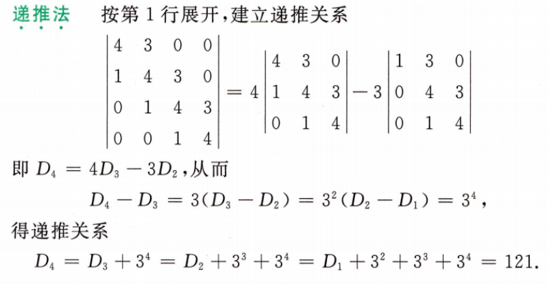

- **特征值** 乘积等于行列式，计算可以考虑矩阵变化对应特征值的变化。相似的运用
- 改写 **对称矩阵 + aE** ，特征值传递出来，行列式显然易见。**也常用于求对角线带有待定参数的矩阵特征值！！！** 。

# 矩阵

**没有交换律和消去律。** 但有结合律和分配律。即 $(\boldsymbol{A}\boldsymbol{B})\boldsymbol{C}=\boldsymbol{A}(\boldsymbol{B}\boldsymbol{C})$ 。还有 **转置** $(\boldsymbol{A}\pm\boldsymbol{B})^T=\boldsymbol{A}^T\pm\boldsymbol{B}^T$ 。

- 单位阵 $\boldsymbol{E}$
- **数量阵** $k\boldsymbol{E}$
- 对角阵，$\forall i\neq j,a_{ij}=0$， 记 $\mathit{\Lambda}=\text{diag}[a_{11},a_{22},\cdots,a_{nn}]$ 
- 反对称阵，$a_{ij}=-a_{ji},a_{ii}=0$ 即 $\boldsymbol{A}^T=-\boldsymbol{A}$ 

## 可逆矩阵和伴随矩阵

对于矩阵方程 $\boldsymbol{A}\boldsymbol{B}=\boldsymbol{E}$，向量表示，即 $\boldsymbol{A}=(\boldsymbol{a}_1,\boldsymbol{a}_2,\cdots,\boldsymbol{a}_n), \boldsymbol{B}=(\boldsymbol{b}_1,\boldsymbol{b}_2,\cdots,\boldsymbol{b}_n)$，记 $\boldsymbol{e}_i$ 为第 $i$ 维为 1 的单位向量，则矩阵方程一个方程组 $\boldsymbol{A}\boldsymbol{b}_i=\boldsymbol{e}_i, i=1,2,\cdots,n$ 。根据克莱默法则有：

$$
\boldsymbol{b}_{ij}=\frac{|\boldsymbol{A}_j|}{|\boldsymbol{A}|}
$$

其中 $\boldsymbol{A}_j=(\boldsymbol{a}_1,\cdots,\boldsymbol{a}_{j-1},\boldsymbol{e}_i,\cdots,\boldsymbol{a}_n)$ 。计算 $|\boldsymbol{A}_j|$ 时对第 $j$ 列 $\boldsymbol{e}_i$ 进行展开，恰好得到 $\boldsymbol{A}$ 的在 $i$ 行 $j$ 列处代数余子式（其他都为 0），记 $A_{ij}$ 。 再由 $\boldsymbol{b}_{ij}=(\boldsymbol{B})_{ji}$ ，（这里的下标是反的，因为是列向量）
即

$$
(\boldsymbol{B})_{ji}=\frac{1}{|\boldsymbol{A}|}A_{ij}\\
\rArr (\boldsymbol{B})_{ij}=\frac{1}{|\boldsymbol{A}|}A_{ji}
$$

构造矩阵 $\boldsymbol{A}^*,\ (\boldsymbol{A}^*)_{ij}=A_{ji}$，有 

$$
\boldsymbol{B}=\frac{1}{|\boldsymbol{A}|}\boldsymbol{A}^*
$$

> 根据推导过程知道 $\boldsymbol{A}^*$ 当中的元素是 $\boldsymbol{A}$ 在该位置的转置位置的代数余子式。即 $\boldsymbol{A}^*$ 的 **第 $i$ 行** 是 $\boldsymbol{A}$ 的 **第 $i$ 列** 的代数余子式； **第 $j$ 列** 是 $\boldsymbol{A}$ 的 **第 $j$ 行** 的代数余子式。
>
> 从这里可以看出，本行的代数余子式只有与本行元素相乘才等于行列式的值，与其他行元素相乘都等于零。因为两者相乘 $\boldsymbol{A}\boldsymbol{A}^*=|\boldsymbol{A}|\boldsymbol{E}$ 是一个对角阵，仅对角线上有非零元素。

以上：

- 称 $\boldsymbol{B}$ 为 $\boldsymbol{A}$ 的 **逆矩阵** ，记 $\boldsymbol{A}^{-1}$ 。
- 记 $\boldsymbol{A}^*$ 为 $\boldsymbol{A}$ 的 **伴随矩阵** 。

$$
\boldsymbol{A}^*\boldsymbol{A}=\boldsymbol{A}\boldsymbol{A}^*=|\boldsymbol{A}|\boldsymbol{E}
$$

> 某矩阵的逆矩阵就是其伴随矩阵除以行列式。所以一切的逆矩阵运算性质都可从伴随矩阵的性质推导出来。

在矩阵公式中，若 $\boldsymbol{A}$ 可逆，则常用 $\boldsymbol{E}=\boldsymbol{A}\boldsymbol{A}^{-1}$ 化简矩阵方程。

$$
(\boldsymbol{A}^{-1})^*=(\boldsymbol{A}^*)^{-1}
\\
(\boldsymbol{A}^T)^*=(\boldsymbol{A}^*)^T
\\
(\boldsymbol{AB})^*=\boldsymbol{B}^*\boldsymbol{A}^*
$$

**二阶矩阵快速用伴随矩阵快速求逆** ：
$$
A=\begin{bmatrix}
 a & b \\
 c & d
\end{bmatrix},\quad
A^*=\begin{bmatrix}
 d & -b \\
 -c & a
\end{bmatrix}, \quad
A^{-1}=\frac{A^*}{|A|}
$$
==当伴随矩阵好求时，可以考虑用其来求逆矩阵== 

## 初等变换、初等矩阵

- 矩阵进行 **倍乘、互换、倍加** 的行（列）变换，统称为 **初等变换** 。
- 单位矩阵进行一次初等变换得到的矩阵称为 **初等矩阵** 。

初等矩阵

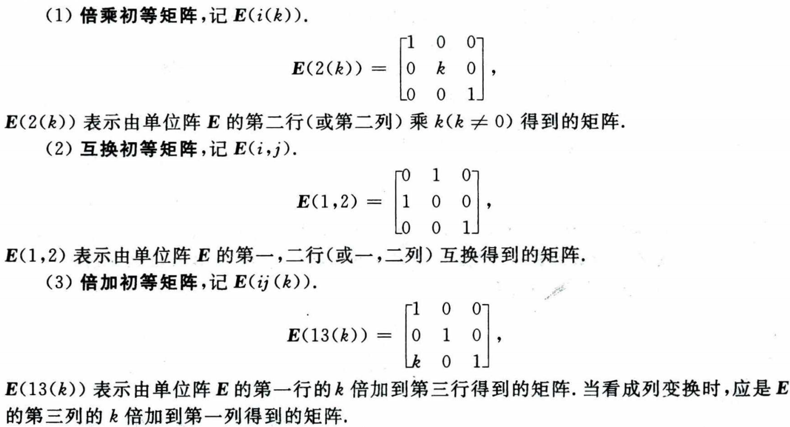

 

> 初等矩阵转置后仍为初等矩阵，初等矩阵的逆矩阵仍为初等矩阵。
>
> 行变换矩阵转置后变成了对应操作的列变换矩阵（合同变换）。—— 比如一个交换12行的初等矩阵，转置后作右乘就是交换12列的初等矩阵、第1行加到第3行转置后就是第1列加到第3列。
>

**用初等矩阵左乘是进行行变换，右乘是进行列变换。** （左行右列）

> 拓展旋转变换矩阵：（逆时针旋转 $\theta$ 角度）
>
> $$
> \begin{bmatrix}
>  \cos\theta & -\sin\theta \\
>  \sin\theta & \cos\theta
> \end{bmatrix}
> $$
> 这其实是极坐标变换的雅可比矩阵。

矩阵 $\boldsymbol{A}$ 经过有限次 **初等行列变换** 得到矩阵 $\boldsymbol{B}$，则称 $\boldsymbol{A}$ 和 $\boldsymbol{B}$ **等价** ，记为 $\boldsymbol{A}\cong\boldsymbol{B}$ 。若 $\boldsymbol{A}\cong\begin{bmatrix}\boldsymbol{E}_r & \boldsymbol{O} \\ \boldsymbol{O} & \boldsymbol{O}\end{bmatrix}$，称后者矩阵为 $\boldsymbol{A}$ 的 **等价标准形** 。即 $r(\boldsymbol{A})=r(\boldsymbol{B})$ 。

显然若矩阵 $\boldsymbol{A}$ 经过一系列 **行或列** 变换 $\boldsymbol{P}_1,\boldsymbol{P}_2,\cdots,\boldsymbol{P}_n$ 变成单位阵，即 $\boldsymbol{P}_n\cdots\boldsymbol{P}_2\boldsymbol{P}_1\boldsymbol{A}=\boldsymbol{E}$ ，则 $\boldsymbol{A}$ 可逆，且 $\boldsymbol{A}^{-1}=\boldsymbol{P}_n\cdots\boldsymbol{P}_2\boldsymbol{P}_1$ 。

- 行阶梯矩阵，0行在底部，非零行主元的列指标随行指标 **严格** 递增。
- 行最简形矩阵，行阶梯矩阵的主元都为 1，且主元所在列的其他元素都为 0。

方阵的行列式 $|\boldsymbol{A}\boldsymbol{B}|=|\boldsymbol{A}||\boldsymbol{B}|$ 。

## 计算

常常遇到需要计算 两个可逆矩阵的乘积 $\boldsymbol{P_1}^{-1}\boldsymbol{P_2}$ ，其中一个是逆运算。可以利用初等变换的思想，聚合它们 $\boldsymbol{[P_1\ |\ P_2]}$ ，然后再这个分块矩阵中，用初等行变换将 $\boldsymbol{P_1}$ 化为单位阵，则会得到 $\boldsymbol{[E\ |\ P_1^{-1}P_2]}$ 。显然计算量比单独求逆然后再进行矩阵乘法便捷多了。

若是乘积 $\boldsymbol{P_1}\boldsymbol{P_2}^{-1}$ ，可利用转置转成上面的形式：
$$
\boldsymbol{P_1}\boldsymbol{P_2}^{-1}=[(\boldsymbol{P_2}^T)^{-1}\boldsymbol{P_1}^{T}]^T
$$
求完 $(\boldsymbol{P_2}^T)^{-1}\boldsymbol{P_1}^{T}$ 再转置一次即可。

# 向量

- **部分组**是向量数量减少；**延伸组**和**缩短组**是组里每个向量维度变化。
- 若某线性无关向量组加入了向量 $\boldsymbol{\beta}$ 后线性相关，则 $\boldsymbol{\beta}$ 可由其他向量 **唯一** 线性表示。（唯一解，克莱默法则）

## 秩

### 向量组的秩

但对于某向量组 $\boldsymbol{\alpha}_1,\boldsymbol{\alpha}_2,\cdots,\boldsymbol{\alpha}_n$ ，在其所有线性无关部分组中，向量数最多的称为 **极大 线性无关 向量组**，其 **向量数** 为向量组的 **秩**，记 $r(\boldsymbol{\alpha}_1,\boldsymbol{\alpha}_2,\cdots,\boldsymbol{\alpha}_n)$ 。

两个向量组可以相互线性表出，则称它们等价，用符号 $\cong$ 表示。

显然，若 $\boldsymbol{\alpha}_1,\boldsymbol{\alpha}_2,\cdots,\boldsymbol{\alpha}_n$ 可以线性表出 $\boldsymbol{\beta}_1,\boldsymbol{\beta}_2,\cdots,\boldsymbol{\beta}_m$ ，则 $r(\boldsymbol{\alpha}_1,\boldsymbol{\alpha}_2,\cdots,\boldsymbol{\alpha}_n)\geq r(\boldsymbol{\beta}_1,\boldsymbol{\beta}_2,\cdots,\boldsymbol{\beta}_m)$ 。

**注意，等价的向量组秩一定相等，但秩相等不一定等价。向量组等价的定义是相互线性表出，用矩阵表示就是只能通过 行变换 看能不能化为另一个，而矩阵的等价是 行列变换 均可。。。**

### ==找线性无关组 仅 行变换==

求极大线性无光向量组是利用向量组矩阵 **初等行变换** 成阶梯型然后 **选出主元列** 。—— 有点跟直观冲突，行等价 列具有相同的关系。它是利用两者的 **列** 具有完全相同的线性相关关系证明的。 $\boldsymbol{Ax}=\boldsymbol{0}$ 与 $\boldsymbol{Bx}=\boldsymbol{0}$ 有完全相同的解集。

### 矩阵的秩

矩阵 $\boldsymbol{A}$ 的所有 **非零子式** 的最高阶数称为矩阵的 **秩**，记为 $r(\boldsymbol{A})$ 。

> - $k$ 阶子式：任取矩阵 $\boldsymbol{A}$ 的 $k$ 行 $k$ 列，得到的行列式。
> - $k$ 阶主子式：行列选取的下标相同。
> - $k$ 阶顺序主子式：规定是前 $k$ 行 $k$ 列。

**矩阵秩的公式**

1. $r(\boldsymbol{A}^T\boldsymbol{A})=r(\boldsymbol{A})$ —— √ ，扩展 $r(\boldsymbol{AA^TAA^TA\cdots})=r(\boldsymbol{A})$ ，夹逼可证。
2. $r(\boldsymbol{A}+\boldsymbol{B})\leq r(\boldsymbol{A})+r(\boldsymbol{B})$ —— √
3. $r(\boldsymbol{A}\boldsymbol{B})\leq \min\{r(\boldsymbol{A}),r(\boldsymbol{B})\}$ ——  √
4. $\max\{r(\boldsymbol{A}),r(\boldsymbol{B})\}\leq r([\boldsymbol{A}|\boldsymbol{B}])\leq r(\boldsymbol{A})+r(\boldsymbol{B})$ —— √
5. 若 $\boldsymbol{A}$ 可逆，则 $r(\boldsymbol{A}\boldsymbol{B})=r(\boldsymbol{B}\boldsymbol{A})=r(\boldsymbol{B})$ —— √（证明同1）
6. 若 $\boldsymbol{A}$ 是 $m\times n$ 矩阵，$\boldsymbol{B}$ 是 $n\times s$ 矩阵且 $\boldsymbol{A}\boldsymbol{B}=\boldsymbol{0}$，则 $r(\boldsymbol{A})+r(\boldsymbol{B})\leq n$ ——  √
7. 分块矩阵 $r(\begin{bmatrix}\boldsymbol{A} & \boldsymbol{0} \\ \boldsymbol{0} & \boldsymbol{B}\end{bmatrix})=r(\boldsymbol{A})+r(\boldsymbol{B})$ —— 显然
8. 伴随矩阵 $r(\boldsymbol{A}^*)=\begin{cases} n, & r(\boldsymbol{A})=n \\ 1, & r(\boldsymbol{A})=n-1 \\ 0, & r(\boldsymbol{A})<n-1 \end{cases}$  ——  √

公式1

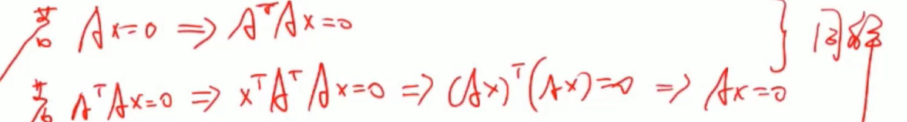

> 公式5证明同法，思路都是证明齐次方程同解。

公式2和4

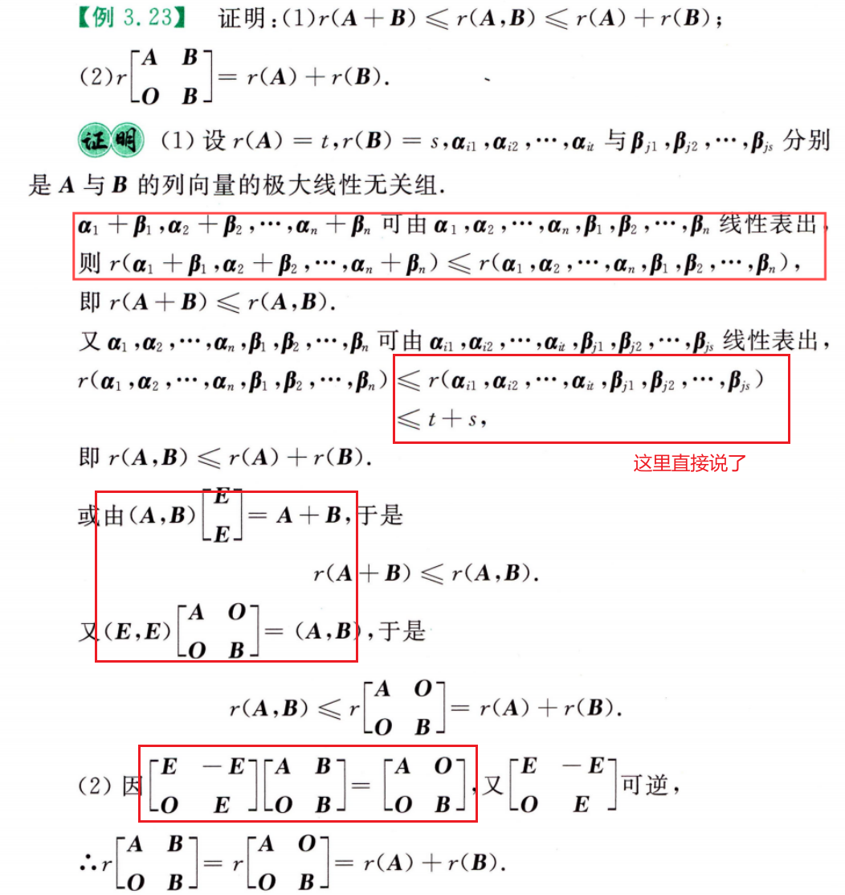

公式3

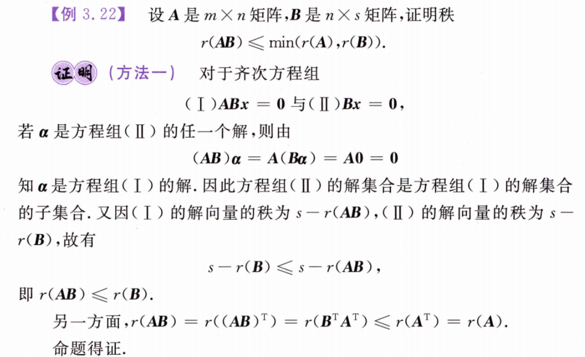

公式6和8

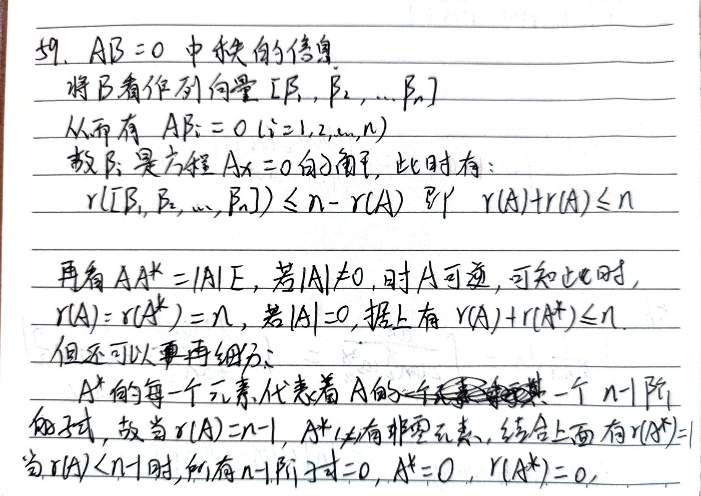

对于 $n$ 阶方阵有以下性质：

$$
r(A^n)=r(A^{n+1})=r(A^{n+2})=\cdots=r(A^{n+k}),\ k=1,2,\cdots
$$

证明要引入：

- 如果从某个 $k$ 开始，$r(A^k)=r(A^{k+1})$，则 $r(A^k)=r(A^{k+1})=r(A^{k+2})=\cdots$ 。

> 苦找证明都没找到。。。 <!--todo -->

那么对于 $n$ 阶方阵，其随着幂次的增加，秩要么减少，要么一旦不再减少就不再变化。由于最大幂就是 $n$ ，$A^n$ 之后秩必然不在发生变化。 

矩阵的秩 等于 其行向量组的秩，也等于 其列向量组的秩。**三秩相等**。

> 秩的含义是该向量组所能线性表示的维度。矩阵的子式对应的向量其实就是它行列向量组的一个 **部分缩短组**，极大化这个组用以表示矩阵的秩。

## 向量空间

$n$ 维向量的两组基 $\boldsymbol{\alpha}_1,\boldsymbol{\alpha}_2,\cdots,\boldsymbol{\alpha}_n$ 和 $\boldsymbol{\beta}_1,\boldsymbol{\beta}_2,\cdots,\boldsymbol{\beta}_n$ 等价，即 $\boldsymbol{\alpha}_i$ 与 $\boldsymbol{\beta}_i$ 可相互线性表出。

**过渡矩阵** ：若 $[\boldsymbol{\alpha}_1,\boldsymbol{\alpha}_2,\cdots,\boldsymbol{\alpha}_n]=[\boldsymbol{\beta}_1,\boldsymbol{\beta}_2,\cdots,\boldsymbol{\beta}_n]\boldsymbol{C}$ ，则称 $\boldsymbol{C}$ 为从 $\boldsymbol{\alpha}$ 到 $\boldsymbol{\beta}$ 的过渡矩阵。显然 $\boldsymbol{C}$ 可逆。

> 注意：过渡矩阵是 **右乘** ，而坐标变换是 $x=\boldsymbol{C}y$ 是 **左乘** 。做题不确定可以推一下。

## 正交

内积是一个 **数值**，所以应该是 **行 · 列**。

对于两个列向量 $\boldsymbol{\alpha},\boldsymbol{\beta}$， $\boldsymbol{\alpha}\boldsymbol{\beta}^T$ 是一个矩阵，而 $\boldsymbol{\alpha}^T\boldsymbol{\beta}$ 是一个数。且 $\boldsymbol{\alpha}^T\boldsymbol{\beta}=\boldsymbol{\alpha}\boldsymbol{\beta}^T$ 的对角线元素之和。

**施密特正交化** Schmidt

施密特正交化

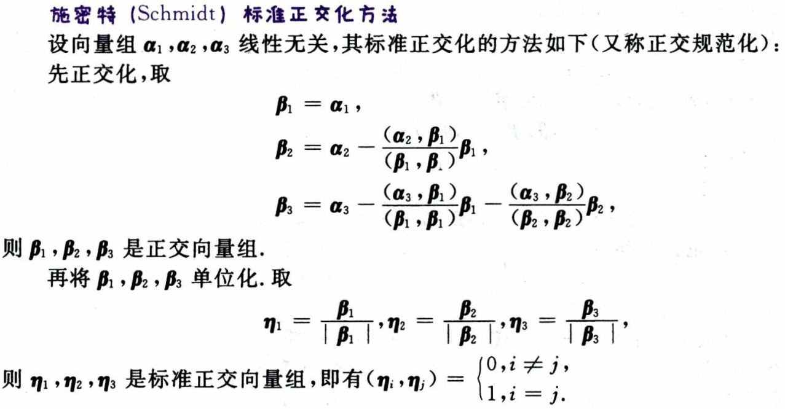

> 当求出 $\boldsymbol{\beta_1}$ 和 $\boldsymbol{\beta_2}$ 后，也可以用 $\boldsymbol{\beta_3}=\boldsymbol{\beta_1}\times\boldsymbol{\beta_2}$ 求最后一个。**常用。**
>
> 比如算正交变换矩阵，求出了某两个特征向量后，最后一个直接叉乘出来就行了。 
> 

**正交矩阵**

若 $n$ 阶**方阵**满足： $\boldsymbol{A}\boldsymbol{A}^T=\boldsymbol{A}^T\boldsymbol{A}=\boldsymbol{E}$，则称 $\boldsymbol{A}$ 为 **正交矩阵**。显然 $\boldsymbol{A}$ 的行（列）向量之间两两正交，且为单位向量。$\boldsymbol{A}^{-1}=\boldsymbol{A}^T$ 。

> *酉矩阵* 是 *正交矩阵*（元素均为实数）在复数的推广

> 如果行向量之间两两正交，那么列向量之间也两两正交

**正交矩阵的特征值只能是 -1 或 1。** 

# 线性方程组

- 齐次方程组 $\boldsymbol{A}_{m\times n}\boldsymbol{x}=\boldsymbol{0}$ 有非零解 $\Lrarr$ $r(\boldsymbol{A})<n$ 。
- 齐次方程组系数矩阵的秩 $r(\boldsymbol{A})=r<n$ 时，方程组有 $n-r$ 个线性无关的解，且它们可以构成一个基础解系。
- $\boldsymbol{Ax}=\boldsymbol{b}$ 有解 $\Lrarr$ $r(\boldsymbol{A})=r(\boldsymbol{A}|\boldsymbol{b})$ 。—— 
- $\boldsymbol{Ax}=\boldsymbol{b}$ 无解 $\Lrarr$ $r(\boldsymbol{A})+1=r(\boldsymbol{A}|\boldsymbol{b})$ 。

## 求齐次基础解系

三个方法：

- 系数矩阵 **化成行最简 或阶梯型** 定主元和自由变量
- **化出单位阵** —— 选取某些列可以构成单位阵，这些列作主元

## 公共解和同解

记得满足的 $\begin{bmatrix} \boldsymbol{A}  \\ \boldsymbol{B} \end{bmatrix}\boldsymbol{x=0}$ 的解同时也是 $\boldsymbol{Ax=0}$ 和 $\boldsymbol{Bx=0}$ 解。

判断同解就是：1、判断通解结构相同；2、判断某个方程的解全是另一个方程的解。从而导出下面的充要关系

同解

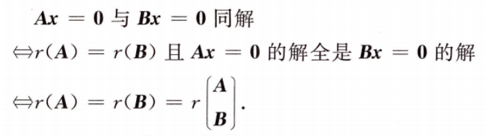

**行等价意味着齐次方程同解。**

> 行等价意味着秩相同，且 $\boldsymbol{PA=B}$ ，故只要满足 $\boldsymbol{Ax=0}$ 一定满足后者。
>
> 显然还有 $\boldsymbol{A^TA}$ 与 $\boldsymbol{A}$ 同解。
>
> 关于非齐次线性方程组同解和公共解问题可看错题集。（欧几里得的）

# 特征值和特征向量

对于方阵 $\boldsymbol{A}$ ，若存在数 $\lambda$ 和 **非零向量** $\boldsymbol{\alpha}$ 使得 

$$
\boldsymbol{A\alpha}=\lambda\boldsymbol{\alpha}
$$

成立，则称 $\lambda$ 为 $\boldsymbol{A}$ 的 **特征值** ，$\boldsymbol{\alpha}$ 为 $\boldsymbol{A}$ 的 **特征向量** 。

特征方程：

$$
|\lambda\boldsymbol{E}-\boldsymbol{A}|=0
$$

> $n$ 阶方阵就有 $n$ 个特征值，但不一定有 $n$ 个线性无关的特征向量。

- n个不同的特征值对应的n个特征向量线性无关。<!-- todo -->
- $\sum\lambda_i=\sum a_{ii}$ （对角线元素之和，迹）<!-- todo 韦达定理 -->
- $|\boldsymbol{A}|=\prod\lambda_i$ 

> 矩阵与其转置矩阵的特征值相同： $\lambda\boldsymbol{E}-\boldsymbol{A}^T=(\lambda\boldsymbol{E}-\boldsymbol{A})^T$ 。
>
> $\boldsymbol{AB}$ 和 $\boldsymbol{BA}$ 具有相同的非零特征值。（特征方程左右乘 B 可知）

**关于秩为1的矩阵，其特征方程：**

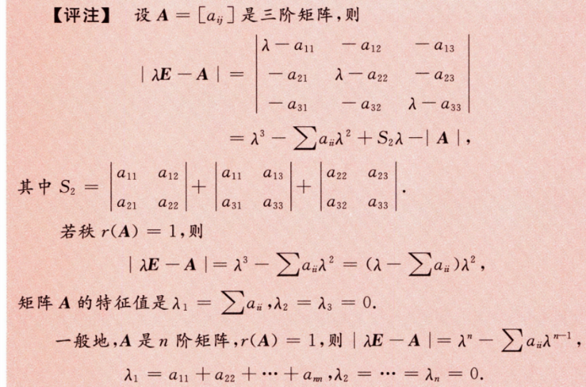

$$
\lambda^n-\text{tr}(\boldsymbol{A})\lambda^{n-1}
$$

## 相似矩阵

若存在可逆矩阵 $\boldsymbol{P}$ 使得 $\boldsymbol{A}=\boldsymbol{P}^{-1}\boldsymbol{B}\boldsymbol{P}$ ，则称 $\boldsymbol{A}$ 和 $\boldsymbol{B}$ **相似** ，记为 $\boldsymbol{A}\sim\boldsymbol{B}$ 。

若 $\boldsymbol{A}\sim\ \boldsymbol{\varLambda}$，则称 $\boldsymbol{A}$ 可相似对角化，$\varLambda$ 是它的 **相似标准型**。

相似的必要条件

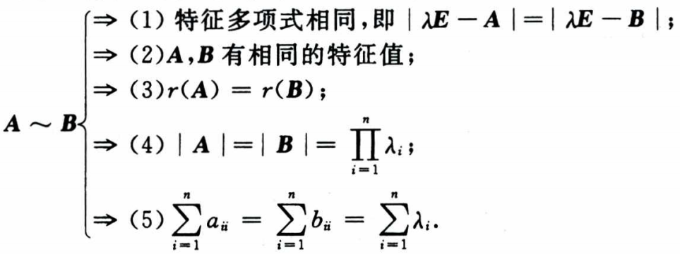

 

矩阵可相似对角化的 **充要条件** 是每个特征值对应的线性无关特征向量恰好等于特征值的重数。

$$
\begin{align*}
\boldsymbol{A}\sim\ \boldsymbol{\varLambda}
    & \lrArr \lambda_i 是\ \boldsymbol{A}\ 的\ n_i\ 重特征值，则\ \lambda_i\ 有\ n_i\ 个线性无关的特征向量 \\
    & \lrArr r(\lambda_i\boldsymbol{E}-\boldsymbol{A})=n-n_i
\end{align*}
$$

> 两矩阵相似，这意味着在两组不同的基下，两个不能的矩阵表示同一个线性变换，而可逆矩阵 $\boldsymbol{P}$ 则是从一组基到另一组基的过渡矩阵。
>
> 比如，在平面直角坐标系中，一个线性变换可能在标准基下用矩阵 $\boldsymbol{A}$ 表示，而在经过旋转或缩放后的新基下该线性变换可用矩阵 $\boldsymbol{B}$ 表示。

矩阵和它的伴随矩阵具有相同的特征向量。

## 实对称矩阵

- **必可相似对角化** 。——（==一旦看到实对称矩阵，这条必须想起来== 
- 不同特征值对应的特征向量相互正交。↓ —— （三个知道两个时，可以利用这个性质求剩下那个）
- 存在正交阵 $\boldsymbol{Q}$ 使得 $\boldsymbol{Q}^T\boldsymbol{A}\boldsymbol{Q}=\boldsymbol{\varLambda}$ 。

当 $\boldsymbol{A}$ 可由正交矩阵相似于对角矩阵时，它必然是实对称的。

> 对于满足以下方程的矩阵：
> $$
> (A-aE)(A-bE)(A-cE)(A-dE)\cdots=0
> $$
> 这种矩阵也必然可以相似对角化。
>
> 各线性无关特征向量个数的和如下：
> $$
> n-r(A-aE)+n-r(A-bE)\cdots=mn-[r(A-aE+r(A-bE)+\cdots)]\ge mn-n\ge n
> $$
> 

求是对称矩阵的正交阵：

1. 特征值对应的特征向量
2. 同一个特征值的线性无关特征向量使用施密特正交化（不同的已经自动正交）
3. 单位化

> 显然，每个实对称矩阵都可分解成 某个对角矩阵和单位正交矩阵的特定乘积。而 奇异值分解（SVD）就是扩展到任意矩阵。$\boldsymbol{A=U\Sigma V^T}$ 。其中 $U、V$ 都是正交矩阵。

## 实反对称矩阵（反偶

$$
\boldsymbol{A=-A^T}
$$

- 特征值是 0 或 纯虚数（特征方程结合下面第三条，用共轭转置证明）
- **秩为偶数** （虚数成对）
- $\boldsymbol{x}^T\boldsymbol{A}\boldsymbol{x}=0$ → $Ax$ 与 $x$ 正交！
- 

$$
\boldsymbol{x}^T\boldsymbol{A}\boldsymbol{x}=-\boldsymbol{x}^T\boldsymbol{A^T}\boldsymbol{x}=-\boldsymbol{(Ax)^Tx}\\
即\quad \boldsymbol{x^T(Ax)}=-\boldsymbol{(Ax)^Tx}\\
显然\quad 仅当\ \boldsymbol{x^T(Ax)}=0\ 时成立。
$$

> 显然 $\boldsymbol{A}^{-1}$ 也是反对此矩阵。

# 二次型

二次齐次多项式，即 $f(x_1,x_2,\cdots,x_n)=\sum_{i=1}^{n}\sum_{j=1}^{n}a_{ij}x_ix_j$ ，称为 **二次型** ，系数均为实数时称为 **实二次型** 。

二次型可以写成 $f(x_1,x_2,\cdots,x_n)=\boldsymbol{x}^T\boldsymbol{A}\boldsymbol{x}$ ，其中 $\boldsymbol{x}=(x_1,x_2,\cdots,x_n)^T$ 。

**当 $\boldsymbol{A}$ 是对称矩阵时，二次型与其一一对应。二次型的秩就是 $r(\boldsymbol{A})$**。

- 标准型：只有平方项的二次型。（平方和）
- 规范型：只有平方项且系数只能是 $0,-1,1$ 。（二次型的 **规范型唯一（归一）**）

**标准型或者规范型中**，正系数的个数称为二次型的 **正惯性指数**，负系数的个数称为二次型的 **负惯性指数**，这是 **唯一的**。

## 合同

若存在可逆矩阵 $\boldsymbol{C}$ 使得 $\boldsymbol{B}=\boldsymbol{C}^T\boldsymbol{A}\boldsymbol{C}$ ，则称 $\boldsymbol{A}$ 和 $\boldsymbol{B}$ **合同** ，记为 $\boldsymbol{A}\simeq\boldsymbol{B}$ 。

> **非对称矩阵无法合同于对角矩阵**  —— 上面的等式两边转置可看出。

对于可逆矩阵 $\boldsymbol{C}$ ，称 $\boldsymbol{x}=\boldsymbol{Cy}$ 为由 $\boldsymbol{x}$ 到 $\boldsymbol{y}$ 的 **坐标变换**。（居然叫 x 到 y）

$\boldsymbol{x}^T\boldsymbol{Ax}$ 经 $\boldsymbol{x}=\boldsymbol{Cy}$ 得到 $\boldsymbol{y}^T\boldsymbol{B}\boldsymbol{y}$ ，显然 $\boldsymbol{B}=\boldsymbol{C}^T\boldsymbol{A}\boldsymbol{C}$，可见经坐标变换后的二次型矩阵是合同的。

正交变换

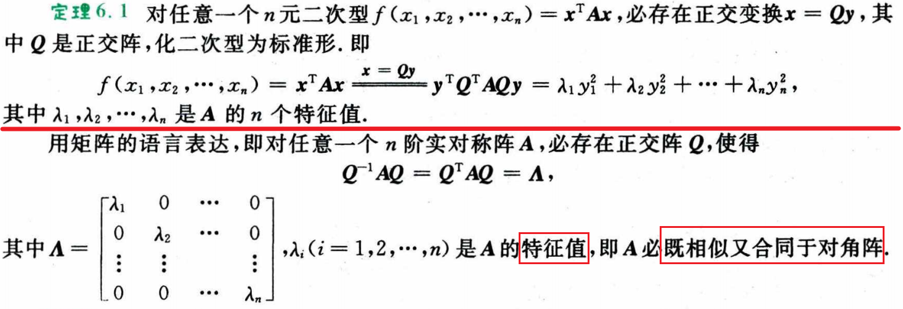

 

坐标变换

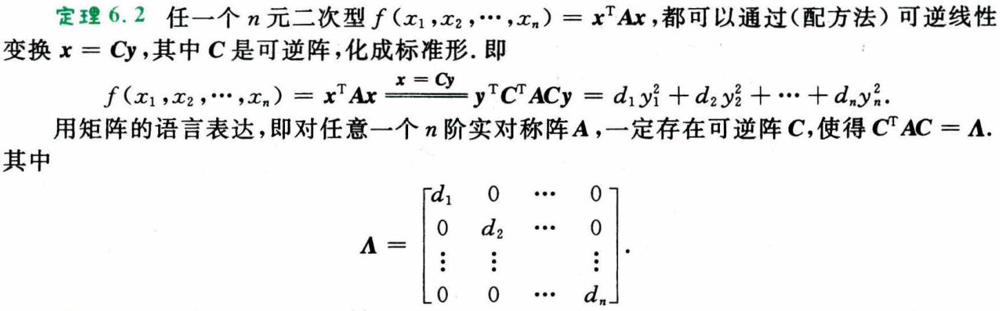

 

**显然正交变换是坐标变换的一个特例，因为他的变换矩阵是 正交阵。** （注意正交阵是满足 $\boldsymbol{A}\boldsymbol{A}^T=\boldsymbol{A}^T\boldsymbol{A}=\boldsymbol{E}$ ，即里面是**单位向量**）

> 为什么引入合同？因为合同矩阵对于的二次型是等价的，有研究价值。例如可以把 复杂的二次多元式 转化为等价的 标准型简单形式

**正交变换是保持图形形状和大小不变的几何变换，包含旋转，轴对称及上述变换的复合！！！** 

> 上述性质常考于某二次型在自变量 $\boldsymbol{x}$ 限制在某条件下的最值，通常是经正交变换 $\boldsymbol{x}=\boldsymbol{Cy}$ 后的标准型间接判断。比如限制了 $||\boldsymbol{x}||=1$ ，即条件在标准型下转变为 $||\boldsymbol{y}||=1$ 。

二级结论：

- 对于实对称矩阵 $\boldsymbol{A}$，显然 $\boldsymbol{A}^*、 \boldsymbol{A}^{-1}、\boldsymbol{A}^T$ 也是对称矩阵，且可以推出它们具有相同的正交变换 $\boldsymbol{Q}$ 。**注意这里有伴随矩阵。** 

**配方法**

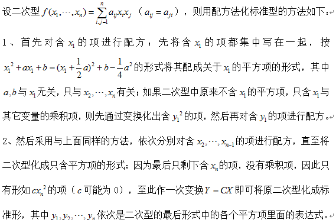

一个问题解答： [为什么配方法化二次型为标准型一定可以做到可逆线性变换](https://blog.csdn.net/weixin_40064300/article/details/131054672)

> 没有平方项，交叉项可用代入两个满足 平方差公式 的构造。

## 正定二次型

$$
\boldsymbol{x}^T\boldsymbol{A}\boldsymbol{x}>0，\forall\boldsymbol{x}\neq\boldsymbol{0}
$$

正定二次型，正定矩阵 $\boldsymbol{A}$ 。

**充要条件**

- 正惯性系数等于 n。—— 规范性唯一
- 合同于单位阵。 —— 规范性唯一 —— $\boldsymbol{C^TAC=E\Rarr A=(C^{-1})^TC^{-1}}$ 
- $\boldsymbol{A}=\boldsymbol{D}^T\boldsymbol{D}$，其中 $\boldsymbol{D}$ 是可逆矩阵。—— $\boldsymbol{A}=\boldsymbol{Q}^T\boldsymbol{\Lambda}\boldsymbol{Q}=\boldsymbol{Q}^T (\boldsymbol{\Lambda}^{\frac{1}{2}})^T \boldsymbol{\Lambda}^{\frac{1}{2}} \boldsymbol{Q}= (\boldsymbol{Q\Lambda}^{\frac{1}{2}})^T \boldsymbol{Q\Lambda^{\frac{1}{2}}}$ ，这也是常考思想！！！ 
- 全部特征值大于0 —— 很明显
- $\boldsymbol{A}$ 的所有 **顺序主子式** 都大于 0。 —— 以前的记的定义。

**必要条件**

- **$\boldsymbol{A}$ 的主对角线元素都大于 0。（平方项的系数，不然所有 $x$ 都取 0，就留那个 $-x^2$ 就不是正定了）** 