# 行列式

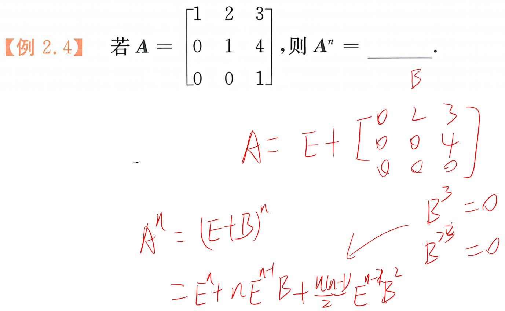

tag: 求矩阵的 n 次幂

---

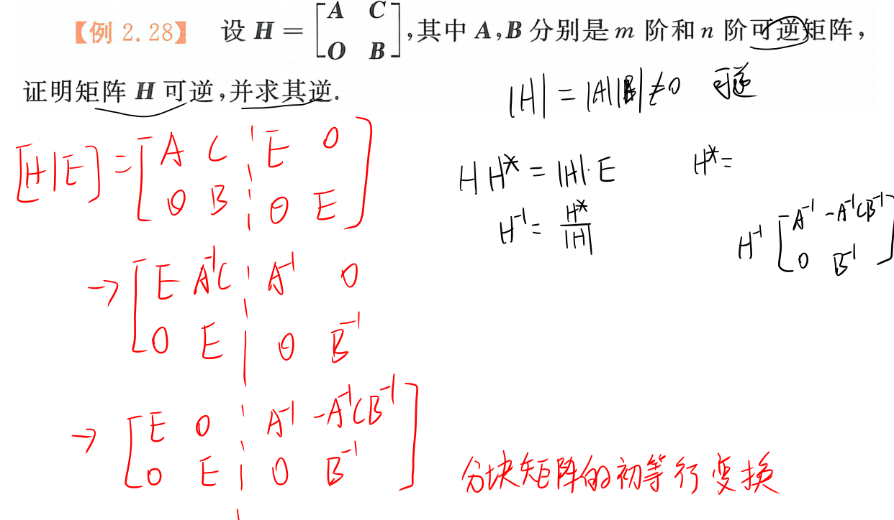

分块矩阵的初等行变换

---

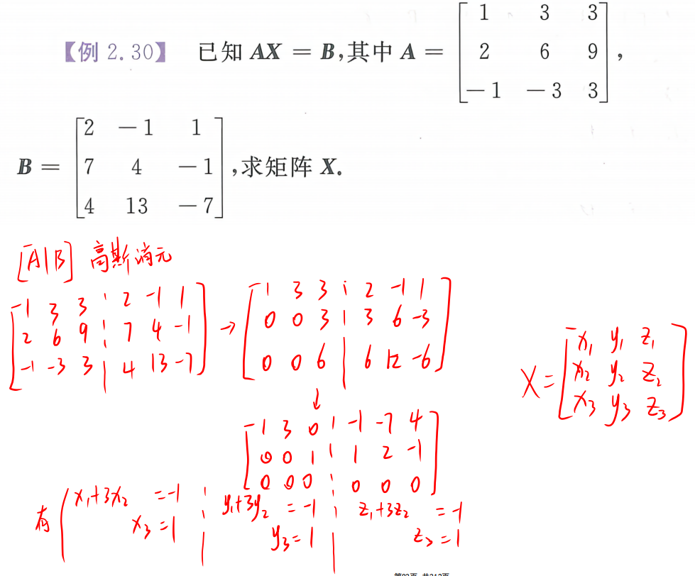

多线性方程组求解

---

分块矩阵的初等行变换。算个二级结论。

---

不同特征值对应的特征向量线性无关，放一起也线性无关

---

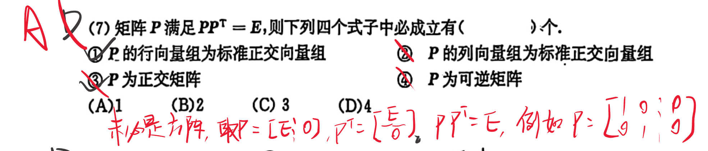

方阵问题。

# 线性方程组

+++

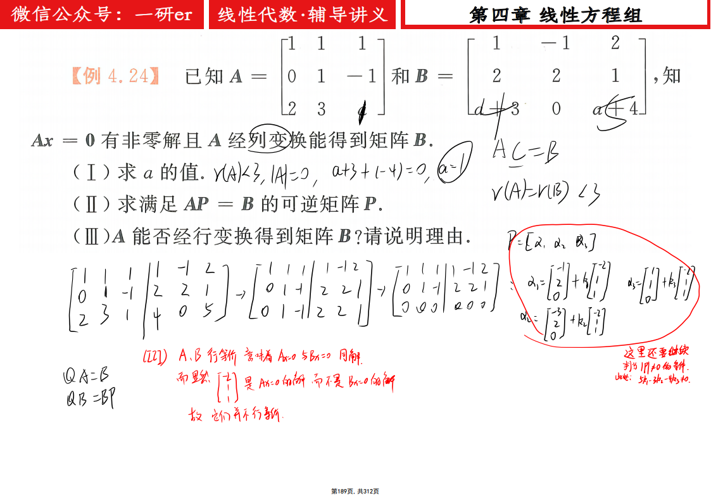

当求出的可逆矩阵适用变量表示时，要留意是否有某些情况不是可逆的

行等价意味着齐次方程同解。

+++

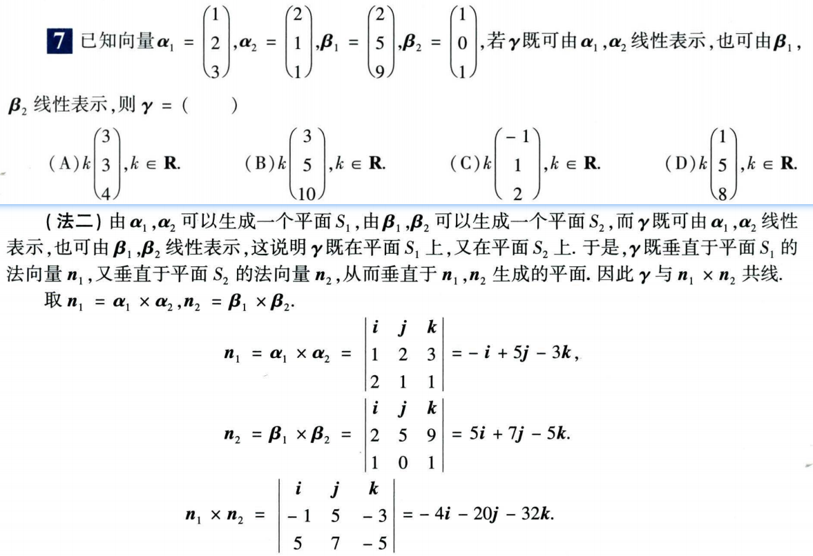

几何角度的线性表示。（23年真题）

+++

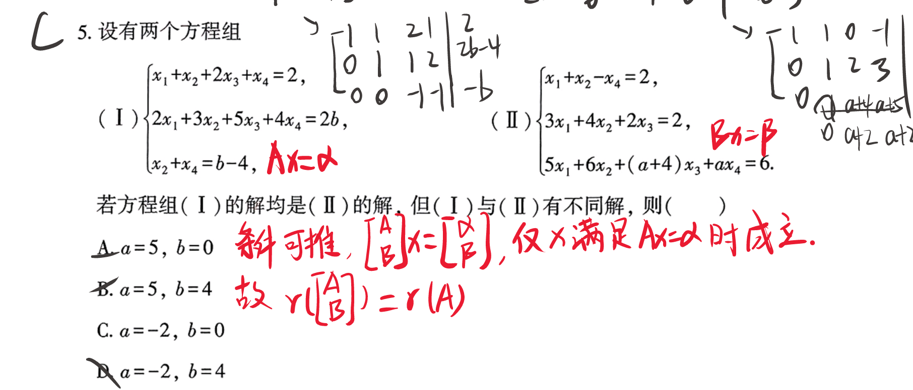

非齐次方程组同解和公共解问题。（25欧几里得冲刺3套

+++

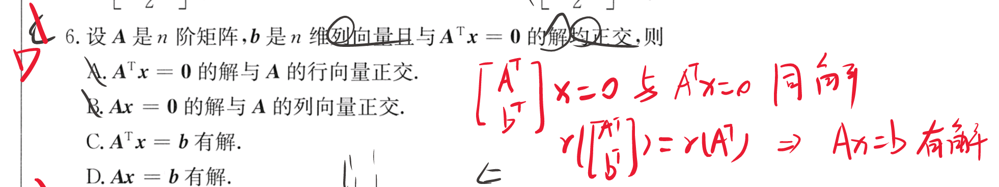

+++

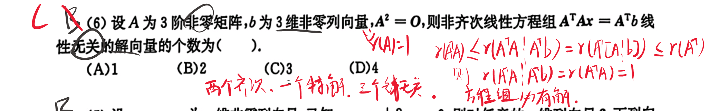

①夹逼算秩，证明非齐次方程组有解；②线性无关解的个数是 齐次解个数+特解！

+++

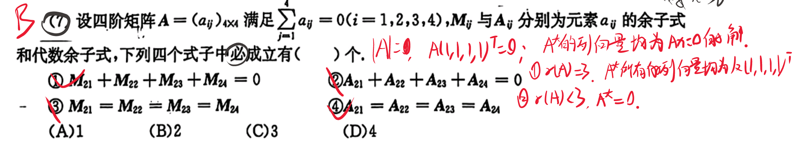

==行列式等于零时谨记伴随矩阵所有列向量都是齐次方程的解== 

# 特征值与特征向量

+++

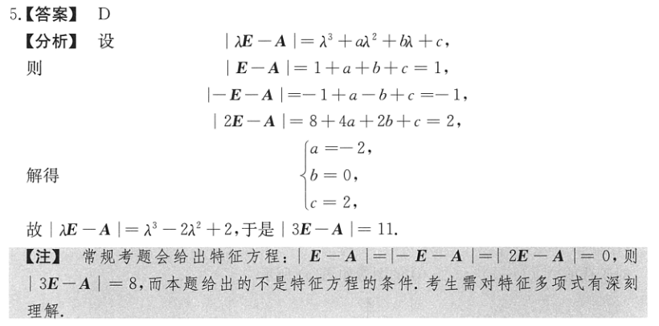

特征多项式的理解。

+++

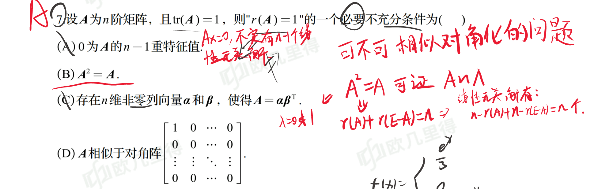

+++

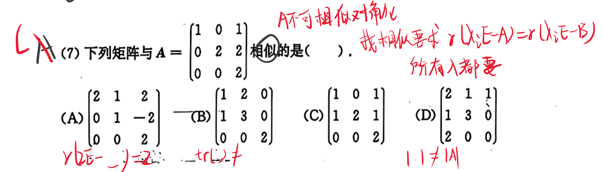

# 二次型

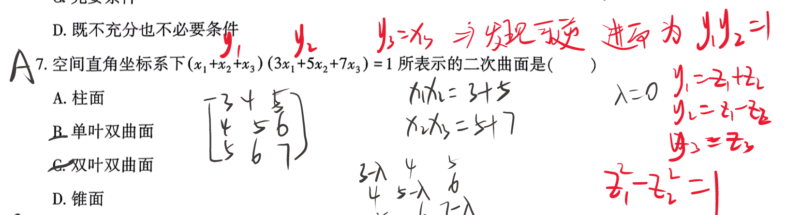

+++

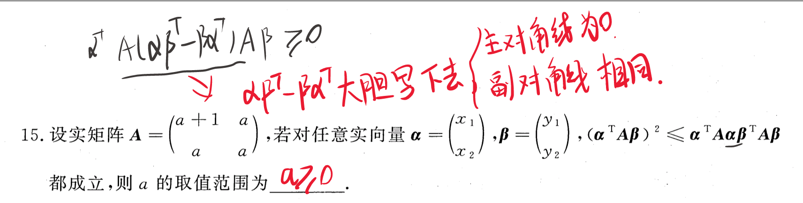

24真题！

+++

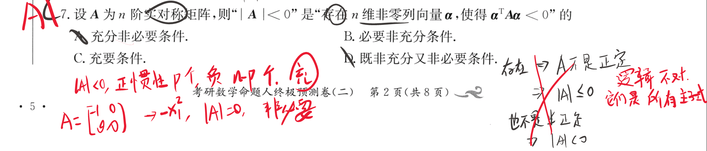

+++

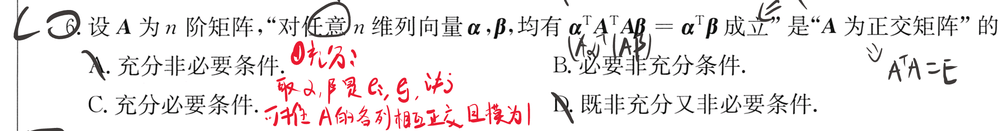

特列选取还有，单位向量。

+++

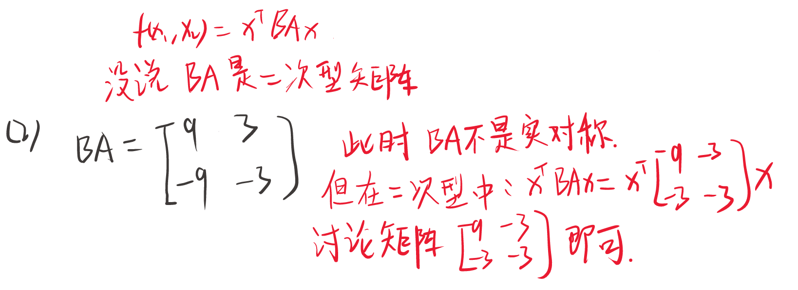
