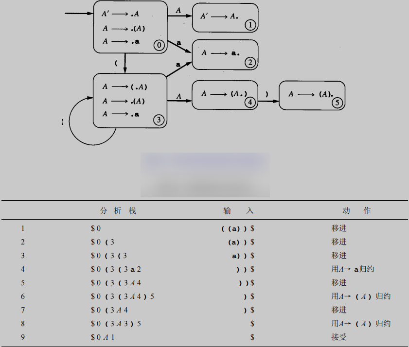

# 编译原理期末复习

> 2024年1月3日考完试了，这个复习笔记没有完成留坑了。

## 基础知识

## 正则表达式->DFA

将正则表达式翻译成 DFA 的最简单算法是通过中间构造：

```
正则表达式->NFA->DFA->程序
```

### 正则表达式->NFA

NFA图数据结构采用如下：

```cpp
vector<map<char, set<int>>> nfaGraph;
```

**Thompson结构**

正则表达式的基本运算有：基本正则表达式、连接 `JION`、选择 `|`、闭包 `*`、可选 `?`。各符号优先级： `(` < `|` < `JION` < `?` = `*` < `)`。

基本正则表达式：例如 a，构造如下NFA


连接（jion）：例如假设有两个正则表达式r1和r2，形成新的表达式r1r2，构造如下NFA


修改r1的接受状态为非接受状态，r1的开始状态为新的开始状态。

选择（select）：例如假设有两个正则表达式r1和r2，形成新的表达式r1|r2，构造如下NFA


修改r1和r2的接受状态为非接受状态。

闭包（closure）：例如假设有一个正则表达式r1，形成新的表达式r1*，构造如下NFA


修改r1的接受状态为非接受状态。

可选（optional）：例如假设有一个正则表达式r1，形成新的表达式r1?，构造如下NFA


所有运算都实现完毕，优先级也已经确定，模仿用栈处理算术表达式的方法，就可以实现正则表达式到NFA的转换了。这里栈中存储的是NFA当前的开始状态和接受状态。

> NFA只有一个开始状态和一个接受状态。

### NFA->DFA

DFA采用的数据结构如下：

```cpp
vector<map<char, int>> dfaGraph;
```

**子集构造法**

实现两个功能：ε-closure和move。

ε-closure：给定一个NFA的状态集合，返回这个状态集合的ε-closure。即从这个状态集合出发，通过零或多个ε边可以到达的所有状态的集合。

move：给定一个NFA的状态集合和一个输入符号，返回从这个状态集合出发，通过输入符号可以到达的所有状态的集合。

子集构造法步骤：

1. 从NFA的开始状态开始，计算其ε-closure，作为DFA的开始状态。
2. 对于DFA的每个状态集合，对于每个输入符号，计算move后再计算ε-closure，作为DFA的状态集合的一个转换。
3. 重复2，直到没有新的状态集合产生。

> 广度优先搜索，以DFA的开始状态集合为根节点，每个节点有m个子节点，m为输入符号的数量，子节点的求法就是对输入符号求move后再求ε-closure。利用哈希表来存储已经求过的状态集合，这样就可以避免重复求解。包含接受状态的状态集合都是DFA的接受状态。

### DFA最小化

自动机理论中有一个很重要的结果，即：对于任何给定的 DFA，都有一个含有最少量状态的等价的DFA，而且这个最小状态的DFA是唯一的。

**可区分：** 如果状态 s 和 t 在某输入字符 a 上有转换且位于不同的集合，此时就称作 a 区分了状态 s 和 t。

显然接受状态和非接受状态是可区分的。最小化DFA的实质就是把所有可区分的状态分开。

改造上一节提到的move：

move_simple：给定**一个DFA的状态**和一个输入符号，返回从这个状态出发，通过输入符号可以到达的所有状态的集合。

具体思路如下：

1. 首先把所有的状态分成两个集合，一个是接受状态集合，一个是非接受状态集合。
2. 求出所有状态在所有输入字符上的转换集合并存储起来。
3. 对所有集合进行划分和合并
   1. 划分：对于某个集合 S，S 上的状态 t 对于输入符号 a 的转换集合 S_ta，若 S_ta 不属于 S，则把 t 从 S 中分离出来。最终得到新的划分S'。(注意这里只是一个一个状态的剥离，下面进行合并)
   2. 合并：对于划分出来的新集合 S'，若 S' 中的有状态在所有输入符号上的转换都属于同一个集合，则把它们合并。最终得到新的划分。
4. 重复3，直到没有新的状态集合产生，得到最终的划分。
5. 利用最终的划分，构造新的 DFA。

划分和合并部分代码如下：

```cpp
set<int> acceptingStates = ..;
set<int> nonAcceptingStates = ..;
// allTransform[t][a] 表示状态t在字符a上转换得到的集合
vector<map<char, set<int>>> allTransform = ..;
set<char> Sigma = ..; // 输入符号集合
bool belong(set<int> S1, set<int> S2); // return S1是否属于S2
bool equal(set<int> S1, set<int> S2); // return S1是否等于S2
set<int> Union(set<int> S1, set<int> S2); // return S1和S2的并集
set<set<int>> div_merge(vector<map<char, int>> dfaGraph)
{
    set<set<int>> div;
    div.push_back(acceptingStates);
    div.push_back(nonAcceptingStates);
    bool divid = true;
    while (divid)
    {
        for (auto S: div)
        {
            divid = false;
            set<set<int>> newDiv;
            for (auto t : S) // 划分
            {
                for (auto a : Sigma)
                {
                    set<int> S_ta = allTransform[t][a];
                    if (!belong(S_ta, S))
                    {
                        S.erase(t);
                        newDiv.push_back({t});
                        divid = true;
                    }
                }
            }
            if (newDiv.size() == 0)
                continue;
            bool merged = true;
            while(merged)// 合并
            {
                merged = false;
                for(auto it1=newDiv.begin(); it1!=newDiv.end(); it1++)
                {
                    for(auto it2=it1+1; it2!=newDiv.end(); it2++)
                    {
                        if(equal(*it1, *it2))
                        {
                            newDiv.push_back(Union(*it1, *it2));
                            newDiv.erase(it1);
                            newDiv.erase(it2);
                            merged = true;
                            break;
                        }
                    }
                    if(merged)
                        break;
                }
            }
            // 更新div
            div.erase(S);
            for(auto S: newDiv)
                div.push_back(S);
        }
    }
}
```

> 其实，这里仅仅把划分取了出来，新的DFA构造还是有点麻烦的。属于仅有点，没有边的情况。遍历每个状态，在其原DFA中找到对应的转换状态，然后在新的DFA中找到对应的状态，然后添加边。。。

## 自顶向下分析

- 正则表达式——反映单词的组成
- 文法——反映句子的组成


> 只学习上下文无关文法。

上下文无关文法(context-free grammars, CFG)的定义：

四元组：G = (Vn, Vt, P, S)

- Vn：非终结符集合
- Vt：终结符集合
- P：产生式集合（规则）
- S：开始符号

产生式（规则）形如：A -> α，其中 A ∈ Vn，α ∈ (Vn ∪ Vt)* ，其中 α 仅有选择 `|` 和连接以及括号 `()` 运算符。BNF文法。

产生式集合数据结构:
    
```cpp
vector<map<char, string>> rules=...; // 产生式集合数据结构
```

EBNF文法扩展了重复`{}`和可选`[]`运算符。

> 表达习惯：用大写字母表示非终结符，用小写字母表示终结符，希腊字母表示串。

- 归约：将产生式的右部替换为左部。
- 推导：将产生式的左部替换为右部。


- 最左推导：每次都将最左边的非终结符替换为右部。（leftmost derivation）
- 最右推导：每次都将最右边的非终结符替换为右部。 （rightmost derivation）
- 句型：推导过程中出现的串。（最左推导得到的叫左句型，最右推导得到的叫右句型）
- 分析树：推导过程的树形表示。
- 语法树：分析树信息过多，抽象简化成仅有非终结符和值的树。

### 二义性及其消除
若存在串ω ∈ (G)，其中ω 有两个不同的分析树（或最左推导或最右推导），那么文法G就有二义性（ambiguous）。

消除二义性的方法：
- 设置限制规则，如指定悬挂else中，else与最近的if匹配。
- 改写文法（重点）
- 重新设计
- 后面SLR(1)分析提到的只做移进不做归约的处理方法

### 文法化简
把有害规则（形如A -> A）去掉，把多余规则（不会用到的非终结符）去掉。
- 不可到达：不在任何规则有部出现的非终结符。
- 不可终止：不能推导出终结符串的非终结符。


### 递归下降分析
EBNF表示法是为更紧密地映射递归下降分析程序的真实代码而设计的，如果使用的是递归下降程序，就应总是将文法翻译成EBNF。


存在的问题：


### first集和follow集
#### first集
定义：非终结符A的first集是所有可以从A推导出的串的开头终结符的集合，可以包括空串。终结符的first集就是自身。

有first集合可以解决多规则选择问题。

算法：


代码：
    
```cpp
map<char, set<char>> first; // first集数据结构
void initFirst(); // 初始化first集，将所有非终结符的first集置空，将所有终结符的first集置为自身
void Add(set<char> &S1, set<char> S2); // 将S1加入S2
void getFirst()
{
    initFirst();
    bool cont = true;
    while (cont){
        for (auto rule : rules){
            char A = rule.first; // 产生式左部
            string X = rule.second; // 产生式右部
            int k = 0;
            cont = true;
            while (cont && k < rule.size()){
                Add(first[X[k]], first[A]); // 将 X[k] 的first集加入 A 的first集
                first[A].erase(EPSILON); // 将 A 的first集中的空串去掉
                if (first[X[k]].find(EPSILON) == first[X[k]].end()) // X[k] 的first集不包含空串
                    cont = false;
                k++;
            }
            if (cont) // X 的所有符号的first集都包含空串
                first[A].insert(EPSILON);
        }
    }
}
```

#### follow集
定义：非终结符A的follow集是所有紧跟在A后面的终结符的集合，可以包括结束符号$。

算法：


代码：

```cpp
map<char, set<char>> follow; // follow集数据结构
void initFollow(); // 初始化follow集，将所有非终结符的follow集置空，开始符号的follow集置为$
void getFollow()
{
    initFollow();
    bool cont = true;
    while (cont){
        for (auto rule : rules){
            char A = rule.first; // 产生式左部
            string X = rule.second; // 产生式右部
            for (int i = 0; i < X.size(); i++){
                if (isTerminal(X[i])){ // X[i] 是非终结符
                    int j = i + 1;
                    while (j < X.size()){
                        Add(first[X[j]], follow[X[i]]); // 将 X[j] 的first集加入 X[i] 的follow集
                        if (first[X[j]].find(EPSILON) == first[X[j]].end()) // X[j] 的first集不包含空串
                            break;
                        j++;
                    }
                    if (j == X.size()) // X[i]往后的所有符号的first集都包含空串
                        Add(follow[A], follow[X[i]]); // 将 A 的follow集加入 X[i] 的follow集
                }
            }
        }
    }
}
```

### LL(1)分析
不需要转换成EBNF文法。利用左递归消除（left recursion removal）和提取左公因子（left factoring）来重写BNF文法。

#### 左递归
消除直接左递归（immediate left recursion）：将左递归改写成有递归即可。


消除普遍左递归：(里面涉及的间接左递归在真正的程序设计语言中几乎不可能出现)

算法：


例子：


#### 提取左公因子


#### LL(1)分析表

通过构造LL(1)分析表来解决选择问题——M[N, T]，其中N是非终结符，T是终结符，该表列出了当分析器在N上，看到输入符号T时应该采取的动作。

分析表例子：


如果文法G相关的LL(1)分析表的每个项目中至多只有一个产生式，则该文法就是LL(1)文法(LL(1) grammar)。

LL(1)分析表的构造：


LL(1)分析过程:
- 分析栈——栈的底部向左，栈的顶部向右。

动作分为两种
- 匹配：栈顶符号和输入符号相同，栈顶符号出栈，输入符号前移。
- 生成：栈顶符号是非终结符，根据分析表，用产生式右部替换栈顶符号，注意替换入栈时是颠倒顺序的。


## LR分析

自底向上的分析方法。


<!-- DFA、分析表、文法、分析方法 -->
### LR(0)

#### LR(0)项

上下文无关文法的LR(0)项(LR(0) item)(或简写为项(item))是在其右边带有区分位置的产生式选择。我们可用一个句点(当然它就变成了元符号，而不会与真正的记号相混淆)来出这个区分的位置。


#### LR(0)项的NFA转换
- 接收的符号为 `.` 后的符号：

- 接收的符号为 空串：


> 图中 `X` 可以是任意记号。（终结符或非终结符）

每一个项对应一个NFA状态，状态之间的关系是通过项的转换来确定。由于NFA只有一个开始状态，所以当文法开始符号有多条产生式时，需要构造一个新的开始符号，然后添加一条新的产生式S' -> S，其中S是原来的开始符号。

上面例子对应的NFA如下：


> 形如 A → α. 的项，称为完整项


#### DFA构造
其实有了前面的NFA，利用子集构造法便可得到DFA。但其实可以直接构造DFA，因为根据LR(0)项的定义，已经隐式地给出了NFA，直接可以应用子集构造法。下面讲一下应用于这里的子集构造法的两个功能函数 ε-closure 和 move。

ε-closure：对某LR(0)项集求ε-closure，即从这个LR(0)项集出发，通过零或多个ε边可以到达的所有LR(0)项的集合。具体实现为：遍历这个LR(0)项集itemSet，对于每个LR(0)项，把 `.` 后面的非终结符对应的所有产生式，其 `.` 在开头的项都加入到itemSet中；直到itemSet不再增大。

move：对某LR(0)项集itemSet求关于符号X的移进新项集，即从itemSet出发，通过X可以到达的所有LR(0)项的集合。具体实现为：遍历itemSet，对于每个LR(0)项，把 `.` 后面的非终结符是X的项加入到新项集中。

上述NFA的DFA如下：


> 核心项、闭包项

#### 分析算法

LR(0)文法：**DFA状态要么仅有移进项要么仅有归约项，且归约项至多一个。**

显然，上诉例子不是LR(0)文法，因为状态0、2、4包含了完整项，但是还包含了其他项。

下面用一个例子来说明LR(0)分析算法。

文法： A → (A) | a 是LR(0)文法，其DFA和对 输入 `((a))` 的分析过程如下：



注意是LR(0)分析，仅考分析栈元素指导动作，并不超前查看输入。栈顶永远都是状态。检查当前栈顶状态：
- 若该状态含有移进项，从输入中读入符号压进栈中，根据该状态进行移进得到新状态压进栈中；
- 若该状态含有归约项，例如上图中的第4步，栈中弹出状态2含有完整项 A → a.，再从栈中弹出a，两者归约成 A，此时栈顶是状态3，状态3在A上的转换为状态4，故依次向栈中压入 A 和 状态4。

> 完整项和归约项是一个意思

分析表如下：


### SLR(1)——简单LR(1)
简单的LR(1)分析方法。使用了和LR(0)分析方法相同的DFA，但是分析表不同。它通过先读入一个输入符号来决定归约的动作。改进有下：
- 移进：移进前考虑当前状态是否可以通过输入符号移进到其他状态(LR(0)只会判断当前状态是否含有移进项)
- 归约：若当前状态含归约项(A → α.)，且输入符号在A的follow集中，则利用该归约项进行归约。(LR(0)要求可进行归约的状态只能含有完整项)

**改进使得SLR(1)允许状态同时含有移进项和归约项，也允许状态含有多个归约项。**

但状态s也要满足以下情况：
- 不能含有移进-归约冲突：对于所有终结符 a，若有 A → α.aβ ，且 a in follow(B)，则不能有关于 B 的归约项。
- 不能含有归约-归约冲突：任何两个归约项(A → α.)和(B → β.)，要求follow(A) ∩ follow(B) = ∅。

**满足上面两个要求的文法成为SLR(1)文法**

判断一个文法是否是SLR(1)文法的算法：

```cpp
set<char> getReduceLeftSet(int i); // 获取状态i中的归约项的左部的集合
set<char> getMoveCharSet(int i); // 获取状态i中可移进符号的集合
bool haveIntersection(set<char> S1, set<char> S2); // 判断两个集合是否有交集
bool isSLR1()
{
    for (int i = 0; i < dfaGraph.size(); i++)
    {
        set<char> reduceLeftSet = getReduceLeftSet(i);
        set<char> moveSet = getMoveCharSet(i);
        set<char> reduceLeftFollowSet;
        int count = 0;
        for (auto A : reduceLeftSet)
        {
            count += follow[A].size();
            Add(follow[A], reduceLeftFollowSet); // 将 A 的follow集加入 reduceLeftFollowSet
        }
        if (count != reduceLeftFollowSet.size()) // 归约-归约冲突
            return false;
        if (haveIntersection(reduceLeftFollowSet, moveSet)) // 移进-归约冲突
            return false;
    }
    return true;
}
```

前面举的非LR(0)文法的例子 S → (S) S | ε ，是SLR(1)文法，其分析表即对输入串 `()()` 的分析过程如下图：


### LR(1)——一般LR(1)
上一节是简单的LR(1)分析方法，这一节是一般的LR(1)分析方法。

前面提到SLR(1)利用的还是LR(0)的DFA，只是分析表不同(仅在分析表构建上考虑"先行")。而LR(1)分析方法则是利用LR(1)的DFA，分析表也不同(一开始就考虑"先行")。接下来像讨论LR(0)一样，先讨论LR(1)项，然后讨论DFA，最后讨论分析算法。

#### LR(1)项

LR(1)项是由LR(0)项和一个先行符号组成的对，形如：[A → α.β, a]，其中a是一个先行记号，即 a in follow(A)。

#### LR(1)项的NFA转换

接收的符号为 `.` 后的符号：


> X 可以是任意记号 (终结符或非终结符)

接收的符号为 空串：


> B 是非终结符，α，β，γ 是任意串，first(βa) 是 βa 的first集

接收空串的转换是对所有 B的产生式 和所有 first(βa) 的终结符都有一个转换。

#### DFA构造

转换定义完成了，DFA构造和LR(0)一样。

还是LR(0)那个例子文法：A → (A) | a，其DFA如下：


#### 分析算法

还是LR(0)那个例子文法：A → (A) | a，其分析表如下：


分析表的动作定义：
- 移进：同LR(0)
- 归约：当前状态包含归约项(A → α., a)，且输入符号是a，则利用该归约项进行归约。

> SLR(1)中是利用follow集合来判断是否采用该归约项的，而LR(1)中是利用先行符号来判断是否采用该归约项的。虽然先行符号也属于follow集合但更加明确。

有了动作定义，分析过程就和LR(0)一样了。

### LALR(1)

通常地，一般的LR(1)分析太复杂以至于不能在大多数情况下的分析程序的构造中使用。

LALR(1)分析方法是一种简化的LR(1)分析方法，它的分析表和SLR(1)分析方法的分析表相同，但是它的DFA比SLR(1)分析方法的DFA更小。即 **压缩DFA** 。

前面讲到 LR(1)项是由 LR(0)项和一个先行符号组成的对。下面引入一个概念：

- 状态核心：一个状态的所有LR(1)项其中LR(0)项部分的集合。

压缩DFA：对于两个状态，若它们的状态核心相同，则合并这两个状态。

还是上面的文法例子：A → (A) | a，其LR(1)DFA中状态核心相同的标注示意图如下：

LALR(1)分析例子标注DFA：


把上面标注的相同状态合并，得到LALR(1)分析例子DFA：


其分析过程与LR(1)分析过程相同。

## 语义分析和中间代码生成

> 很遗憾，这部分没来得及详细看书。

仅探讨在语法分析时的即时语义翻译。

常见的翻译方法有：


程序设计语言语句有两类：

- 声明语句：声明变量、常量、函数等。
- 执行语句：赋值、条件、循环等。

语义分析这两类语句的方法不同。

- 分析声明语句：建立符号表，记录标识符的信息。
- 分析执行语句：检查类型、生成中间代码。

常见的中间代码有：树、后缀表达式、三元组、四元组、P-代码。

- 树：语法树、抽象语法树
- 后缀表达式：例如 `a = b + c` 的后缀表达式为 `b c + a =`
- 三元组：`(OP, P1, P2)`，其中OP是操作符，P1和P2是地址
- 四元组：`(OP, P1, P2, P3)`，其中OP是操作符，P1、P2、P3是地址

> 三元组和四元组是三地址码两种不同的实现方式。四元组是1个操作符三个地址，三元组是1个操作符两个地址，另一个地址通过指令序号来确定。

### 后缀表达式

条件语句的后缀如图：


看下面的一个具体例子：

```cpp
if (m > n) k = 1; else m = 0;
// 后缀表达式
m n > 10 BZ k 1 = 20 BR
10: m 0 =
20:
```

留意到上面还引入了几个运算符：`BZ`、`L1`、`BR`、`L2`。此时 `while` 语句的后缀表达式如下：

```cpp
while (u)
    S1
// 后缀表达式
L2
    u L1 BZ S1 L2 BR
L1
```

具体例子：

```cpp
while(m > n)
    k = 1;
// 后缀表达式
10:
    m n > 20 BZ k 1 = 10 BR
20:
```

> 算术的后缀表达式就不讲了。

### 四元组

还是上面的两个例子

```cpp
(1) (-, m, n, t1)
(2) (BMZ, 5, , t1) // BMZ 表示t1 ≤ 0 时跳转
(3) (=, 1, , k)
(4) (BR, 6, , )
(5) (=, 0, , m)
(6) 
```

```cpp
(1) (-, m, n, t1)
(2) (BMZ, 5, , t1)
(3) (=, 1, , k)
(4) (BR, 1, , )
(5) 
```

### 三元组

类似四元组，不过对类似于 `BMZ` 和 `BR` 的指令格式改一下：

(BMZ, 转移入口, 判断值); (BR, , 转移入口)


### TINY语言中间代码

程序示例


三地址码


三地址码的四元组表示，其数据结构如下：


四元组

示例程序的四元组实现


三元组实现


> 三元组实现尚未有数据结构定义。

### 常用语句的翻译

一般步骤：

1. 分析语句的书写格式
2. 写文法
3. 分析语句的执行时的具体含义，以确定是否需要改造文法以及写出规则归约时的语义动作

#### 算法表达式

`3+4*5`  `a*(b+c)`

文法及语义动作


#### 声明语句

```cpp
int j;
int k, m, n;
float x, y, z;
```

构造符号表，保存符号类型信息。


#### 赋值语句

#### 逻辑表达式

#### if语句

#### while语句

# 看过的资料

1. 编译原理及实践（美）Kenneth C. Louden
2. [编译原理笔记6：从正规式到词法分析器（3）：DFA最小化、词法分析器的构造、Lex 使用示例](https://developer.aliyun.com/article/762160)
