# 高等数学

## 函数、极限、连续

> 基本初等函数、初等函数

函数是一个一对一的映射关系。而映射值为一个确定的数，由此知道，函数不能有一个这样的映射：$f(x_0)=\infty$。

五大 **基本初等函数** : **幂函数、指数函数、对数函数、三角函数、反三角函数**。

- 指数函数：$y = a^x$，$a > 0$ 且 $a \neq 1$。
- 对数函数：$y = \log_a x$，$a > 0$ 且 $a \neq 1$。

**初等函数** ：由常数和基本初等函数经过 **有限次四则运算** 和 **有限次复合运算** 并能用 **一个式子** 表示的函数。

---

> 极限的定义、与无穷小的关系、有理运算、等价无穷小替换、定积分求极限、常用极限

**某个变化的极限就是 变化值 变化一定程度后 会落在 极限值很小的 邻域内。** —— $|f(x)-A| < \varepsilon$。

左极限：$\lim_{x \to x_0^-} f(x)=f(x_0^-)$，右极限：$\lim_{x \to x_0^+} f(x)=f(x_0^+)$。

> 值得注意的是对于函数的某点极限，要求其在该点的 **去心邻域内有定义**。

- **对函数在某点极限的讨论只与该点的去心邻域有关，而与该点是否有定义及函数在该点的取值无关。**

- 当 $\lim [f(x) \plusmn g(x)]$ 存在时，两函数要么同时存在，要么同时不存在。所以当确定了 $\lim f(x)=a,\ \lim [f(x) \plusmn g(x)] = c$ 时，$\lim g(x)=c-a$。
- 利用定积分求极限提 $\frac{1}{n}$ ，里头的变化值可取 $\frac{i}{n},\frac{i-1}{n},\frac{2i-1}{2n}$ 。步长都是 $\frac{1}{n}$ 。
  - **当变化部分最大值与主体部分是同量级时使用定积分，次量级时用夹逼定理。** （同济刺鼻）
- $\lim_{n \to \infty} \sqrt[n]{n} = 1,\ \lim_{n \to \infty} \sqrt[n]{a} = 1$ 
- $\ln^\alpha x\ll x^\beta \ll a^x \ll x! \ll x^x$ ，其中 $\alpha > 0,\ \beta > 0,\ a > 1$。
- 极限判断常用的反例是分段函数，比如 **当 $x$ 奇数时取什么值，偶数时取什么值。甚至还有有理数、无理数地分段。**
- 递推关系的数列除了利用 **有界+单调** 证极限外；

    - 当数列 **非单调时** 转向极限的定义直接证极限 $a$ ：**主要思路是证递推表达式 $|x_n-a|\ 与\ A|x_{n-1}-a|$ 的关系**。（==非单调貌似只有这一种办法==）
    - 拓展：当 $x_{n+1}=f(x_{n})$ ，显然 $a=f(a)$ ，故会有 $|x_n-a|=|f(x_{n-1})-f(a)|=|f'(\xi)(x_{n-1}-a)|\le |\max f'(x)|^{n-1}|(x_0-a)|$ 故问题转换为看 $f'(x)$ 是否小于 $1$ 。

- 因为证明 $\lim x_n$ 收敛等价于证明级数 $\sum(x_n-x_{n-1})$ 收敛。而若有关系 $x_{n+1}=f(x_{n})，可知， |x_n-x_{n-1}|=|f(x_{n-1})-f(x_{n-2})|=|f'(\xi)(x_{n-1}-x_{n-2})|$ ，显然  $|x_n-x_{n-1}|\le |[\max f'(x)]^{n-1}(x_1-x_0)|$ ，故问题转换为看 $|f'(x)|$ 是否小于 $1$ ，推绝对收敛，进而推级数收敛，从而数列收敛。 
- 拓展：遇到数列三项的关系 $x_{n+1}=f(x_n,x_{n-1})$ 可以尝试找两项两项之间的关系，比如 $x_{n+1}-x_n=\alpha(x_n-x_{n-1})$ 。
- $\lim_{x\to 0}\frac{0}{x}=0$ 。
- **数列极限最值判断**：设 $\lim a_n=A$
    - $a_n$ 有最大值 $\Leftrightarrow$ 存在 $a_i\ge A$ 。
    - $a_n$ 有最小值 $\Leftrightarrow$ 存在 $a_i\le A$ 。

- 第二个重要极限是单调 **递增** 地趋向 $e$ 的。即 $x>0,f(x)=(1+\frac{1}{x})^x<e$ 。事实上图像长这样：（指数贡献大；其实用常见不等式恒等变换也可以证明）

- 有界数列的表达式可取 指数函数、三角函数。
- 遇到取整符号 $[\cdot]$ 可以考虑放缩。

---

> 连续的定义、间断点、连续函数的运算

$$
\lim_{\Delta x\to 0}\Delta y=\lim_{\Delta x\to 0}[f(x_0+\Delta x)-f(x_0)]=0 \\ 或者 \lim_{x \to x_0} f(x) = f(x_0)
$$

函数 **在该点有定义** 且 **左右极限存在** 且 **等于该点的函数值** 。

由于函数在某点的连续是由极限定义的，故讨论连续性时，函数在该点的 **邻域要有定义**。

函数在某点不连续则称该点为其间断点。站在该点 **左右极限的角度** 将间断点分成两类：
- 第一类间断点：都存在
  - 相等：可去间断点，此时要么函数在该点无定义，要么函数值与极限值不相等。
  - 不相等：跳跃间断点
- 第二类间断点：**至少**有一个不存在（单侧极限不存在，要么就是无穷，要么就是振荡）
  - 无穷：无穷间断点，如 $\frac{1}{x}$ 在 $x = 0$ 处。
  - 振荡：振荡间断点，如 $\sin \frac{1}{x}$ 在 $x = 0$ 处。

连续函数进行四则、复合及取反函数运算后仍然连续。

**基本初等函数在其定义域内连续；初等函数在其定义区间内连续。** ↓

首先明确：
- 定义域是点的集合；
- 定义区间是定义域的一个子区间，不能是单个点。

显然基本初等函数在其定义域内连续。对于初等函数，比如 $y=\sqrt{\cos x-1}$，定义域是 $x \in \{2k\pi | k \in \mathbb{Z}\}$，是一堆离散的点，没有定义区间，显然其在定义域内不连续。

**闭区间** 上连续的函数有一些很显然的性质：有界、最值、介值、零点定理。

## 一元函数微分学

> 可导定义、可微定义、莱布尼茨公式（高阶导数）、微分四则运算、中值定理

导数本身就是一个极限，所以讨论某点的导数时要求邻域内有定义。（闭区间端点可导是认为左极限或右极限存在）

$$
f'(x_0) =\lim_{\Delta x\to 0}\frac{\Delta y}{\Delta x} =\lim_{\Delta x \to 0} \frac{f(x_0 + \Delta x) - f(x_0)}{\Delta x}=\lim_{x \to x_0} \frac{f(x) - f(x_0)}{x - x_0}
$$

注意：

$$
\lim_{\Delta x \to 0} \frac{f(x_0 - \Delta x) - f(x_0)}{\Delta x}=-f'(x_0)
$$

若增量 $\Delta y$ 可表示为 $\Delta y=A\Delta x+o(\Delta x)(\Delta x \to 0),\ A$ 不依赖于 $\Delta x$ ，则称 $f(x)$ 在 $x_0$ 处可微，记 $\mathrm{d}y=A\Delta x$ 。

一元函数**某点可微的充要条件是该点可导**，此时上式的 $A$ 就是该点的导数值。（极限与无穷小的关系）

> 连续可以看作当 $\Delta x\to 0$ 时，$\Delta y$ 为无穷小，而可导可以看作是 $\Delta y$ 与 $\Delta x$ 是同阶无穷小。由此可知，可导的条件更强，且涵盖连续的条件。

$\Delta y$ 是函数的增量，$\mathrm{d}y$ 是 **切线的增量**。 

**莱布尼茨公式**：$[f(x)g(x)]^{(n)}=\sum_{k=0}^{n} C_n^k f^{(k)}(x)g^{(n-k)}(x)$。

### 应用

**极值**： 邻域内最大或最小（非严格）称为 **极值**，取得极值的 $x$ **值** 称为**极值点**。（极值点是值，拐点是点）

> 问极值时不仅要求出值，还有判断是极大还是极小，这通常需要再求一次导。

**端点处没有定义邻域，故不可能是极值点。但可以是最值点。** 

必要条件：$x_0$ 为极值点，则 $f'(x_0)=0$ 或 $f'(x_0)$ 不存在。（费马定理就是可导的情况）

**中值定理**： 闭区间 $[a,b]$ ，开区间 $(a,b)$ ，函数 $f(x)$ ：（==中值定理都没有要求导函数连续！且求得的中值都是开区间范围内的==）

- 罗尔定理，闭区间连续开区间可导，$f(a)=f(b)$，$\exists \xi \in (a,b)$ 使 $f'(\xi)=0$。

罗尔定理的证明：函数的必有一个最值在 $(a,b)$ 内取得，结合费马定理。

- 拉格朗日中值定理，闭区间连续开区间可导，$\exists \xi \in (a,b)$ 使 $f(b)-f(a)=f'(\xi)(b-a)$。

构造下面函数使用罗尔定理证明拉格朗日中值定理：

$$
F(x)=[f(x)-f(a)](b-a)-[f(b)-f(a)](x-a)
$$

- 柯西中值定理，闭区间连续开区间可导，$g'(x) \neq 0$，$\exists \xi \in (a,b)$ 使 $\frac{f(b)-f(a)}{g(b)-g(a)}=\frac{f'(\xi)}{g'(\xi)}$。

构造下面函数使用罗尔定理证明柯西中值定理：

$$
F(x)=[f(b)-f(a)][g(x)-g(a)]-[g(b)-g(a)][f(x)-f(a)]
$$

- 泰勒定理：

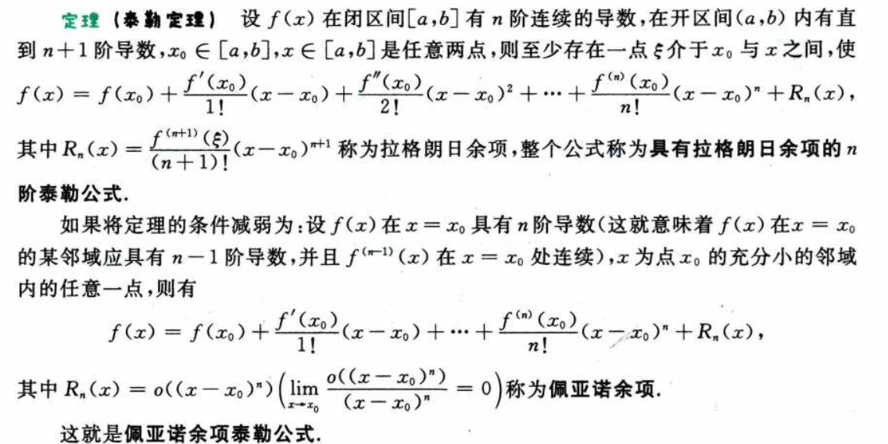

> 泰勒定理注意一点：拉格朗日余项展开要求有 $n$ **连续** 导数，而佩亚诺则不要求连续，只需具备即可。

#### 泰勒展开深入

当 $f(x)$ $n+2$ 阶可导时，在 $x=0$ 处拉格朗日余项泰勒展开 ，比上图展开多一项。两式子相等，会有：
$$
\frac{f^{(n+1)}(\xi_1)}{(n+1)!}x^{(n+1)}=\frac{f^{(n+1)}(0)}{(n+1)!}x^{(n+1)}+\frac{f^{(n+2)}(\xi_2)}{(n+2)!}x^{(n+2)}\\
\Rarr f^{(n+1)}(\xi_1)-f^{(n+1)}(0) = \frac{f^{(n+2)}(\xi_2)}{(n+2)}x \\
\Rarr \frac{f^{(n+1)}(\xi_1)-f^{(n+1)}(0)}{x}= \frac{f^{(n+2)}(\xi_2)}{(n+2)}\\
两边取极限，凑导数定义：\\
\Rarr f^{n+2}(0) \cdot \lim_{\xi_1 \to 0}\frac{\xi_1}{x} = \frac{1}{n+2} \lim_{\xi_2\to0}f^{n+2}(\xi_2)
$$
当 $f^{(n+2)}$ 在 $x=0$ 处连续且不为零。那么：
$$
\lim_{x\to 0}\frac{\xi_1}{x}=\frac{1}{n+2}
$$
这里，$\xi_1$ 是 $n+1$ 导数那个中值。

+++

再看一个下面的一个证明：

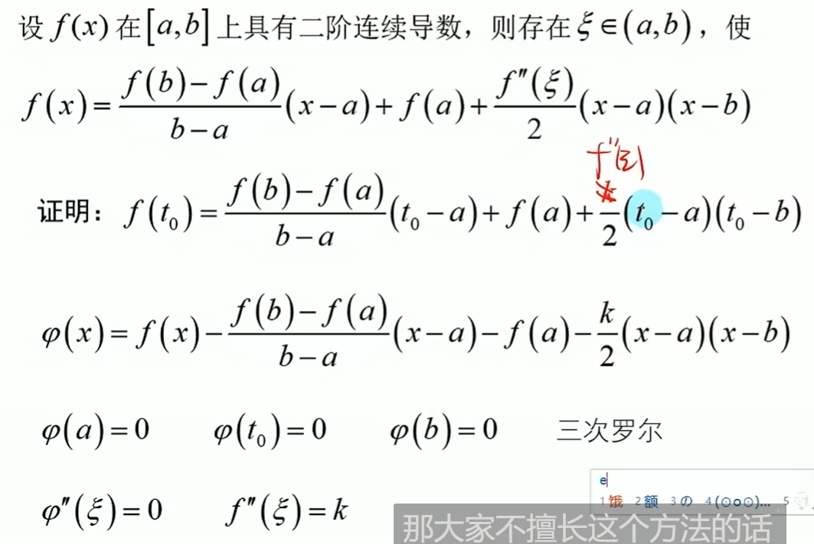

这是常用的 $k$ 值法思想。直接假设一个 $k$ 是关于 $a,b$ 以及特定点的常数，然后tui'j

以及一个二级结论：具有二阶连续导数的函数，可以写成 直线弦+二次抛物线

+++

四大中值定理的关系：

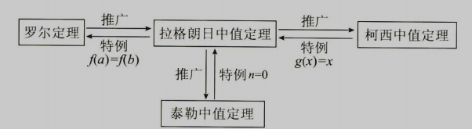

罗尔定理及其推理常用于零点问题：（假设下述提到的导数都存在）
- 若 $f(x)$ 有 $k$ 个零点，则 $f^{(n)}(x)$ 有**至少** $k-n$ 个零点。
- 若 $f^{(n)}(x)$ 有 $k$ 个零点，则 $f(x)$ 有**至多** $k+n$ 个零点。

#### **拐点** 

引入凹凸性的概念，凹——$f(\frac{x_1+x_2}{2}) < \frac{f(x_1)+f(x_2)}{2}$，凸反之。

> 扩展到区间 $(x_1,x_2)$ 的任意点，即 $\alpha x_1+(1-\alpha)x_2,\quad \alpha\in(0,1)$，满足:
>
> $f(\alpha x_1+(1-\alpha)x_2) < \alpha f(x_1)+(1-\alpha)f(x_2)$，即 $f(x)$ 的图像在 $(x_1,x_2)$ 上的任意一点位于弦的下方。更一般有：$\forall x\in(x_1,x_2),\quad f(x)<\alpha f(x_1)+(1-\alpha)f(x_2)$ 

注意两点：
- （极值点是值，拐点是点）
- **凹凸性是在函数连续的前提上讨论的。**
- **凹凸性定义里面是严格不等号。** （有点争议）

拐点是 **连续函数** 凹凸性变化的点。显然对应二阶可导函数，二阶导数发生变号的点就是拐点。注意：**拐点的存在定义在连续的前提上。极值只是要求邻域有定义即可。** 

> 极值和拐点的问题除了利用定义外，基本都要要求连续可导。极值是一阶导数的问题，拐点是二阶导数的问题。

**斜渐近线**：$\lim_{x \to \infty} \frac{f(x)}{x} = a,\ \lim_{x \to \infty} [f(x)-ax] = b$，则 $y=ax+b$ 是 $f(x)$ 的斜渐近线。——**泰勒公式也是一种求解方法，（要提 $x$ 出来方便无穷的展开）** 。

**曲率**：$K=\lim_{\Delta s \to 0} |\frac{\Delta \alpha}{\Delta s}|$，$\alpha$ 为切线与 $x$ 轴的夹角。含义为单位弧长上的转角。
$$
K=|\frac{\mathrm{d} (\arctan y')}{\mathrm{d} s}|=\frac{|y''|}{(1+(y')^2)^{\frac{3}{2}}}
$$

> 也可以是： 
> $$
> K=\frac{|x''|}{(1+(x')^2)^{\frac{3}{2}}}
> $$
> 

**曲率半径**：$R=\frac{1}{K}$。（弧度 = 弧长 / 半径 $\Lrarr$ 半径 = 弧长 / 弧度）

> 曲率圆本质上就是曲线在该点处的二阶近似表示。

### 杂（洛必达详解）

**点可导与及其邻域内的情况**

由定义可知，某点可导，说明该点处函数连续。导数值大于零说明左邻域小于函数值，右邻域大于函数值，导数值小于零反之。

==但是，点可导推不出点邻域内连续。反例：== 
$$
f(x) =
        \begin{cases}
            0,  & \text{if $x$ is 有理数} \\
            x^2, & \text{if $x$ is 无理数} \\
        \end{cases}
$$
其仅在 $x=0$ 处连续且可导，其余点都不行。即使是邻域也不行。

**点可导和邻域内可导不一样。洛必达法则由于出现 $\lim \frac{f'(x)}{g'(x)}$，是极限的形式，前面也说了，极限是在邻域内讨论的，所以洛必达法则是要求函数在邻域内可导。且导函数也要连续（保证这个极限存在就行），不然这个极限不能保证等于那个特定点的。**

- 要注意洛必达的三个条件最后一条是 $\lim \frac{f'(x)}{g'(x)}$ 存在，所以 **导完发现不存在说明洛必达不适用，并不是原极限不存在。常常因为导函数不存在而不满足这条，比如没说导函数连续，自然这个极限无法判断** 。（==右端存在，那么就等于左端==）
- **若洛必达不能用则考虑导数定义或泰勒公式。**  

比如：设函数 $f(x)$ 一阶连续可导，且满足 $\lim_{x\to 0}\frac{f(x)}{x^2}=A$ 。由这条件可得 $f(0)=f'(0)=0$ ，但是无法得出 $\lim_{x\to 0}\frac{f'(x)}{2x}=A$ ，理由如上所述。经典反例就是：
$$
f(x) =
        \begin{cases}
            0,  & \text{if $x=0$} \\
            Ax^2+x^3\sin{\frac{1}{x}}, & \text{else} \\
        \end{cases}
$$
**拉格朗日定理、拉格朗日余项的泰勒公式、凹凸性 都可以用来证明不等式。** 

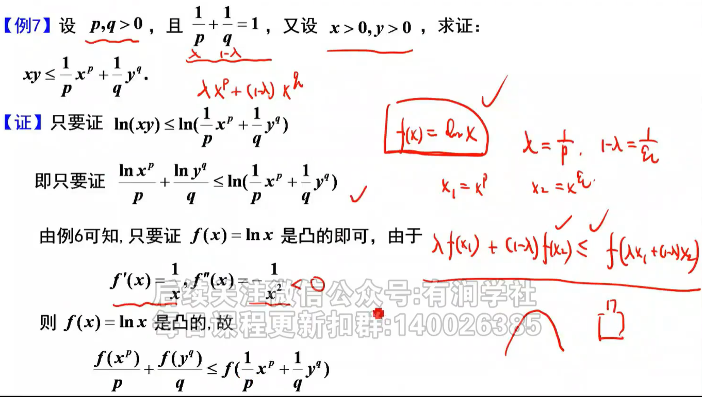

> 出现两点函数值

可导性也可以用善用泰勒展开证明：泰勒展开是 恒等号 ！！。

立方和差：（加项减项思想）
$$
a^3+b^3=a^3+a^2b+b^3-a^2b=a^2(a+b)+b(b^2-a^2)=(a+b)(a^2-ab+b^2)\\
a^3-b^3=(a-b)(a^2+ab+b^2)
$$

立方和差常见应用：
$$
1+x^3=(1+x)(1-x+x^2)\\
1-x^3=(1-x)(1+x+x^2)\\
1+x^6=(1+x^2)(1-x^2+x^4)\\
$$

> 奇偶次幂多项式转化。

==实际上 n 次方差公式：== 
$$
a^n-b^n=(a-b)(a^{n-1}+a^{n-2}b+a^{n-3}b^2+\cdots+ab^{n-2}+b^{n-1}),\quad n\in N^+
$$
[平方和数列求和](https://blog.csdn.net/qq_41437512/article/details/109012449)：
$$
\frac{n(n+1)(2n+1)}{6}
$$

三角函数 积化和差 与 和差化积：（武zx说和差化积考研不作要求）

$$
\sin a \sin b = \frac{1}{2}[\cos(a-b)-\cos(a+b)] \Rarr  \cos a + \cos b = 2\cos \frac{a+b}{2}\cos \frac{a-b}{2} \\
\sin a \cos b = \frac{1}{2}[\sin(a+b)+\sin(a-b)] \Rarr  \sin a + \sin b = 2\sin \frac{a+b}{2}\cos \frac{a-b}{2}
$$

几何算术均值不等式：

$$
\frac{1}{n} \sum_{i=1}^{n} a_i \ge \sqrt[n]{\prod_{i=1}^{n} a_i}
$$

> 算术均值大于等于几何均值，等号成立当且仅当 $a_1=a_2=\cdots=a_n$。

## 一元函数积分学

> 原函数、万能代换、可积、点火公式、分离三角函数公式、变限积分、积分中值定理、反常积分、$\Gamma$ 函数

如果区间 $I$ 上 $F'(x)=f(x)$ 或 $\mathrm{d} F(x)=f(x)\mathrm{d} x$ 处处成立，则称 $F(x)$ 是 $f(x)$ 在区间 $I$ 上的一个原函数。

- **若 $f(x)$ 在区间 $I$ 存在第一类间断点或无穷间断点，则 $f(x)$ 在 $I$ 上没有原函数。** —— 一穷无缘
- **若 $f(x)$ 在区间 $I$ 上连续，则 $f(x)$ 在 $I$ 上有原函数。** 

> **导函数一定没有第一类间断点和无穷间断点** 。（定义加洛必达可证）（其实可以由这个出发再说明上面的一穷无缘）
>
> ==那导函数只能存在振荡间断点。== 

常用积分公式：

$$
\int \sec x \mathrm{d}x = \ln |\sec x + \tan x| + C \\
\int \csc x \mathrm{d}x = \ln |\csc x - \cot x| + C \\
\int \frac{\mathrm{d}x}{\sqrt{x^2+a^2}} = \ln |x + \sqrt{x^2+a^2}| + C \\
\int \frac{\mathrm{d}x}{\sqrt{x^2-a^2}} = \ln |x + \sqrt{x^2-a^2}| + C \\
$$

万能代换公式：
$$
\tan \frac{x}{2} = t, \ \ \sin x = \frac{2t}{1 + t^2}, \ \ \cos x = \frac{1 - t^2}{1 + t^2} \\
x = 2 \arctan t \Rightarrow \mathrm{d}x = \frac{2}{1 + t^2} \mathrm{d}t \\
$$

推理如下：

$$
\tan \frac{x}{2}=t,  \\
\sec^2 \frac{x}{2} = 1 +\tan^2 \frac{x}{2} = 1 + t^2, \ \ \cos^2 \frac{x}{2} = \frac{1}{1 + t^2} \\
\cos x = 2 \cos^2 \frac{x}{2} - 1 = \frac{1 - t^2}{1 + t^2}, \ \ \sin x = 2 \tan \frac{x}{2}\cos^2 \frac{x}{2} = \frac{2t}{1 + t^2} \\
$$

万能代换将三角函数转换为有理函数。

### 定积分

定义要求闭区间  $[a,b]$  有定义，将闭区间分成多个尽可能小（极限的变化值）的区间，对应地小区间长度乘小区内**任取**一点 $\xi_i$ 的函数值，再求和，得到一个极限，若极限值不依赖于区间的划分方法，也不依赖于 $\xi_i$ 的选取方法，则称该极限为函数 $f(x)$ 在区间 $[a,b]$ 上的定积分，记作 $\int_a^b f(x) \mathrm{d}x$。

$$
\int_a^b f(x) \mathrm{d}x = \lim_{\lambda \to 0} \sum_{i=1}^{n} f(\xi_i) \Delta x_i
$$

**注意定积分是在闭区间上讨论的，不仅要求==区间有定义==，两端点也要有定义。**（不然就是反常积分了）

**可积性**

- 必要条件——有界：若定积分 $\int_a^b f(x) \mathrm{d}x$ 存在，则 $f(x)$ 在 $[a,b]$ 上 **有界**。

- 若 $f(x)$ 在 $[a,b]$ 上连续，则 $f(x)$ 在 $[a,b]$ 上可积。

- 若 $f(x)$ 在 $[a,b]$ 上**有界，且只有有限个间断点**，则 $f(x)$ 在 $[a,b]$ 上可积。

---

#### 华里士公式：（点火公式）

$$
\begin{align*}
    \int_{0}^{\frac{\pi}{2}} \sin^n x \mathrm{d}x &= \int_{0}^{\frac{\pi}{2}} \cos^n x \mathrm{d}x \\
    &= 
    \begin{cases}
        \frac{n-1}{n} \cdot \frac{n-3}{n-2} \cdot \cdots \cdot \frac{1}{2} \cdot \frac{\pi}{2}, & n \text{ 为正偶数}, \\[2ex]
        \frac{n-1}{n} \cdot \frac{n-3}{n-2} \cdot \cdots \cdot \frac{2}{3}, & n \text{ 为大于 1 的正奇数}, \\[2ex]
        \frac{\pi}{2}, & n = 0, \\[2ex]
        1, & n = 1.
    \end{cases}

\end{align*}
$$

> 记忆方法：在序列n~1中，按序两个两个地取（不重复，对应分母、分子）构成分式相乘，直到取到分母为 0 的情况，再乘上 $\frac{\pi}{2}$。
>
> 若积分限为 $\pi$ 或者 $2\pi$，考虑对称性，比如 $\sin x$ 关于 $x=\frac{\pi}{2},(\pi,0)$ 对称、$\cos x$ 关于 $x=\pi,(\frac{\pi}{2},0)$ 对称，再结合奇偶性转换。

还有一个的公式：

$$
\int_{0}^{\pi} xf(\sin x) \mathrm{d}x = \frac{\pi}{2} \int_{0}^{\pi} f(\sin x) \mathrm{d}x, \ \ \text{其中} f(x) \text{连续}
$$

证明：（令 $x = \pi - t$ ，区间再现思想）

$$
\begin{align*}
    \int_{0}^{\pi} xf(\sin x) \mathrm{d}x &= \int_{0}^{\pi} (\pi - x)f(\sin x) \mathrm{d}x 
    = \pi \int_{0}^{\pi} f(\sin x) \mathrm{d}x - \int_{0}^{\pi} xf(\sin x) \mathrm{d}x \\
    \Rightarrow 2 \int_{0}^{\pi} xf(\sin x) \mathrm{d}x &= \pi \int_{0}^{\pi} f(\sin x) \mathrm{d}x 
    \Rightarrow \int_{0}^{\pi} xf(\sin x) \mathrm{d}x = \frac{\pi}{2} \int_{0}^{\pi} f(\sin x) \mathrm{d}x
\end{align*}
$$

> 该式将三角函数积分独立出来。

注意，在 $[0,\pi]$ 上，$\cos x\not= f(\sin x)$ ，它有正负，没有一个连续函数可以做到这种映射。

### 变限积分

$$
(\int_a^x f(t) \mathrm{d}t)' = f(x)
$$

对**可积**函数变限求积分的函数。

若**被积函数连续**，则变限积分求导等于被积函数。即变限积分是可积函数的一个原函数。由此得到了不定积分与定积分的联系：若 $f(x)$ 连续，则 $\int f(x) \mathrm{d}x = \int_a^x f(t) \mathrm{d}t + C$。

**变限积分函数必定连续。**

至于可导性要看被积函数的间断点情况。利用导数的定义分析是否可导。

变限积分求导的三种类型

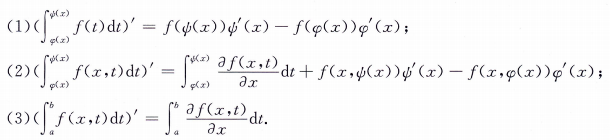

> 记第一条，第二、三条把定积分拆开成求和公式理解记忆。（积分里面的偏导要求连续）

**变上限积分的等价代换**

设 $f(x),g(x)$ 在 $x=a$ 的某邻域内连续（变限积分求导等于它们自身），当 $x \to a$ 时，$f(x) \sim g(x)$，则 $\int_{a}^{x} f(t) \mathrm{d}t \sim \int_{a}^{x} g(t) \mathrm{d}t$。（洛必达法则）

特别地，由于 $\lim_{x\to a}\frac{f(x)}{f(a)}=1$ ，故 $\int_{a}^{x} f(t) \mathrm{d}t \sim (x-a)f(a)$ 。

### 周期函数

周期函数任意周期长度区间上的定积分相等：

$$
T'(x) = (\int_{x}^{x+T}f(t) \mathrm{d}t)' = f(x+T) - f(x) = 0 \\
\Rarr T(x) = C = 一个周期的积分 \\
F(x)=\int_a^xf(t)\mathrm{d}t;\quad F(x+T)=\int_a^{x+T}..=F(x)+C
$$

显然，若这个定积分等于 0，则其变限积分也是周期函数。**扩展，若是奇函数的周期函数，显然这个定积分就是 0**。

周期函数求导后仍是周期函数：
$$
f(x)=f(x+T)\\
\Rarr f'(x)=f'(x+T)
$$
此外，连续的周期函数 $f(x)$ ：
$$
\lim_{x\to+\infty}\frac{\int_0^xf(t)\mathrm{d}t}{x}=\frac{\int_0^T f(t)\mathrm{d}t}{T}
$$
周期性常用反例 ：$|\sin x|$ 

---

常用的不等式

$$
\frac{x}{1+x} \le \ln(1+x) \le x
$$

**定义域内都成立！！！**。

> 在放缩中常用它来联系 $\ln n$ 和 $\frac{1}{n}$ 

以及二次函数：
$$
(x-a)^2+(x-b)^2\ge(\frac{a+b}{2}-a)^2+(\frac{a+b}{2}-b)^2=\frac{1}{2}(b-a)^2
$$
**积分中值定理**

- 若 $f(x)$ 在 $[a,b]$ 上连续，则 $\exists \xi \in (a,b)$ 使 $\int_a^b f(x) \mathrm{d}x = f(\xi)(b-a)$。
- 若 $f(x)$ 在 $[a,b]$ 上**连续**， $g(x)$ 可积不变号（**不变号的在里面**），则 $\exists \xi \in [a,b]$ 使 $\int_a^b f(x)g(x) \mathrm{d}x = f(\xi)\int_a^b g(x) \mathrm{d}x$。(广义积分中值定理；一个连续一个可积不变号)

> 1.7广义积分中值定理的证明 - 平凡的普通人的文章 - 知乎 https://zhuanlan.zhihu.com/p/342472242 *主要是利用介值* ，若是改成开区间，则要用柯西中值定理证明了。

上面一个是开区间一个是闭区间。

**柯西积分不等式**

$$
(\int_a^b f(x)g(x) \mathrm{d}x)^2 \le \int_a^b f^2(x) \mathrm{d}x \int_a^b g^2(x) \mathrm{d}x,\quad f(x)=\lambda g(x) 时等号成立\\
(\sum a_i b_i)^2 \le (\sum a^2_i)(\sum b^2_i),\quad a_i=\lambda b_i 时等号成立
$$

柯西不等式把积分的幂转换成了函数幂的积分，即把指数放到积分函数里面。

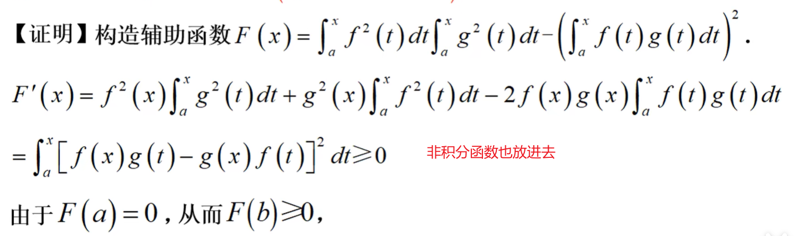

平时见不到的柯西积分不等式应用，原来当出现 $f^2(x)$ 时就出现应用场景了。： $f(0)=0且可导,则f(x)=\int_0^xf'(t)\mathrm{d}t$ ，则 $f^2(x)=(\int_0^xf'(t)\mathrm{d}t)^2\le x\int_0^x f'^2(t)\mathrm{d}t$ 。

### 反常积分

两种：无穷区间的反常积分、无界函数的反常积分。

本质也是常积分求极限。（对积分限求极限）

无界函数的反常积分：设 $f(x)$ 在 $[a,b)$ 上连续，且 $\lim_{x \to b^-} f(x) = +\infty$，则称 $\int_a^b f(x) \mathrm{d}x = \lim_{\beta \to b^-} \int_a^\beta f(x) \mathrm{d}x$ 为 $f(x)$ 在 $[a,b)$ 上的反常积分（瑕积分），点 $b$ 为奇点（瑕点）。

若 $a,b$ 都是奇点，则应该**分成两个反常积分求和**：$\int_a^b f(x) \mathrm{d}x = \int_a^c f(x) \mathrm{d}x + \int_c^b f(x) \mathrm{d}x$。（无穷区间也是）（要求两个都收敛才收敛，**只要有一个发散就发散**，应该也是后面说的速度问题）

**非负** 函数的反常积分可以利用 **比较判别法（恒大小 或者 极限形式）** 判断敛散性。这块和后面级数有点联系。<!--todo-->

常用结论：

$$
\int_a^{+\infty} \frac{1}{x^p}\mathrm{d}x \begin{cases}
    \text{收敛} & p > 1, \\
    \text{发散} & p \le 1.
\end{cases}(a>0),\quad \int_0^1 \frac{1}{x^p}\mathrm{d}x \begin{cases}
    \text{收敛} & p < 1, \\
    \text{发散} & p \ge 1.
\end{cases}
$$

关于对称区间的反常函数计算相比于定积分的多一个 “收敛” 的要求。因为虽然两边对称，但 **趋向的速度不能保证相同**，所以要求收敛。（听闻柯西主值就是利用 $\lim_{a\to \infty} \int_{-a}^{a} f(x) \mathrm{d}x$ 让它们两边的趋势速度一致）

#### **$\Gamma$ 函数** 

$$
\Gamma(z) = \int_0^{+\infty} t^{z-1} e^{-t}  \mathrm{d}t
$$

其在 $z > 0$ 时收敛，且有性质 $\Gamma(z+1) = z\Gamma(z),\ \Gamma(n+1)=n!$ （分部积分证）。

$\Gamma(1)=1$ ，$\Gamma(\frac{1}{2})=\sqrt{\pi}$。
$$
\Gamma(n+1) =\int_0^{+\infty} x^{n} e^{-x}  \mathrm{d}x = n!\\
\text{特别的} \quad \int_0^{+\infty} x e^{-x}  \mathrm{d}x =\Gamma(2)= 1,\\
\quad \int_0^{+\infty} x^{-\frac{1}{2}} e^{-x}  \mathrm{d}x =\Gamma(\frac{1}{2})= \sqrt{\pi}\\
\quad \int_0^{+\infty} x^{\frac{1}{2}} e^{-x}  \mathrm{d}x =\Gamma(\frac{3}{2})=\frac{1}{2}\Gamma(\frac{1}{2})= \frac{\sqrt{\pi}}{2}\\
$$
概率论常用。

> 既是瑕积分，又是无穷区间积分，分开计算可证收敛性质。

**一个重要反常积分**
$$
\int_{-\infty}^{+\infty} e^{-x^2} \mathrm{d}x = \sqrt{\pi} \\
特别地,\ \int_{-\infty}^{+\infty} e^{-\frac{-x^2}{2}} \mathrm{d}x =\sqrt{2} \int_{-\infty}^{+\infty} e^{-(\frac{x}{\sqrt{2}})^2} \mathrm{d} (\frac{x}{\sqrt{2}}) = \sqrt{2\pi}
$$

> 上述两个函数在概率论中有重要应用。后者其实就是 $\Gamma(\frac{1}{2})=\sqrt{\pi}$。 

---

### 杂

前面关于原函数、可积性、变限积分提到：
- 如果区间 $I$ 上 $F'(x)=f(x)$ 或 $\mathrm{d} F(x)=f(x)\mathrm{d} x$ 处处成立，则称 $F(x)$ 是 $f(x)$ 在区间 $I$ 上的一个原函数。
- 若 $f(x)$ 在区间 $I$ 存在第一类间断点或无穷间断点，则 $f(x)$ 在 $I$ 上没有原函数。
- 若 $f(x)$ 在 $[a,b]$ 上**有界，且只有有限个间断点**，则 $f(x)$ 在 $[a,b]$ 上可积。
- 若 $f(x)$ 连续，则 原函数 $= \int_a^x f(t) \mathrm{d}t + C$。

举例理解：

如果 $f(x)$ 在 $[a,b]$ 上除了点 $x_0$ 外都连续，据上断定：
- $f(x)$ 在 $[a,b]$ 没有原函数。
- $f(x)$ 在 $[a,b]$ 上可积。

既然可积，记

$$
F(x) = \int_a^x f(t) \mathrm{d}t
$$

分析 $F(x)$，显然连续（变限积分的连续性），且有 $F'(x) = f(x),\ x \neq x_0$ ；计算 $x_0$ 处的左右导数：

$$
F'_-(x_0)=\lim_{x \to x_0^-} \frac{\int_a^x f(t) \mathrm{d}t - \int_a^{x_0} f(t) \mathrm{d}t}{x-x_0} \overset{L}{=} \lim_{x \to x_0^-} f(x) = f(x_0^-)
$$

同理 $F'_+(x_0) = f(x_0^+)$ 。由于 $x_0$ 是间断点，若是第一类间断点，显然 $F'(x_0)$ 不存在或 $\neq f(x_0)$；

故 $F(x)$ 不满足原函数条件。（处处导数等于 $f(x)$）所以在变限积分部分特地说明了**连续函数**的变限积分才是可积函数的一个原函数。

> 存在无穷间断点肯定是没有原函数的（无界不可积），但存在振荡间断点是可以有原函数。

---

考虑这样一个积分：带 绝对值 的三角函数积分。

$$
\int |\cos x| \mathrm{d}x
$$

分析：积分函数是周期为 $\pi$ 的函数，可以分区间讨论 $[k\pi+\frac{\pi}{2}, k\pi+\frac{3\pi}{2})$，$k$ 为整数。当 $k=-1$ 时，绝对值可去掉，原函数则为 $\sin x$；当 $k=0$ 时，相当于 $\cos x$ 的第一个正部分右移了 $\pi$，那么原函数则为 $\sin (x+\pi)$，以此类推。所以原函数为：

$$
F_k(x) = \sin {[x+(k+1)\pi]}+C_k, \ \ x \in [k\pi+\frac{\pi}{2}, k\pi+\frac{3\pi}{2})
$$

但由于**原函数是连续的**，故有 $F_{k-1}(k\pi+\frac{\pi}{2}) = F_k(k\pi+\frac{\pi}{2})$，即：

$$
\sin{[k\pi+\frac{\pi}{2}+k\pi]}+C_{k-1} = \sin{[k\pi+\frac{\pi}{2}+(k+1)\pi]}+C_k\\
\lrArr \sin\frac{\pi}{2}+C_{k-1} = \sin\frac{3\pi}{2}+C_k\\
\lrArr C_{k} = C_{k-1}+2
$$

故最终原函数为：

$$
\sin{[x+(k+1)\pi]}+2k+C, \ \ x \in [k\pi+\frac{\pi}{2}, k\pi+\frac{3\pi}{2})
$$

---

## 多元函数微分学

> 重极限、全微分、极值、拉格朗日乘数法、方向导数和梯度

证明重极限不存在的常用方法就是取两种不同的路径，证明极限不相等。

### 全微分

全增量可以表示为下面的样子：
$$
\Delta z = A \Delta x + B \Delta y + o(\sqrt{\Delta x^2 + \Delta y^2})
$$

> 注意和一元的区别，一元是 $o(\Delta x)$，多元是 $o(\sqrt{\Delta x^2 + \Delta y^2})$。

记为 $\mathrm{d}z = A \Delta x + B \Delta y$。**利用定义判断可微**：

$$
\lim_{\substack{\Delta x \to x_0 \\ \Delta y \to y_0}} \frac{[f(x_0+\Delta x, y_0+\Delta y) - f(x_0, y_0)] - (A \Delta x + B \Delta y)}{\sqrt{\Delta x^2 + \Delta y^2}} \overset{?}{=} 0
\\
\lim_{\substack{ x \to x_0 \\ y \to y_0}} \frac{[f(x, y) - f(x_0, y_0)] - (A(x-x_0) + B(y-y_0))}{\sqrt{(x-x_0)^2 + (y-y_0)^2}} \overset{?}{=} 0
$$

> **这里其实只要有 $\Delta z=o(\rho)$ 便可直接得出可微了，因为 $\exist A=0,B=0$ 使得定义中的式子成立。（也可以证明两个偏导数等于0）**

**必要条件** ：如果可微，则 $\mathrm{d}z=\frac{\partial f}{\partial x} \mathrm{d}x + \frac{\partial f}{\partial y} \mathrm{d}y$。—— 可微之后，才有偏导数的关系。

> 所以只要全增量可以表示成上面定义的样子，即可认为 $A=\frac{\partial f}{\partial x},B=\frac{\partial f}{\partial y}$ 。——

这里 $\frac{\partial z}{\partial x} =\frac{\partial f}{\partial x},\frac{\partial z}{\partial y}=\frac{\partial f}{\partial y}$ 。==常见要去 z 的各种偏导，其实可以从全微分的角度出发，尤其是 z 不能表达出来的时候。== 

**充分条件** ：两个偏导数连续，则函数可微。其实一个连续，一个存在即可也是充分条件。

可微和可导的关系

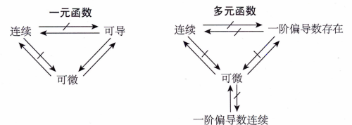

常见多元无穷小比值：

$$
\frac{x}{\sqrt{x^2+y^2}} 、 \frac{x^2}{x^2+y^2}、\frac{xy}{x^2+y^2}、\frac{|x|}{\sqrt{x^2+y^2}}、\frac{|x|+|y|}{\sqrt{x^2+y^2}} : 极限不存在 \\
\frac{x^2y}{x^2+y^2}、\frac{xy}{\sqrt{x^2+y^2}}：极限为0（因为 |xy| \le \frac{1}{2}(x^2+y^2) ，利用有界乘无穷小也可证）\\
$$

> 事实上第二条只有是 $x^p y^q,p+q>1$ 就行。极坐标可证。

### 极值

**充分条件** ：设 $f(x,y)$ 在点 $(x_0, y_0)$ 处有 **二阶连续偏导数**，且 $f'_x(x_0, y_0) = f'_y(x_0, y_0) = 0$，令 $f''_{xx}(x_0, y_0) = A,\ f''_{xy}(x_0, y_0) = B,\ f''_{yy}(x_0, y_0) = C$，则：

- 若 $AC-B^2 > 0$，有极值；当 $A < 0$ 时，有极大值；当 $A > 0$ 时，有极小值。
- 若 $AC-B^2 < 0$，无极值。
- 若 $AC-B^2 = 0$，无法判断。

==注意，该方式只能求区域内部极值，边界都要另外求== 

> 这个得记

**拉格朗日乘数法**

$f(x,y)$ 在约束条件 $\varphi(x,y)=0$ 求极值。构造拉格朗日函数：

$$
L(x,y,\lambda) = f(x,y) + \lambda \varphi(x,y)
$$

化为无条件函数求极值，即求 $L'_x(x,y,\lambda) = L'_y(x,y,\lambda) = L'_\lambda(x,y,\lambda) = 0$。

多条件约束下类似。

> $f$ 的梯度向量 与 $\varphi$ 的梯度向量 成比例 $\lambda$ 。
>
> 多条件下是 $f$ 的梯度向量 可由所有条件的梯度向量 线性组合。$\nabla f=\lambda_1 \nabla\varphi_1+ \lambda_2\nabla\varphi_2$ 。

---

**注意：多元函数求偏导后仍是多元函数**

### 方向导数、梯度 （单位向量）

沿特定方向 $\vec{l}=(\cos \alpha, \sin \alpha)$ （注意这是 **单位向量**，且极限当中 $t$ 是从正方向趋向于0）的方向导数：

$$
\frac{\partial f(x_0,y_0)}{\partial \vec{l}} = \lim_{ t \to 0^+} \frac{f(x_0+ t \cos \alpha, y_0+ t \sin \alpha) - f(x_0, y_0)}{t}
$$

**方向已经确定，不可回头，故 $t\to 0^+$ 。** 

要求 $f$ 在此处有 **一阶连续偏导（可微）** ，梯度：$\textbf{grad}\ f(x_0,y_0) = (\frac{\partial f (x_0, y_0)}{\partial x}, \frac{\partial f (x_0, y_0)}{\partial y})$。是一个向量。

> **梯度是曲线的法向量，注意不是切向量。** 

引入梯度后，可微条件下，上述的方向导数 可写成： $\frac{\partial f(x_0,y_0)}{\partial \vec{l}} = \textbf{grad}\ f(x_0,y_0) \cdot \vec{l}$。即：

$$
\frac{\partial f(x_0,y_0)}{\partial \vec{l}} = \frac{\partial f(x_0, y_0)}{\partial x} \cos \alpha + \frac{\partial f(x_0, y_0)}{\partial y} \sin \alpha
$$

> 注意梯度和利用梯度求方向导数都是要求 ==**可微的**== ，若不可微则考虑定义法。

---

海伦公式 求三角形面积：

$$
S = \sqrt{p(p-a)(p-b)(p-c)}, \quad p = \frac{a+b+c}{2}
$$

锥型体积：

$$
V = \frac{1}{3}S h, \quad S \text{ 为底面积}
$$

## 多元函数积分学

> 重积分、累次积分、曲线积分（格林公式、斯托克斯公式）、曲面积分（投影定理、高斯公式）、应用（质心、形心、转动惯量、散度、旋度）

**变量对称性原理：**
$$
\iint_{D(x,y)} f(x,y) \mathrm{d}\sigma=\iint_{D(y,x)} f(y,x) \mathrm{d}\sigma
$$

### 极坐标、球坐标、柱坐标

二重积分下的极坐标：

$$
\begin{align*}
    x &= r \cos \theta, \\
    y &= r \sin \theta, \\
    \mathrm{d}x \mathrm{d}y &= r \mathrm{d}r \mathrm{d}\theta.
\end{align*}
$$

三重积分下的球坐标：

$$
0 \le \varphi \le \pi,\ 0 \le \theta \le 2\pi \\
\begin{align*}
    x &= r \sin \varphi \cos \theta, \\
    y &= r \sin \varphi \sin \theta, \\
    z &= r \cos \varphi, \\
    \mathrm{d}x \mathrm{d}y \mathrm{d}z &= r^2 \sin \varphi \ \mathrm{d}r \mathrm{d}\varphi \mathrm{d}\theta.
\end{align*}
$$

> 体积单元的三条边：$\mathrm{d}r,\ r\sin\varphi\mathrm{d}\theta,\ r\mathrm{d}\varphi$ 。
>
> 这里要注意，仰角 $\varphi$ 的取值范围是 $(0,\pi)$ 。

三重积分下的柱坐标：
$$
\begin{align*}
    x &= r \cos \theta, \\
    y &= r \sin \theta, \\
    z &= z, \\
    \mathrm{d}x \mathrm{d}y \mathrm{d}z &= r \mathrm{d}r \mathrm{d}\theta \mathrm{d}z.
\end{align*}
$$

本质都是雅可比行列式进行积分单元变化。比如复杂情况：椭圆区域：

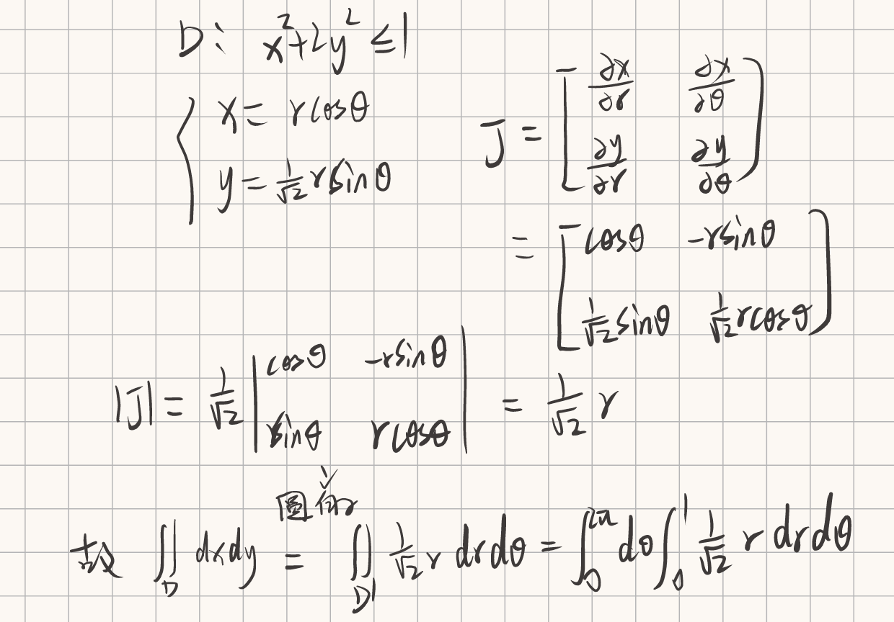

### 曲线积分

若 $L:r=r(\theta),\alpha \le \theta \le \beta$，则：

$$
\int_L f(x,y) \mathrm{d}s = \int_{\alpha}^{\beta} f(r\cos \theta, r\sin \theta) \sqrt{r^2+r'^2} \mathrm{d}\theta
$$

> 对弧长的曲线积分常规就只有参数方程一种方法。

#### 对坐标的平面曲线积分

**格林公式** ：设闭区域 $D$ 的边界为平面曲线 $L$（可以是多段），$D$ 内的函数 $P(x,y),Q(x,y)$ **有连续偏导数** ，则：

$$
\oint_L P \mathrm{d}x + Q\mathrm{d}y = \iint_D (Q'_x - P'_y) \mathrm{d}x \mathrm{d}y
$$

其中，$L$ 为 $D$ 取正向的边界曲线，即沿着 $L$ 走，$D$ 在 **左手边**。

> $P,Q$ 有连续偏导数。注意是对 $x$ 偏导的 $Q$ 减去对 $y$ 偏导的 $P$。

计算思路一般为：

1. 封闭曲线，格林公式；
2. 开曲线
    1. 位于路径无关的区域内，改换简单路径 或 找出原函数；
    2. 否则，补线用格林公式。
3. 参数方程直接计算。

两类积分的联系：

$$
\oint_L P \mathrm{d}x + Q\mathrm{d}y = \int_L (P \cos \alpha + Q \sin \alpha) \mathrm{d}s
$$

#### 对坐标的空间曲线积分

1. **参数方程直接计算** 
2. 斯托克斯公式
3. **某个变量可用另外两个表示，代入转成平面线积分**

**斯托克斯公式** ：设空间曲线 $L$（可以是多段） 为 $\Sigma$ 的边界，$L$ 的方向与 $\Sigma$ 的法向量方向符合右手定则，$P(x,y,z),Q(x,y,z),R(x,y,z)$ 在 $\Sigma$ 上 **有连续偏导数** ，则：（①对坐标的面积分；②对面积的面积分
$$
\oint_L P \mathrm{d}x + Q\mathrm{d}y + R\mathrm{d}z \\
\begin{align*}
    &= \iint_{\Sigma} 
    \begin{vmatrix}
        \mathrm{d}y\mathrm{d}z & \mathrm{d}x\mathrm{d}z & \mathrm{d}x\mathrm{d}y \\
        \frac{\partial}{\partial x} & \frac{\partial}{\partial y} & \frac{\partial}{\partial z} \\
        P & Q & R
	\end{vmatrix} =不是平面的话，考虑高斯公式\\
    &= \iint_{\Sigma} 
    \begin{vmatrix}
        \boldsymbol{i} & \boldsymbol{j} & \boldsymbol{k} \\
        \frac{\partial}{\partial x} & \frac{\partial}{\partial y} & \frac{\partial}{\partial z} \\
        P & Q & R
	\end{vmatrix}
	\mathrm{d}\textbf{S}\\
	&= \iint_{\Sigma}
    \begin{vmatrix}
        - z'_x & - z'_y &  1 \\
        \frac{\partial}{\partial x} & \frac{\partial}{\partial y} & \frac{\partial}{\partial z} \\
        P & Q & R
	\end{vmatrix}
	\mathrm{d}x\mathrm{d}y = \pm\iint_{D_{xy}}
\end{align*}
$$

1. 是转对坐标的曲面积分。（==曲面所围区域简单，可以用高斯公式进一步==）
2. 是转对面积的曲面积分，其中 $\boldsymbol{i} , \boldsymbol{j} , \boldsymbol{k}$ 是方向余弦。即第一行是当前 **曲面面积单元** 的法线向量 **方向余弦**；（==通常是行列式为常数，且曲面面积好求时考虑==）
3. 是三合一公式，最后映射到平面注意曲面方向。（==曲面投影简单==）

> 第二行是偏导算子

**该公式的三种写法也蕴含了曲面积分的各种关系** 

### 曲面积分

**投影定理** ：设曲面 $\Sigma$ 的方程为 $z=z(x,y)$，则：
$$
\iint_{\Sigma} f(x,y,z) \mathrm{d}S = \iint_{D} f(x,y,z(x,y)) \sqrt{1+(z'_x)^2+(z'_y)^2} \mathrm{d}x \mathrm{d}y
$$

$\mathrm{d}S \cos \alpha=\mathrm{d}x \mathrm{d}y$，其中 $\alpha$ 是曲面面积单元与 $xOy$ 面的夹角。

$$
n_1 = (-z'_x, -z'_y, 1),\ n_2 = (0,0,1) \\
\cos (\alpha) = \frac{n_1 \cdot n_2}{|n_1| |n_2|} = \frac{1}{\sqrt{1+(-z'_x)^2+(-z'_y)^2}}\\
\mathrm{d}S = \sqrt{1+(z'_x)^2+(z'_y)^2} \mathrm{d}x \mathrm{d}y
$$

事实上有：
$$
F(x,y,z)=0\\

\vec{n} = \textbf{grad}\ F = (F'_x, F'_y, F'_z)\ 单位化为方向余弦\ (\cos \alpha, \cos \beta, \cos \gamma)\\

\frac{\mathrm{d}x \mathrm{d}y}{\cos \gamma} = \frac{\mathrm{d}x \mathrm{d}z}{\cos \beta} = \frac{\mathrm{d}y \mathrm{d}z}{\cos \alpha} = \mathrm{d}S \\

    \mathrm{d}x \mathrm{d}z = \frac{\cos\beta}{\cos\gamma} \mathrm{d}x \mathrm{d}y = \frac{F'_y}{F'_z} \mathrm{d}x \mathrm{d}y = (-\frac{\partial z}{\partial y})\mathrm{d}x \mathrm{d}y, \\
    \mathrm{d}y \mathrm{d}z = \frac{\cos\alpha}{\cos\gamma} \mathrm{d}x \mathrm{d}y = \frac{F'_x}{F'_z} \mathrm{d}x \mathrm{d}y = (-\frac{\partial z}{\partial x})\mathrm{d}x \mathrm{d}y
$$

从而导出所谓的 **三合一公式** 
$$
\iint_{\Sigma} P \mathrm{d}y \mathrm{d}z + Q \mathrm{d}z \mathrm{d}x + R \mathrm{d}x \mathrm{d}y =\iint_{\Sigma} [(-\frac{\partial z}{\partial x}) P+ (-\frac{\partial z}{\partial y})Q+R] \mathrm{d}x \mathrm{d}y
$$
最后曲面 $\Sigma$ 到平面域 $D$ 时要注意曲面方向。

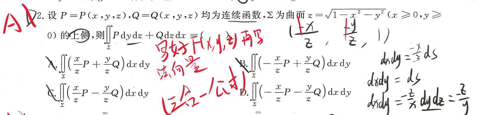

#### 对坐标的曲面积分

① 直接法：拆开三部分分别计算，如

$$
\iint_{\Sigma} R(x,y,z) \mathrm{d}x \mathrm{d}y=\pm \iint_{D_{xy}} R(x,y,z(x,y)) \mathrm{d}x \mathrm{d}y
$$

> 注意这里不用投影定理，因为左边不是曲面面积单元。

若 $\Sigma$ 的法向量与 $z$ 轴正向夹角为 **锐角**，即指向上侧，取正号；否则取负号。

② **高斯公式** ：空间闭区域 $\Omega$ 由光滑曲面 $\Sigma$ 围成，函数 $P,Q,R$ 在其内**有一阶连续偏导数**，则：
$$
\oiint_{\Sigma_外} P \mathrm{d}y \mathrm{d}z + Q \mathrm{d}z \mathrm{d}x + R \mathrm{d}x \mathrm{d}y =\iiint_{\Omega} \text{div} \{P,Q,R\} \mathrm{d}x \mathrm{d}y \mathrm{d}z= \iiint_{\Omega} (P'_x + Q'_y + R'_z) \mathrm{d}x \mathrm{d}y \mathrm{d}z
$$

> 与散度联系

③ 上面提到的 **三合一** 。

**两类面积分的联系** 
$$
\iint_{\Sigma} P \mathrm{d}y \mathrm{d}z + Q \mathrm{d}z \mathrm{d}x + R \mathrm{d}x \mathrm{d}y = \iint_{\Sigma} (P \cos \alpha + Q \cos \beta + R \cos \gamma) \mathrm{d}S
$$

### 应用

==对旋转体求体积：== 

- 一元积分 $\int \pi(R_1^2-R_2^2) \mathrm{d}u$ ，环形面积 再积分
- 二重积分 $\iint 2\pi R \mathrm{d}\sigma$ ，面积单元转一周长积分。—— 二重平面区域有 **对称性** 或二重积分好算时。
- 对锥面求 **表面积** 时 $\mathrm{d} S=2\pi r(z)\times \mathrm{d}z/\sin\theta$ ，即 每一个高度 $z$ 对应的周长 $2\pi r(z)$ 乘以 **斜面** 变化长度。比如对于 $z=\sqrt{x^2+y^2}$ 锥面， $\mathrm{d}S=2\pi r(z)\times \sqrt{2} \mathrm{d}z$ 。与求体积时的 $\mathrm{d}V=\pi\ [r(z)]^2\mathrm{d}z$ 不同。
- 对旋转面求表面积，$S=2\pi\int r(x,y)\mathrm{d}s$ ，弧长微分单元进行一周旋转。

**质心**，对于平面：
$$
\bar{x}= \frac{\iint_{D} x \rho(x,y) \mathrm{d}x \mathrm{d}y}{\iint_{D} \rho(x,y) \mathrm{d}x \mathrm{d}y}
$$

其中当 $\rho(x,y)=1$ 时，即为平面图形的形心。即 $\bar{x} S = \iint_{D} x \mathrm{d}x \mathrm{d}y$。

> 对于空间体、曲线段、曲面片都有这样的物理量。

多元积分应用

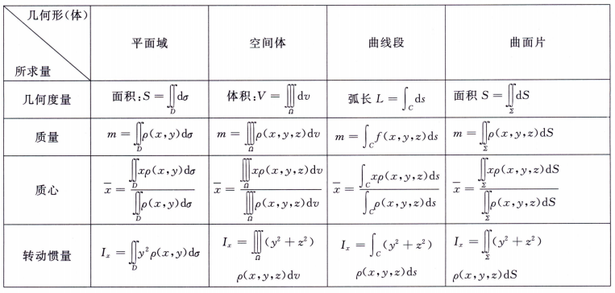

> 椭圆面积 ： $\pi ab$ 

**散度** ：$P,Q,R$ 具有一阶连续偏导数，则：
$$
\text{div} \{P,Q,R\} = \frac{\partial P}{\partial x} + \frac{\partial Q}{\partial y} + \frac{\partial R}{\partial z}
$$

**旋度** ：$P,Q,R$ 具有一阶连续偏导数，则：

$$
\textbf{rot}\ \{P,Q,R\} =\\
\begin{vmatrix}
    \boldsymbol{i} & \boldsymbol{j} & \boldsymbol{k} \\
    \frac{\partial}{\partial x} & \frac{\partial}{\partial y} & \frac{\partial}{\partial z} \\
    P & Q & R
\end{vmatrix}
$$

特别的，当 $P、Q、R$ 是某函数的梯度时，旋度为。即 ==梯度的旋度为零== 。

## 微分方程

> 可分离变量、齐次、一阶线性、伯努利、线性微分方程解的性质、二阶常系数线性齐次（以及某些特殊自由项的非齐次）、欧拉方程

齐次微分方程就是用 $y=ux$ 代替 $y$ 同时消去 $x$，然后化简为可分离变量的形式。
$$
\frac{\mathrm{d}y}{\mathrm{d}x}=u+x\frac{\mathrm{d}u}{\mathrm{d}x}=\varphi(u)
$$
没有那么刚刚好的情况下，一般求解方法：

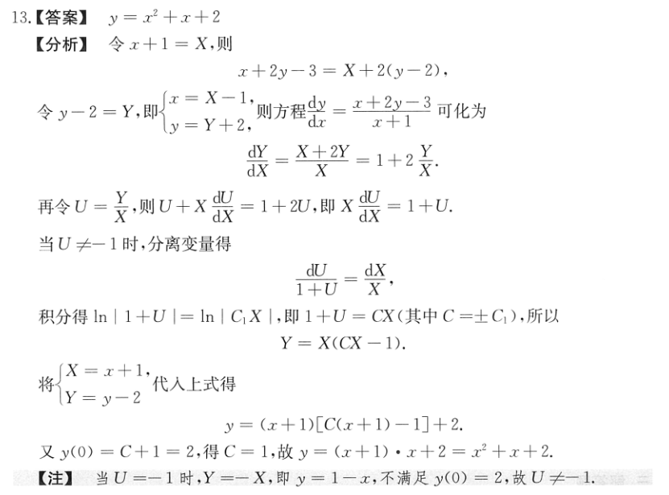

想要用齐次求解方法：①分式上下齐次；②不能有常数；故上述例题就是通过换元变为适当情况。它是线性换元，所以微分不变。适用度不是很大。

### 一阶线性微分方程

$$
y'+p(x)y=q(x)
$$

通解为：

$$
y = e^{-\int p(x) \mathrm{d}x} \left[ \int q(x) e^{\int p(x) \mathrm{d}x} \mathrm{d}x + C \right]
$$

推理过程：

$$
\begin{align*}
    y'+p(x)y &= q(x) \\
    e^{\int p(x) \mathrm{d}x} y'+p(x)e^{\int p(x) \mathrm{d}x} y &= q(x)e^{\int p(x) \mathrm{d}x} \\
    \frac{\mathrm{d}}{\mathrm{d}x} \left[ e^{\int p(x) \mathrm{d}x} y \right] &= q(x)e^{\int p(x) \mathrm{d}x} \\
    e^{\int p(x) \mathrm{d}x} y &= \int q(x) e^{\int p(x) \mathrm{d}x} \mathrm{d}x + C \\
    y &= e^{-\int p(x) \mathrm{d}x} \left[ \int q(x) e^{\int p(x) \mathrm{d}x} \mathrm{d}x + C \right]
\end{align*}
$$

### 伯努利微分方程

$$
\begin{align*}
    & y'+p(x)y=q(x)y^n, \ n \neq 0,1 \\
    \rArr & y^{-n}\frac{\mathrm{d} y}{\mathrm{d} x}+p(x)y^{1-n}=q(x) ,\ y \neq 0 \\
    & 令\ z=y^{1-n} \rArr \frac{\mathrm{d} z}{\mathrm{d} x}= (1-n)y^{-n} \frac{\mathrm{d} y}{\mathrm{d} x}\ 有 \\
    & \frac{1}{1-n} \frac{\mathrm{d} z}{\mathrm{d} x} + p(x)z = q(x) \\
    \rArr & \frac{\mathrm{d}z}{\mathrm{d} x}+(1-n)p(x)z=(1-n)q(x) \\
    & 变成了一阶线性微分方程 \\
    \rArr & z = e^{-(1-n)\int p(x) \mathrm{d}x} \left[ \int (1-n)q(x) e^{(1-n)\int p(x) \mathrm{d}x} \mathrm{d}x + C \right] \\
\end{align*}
$$

### 线性微分方程解的性质

对于齐次的，解有叠加性质，且 $n$ 个线性无关的所有线性组合构成了其通解。（$n$为阶数）

对于非齐次的，其通解为 对于齐次方程的**通解** + 其自身的一个**特解**。**解的叠加，自由项也叠加。**

### 二阶常系数线性

齐次的

$$
y''+py'+qy=0
$$

特征方程为：

$$
r^2+pr+q=0
$$

| 特征方程根 $r_1,r_2$         | 通解形式                                            |
| ---------------------------- | --------------------------------------------------- |
| $r_1 \neq r_2$               | $y=C_1e^{r_1x}+C_2e^{r_2x}$                         |
| $r_1 = r_2$                  | $y=(C_1+C_2x)e^{r_1x}$                              |
| $r_1,r_2=\alpha \pm \beta i$ | $y=e^{\alpha x}(C_1\cos \beta x + C_2\sin \beta x)$ |

$n$ 阶推广：

|特征方程根|通解形式|
|---|---|
|单重实根 $r$|对应一项： $Ce^{rx}$|
|$k$重实根 $r$|对应 $k$ 项：$(C_1+C_2x+\cdots+C_kx^{k-1})e^{rx}$|
|单重复数根 $\alpha \pm \beta i$|对应两项：$e^{\alpha x}(C_1\cos \beta x + C_2\sin \beta x)$|
|$k$重复数根 $\alpha \pm \beta i$|对应 $2k$ 项：$e^{\alpha x}[(A_1+A_2x+\cdots+A_kx^{k-1})\cos \beta x + (B_1+B_2x+\cdots+B_kx^{k-1})\sin \beta x]$|

特殊自由项的非齐次二阶常系数线性微分方程，分两类。

⚠：==下面的特殊自由项求解都是针对二阶的，超二阶解不了非齐次，要降为二阶！！== 

类型一：

$$
y''+py'+qy=P_m(x)e^{ax}
$$

其中 $P_m(x)$ 是已知的 $m$ 次多项式。

根据解的性质，求出齐次的通解，然后求出非齐次的一个特解，两者相加即为非齐次的通解。

该类型的特解形式为：

$$
y^*=x^kQ_m(x)e^{ax}
$$

其中 $Q_m(x)$ 系数待定，关于 $k$ ：

$$
k=
\begin{cases}
    0, & a 不是特征方程的根 \\
    1, & a 是特征方程的单重根 \\
    2, & a 是特征方程的重根
\end{cases}
$$

类型二：

$$
y''+py'+qy\overset{其中之一}{=}
\begin{cases}
    e^{ax}P_m(x)\cos bx, \\
    e^{ax}Q_m(x)\sin bx, \\
    e^{ax}(P_m(x)\cos bx+Q_m(x)\sin bx)
\end{cases}
$$

特解形式为：

$$
y^*=x^ke^{ax}[R_m(x)\cos bx+S_m(x)\sin bx]
$$

$$
k=
\begin{cases}
    0, & a \pm bi 不是特征方程的根 \\
    1, & a \pm bi 是特征方程的根 \\
\end{cases}
$$

> 所谓特解是确定，问及时要求出符合条件的系数（待回方程确定），除非问结构。

### 欧拉方程

特殊变系数的二阶线性微分方程：

$$
x^2y''+a_1xy'+a_2y=f(x)\\
x^ny^{(n)}+p_1x^{n-1}y^{(n-1)}+\cdots +p_{n-1}xy'+p_ny=f(x)
$$

若 $x>0$ 作变量代换
$$
x=e^t \\
t=\ln x
$$
则：

$$
\begin{align*}
    \frac{\mathrm{d}y}{\mathrm{d}x} &= \frac{\mathrm{d}y}{\mathrm{d}t} \frac{\mathrm{d}t}{\mathrm{d}x} = \frac{1}{x} \frac{\mathrm{d}y}{\mathrm{d}t} \\
    \frac{\mathrm{d}^2y}{\mathrm{d}x^2} &= \frac{\mathrm{d}}{\mathrm{d}x} \left( \frac{1}{x} \frac{\mathrm{d}y}{\mathrm{d}t} \right) = \frac{1}{x^2} \frac{\mathrm{d}^2y}{\mathrm{d}t^2} - \frac{1}{x^2} \frac{\mathrm{d}y}{\mathrm{d}t}\\
    x^ky^{(k)} &= D(D-1)\cdots(D-k+1)y;\quad D\text{ 表示对 $t$ 的求导运算}
\end{align*}
$$

若 $x<0$ 作变量代换 $x=-e^t,\ t=\ln (-x)$，类似处理得到是一样的方程。

代入原方程变为了常系数线性微分方程。

## 无穷级数

> 概念和性质、正常数项级数、交错常数项级数（莱布尼茨判别准则）、绝对收敛、条件收敛、幂级数（阿贝尔定理）、傅里叶级数（狄利克雷收敛定理）

**无穷级数是一个和** 

- 收敛级数加括号后仍然收敛且和不变；
- 一个级数加括号后收敛，原级数不一定收敛；
- 别忘了高中的的 **裂项相加 和 错位相减** 。见错题集。

### 正常数项级数

比较判别法（两个级数）： $\exist N$ 使得 $n>N$ 时，$a_n \le b_n$，则：（大的收敛小的收敛，小的发散大的发散）

推论 **比较法的极限形式** ：设 $\lim_{n \to \infty} \frac{a_n}{b_n} = A$ 。

级数自身判别：比值判别、根值判别、积分判别（同敛散）。

**积分判别法**

若 $f(x)$ 在 $[1,+\infty)$ 上**单调递减**且 $f(x)>0$，并有 $f(n)=a_n$，则： $\sum_{n=1}^{+\infty} a_n$ 和 $\int_1^{+\infty} f(x) \mathrm{d}x$ 同敛散。

两类级数：

- $p$ 级数：$\sum \frac{1}{n^p}$，$p>1$ 收敛，$p \le 1$ 发散；
- 几何级数（等比级数）：$\sum aq^n$，$|q|<1$ 收敛，$|q| \ge 1$ 发散。

**注意：** $\frac{1}{n}$ 是典型的发散级数，$p$ 级数的临界，但并不是 $o(\frac{1}{n})$ 的正项级数就收敛，比如 $\frac{1}{n\ln n}$ 就是发散的（用积分判别法），但 $\frac{1}{n\ln^{\alpha+1} n},\frac{1}{n^{1+\alpha}},\alpha>0$ 就确实是收敛的。

**泰勒展开常常用于此，用于两阶数比较、与p级数的比较等等。。** 

### 交错常数项级数

莱布尼茨判别准则：**非增**、**趋于零** 的交错级数收敛。（注意这是一个充分不必要条件，且要求的是非增，而不是严格单调）

### 绝对收敛、条件收敛

- 绝对收敛：$\sum |a_n|$ 收敛。
- 条件收敛：$\sum a_n$ 收敛，$\sum |a_n|$ 发散。

绝对收敛原级数一定收敛：$\sum |a_n|\ 收敛 \rArr \sum a_n\ 收敛$ 。(从而 $\sum a_n\ 发散 \rArr \sum |a_n|\ 发散$ )

$\sum a_n$ 条件收敛有： $\sum \frac{a_n+|a_n|}{2}$（所有正项） 和 $\sum \frac{a_n-|a_n|}{2}$（所有负项） 发散。（一个收敛+一个发散=发散）

- 绝 $\pm$ 条 = 条
- 绝 $\pm$ 绝 = 绝
- 条 $\pm$ 条 = 条或绝

**某级数发散，那么加绝对值也一定发散，常用加绝对值转成正项级数处理。** 

### 幂级数

$$
\sum a_n(x-x_0)^n=a_0+a_1(x-x_0)+a_2(x-x_0)^2+\cdots
$$

**阿贝尔定理** ：若当 $(x-x_0)=r\neq 0$ 时收敛，则 $|x-x_0|<|r|$ 时 **绝对收敛** ；当 $(x-x_0)=-r$ 时发散，则 $|x-x_0|>|r|$ 时发散。

据此可知幂级数的收敛区间（开区间）对称，有收敛半径一说。$|x-x_0|<R$ ，即 $(x-x_0)\in(-R,R)$ 时（收敛区间）绝对收敛。对于两端点的收敛性需单独讨论。

据阿贝尔定理知若 $(x-x_0)=r$ 时级数 **条件收敛**，则 $|r|=R$，即 $r$ 就是端点。

> 注意收敛半径是针对 $(x-x_0)$ 而不是 $x$ 的。

**对于 $a_n$ 确定的幂级数，其收敛半径也就确定了。**

对系数 $a_n$ 进行比值和根植法，求收敛半径 (**记忆**)

- 若 $\lim_{n \to \infty} \left| \frac{a_{n+1}}{a_n} \right| = \rho$，则 $R=\frac{1}{\rho}$；
- 若 $\lim_{n \to \infty} \sqrt[n]{|a_n|} = \rho$，则 $R=\frac{1}{\rho}$。

**但凡问到某级数收敛域问题都可以先直接这样判断，没必要等转化后看！！！** 。

幂级数四则运算后收敛半径 $R=\min\{R_1,R_2\}$。（$R_1\neq R_2$ 的情况下）

> 幂级数在收敛区间内 连续、可导、可积，且求导和积分后的仍为幂级数，收敛半径不变。

**收敛半径是不变，但收敛域不是，端点自判。求导后可能缩小，积分后可能放大。再有就是子级数半径也是可能放大。** 

常用的麦克劳林展开式

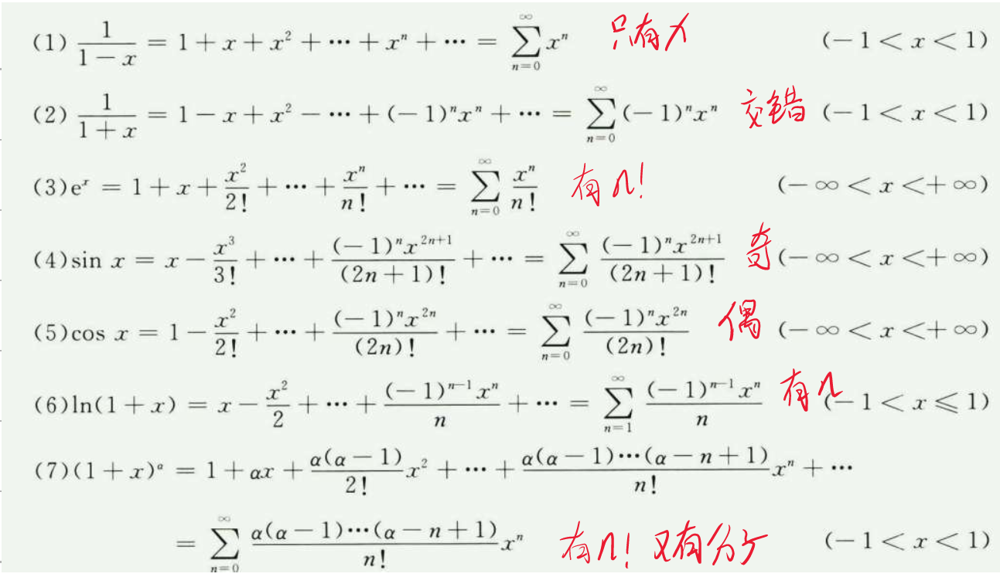

> 第7条是，下面阶乘n个，上面也是n个相乘。

已知公式都是在 $x=0$ 处展开的，若要在 $x=a$ 处展开，构造 $x-a$ ， 令 $t=x-a$，然后在 $t=0$ 处展开。

> 要求展开为幂级数时要记得写上收敛域。
>
> $\sin x, \cos x$ 很少考。要求跳项、交错、阶乘。所以一般见到阶乘都是 $e^x$ 。

#### 求和 ⭐（方浩）

==求和步骤：拆项、次数配齐、级数转函数、补点（配齐时出现分母变量要补 0 点；根据连续性补边界）。== 

##### 母级数

$n$ 在分母。三种类型：

​	无跳项（可以有交错，毕竟是全项了，交错也就是 $-x$ 代入而已）：常用展开是 $-\ln(1-x)$ 这种类型的展开。==注意负号== 
$$
\sum_{n=1}^{\infty}\frac{x^n}{n}=-\ln(1-x)
$$
​	**当遇到奇偶跳项时**，不必求导再算（运算量大），可以这般：（==奇偶跳项常用思想：纯正 和 交错相加减除2==）
$$
\sum_{n=1}^{\infty} \frac{x^{2n-1}}{2n-1}= \frac{1}{2}(\sum_{n=1}^{\infty} \frac{x^{n}}{n}-\sum_{n=1}^{\infty} \frac{(-x)^{n}}{n})=\frac{1}{2}[-\ln(1-x)-(-\ln(1+x))]
$$

​	**当遇到奇偶+交错时** ：用 $\arctan x$ 展开。
$$
\sum_{n=1}^{\infty} (-1)^{n-1}\frac{x^{2n-1}}{2n-1} = \arctan x
$$

​	*偶项的交错，把 $x^2$ 看作一个整体就变为无跳项的情况*

##### 子级数（n=0开始）

$n$ 在分子，三个部分：（一种类型，只是有三个部分要算。）
$$
\sum_{n=0}^{\infty} x^n=\frac{1}{1-x},\sum_{n=0}^{\infty} nx^{n-1}=(\frac{1}{1-x})',\sum_{n=0}^{\infty} n(n-1)x^{n-2}=(\frac{1}{1-x})''\\
\sum_{n=0}^{\infty} (-x)^n=\frac{1}{1+x},\sum_{n=0}^{\infty} n(-x)^{n-1}=-(\frac{1}{1+x})',\sum_{n=0}^{\infty} n(n-1)(-x)^{n-2}=(\frac{1}{1+x})''
$$
由于任何二次多项式 $an^2+bn+c$ 都可以由 $1,n,n(n-1)$ 组成。（==这种思想也很重要==）。如此任何形如
$$
\sum_{n=0}^{\infty} (an^2+bn+c)x^n
$$
的级数都可以拆分组合求解。子母组合形式也是利用这种思想。

> 遇到奇偶跳项也提或取变成上面形式。
>

##### 带阶乘的

也就那三个级数展开。但遇到分母还有东西，就利用子级数处理那种拆分组合思想。

### 傅里叶级数 ——

$f(x)$ 周期为 $2\pi$，且在 $[-\pi,\pi]$ 上可积，有：

$$
\begin{align*}
    f(x) &\sim \frac{a_0}{2} + \sum_{n=1}^{\infty} [a_n \cos nx + b_n \sin nx] \\
    a_n &= \frac{1}{\pi} \int_{-\pi}^{\pi} f(x) \cos nx \mathrm{d}x \\
    b_n &= \frac{1}{\pi} \int_{-\pi}^{\pi} f(x) \sin nx \mathrm{d}x \\
    a_0 &= \frac{1}{\pi} \int_{-\pi}^{\pi} f(x) \ \mathrm{d} x
\end{align*}
$$

狄利克雷收敛定理：周期为 $2\pi$ 的函数 $f(x)$，满足两个条件：

- 在 $[-\pi,\pi]$ 上连续或只有 **有限个第一类间断点**；
- 在 $[-\pi,\pi]$ 上只有**有限个单调区间**。

则 $f(x)$ 的傅里叶级数收敛，且

$$
\frac{a_0}{2} + \sum_{n=1}^{\infty} [a_n \cos nx + b_n \sin nx]=
\begin{cases}
    f(x), & x \text{为连续点,} \\
    \frac{f(x^+)+f(x^-)}{2}, & x \text{为间断点,}\\
    \frac{f((-\pi)^+)+f((\pi)^-)}{2}, & x=\pm \pi
\end{cases}
$$

> 若函数符合这个收敛定理，其在特定周期区间的傅里叶展开就可以直接写了！！！！
>
> **特别注意边界的计算。。。** 

推广到周期为 $2l$ 的函数 $f(x)$，因变量要变成 $\frac{\pi}{l}$ 倍，故用 $\frac{l}{\pi}x$ 代入，即令 $t=\frac{l}{\pi}x,\ x=\frac{\pi}{l}t$ 代入得到周期为 $2\pi$ 的函数 $f(t)$ 。 关键： $x=\frac{\pi}{l}t$ 。

$$
a_n = \frac{1}{l} \int_{-l}^{l} f(t) \cos \frac{n\pi}{l}t \mathrm{d}t \\
b_n = \frac{1}{l} \int_{-l}^{l} f(t) \sin \frac{n\pi}{l}t \mathrm{d}t
$$

注意，如果是在单侧展开比如 $[0,\pi]$，可以认为把函数进行延拓（奇延拓或偶延拓），在进行展开，但此时得到的傅里叶级数是收敛于延拓后的函数的。

> 周期为 $2l$ 就是 $\frac{1}{l}$ 注意了。比如题目说周期为 2 不要写成  $\frac{1}{2}$ 。

## 向量和空间解析几何

> 混合积、点到线面的距离、常见曲面

**数量积和向量积都满足交换律**

### 混合积

$$
(\boldsymbol{abc})= (\boldsymbol{a} \times \boldsymbol{b}) \cdot \boldsymbol{c} =
\begin{vmatrix}
    a_1 & a_2 & a_3 \\
    b_1 & b_2 & b_3 \\
    c_1 & c_2 & c_3
\end{vmatrix}
$$

根据行列式行交换变号的性质，可以得到轮换对称性。

几何意义上其绝对值是 **平行六面体的体积** ，可用来判断 **三向量是否共面** ，同理用来判断空间两直线是否异面。

### 点到线面的距离

$(x_0,y_0,z_0)$ 到平面 $Ax+By+Cz+D=0$ 的距离：

$$
d = \frac{|Ax_0+By_0+Cz_0+D|}{\sqrt{A^2+B^2+C^2}}
$$

$(x_0,y_0,z_0)$ 到直线 $l:[过点(x_1,y_1,z_1),方向向量\vec{s}=(m,n,p)]$ 的距离：（记 $\vec{v}=(x_0-x_1,y_0-y_1,z_0-z_1)$）

$$
d=\frac{|\vec{s}\times\vec{v}|}{|\vec{s}|}\\
d=\sqrt{|\vec{v}|^2- (|\vec{v}|\cdot\cos\theta)^2}=\sqrt{|\vec{v}|^2-(\frac{\vec{s}\cdot\vec{v}}{|\vec{s}|})^2}
$$

> 面积除于底边

### 空间上异面的两直线距离

$$
d=\frac{|(\boldsymbol{s_1s_2}\vec{AB})|}{|\boldsymbol{s_1}\times\boldsymbol{s_2}|}
$$

其中 $s_1,s_2$ 为方向向量，$A,B$ 是分别位于两直线的点。

> 体积除于底面积

+++

空间解析几何常用技巧：确定一条直线后，

- 可利用其方向向量结合**一个待定参数**给出垂直于其的所有平面方程；（自由度为1）
- 经简单的转换结合**两个待定参数**可给出过其的 **平面束** 。

比如求直线在平面 $\pi_3$ 的投影：

直线由 $\pi_1,\pi_2$ 平面所交，则平面过直线的平面束为 $\lambda(\pi_1方程)+\mu(\pi_2方程)=0$ 。当平面与 $\pi_3$ 垂直时，相交直线为所求投影。

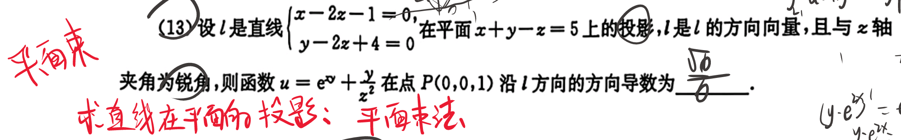

### 曲面投影边界

投影边界本质就是曲面上的某条曲线的投影，而且在该条曲线上的点，曲面在该处的切平面是垂直于要投影的面的。

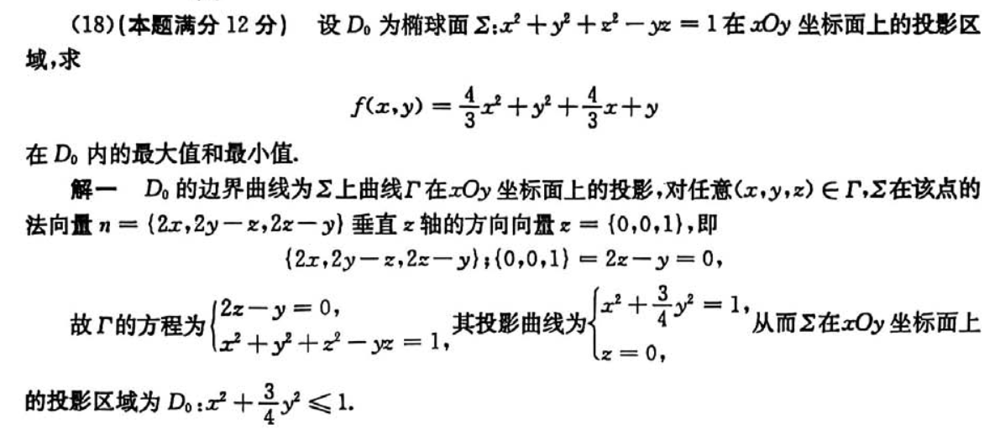

### 几个概念

|        | 空间曲线           | 空间曲面           |
| ------ | ------------------ | ------------------ |
| 切向量 | ==参数方程求导==   | 切平面上的向量     |
| 法向量 | 无；               | 三个偏导           |
| 切平面 | 无；               | 与法向量垂直的平面 |
| 法平面 | 与切向量垂直的平面 | 无；               |

### 常见曲面

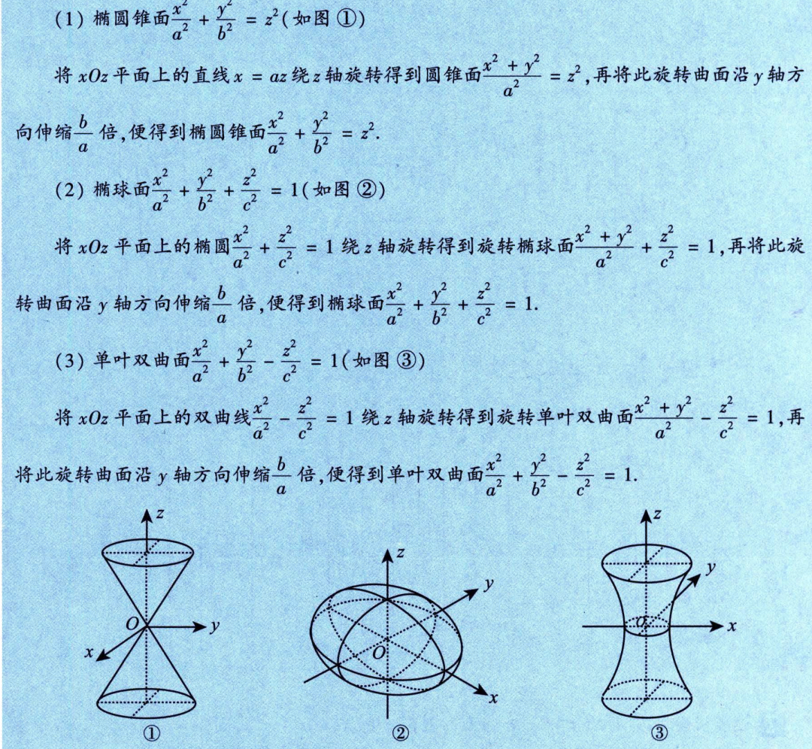

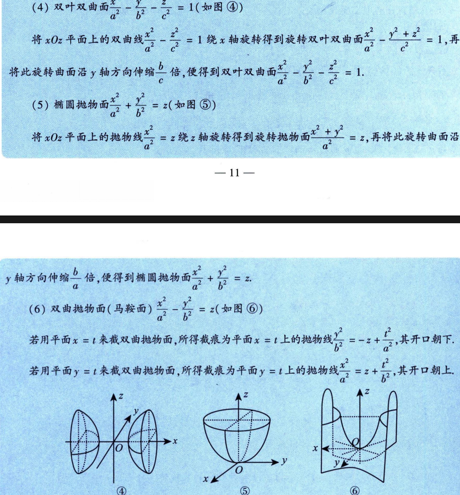

其中特殊的马鞍面还有：

$$
z=xy
$$