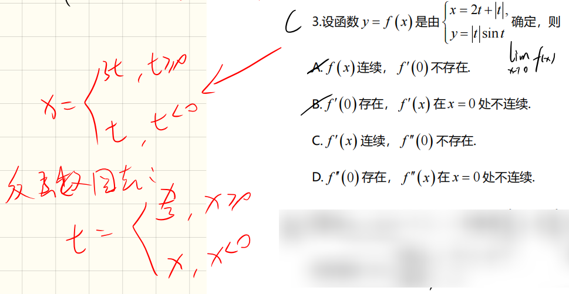
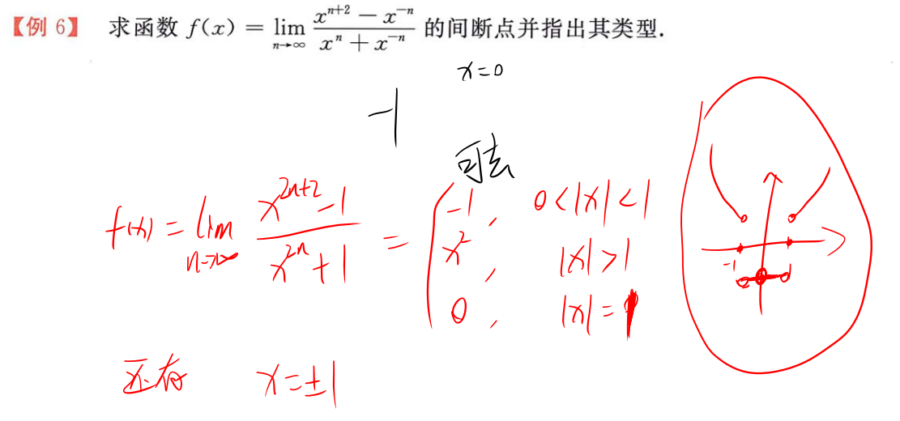
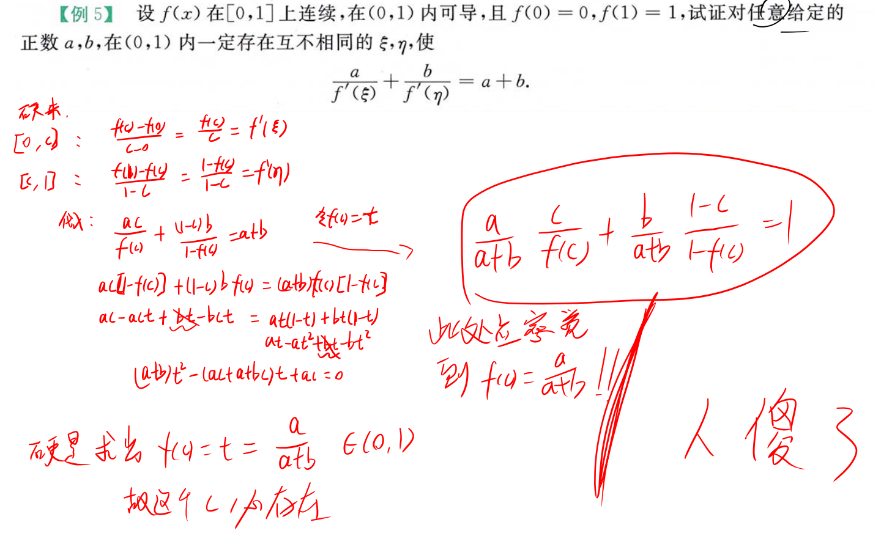
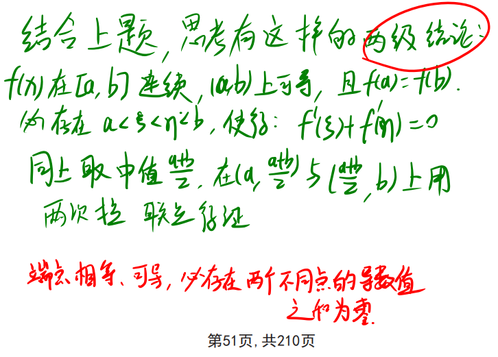
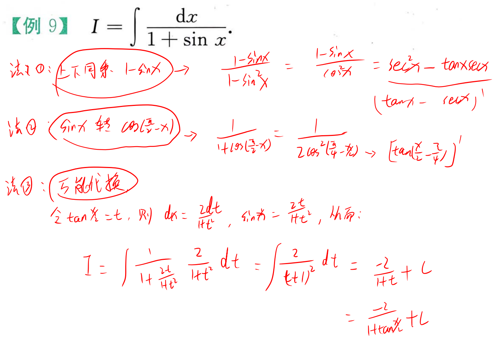
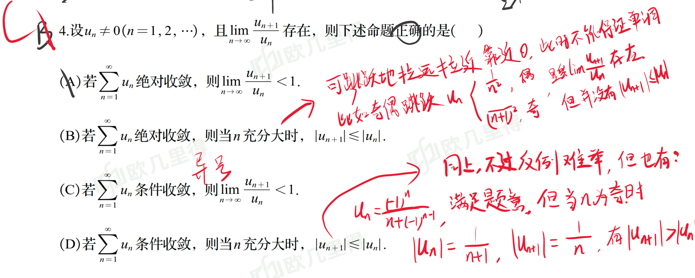
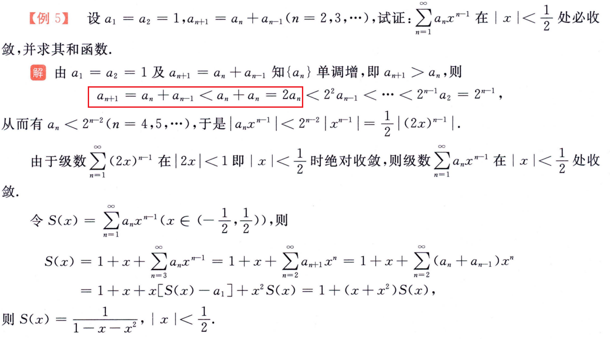
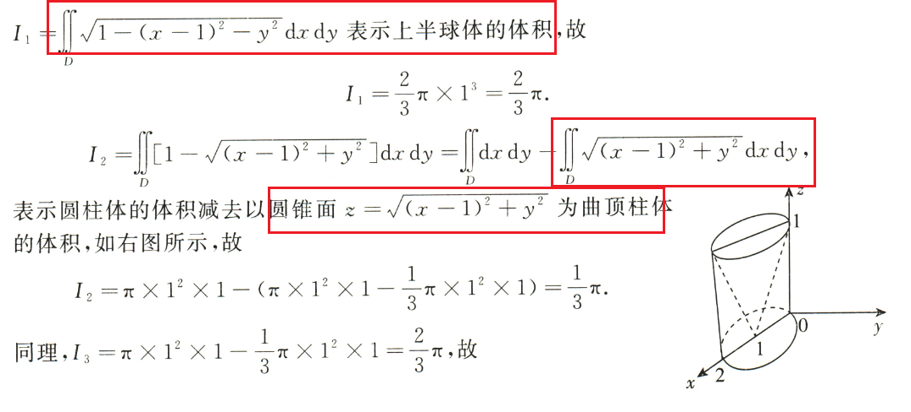

# 极限

$$
\lim_{x\to+\infty}[\ln(1+e^x)-x]=\lim_{x\to+\infty}[\ln(1+e^x)-\ln e^x]=\lim_{x\to+\infty}\ln\frac{1+e^x}{e^x}=0
$$

化成同构

+++

tag: 定积分求极限 放缩

---

tag: 定积分求极限 构造条件

comment: 这构造秀到我了 $\sum_{i=1}^n=\frac{(n+1)n}{2}$ 

---

tag: 放缩 移位相乘

---

tag: 递推数列求极限 利用积分导函数转原函数 数列与级数的等价收敛

---

comment: 直接判断最高次项

---

tag: 等价代换

comment: 拉格朗日中值定理用法不好说

---

特殊数列	==逆否命题逻辑== 

+++

无穷小的使用 和 嵌套极限，要留意是否可以等于零 

+++

洛必达不能用。极限 变 0，或者说是等价无穷小 乘多一个 x 变为 高阶无穷小。

+++

主体最大是 $n^2$ ，分子是变化部分是次量级，分子放缩夹逼；分母部分是同量级，用积分。

+++

泰勒用于渐近线。

+++

==数列证明题，基本方法== 

# 一元微分

看洛必达。

+++

$$
[\arctan(\frac{1-x^2}{1+x^2})]'|_{x=1}=\lim_{x\to 1}\frac{\varphi(x)}{x-1}=\lim_{x\to 1}\frac{-(1+x)}{1+x^2}=-1
$$

有时具体点导数难求，要考虑定义法。

+++

参数方程有时可以直接反代变回原方程。（23年真题）

+++

先求出函数再进一步判断，常见题型。

---

tag: 二级结论 反证法。

在 $[a,a+k],k\in Z^+$ 连续的函数 $f(x)$ ，在该区间上对于任何 $n\in Z^+$ ，都能找到一个满足 $f(x+\frac{1}{n})=f(x)$ 点。

---

tag: 反函数

comment: 反函数的变量不要搞混。

---

tag: 高阶导数

---

tag: 高阶导数

comment: 有一个常用的代换： $1=\sin^2 x+\cos^2 x=(\sin^2 x+\cos^2 x)^2$ 

+++

又是立方和公式。

---

tag: 曲率 曲率圆

comment: 注意曲率圆的位置

---

tag: 罗尔定理

comment: 构造原函数

---

tag: 特殊值结合罗尔定理推论

+++

首先易知，各个区间都有一个驻点，即 3 个。但还要分析原函数的零点是否也是驻点，可以看到高次的零点 2、3、4 也是驻点。故共有 6 个。

---

tag: 构造

+++

---

tag: 构造 要注意连续性 罗尔定理的使用条件

---

要么柯西中值，要么拉格朗日中值；然后两者通过桥梁找出等式。

---

comment: 硬是求出分点，然后用两次拉格朗日中值定理

---

---

特殊分段函数，不是初等函数，有意想不到的性质！！

+++

知道原函数的零点个数可以知道导函数的零点个数下限。

+++

有的东西

+++

常取区间中值进行两边拉格朗日，相加消掉。二级结论。

+++

高中的经典压轴题啊，思想还是没有转过来。（==目标是什么，打算去掉什么因子的影响==） 

+++

拉格朗日中值定理求极限居然也像洛必达一样。拉完不存在不一定真不存在。

+++

# 一元积分

tag: 积分

comment: 关键式： $1+x^3=(1+x)(1-x+x^2)$ ；n 次方差公式。

---

tag: 三角积分：①分母有理化；②去1：（$1=\sin^2 x+\cos^2 x,1=\cos x-2\cos^2\frac{x}{2},...$ ）；③万能代换。

拓展一个：

都化成 $\cos x$ 好处理一些。

---

tag: 广义积分中值定理、或 放缩

---

这两题体现了一种积分的常用思想：==区间再现== 。

---

tag: 放缩

comment: 据题放缩

---

其实就是要对 $\frac{(b-a)^2}{2} = \int_a^b(x-a)\mathrm{d}x$ 敏感。

---

tag: 柯西积分不等式 函数与导函数的关系

comment：平时见不到的柯西积分不等式应用，原来当出现 $f^2(x)$ 时就出现应用场景了。： $f(0)=0,f(x)=\int_0^xf'(t)\mathrm{d}t$ 。

---

tag: 反常积分 敛散性判断，当出现 $\ln x$ 时。

---

tag: 反常积分计算

---

tag: 变量代换 凑积分 ！！！！==重点题== 。基本每家习题册都有类似题目。

---

比较大小，善用常用的函数不等式。

+++

22年真题。

+++

$1-\cos x<\sin x$ 几何上就可以看出。

+++

一个比较有意思的做法

+++

用定积分求极限时要留意区间长度！！！

+++

对介值定理的运用不够熟悉，以后见到闭区间连续这个条件都得留意一下。

+++

拉格朗日中值定理

+++

定积分面积（细粒度） 与  粗粒度面积。桥梁如下：
$$
\int_0^1f(x)\mathrm{d}x=\sum_{k=1}^{n}\int_{\frac{k-1}{n}}^{\frac{k}{n}}f(x)\mathrm{d}x\\
\frac{1}{n}\sum_{k=1}^{n}f(\frac{k}{n})=\sum_{k=1}^{n}\int_{\frac{k-1}{n}}^{\frac{k}{n}}f(\frac{k}{n})\mathrm{d}x
$$

+++

+++

+++

绝对值不要慌，分开讨论一下。

+++

==直观但不知如何表达。== 

# 微分方程

---

障眼法 $f(x+y)$ ，直接把 $y$ 当作 $\Delta x$ 即可。

---

+++

# 多元微分

偏导数连续，判断也是重极限。

---

tag: 更小的可微充分条件，加项减项，极限与无穷小。

---

comment: 对于用观察法得出原函数时要注意。

---

---

==微分求隐函数偏导== 

---

tag: 极限与无穷小

---

tag: 海伦公式 锥形体积 拉格朗日乘数法

+++

当二元函数不可微时，方向导数计算就不能用梯度，只能用定义。

---

---

做法一：旋转椭圆的常规思路。（可惜高中不知道）

做法二：正交变换成正椭圆，直接可看短轴。（正交变换是保持图形形状和大小不变的几何变换，包含旋转，轴对称及上述变换的复合）

+++

+++

偏导数还能看作一元微分。。

# 二重积分

---

全微分要看出来。

---

积分中值定理连接原函数和偏导数；遇到某函数值为0的条件，要对随意添加进去构造 敏感。

---

---

==对于两个函数的乘积积分或积分的乘积，善用二重积分。== 和上一题很像。

这题另法是令 b 作变量构造大函数求导，合到积分里面去也可以看出正负性。

+++

累次积分的奇偶简化。

若是从二重积分的角度也行，留意积分方向！

# 级数

要对可以弄出来的正项级数 敏感。（23年真题）

+++

离散变积分 放大

+++

正次幂函数 大于 对数函数

---

有理化，后面的推进是，它从某项开始单调递减。

---

比值判别法判别绝对收敛时可以进一步判别原级数

---

均值不等式

---

有两项的可以考虑展开

---

利用有界性判断

+++

+++

+++

==转成同一个东西进行运算== 

---

特定的项变化，直接代入。

+++

## 幂级数

又是这条公式。 ==n次方差== 

==20年真题。==

或者是： $R$ 内绝收，则偶次项在 $R$ 内绝收，则偶次项在 $R$ 内收敛；故当偶次项在 $R$ 内发散时，$|r|\ge R$ 。

---

---

幂级数求和

---

系数有时没必要求出来。

## 傅里叶级数

# 空间几何代数

①点乘法；②叉乘法；③平面方程组法

---

判空间直线相交	算空间直线的距离

+++

斜圆柱面，利用到每个点母线的距离恒定来确定方程。

+++

==直线绕轴旋转== 

+++

空间曲线法平面

+++

==二维中常用的几何积分技巧，在三维中的也有！== 应该挺实用的。

# 三重积分和线面积分

①对坐标积分**可以拆**；②坐标积分善用全微分。

+++

三维的变量对称性，其中两个换也行。

+++

==不能用高斯公式的对坐标的面积分：全部统一到简单投影面的二重积分== 三合一公式的本质。

+++

+++

+++

灵活选取面积单元，这样可以不需要投影成平面。

+++

投影旋转面的要注意分前后！！！

+++

将对坐标的曲面积分化成对面积的曲面积分！！！

==不能用高斯公式的对坐标的面积分：全部返回到对面积的面积分== ，这题其实用三合一公式也行。

+++

代数几何。这里根据球面的对称性，直接选取特定点就行。上面写的有点问题。

+++

转动惯量公式

+++

代数几何坐标系建模！！！

+++

多重积分技巧

+++

