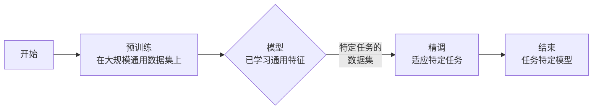

# 深度学习期末复习

> 本文仅为课程复习笔记，针对老师给的复习提纲逐条描述。
>
> 参考教材为：PyTorch深度学习实战：微课视频版/吕云翔
>
> 辅以Chat GPT进行复习。

## 机器学习篇

## 概念篇

什么是MLP、CNN、RNN、BN、RELu、GPT、GAN、VAE?

1. **MLP (多层感知器)**: MLP是一种基础的神经网络结构，由多个层次组成，每个层次包含多个神经元。这些层通常包括一个输入层、若干隐藏层和一个输出层。MLP主要用于分类和回归问题。

2. **CNN (卷积神经网络)**: CNN是一种专门用于处理具有类似网格结构的数据（如图像）的神经网络。它通过卷积层来提取空间特征，广泛应用于图像和视频识别、图像分类、医学图像分析等领域。

3. **RNN (递归神经网络)**: RNN是处理序列数据（如时间序列或自然语言）的神经网络。它能够在序列的不同时间点传递信息，适用于语言建模、文本生成等任务。

4. **BN (批归一化)**: BN是一种用于加速神经网络训练的技术。它通过规范化层的输入来减少内部协变量偏移，通常能够加快训练速度并提高性能。

5. **ReLU (线性整流函数)**: ReLU是一种非线性激活函数，用于神经网络中以增加模型的非线性。它的公式是`f(x) = max(0, x)`，能够加快神经网络的训练速度并提高性能。

6. **GPT (生成式预训练变换器)**: GPT是一种基于Transformer架构的大型语言模型，通过大量文本数据预训练，用于生成文本、翻译、问答等NLP任务。

7. **GAN (生成对抗网络)**: GAN由两部分组成：生成器和判别器。生成器生成数据，判别器评估数据。它们相互竞争，以此提高生成的数据质量。GAN广泛用于图像生成、艺术创作等领域。

8. **VAE (变分自编码器)**: VAE是一种生成模型，能够通过学习输入数据的低维表示（潜在空间）来生成新的数据。VAE常用于图像重构、图像生成等任务。

---

什么是训练集、测试集、验证集？这些数据集的作用和关系？

定义和作用：

1. **训练集 (Training Set)**: 用于训练模型的数据集。在这个阶段，模型尝试学习并理解数据，调整其参数（如神经网络中的权重和偏差），以便能够准确地预测或分类。训练集通常占总数据集的较大比例（例如70%）。

2. **测试集 (Test Set)**: 在模型训练完成后用来评估模型性能的数据集。它不参与训练过程。通过在测试集上评估模型，可以了解模型在处理未见过的数据时的性能，这有助于评估模型的泛化能力。测试集通常占总数据集的一小部分（例如15%或20%）。

3. **验证集 (Validation Set)**: 验证集用于在训练过程中调整模型的超参数（如学习率或网络结构）。验证集提供了一种在不触碰测试集的情况下评估模型性能的方法。它有助于监控和避免过拟合，即确保模型不仅仅对训练数据过度优化，而是能够泛化到新的数据上。在数据集划分中，验证集通常也占一小部分（例如15%或10%）。

这三个数据集的关系如下：

- **训练集用于学习**：模型在这里学习数据的特征和模式。
- **验证集用于调整**：在这里，模型的配置（超参数）可以根据其在验证集上的表现进行调整。
- **测试集用于最终评估**：模型的最终效果在测试集上评估，以确保它在未知数据上的表现。

这种划分确保了模型在整个训练和评估过程中可以公平、有效地被调整和测试，同时避免了过拟合的问题。

---

简述生成（generative）模型与判别（discriminative）模型的区别和应用特性

1. **生成模型 (Generative Models)**:
   - **定义**: 生成模型是试图学习数据的**联合概率分布** $P(X, Y)$，即数据和标签的共同分布。通过这种方式，它们能够生成或模拟符合训练数据特征的新数据。
   - **核心特性**: 能够**生成新数据实例**，如新图像、新文本等。
   - **应用实例**: GAN（生成对抗网络）、VAE（变分自编码器）等。这些模型广泛应用于图像生成、语音合成、数据增强等领域。
   - **优势**: 有助于更深入地理解数据的结构。
   - **劣势**: 相比于判别模型，生成模型往往计算复杂度更高。

2. **判别模型 (Discriminative Models)**:
   - **定义**: 判别模型致力于学习**条件概率分布** $P(Y|X)$，即给定输入数据时标签的概率分布。它们关注于区分不同的数据类别。
   - **核心特性**: 专注于**区分不同类别**，而不是生成新数据。
   - **应用实例**: SVM（支持向量机）、决策树、大多数神经网络等。这些模型被用于分类、回归等任务。
   - **优势**: 通常训练速度更快，计算效率更高。
   - **劣势**: 不具备生成新数据的能力。

总结：
- **生成模型**：理解和模仿数据分布，能生成新数据。
- **判别模型**：专注于区分不同类别，适用于分类和回归任务。

---

比较基本MLP、CNN、RNN模型的应用特性（功能、结构、计算和应用特点）

1. **MLP (多层感知器)**
   - **功能**: 用于分类和回归任务，适合处理**不涉及时间依赖或空间依赖**的数据。
   - **结构**: 由多个完全连接的层组成。每一层包含一定数量的神经元，每个神经元与前一层的所有神经元相连。
   - **计算特点**: 由于层与层之间是完全连接的，所以计算量较大，尤其是当网络和输入数据较大时。
   - **应用特点**: 由于缺乏对空间或时间结构的处理能力，MLP在图像识别或时间序列数据上的表现不如CNN或RNN。

2. **CNN (卷积神经网络)**
   - **功能**: 专门用于处理**具有空间关联**的数据，如图像和视频。
   - **结构**: 包含卷积层、池化层和全连接层。**卷积层用于提取空间特征，池化层用于降低特征维度。**
   - **计算特点**: 卷积运算比完全连接的网络更高效，因为它减少了参数的数量。
   - **应用特点**: 在图像识别、图像分割、视频分析等领域表现出色。

3. **RNN (递归神经网络)**
   - **功能**: 专门用于处理**具有时间序列关联**的数据，如语音、文本或任何时间序列数据。
   - **结构**: 其核心是一个循环单元，能够将前一个时间点的输出作为当前时间点的输入的一部分。
   - **计算特点**: 虽然能够处理时间序列数据，但由于梯度消失或爆炸的问题，RNN在长序列上的性能有限。
   - **应用特点**: 在自然语言处理、语音识别、时间序列分析等领域表现良好。

总结：
- **MLP**：适用于基本的分类和回归任务，但在处理复杂的空间或时间数据时有局限性。
- **CNN**：在处理空间数据（如图像和视频）时效果显著，因其能够有效地提取空间特征。
- **RNN**：适合处理时间序列数据，尤其是在需要理解数据中时间依赖性的场景中。

---

什么是模型的预训练（pre-training）和精调（fine-tuning）？

预训练 (Pre-training)
- **定义**: 在预训练阶段，模型在一个大规模的数据集上进行训练，这个数据集通常是通用的并且不针对特定任务。这个阶段的目的是让模型学习到一些通用的特征或模式。
- **目的**: 使模型能够捕捉到基本的、通用的数据特征，为后续的特定任务学习打下基础。
- **例子**: 在自然语言处理中，一个模型可能在包含广泛话题和风格的文本上进行预训练，以学习语言的基本结构和词义。

精调 (Fine-tuning)
- **定义**: 在精调阶段，预训练的模型被进一步训练在一个更小、更专注于特定任务的数据集上。这个阶段调整模型以适应特定的应用或需求。
- **目的**: 通过在特定任务的数据上训练，使模型更好地理解和执行这个特定任务。
- **例子**: 在自然语言处理中，一个预训练的模型可能在特定领域的数据集（如医学文献）上进行精调，以执行诸如疾病名称识别等特定任务。

为更好地说明这两个过程，我将创建一个简单的流程图来展示预训练和精调的关系：

在这个流程中，可以看到预训练为精调阶段提供了基础，而精调则使模型能够专注于并优化针对特定任务的表现。

---

简述欠拟合和过拟合现象，说明过拟合的原因及改善措施。

**欠拟合 (Underfitting)**:
- **现象**：模型在训练数据上表现不佳，无法捕捉到数据的基本关系，导致在训练集和测试集上都有较差的性能。
- **原因**：通常是因为模型过于简单，缺乏足够的参数或深度来学习数据的复杂性。

**过拟合 (Overfitting)**:
- **现象**：模型在训练数据上表现很好，但在新的、未见过的数据上表现不佳。这表明模型过度学习了训练数据的特性，包括噪声和异常值，而没有学习到数据的普遍规律。
- **原因**：
  - **数据量不足**：模型没有足够的数据来泛化新情况。
  - **模型过于复杂**：模型有太多的参数，使其容易捕捉到训练数据中的随机噪声。
  - **训练时间过长**：过度训练使模型过度适应训练数据。

**过拟合的改善措施**:
1. **增加数据量**：更多的训练数据可以帮助模型更好地泛化。
2. **数据增强**：在现有数据上应用变换（如旋转、缩放图像）以提供更多的训练样本。
3. **简化模型**：减少模型的复杂性，例如减少层的数量或每层的神经元数量。
4. **正则化**：例如L1或L2正则化，这些技术惩罚模型的复杂性。
5. **早期停止**：在验证集上的性能不再提高时停止训练。
6. **交叉验证**：使用不同的数据子集来训练和验证模型，以确保模型的稳定性和泛化能力。
7. **Dropout**：在训练过程中随机“丢弃”神经网络中的一部分神经元，以防止模型对特定的数据特征过度依赖。

通过这些方法，可以帮助模型在学习数据的同时保持其泛化能力，从而在新数据上表现更好。

---

常用优化算法

1. **梯度下降法**：最常用的优化算法之一，通过迭代的方式，沿着梯度下降的方向更新模型参数，逐渐逼近最小化损失函数的目标。

2. **牛顿法**：使用二阶导数信息来优化目标函数，通常比梯度下降法收敛速度更快，但计算成本更高。

3. **Momentum**：在梯度下降的基础上增加了动量概念，通过考虑前一步的更新方向来加速学习，并减少震荡。

4. **Nesterov Momentum**：是Momentum的一个变体，它在更新参数之前先计算未来位置的梯度，通常能够加速训练。

5. **Adagrad**：自适应地调整每个参数的学习率，适合处理稀疏数据。

6. **Adam**：结合了Momentum和Adagrad的优点，通过计算梯度的一阶矩估计和二阶矩估计来更新学习率。

选择合适的算法可以显著提高模型训练的效率和效果。

---

什么是超参数？列举3~5个常用的超参数，简述超参数设置的方法

超参数是指在开始学习过程之前设置的参数，与模型训练过程中学习的参数不同。超参数的设置直接影响模型的行为和性能。常用的超参数包括：

1. **学习率**：决定模型参数在每次迭代中更新的幅度。
2. **批大小（Batch Size）**：训练过程中一次性使用的样本数量。
3. **迭代次数（Epochs）**：完整训练数据集被遍历的次数。
4. **网络层数和神经元数目**：决定神经网络的深度和宽度。
5. **正则化参数**：如L1、L2正则化，用于防止模型过拟合。

超参数的设置通常依赖于试验和错误方法，可以通过网格搜索（Grid Search）、随机搜索（Random Search）或使用基于贝叶斯优化的自动化方法进行。有效的超参数调整是实现模型最佳性能的关键。

---

什么是梯度下降算法？简述梯度爆炸和梯度弥散现象及改善措施。

梯度下降算法是一种用于优化机器学习模型的方法，通过迭代的方式调整参数以最小化损失函数。该算法在每次迭代中沿着梯度下降的方向更新参数。

梯度爆炸和梯度消散是梯度下降过程中的两个常见问题：

1. **梯度爆炸**：梯度变得非常大，导致数值计算不稳定。解决办法包括使用梯度裁剪（限制梯度的大小）和选择更稳定的网络结构。

2. **梯度消散**：梯度变得非常小，使得权重更新缓慢，尤其是在深层网络中。改善措施包括使用ReLU等激活函数，合理初始化权重，以及使用残差连接等网络结构。

## 模型篇

### MLP

在一个多层感知器（MLP）模型中，输入数据首先通过多个隐藏层进行处理。每个隐藏层由一组神经元组成，神经元之间不相连，但与上下层的所有神经元相连。每个神经元的输出是其输入的加权和，通过一个激活函数（如ReLU或Sigmoid）处理。输出层将最后一个隐藏层的输出转换为最终的预测结果。

在**训练过程**中，MLP使用反向传播算法和梯度下降（或其变种）来更新网络的权重。这个过程涉及在给定训练数据集上计算预测结果与实际结果的误差，然后将误差反向传播回网络，以逐步调整权重，从而最小化误差。

在**推理过程**中，训练好的模型用于新的、未见过的数据。数据通过模型的各层进行前向传播，最终输出预测结果，此时模型的权重不再更新。

---

### CNN

假设我们有一个小型CNN来处理28x28像素的手写数字识别（比如MNIST数据集）。该网络可能包含以下层：

1. **第一个卷积层**：设有8个过滤器，每个大小为3x3。这个层会产生8个28x28的特征图。（填充为1，步幅为1）
2. **第一个池化层**：使用2x2的最大池化，将特征图的尺寸减半至14x14。
3. **第二个卷积层**：设有16个过滤器，每个大小为3x3。此层产生16个14x14的特征图。（填充为1，步幅为1）
4. **第二个池化层**：再次使用2x2的最大池化，将特征图的尺寸减半至7x7。
5. **全连接层**：将特征图展平为一维向量，并连接到一个有128个神经元的全连接层。
6. **输出层**：最后连接到一个有10个神经元的输出层（对应10个数字类别），通常使用softmax激活函数。

在一个卷积神经网络（CNN）中，卷积层可以不减小特征图的尺寸，这取决于卷积的步长（stride）和填充（padding）的设置：

1. **步长**：步长是卷积核在输入特征图上滑动的间隔。

2. **填充**：为了保持特征图的空间尺寸，可以在输入特征图的边缘添加额外的**零填充**。这种做法称为“same padding”，它允许卷积层在保持空间尺寸不变的情况下应用卷积核。

