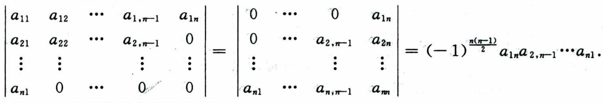
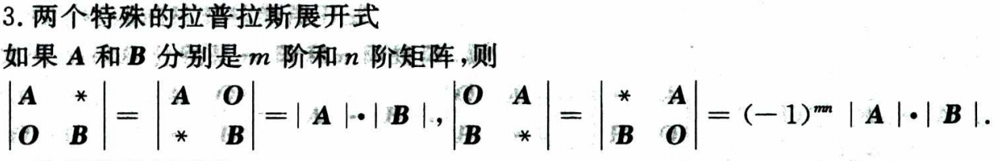
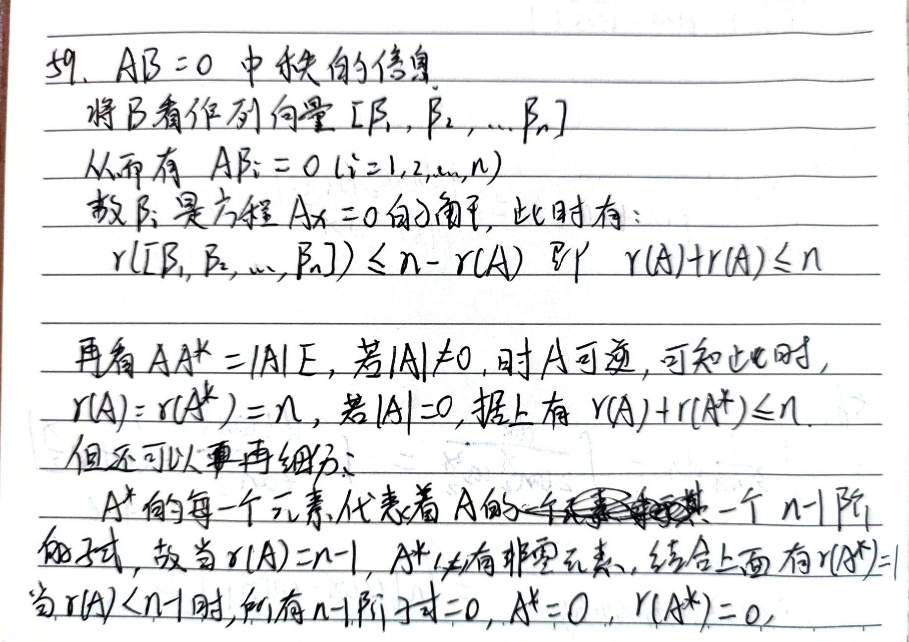
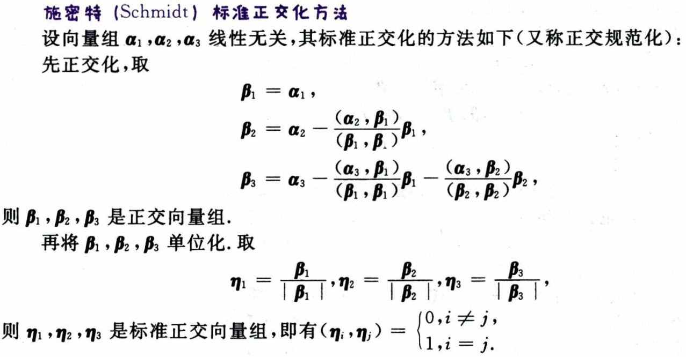
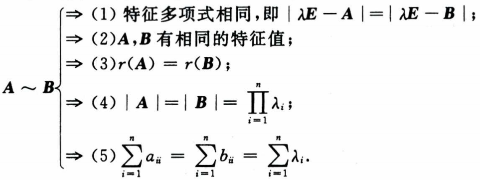
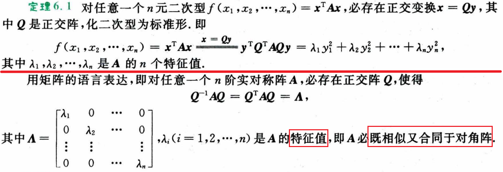
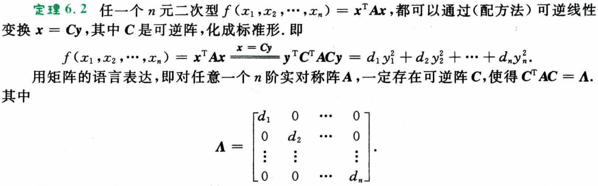

# 行列式

一个排列中，一个大数排在一个小数，这两个数构成一个 **逆序** 。一个排序的 **逆序总数** 就是这个排列的 **逆序数** ，记 $\tau(j_1,j_2,\cdots,j_n)$ 为排列 $j_1,j_2,\cdots,j_n$ 的逆序数。该数为偶数的排列称为 **偶排列** ，为奇数的称为 **奇排列** 。

行列式的值就是所有不同行不同列的元素的乘积的代数和。即每一行（列）都要选上 $(1,2,\cdot,n)$，列（行）下标自由排列 $(j_1,j_2,\cdots,j_n)$ 得到所有可能的乘积，然后加起来。系数为 $(-1)^{\tau(j_1,j_2,\cdots,j_n)}$ 。

## 性质

- 转置，行列式值不变
- 行（列）互换，行列式值**变号**
- 某行（列）有公因子可以提出来（注意是一行一个，多行提多个）
- 把某行（列）的 k 倍加到另一行（列）上，行列式值不变。（行倍加） 
$$
\begin{vmatrix}
    a_1+c_1 & a_2+c_2 \\
    b_1 & b_2
\end{vmatrix}
=
\begin{vmatrix}
    a_1 & a_2 \\
    b_1 & b_2
\end{vmatrix}
+
\begin{vmatrix}
    c_1 & c_2 \\
    b_1 & b_2
\end{vmatrix}
$$

> 按行展开可以看出来，这个性质是成立的。

## 展开公式

分清 **余子式** 和 **代数余子式** 。代数余子式是余子式乘以 $(-1)^{i+j}$ ，其中 $i,j$ 是元素的下标。

**行列式的任一行（列）元素与另一行（列）元素的代数余子式乘积之和等于零。**

> 本行的代数余子式只有与本行元素相乘才等于行列式的值，与其他行元素相乘都等于零。想想伴随矩阵。

 

副对角线行列式

类似冒泡排序，把最后一行向上逐步交换至第一行，需要 n-1 次交换，然后原来倒数第二行成为了最后一行，同样的方法换到第2行，需要 n-2 次交换，以此类推，共需要 $\sum_{i=1}^{n-1}i=\frac{n(n-1)}{2}$ 次交换（变多少次号）。最后变成主对角线行列式。

 

两个特殊的拉普拉斯展开式

前者记忆（广义展开），后者同上面一样证明，依次交换变成前者。

## 克莱默法则 Cramer

对非齐次线性方程组用向量表示，即 $\boldsymbol{A}\boldsymbol{x}=\boldsymbol{b}$ ，其中 $\boldsymbol{A}=(\boldsymbol{a}_1,\boldsymbol{a}_2,\cdots,\boldsymbol{a}_n)$ ，$\boldsymbol{a}_i$ 是系数矩阵的第 i 列，$\boldsymbol{x}=(x_1,x_2,\cdots,x_n)^T$ 是未知数向量，$\boldsymbol{b}$ 是常数向量。

有 $\boldsymbol{b}=x_1\boldsymbol{a}_1+x_2\boldsymbol{a}_2+\cdots+x_n\boldsymbol{a}_n=\sum_{i=1}^{n}x_i\boldsymbol{a}_i$ ，即 $\boldsymbol{b}$ 是 $\boldsymbol{a}_i$ 的线性组合。若用 $\boldsymbol{A}_j$ 表示把 $\boldsymbol{b}$ 替换到 $\boldsymbol{a}_j$ 的位置得到的矩阵，即 $\boldsymbol{A}_i=(\boldsymbol{a}_1,\cdots,\boldsymbol{a}_{j-1},\sum_{i=1}^{n}x_i\boldsymbol{a}_i,\cdots,\boldsymbol{a}_n)$ 。根据行列式列倍加值不变的性质，有 $|\boldsymbol{A}_j|=(\boldsymbol{a}_1,\cdots,\boldsymbol{a}_{j-1},x_j\boldsymbol{a}_j,\cdots,\boldsymbol{a}_n)=x_j|\boldsymbol{A}|$ 。故当 $|\boldsymbol{A}|\neq 0$ 时，有

$$
x_j=\frac{|\boldsymbol{A}_j|}{|\boldsymbol{A}|}
$$

根据 $|\boldsymbol{A}_j|=(\boldsymbol{a}_1,\cdots,\boldsymbol{a}_{j-1},x_j\boldsymbol{a}_j,\cdots,\boldsymbol{a}_n)=x_j|\boldsymbol{A}|$ 对方程组的解有以下判断：

$$
\begin{cases}
    唯一解, & |\boldsymbol{A}|\neq 0 \\
    无解, & |\boldsymbol{A}|=0, \exist\ |\boldsymbol{A}_j|\neq 0 \\
    无穷多解, & |\boldsymbol{A}|=0, \forall\ |\boldsymbol{A}_j|=0
\end{cases}
$$

> 特别地，对于 $\boldsymbol{A}\boldsymbol{x}=\boldsymbol{0}$，显然 $\boldsymbol{x}=\boldsymbol{0}$ 是一个解且 $\forall\ |\boldsymbol{A}_j|=0$。故若 $|\boldsymbol{A}|\neq 0$ 则方程仅有零解，若 $|\boldsymbol{A}|=0$ 则有无穷多解。产生两个充要关系：
> - $\boldsymbol{A}\boldsymbol{x}=\boldsymbol{0}$ 有非零解 $\Leftrightarrow |\boldsymbol{A}|=0$ 
> - $\boldsymbol{A}\boldsymbol{x}=\boldsymbol{0}$ 仅有零解 $\Leftrightarrow |\boldsymbol{A}|\neq 0$。

# 矩阵

**没有交换律和消去律。** 但有结合律和分配律。即 $(\boldsymbol{A}\boldsymbol{B})\boldsymbol{C}=\boldsymbol{A}(\boldsymbol{B}\boldsymbol{C})$ 。

- 单位阵 $\boldsymbol{E}$
- 数量阵 $k\boldsymbol{E}$
- 对角阵，$\forall i\neq j,a_{ij}=0$， 记 $\mathit{\Lambda}=\text{diag}[a_{11},a_{22},\cdots,a_{nn}]$
- 反对称阵，$a_{ij}=-a_{ji},a_{ii}=0$ 即 $\boldsymbol{A}^T=-\boldsymbol{A}$

## 可逆矩阵和伴随矩阵

对于矩阵方程 $\boldsymbol{A}\boldsymbol{B}=\boldsymbol{E}$，向量表示，即 $\boldsymbol{A}=(\boldsymbol{a}_1,\boldsymbol{a}_2,\cdots,\boldsymbol{a}_n), \boldsymbol{B}=(\boldsymbol{b}_1,\boldsymbol{b}_2,\cdots,\boldsymbol{b}_n)$，记 $\boldsymbol{e}_i$ 为第 $i$ 维为 1 的单位向量，则矩阵方程一个方程组 $\boldsymbol{A}\boldsymbol{b}_i=\boldsymbol{e}_i, i=1,2,\cdots,n$ 。根据克莱默法则有：

$$
\boldsymbol{b}_{ij}=\frac{|\boldsymbol{A}_j|}{|\boldsymbol{A}|}
$$

其中 $\boldsymbol{A}_j=(\boldsymbol{a}_1,\cdots,\boldsymbol{a}_{j-1},\boldsymbol{e}_i,\cdots,\boldsymbol{a}_n)$ 。计算 $|\boldsymbol{A}_j|$ 时对第 $j$ 列 $\boldsymbol{e}_i$ 进行展开，恰好得到 $\boldsymbol{A}$ 的在 $i$ 行 $j$ 列处代数余子式（其他都为 0），记 $A_{ij}$ 。 再由 $\boldsymbol{b}_{ij}=(\boldsymbol{B})_{ji}$ ，（这里的下标是反的，因为是列向量）
即

$$
(\boldsymbol{B})_{ji}=\frac{1}{|\boldsymbol{A}|}A_{ij}\\
\rArr (\boldsymbol{B})_{ij}=\frac{1}{|\boldsymbol{A}|}A_{ji}
$$

构造矩阵 $\boldsymbol{A}^*,\ (\boldsymbol{A}^*)_{ij}=A_{ji}$，有 

$$
\boldsymbol{B}=\frac{1}{|\boldsymbol{A}|}\boldsymbol{A}^*
$$ 

> 根据推导过程知道 $\boldsymbol{A}^*$ 当中的元素是 $\boldsymbol{A}$ 在该位置的转置位置的代数余子式。即 $\boldsymbol{A}^*$ 的 **第 $i$ 行** 是 $\boldsymbol{A}$ 的 **第 $i$ 列** 的代数余子式； **第 $j$ 列** 是 $\boldsymbol{A}$ 的 **第 $j$ 行** 的代数余子式。
>
> 从这里可以看出，本行的代数余子式只有与本行元素相乘才等于行列式的值，与其他行元素相乘都等于零。因为两者相乘 $\boldsymbol{A}\boldsymbol{A}^*=|\boldsymbol{A}|\boldsymbol{E}$ 是一个对角阵，仅对角线上有非零元素。

以上：

- 称 $\boldsymbol{B}$ 为 $\boldsymbol{A}$ 的 **逆矩阵** ，记 $\boldsymbol{A}^{-1}$ 。
- 记 $\boldsymbol{A}^*$ 为 $\boldsymbol{A}$ 的 **伴随矩阵** 。

> 上述方程是可逆的定义，故若 $\boldsymbol{A}$ 可逆，则方程成立，两边求行列式可知 $|\boldsymbol{A}| \neq 0$ ；而当 $|\boldsymbol{A}| \neq 0$ 时，$\boldsymbol{B}$ 存在且唯一，故 $\boldsymbol{A}$ 可逆。即 $\boldsymbol{A}$ 可逆 $\Leftrightarrow |\boldsymbol{A}| \neq 0$ 是充要条件。
>
> 由伴随矩阵的定义可知 $\boldsymbol{A}^*\boldsymbol{A}=\boldsymbol{A}\boldsymbol{A}^*$，即 $\boldsymbol{A}\boldsymbol{B}=\boldsymbol{B}\boldsymbol{A}=\boldsymbol{E}$
>
> 某矩阵的逆矩阵就是其伴随矩阵除以行列式。所以一切的逆矩阵运算性质都可从伴随矩阵的性质推导出来。

## 初等变换、初等矩阵

- 矩阵进行 **倍乘、互换、倍加** 的行（列）变换，统称为 **初等变换** 。
- 单位矩阵进行一次初等变换得到的矩阵称为 **初等矩阵** 。

初等矩阵

 

> 三大初等变化均是可以经由矩阵乘法实现且可逆的。即三大初等矩阵均可逆。
>
> 初等矩阵转置后仍为初等矩阵，初等矩阵的逆矩阵仍为初等矩阵。

**用初等矩阵左乘是进行行变换，右乘是进行列变换。** （左行右列）

矩阵 $\boldsymbol{A}$ 经过有限次初等变换得到矩阵 $\boldsymbol{B}$，则称 $\boldsymbol{A}$ 和 $\boldsymbol{B}$ **等价** ，记为 $\boldsymbol{A}\cong\boldsymbol{B}$ 。若 $\boldsymbol{A}\cong\begin{bmatrix}\boldsymbol{E}_r & \boldsymbol{O} \\ \boldsymbol{O} & \boldsymbol{O}\end{bmatrix}$，称后者矩阵为 $\boldsymbol{A}$ 的 **等价标准形** 。

显然若矩阵 $\boldsymbol{A}$ 经过一系列行变换 $\boldsymbol{P}_1,\boldsymbol{P}_2,\cdots,\boldsymbol{P}_n$ 变成单位阵，即 $\boldsymbol{P}_n\cdots\boldsymbol{P}_2\boldsymbol{P}_1\boldsymbol{A}=\boldsymbol{E}$ ，则 $\boldsymbol{A}$ 可逆，且 $\boldsymbol{A}^{-1}=\boldsymbol{P}_n\cdots\boldsymbol{P}_2\boldsymbol{P}_1$ 。

- 行阶梯矩阵，0行在底部，非零行主元的列指标随行指标 **严格** 递增。
- 行最简形矩阵，行阶梯矩阵的主元都为 1，且主元所在列的其他元素都为 0。

方阵的行列式 $|\boldsymbol{A}\boldsymbol{B}|=|\boldsymbol{A}||\boldsymbol{B}|$ 。

# 向量

- **部分组**是向量数量减少；**延伸组**和**缩短组**是组里每个向量维度变化。
- 任何 $n+1$ 个 $n$ 维向量必线性相关。（反证法）
- 若某线性无关向量组加入了向量 $\boldsymbol{\beta}$ 后线性相关，则 $\boldsymbol{\beta}$ 可由其他向量 **唯一** 线性表示。（唯一解，克莱默法则）
- $m$ 线性无关向量组最多线性表示出 $m$ 个线性无关向量。

## 秩

### 向量组的秩

但对于某向量组 $\boldsymbol{\alpha}_1,\boldsymbol{\alpha}_2,\cdots,\boldsymbol{\alpha}_n$ ，在其所有线性无关部分组中，向量数最多的称为 **极大线性无关向量组**，其向量数为向量组的 **秩**，记 $r(\boldsymbol{\alpha}_1,\boldsymbol{\alpha}_2,\cdots,\boldsymbol{\alpha}_n)$ 。 

两个向量组可以相互线性表出，则称它们等价，用符号 $\cong$ 表示。

显然，若 $\boldsymbol{\alpha}_1,\boldsymbol{\alpha}_2,\cdots,\boldsymbol{\alpha}_n$ 可以线性表出 $\boldsymbol{\beta}_1,\boldsymbol{\beta}_2,\cdots,\boldsymbol{\beta}_m$ ，则 $r(\boldsymbol{\alpha}_1,\boldsymbol{\alpha}_2,\cdots,\boldsymbol{\alpha}_n)\leq r(\boldsymbol{\beta}_1,\boldsymbol{\beta}_2,\cdots,\boldsymbol{\beta}_m)$ 。若它们等价则 $r(\boldsymbol{\alpha}_1,\boldsymbol{\alpha}_2,\cdots,\boldsymbol{\alpha}_n)=r(\boldsymbol{\beta}_1,\boldsymbol{\beta}_2,\cdots,\boldsymbol{\beta}_m)$ 。

### 矩阵的秩

矩阵 $\boldsymbol{A}$ 的所有 **非零子式** 的最高阶数称为矩阵的 **秩**，记为 $r(\boldsymbol{A})$ 。

> - $k$ 阶子式：任取矩阵 $\boldsymbol{A}$ 的 $k$ 行 $k$ 列，得到的行列式。
> - $k$ 阶主子式：行列选取的下标相同。
> - $k$ 阶顺序主子式：规定是前 $k$ 行 $k$ 列。

**矩阵秩的公式**

1. $r(\boldsymbol{A}^T\boldsymbol{A})=r(\boldsymbol{A})$ 
2. $r(\boldsymbol{A}+\boldsymbol{B})\leq r(\boldsymbol{A})+r(\boldsymbol{B})$
3. $r(\boldsymbol{A}\boldsymbol{B})\leq \min\{r(\boldsymbol{A}),r(\boldsymbol{B})\}$
4. $\max\{r(\boldsymbol{A}),r(\boldsymbol{B})\}\leq r([\boldsymbol{A}|\boldsymbol{B}])\leq r(\boldsymbol{A})+r(\boldsymbol{B})$——显然
5. 若 $\boldsymbol{A}$ 可逆，则 $r(\boldsymbol{A}\boldsymbol{B})=r(\boldsymbol{B}\boldsymbol{A})=r(\boldsymbol{B})$
6. 若 $\boldsymbol{A}$ 是 $m\times n$ 矩阵，$\boldsymbol{B}$ 是 $n\times s$ 矩阵且 $\boldsymbol{A}\boldsymbol{B}=\boldsymbol{0}$，则 $r(\boldsymbol{A})+r(\boldsymbol{B})\leq n$
7. 分块矩阵 $r(\begin{bmatrix}\boldsymbol{A} & \boldsymbol{0} \\ \boldsymbol{0} & \boldsymbol{B}\end{bmatrix})=r(\boldsymbol{A})+r(\boldsymbol{B})$——显然
8. 伴随矩阵 $r(\boldsymbol{A}^*)=\begin{cases} n, & r(\boldsymbol{A})=n \\ 1, & r(\boldsymbol{A})=n-1 \\ 0, & r(\boldsymbol{A})<n-1 \end{cases}$

<!-- todo 各公式理解记忆 或证明 -->

公式6和8

矩阵的秩 等于 其行向量组的秩，也等于 其列向量组的秩。三秩相等。

> 秩的含义是该向量组所能线性表示的维度。矩阵的子式对于的向量其实就是它行列向量组的一个 **部分缩短组**，极大化这个组用以表示矩阵的秩。

## 正交

内积是一个 **数值**，所以应该是 **行 · 列**。

**施密特正交化** Schmidt

施密特正交化

<!-- todo -->
 

**正交矩阵**

若 $n$ 阶**方阵**满足： $\boldsymbol{A}\boldsymbol{A}^T=\boldsymbol{A}^T\boldsymbol{A}=\boldsymbol{E}$，则称 $\boldsymbol{A}$ 为 **正交矩阵**。显然 $\boldsymbol{A}$ 的行（列）向量之间两两正交，且为单位向量。$\boldsymbol{A}^{-1}=\boldsymbol{A}^T$

> 如果行向量之间两两正交，那么列向量之间也两两正交吗？ <!-- todo -->

# 线性方程组

- 齐次方程组 $\boldsymbol{A}_{m\times n}\boldsymbol{x}=\boldsymbol{0}$ 有非零解 $\Lrarr$ $r(\boldsymbol{A})<n$ 。<!-- todo -->
- 齐次方程组系数矩阵的秩 $r(\boldsymbol{A})=r<n$ 时，方程组有 $n-r$ 个线性无关的解，且它们可以构成一个基础解系。<!-- todo -->
- $\boldsymbol{Ax}=\boldsymbol{b}$ 有解 $\Lrarr$ $r(\boldsymbol{A})=r(\boldsymbol{A}|\boldsymbol{b})$ 。
- $\boldsymbol{Ax}=\boldsymbol{b}$ 无解 $\Lrarr$ $r(\boldsymbol{A})+1=r(\boldsymbol{A}|\boldsymbol{b})$ 。

# 特征值和特征向量

对于方阵 $\boldsymbol{A}$ ，若存在数 $\lambda$ 和 **非零向量** $\boldsymbol{\alpha}$ 使得 

$$
\boldsymbol{A\alpha}=\lambda\boldsymbol{\alpha}
$$

成立，则称 $\lambda$ 为 $\boldsymbol{A}$ 的 **特征值** ，$\boldsymbol{\alpha}$ 为 $\boldsymbol{A}$ 的 **特征向量** 。

特征方程：

$$
|\lambda\boldsymbol{E}-\boldsymbol{A}|=0
$$

> $n$ 阶方阵就有 $n$ 个特征值，但不一定有 $n$ 个线性无关的特征向量。

- 不同特征值对应的特征向量线性无关。<!-- todo -->
- $\sum\lambda_i=\sum a_{ii}$ （对角线元素之和，迹）<!-- todo 韦达定理 -->
- $|\boldsymbol{A}|=\prod\lambda_i$ <!-- todo -->

## 相似矩阵

<!-- todo 线代从这里开始不太熟练了-->

若存在可逆矩阵 $\boldsymbol{P}$ 使得 $\boldsymbol{B}=\boldsymbol{P}^{-1}\boldsymbol{A}\boldsymbol{P}$ ，则称 $\boldsymbol{A}$ 和 $\boldsymbol{B}$ **相似** ，记为 $\boldsymbol{A}\sim\boldsymbol{B}$ 。

若 $\boldsymbol{A}\sim\ \boldsymbol{\varLambda}$，则称 $\boldsymbol{A}$ 可相似对角化，$\varLambda$ 是它的 **相似标准型**。

相似的必要条件

 

矩阵可相似对角化的 **充要条件** 是每个特征值对应的线性无关特征向量恰好等于特征值的重数。

$$
\begin{align*}
\boldsymbol{A}\sim\ \boldsymbol{\varLambda}
    & \lrArr \lambda_i 是\ \boldsymbol{A}\ 的\ n_i\ 重特征值，则\ \lambda_i\ 有\ n_i\ 个线性无关的特征向量 \\
    & \lrArr r(\lambda_i\boldsymbol{E}-\boldsymbol{A})=n-n_i
\end{align*}
$$

## 实对称矩阵

- 必可相似对角化。
- 不同特征值对应的特征向量相互正交。↓
- 存在正交阵 $\boldsymbol{Q}$ 使得 $\boldsymbol{Q}^T\boldsymbol{A}\boldsymbol{Q}=\boldsymbol{\varLambda}$ 。

# 二次型

二次齐次多项式，即 $f(x_1,x_2,\cdots,x_n)=\sum_{i=1}^{n}\sum_{j=1}^{n}a_{ij}x_ix_j$ ，称为 **二次型** ，系数均为实数时称为 **实二次型** 。

二次型可以写成 $f(x_1,x_2,\cdots,x_n)=\boldsymbol{x}^T\boldsymbol{A}\boldsymbol{x}$ ，其中 $\boldsymbol{x}=(x_1,x_2,\cdots,x_n)^T$ 。

**当 $\boldsymbol{A}$ 是对称矩阵时，二次型与其一一对应。二次型的秩就是 $r(\boldsymbol{A})$**。

- 标准型：只有平方项的二次型。（平方和）
- 规范型：只有平方项且系数只能是 $0,-1,1$ 。（二次型的 **规范型唯一**）

**标准型或者规范型中**，正系数的个数称为二次型的 **正惯性指数**，负系数的个数称为二次型的 **负惯性指数**，这是 **唯一的**。

## 合同

若存在可逆矩阵 $\boldsymbol{C}$ 使得 $\boldsymbol{B}=\boldsymbol{C}^T\boldsymbol{A}\boldsymbol{C}$ ，则称 $\boldsymbol{A}$ 和 $\boldsymbol{B}$ **合同** ，记为 $\boldsymbol{A}\simeq\boldsymbol{B}$ 。

对于可逆矩阵 $\boldsymbol{C}$ ，称 $\boldsymbol{x}=\boldsymbol{Cy}$ 为由 $\boldsymbol{x}$ 到 $\boldsymbol{y}$ 的 **坐标变换**。（居然叫 x 到 y）

$\boldsymbol{x}^T\boldsymbol{Ax}$ 经 $\boldsymbol{x}=\boldsymbol{Cy}$ 得到 $\boldsymbol{y}^T\boldsymbol{B}\boldsymbol{y}$ ，显然 $\boldsymbol{B}=\boldsymbol{C}^T\boldsymbol{A}\boldsymbol{C}$，可见经坐标变换后的二次型矩阵是合同的。

正交变换

 

坐标变换

 

**显然正交变换是坐标变换的一个特例，因为他的变换矩阵是正交阵。**

> 为什么引入合同？因为合同矩阵对于的二次型是等价的，有研究价值。

## 正定二次型

$$
\boldsymbol{x}^T\boldsymbol{A}\boldsymbol{x}>0，\forall\boldsymbol{x}\neq\boldsymbol{0}
$$

正定二次型，正定矩阵 $\boldsymbol{A}$ 。

**充要条件**

- $\boldsymbol{A}=\boldsymbol{D}^T\boldsymbol{D}$，其中 $\boldsymbol{D}$ 是可逆矩阵。
- $\boldsymbol{A}$ 的所有顺序主子式都大于 0。

**必要条件**

- $\boldsymbol{A}$ 的主对角线元素都大于 0。（平方项的系数啊）