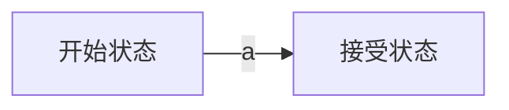
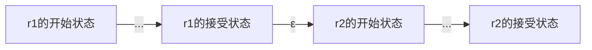
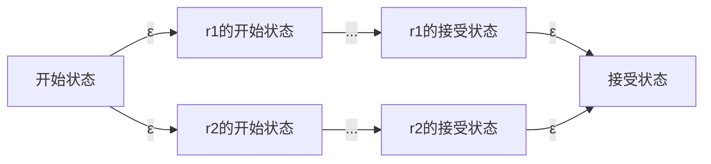
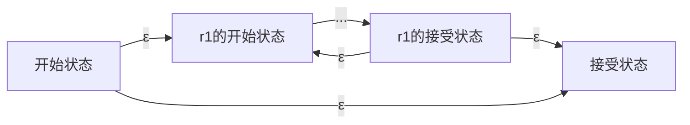
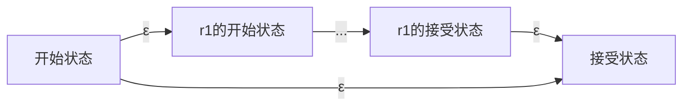

# 编译原理期末复习
## 基础知识

## 正则表达式->DFA
将正则表达式翻译成 DFA 的最简单算法是通过中间构造：

```
正则表达式->NFA->DFA->程序
```


### 正则表达式->NFA
NFA图数据结构采用如下：
```cpp
vector<map<char, set<int>>> nfaGraph;
```

**Thompson结构**

正则表达式的基本运算有：基本正则表达式、连接`JION`、选择`|`、闭包`*`、可选`?`。各符号优先级： `(` < `|` < `JION` < `?` = `*` < `)`。

基本正则表达式：例如 a，构造如下NFA


连接（jion）：例如假设有两个正则表达式r1和r2，形成新的表达式r1r2，构造如下NFA

修改r1的接受状态为非接受状态，r1的开始状态为新的开始状态。

选择（select）：例如假设有两个正则表达式r1和r2，形成新的表达式r1|r2，构造如下NFA

修改r1和r2的接受状态为非接受状态。

闭包（closure）：例如假设有一个正则表达式r1，形成新的表达式r1*，构造如下NFA

修改r1的接受状态为非接受状态。

可选（optional）：例如假设有一个正则表达式r1，形成新的表达式r1?，构造如下NFA


所有运算都实现完毕，优先级也已经确定，模仿用栈处理算术表达式的方法，就可以实现正则表达式到NFA的转换了。这里栈中存储的是NFA当前的开始状态和接受状态。

> NFA只有一个开始状态和一个接受状态。


### NFA->DFA
DFA采用的数据结构如下：
```cpp
vector<map<char, int>> dfaGraph;
```
**子集构造法**

实现两个功能：ε-closure和move。

ε-closure：给定一个NFA的状态集合，返回这个状态集合的ε-closure。即从这个状态集合出发，通过零或多个ε边可以到达的所有状态的集合。

move：给定一个NFA的状态集合和一个输入符号，返回从这个状态集合出发，通过输入符号可以到达的所有状态的集合。

子集构造法步骤：

1. 从NFA的开始状态开始，计算其ε-closure，作为DFA的开始状态。
2. 对于DFA的每个状态集合，对于每个输入符号，计算move后再计算ε-closure，作为DFA的状态集合的一个转换。
3. 重复2，直到没有新的状态集合产生。

> 广度优先搜索，以DFA的开始状态集合为根节点，每个节点有m个子节点，m为输入符号的数量，子节点的求法就是对输入符号求move后再求ε-closure。利用哈希表来存储已经求过的状态集合，这样就可以避免重复求解。包含接受状态的状态集合都是DFA的接受状态。


### DFA最小化
自动机理论中有一个很重要的结果，即：对于任何给定的 DFA，都有一个含有最少量状态的等价的DFA，而且这个最小状态的DFA是唯一的。

**可区分：** 如果状态 s 和 t 在某输入字符 a 上有转换且位于不同的集合，此时就称作 a 区分了状态 s 和 t。

显然接受状态和非接受状态是可区分的。最小化DFA的实质就是把所有可区分的状态分开。

改造上一节提到的move：

move_simple：给定**一个DFA的状态**和一个输入符号，返回从这个状态出发，通过输入符号可以到达的所有状态的集合。

具体思路如下：

1. 首先把所有的状态分成两个集合，一个是接受状态集合，一个是非接受状态集合。
2. 求出所有状态在所有输入字符上的转换集合并存储起来。
3. 对所有集合进行划分和合并
   1. 划分：对于某个集合 S，S 上的状态 t 对于输入符号 a 的转换集合 S_ta，若 S_ta 不属于 S，则把 t 从 S 中分离出来。最终得到新的划分S'。(注意这里只是一个一个状态的剥离，下面进行合并)
   2. 合并：对于划分出来的新集合 S'，若 S' 中的有状态在所有输入符号上的转换都属于同一个集合，则把它们合并。最终得到新的划分。
4. 重复3，直到没有新的状态集合产生，得到最终的划分。
5. 利用最终的划分，构造新的 DFA。

划分和合并部分代码如下：
```cpp
set<int> acceptingStates = ..;
set<int> nonAcceptingStates = ..;
// allTransform[t][a] 表示状态t在字符a上转换得到的集合
vector<map<char, set<int>>> allTransform = ..;
set<char> Sigma = ..; // 输入符号集合
bool belong(set<int> S1, set<int> S2); // return S1是否属于S2
bool equal(set<int> S1, set<int> S2); // return S1是否等于S2
set<int> Union(set<int> S1, set<int> S2); // return S1和S2的并集
set<set<int>> div_merge(vector<map<char, int>> dfaGraph)
{
    set<set<int>> div;
    div.push_back(acceptingStates);
    div.push_back(nonAcceptingStates);
    bool divid = true;
    while (divid)
    {
        for (auto S: div)
        {
            divid = false;
            set<set<int>> newDiv;
            for (auto t : S) // 划分
            {
                for (auto a : Sigma)
                {
                    set<int> S_ta = allTransform[t][a];
                    if (!belong(S_ta, S))
                    {
                        S.erase(t);
                        newDiv.push_back({t});
                        divid = true;
                    }
                }
            }
            if (newDiv.size() == 0)
                continue;
            bool merged = true;
            while(merged)// 合并
            {
                merged = false;
                for(auto it1=newDiv.begin(); it1!=newDiv.end(); it1++)
                {
                    for(auto it2=it1+1; it2!=newDiv.end(); it2++)
                    {
                        if(equal(*it1, *it2))
                        {
                            newDiv.push_back(Union(*it1, *it2));
                            newDiv.erase(it1);
                            newDiv.erase(it2);
                            merged = true;
                            break;
                        }
                    }
                    if(merged)
                        break;
                }
            }
            // 更新div
            div.erase(S);
            for(auto S: newDiv)
                div.push_back(S);
        }
    }
}
```

> 其实，这里仅仅把划分取了出来，新的DFA构造还是有点麻烦的。属于仅有点，没有边的情况。遍历每个状态，在其原DFA中找到对应的转换状态，然后在新的DFA中找到对应的状态，然后添加边。。。

## 自顶向下分析

## LR分析

## 语义分析

# 看过的资料

1. 编译原理及实践（美）Kenneth C. Louden
2. [编译原理笔记6：从正规式到词法分析器（3）：DFA最小化、词法分析器的构造、Lex 使用示例](https://developer.aliyun.com/article/762160)
  