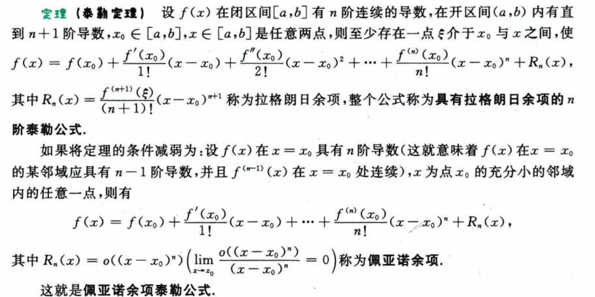
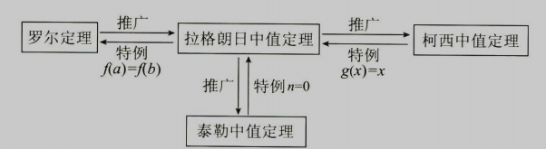
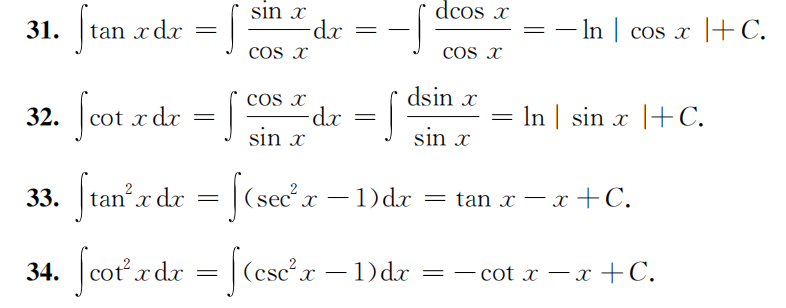
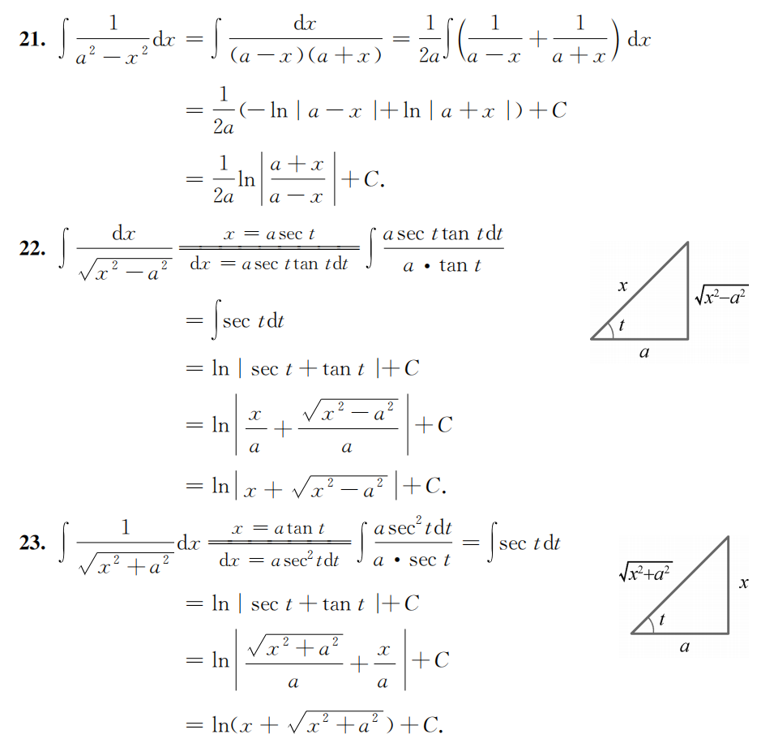
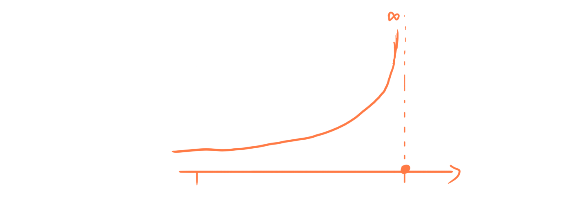
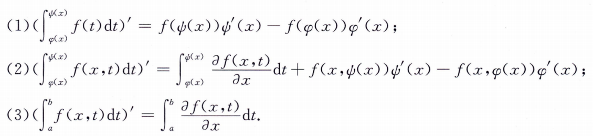
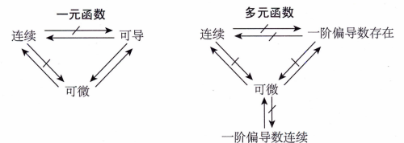
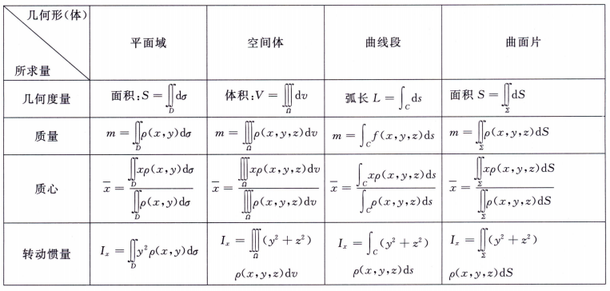
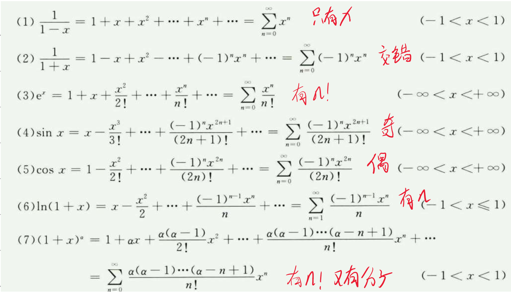

> 只记录一些个人认为需要记的内容，已经记得很牢的内容不会出现。

# 高等数学

## 函数、极限、连续

> 基本初等函数、初等函数

函数是一个一对一的映射关系。而映射值为一个确定的数，由此知道，函数不能有一个这样的映射：$f(x_0)=\infty$。

五大 **基本初等函数** : **幂函数、指数函数、对数函数、三角函数、反三角函数**。

- 指数函数：$y = a^x$，$a > 0$ 且 $a \neq 1$。
- 对数函数：$y = \log_a x$，$a > 0$ 且 $a \neq 1$。

**初等函数** ：由常数和基本初等函数经过 **有限次四则运算** 和 **有限次复合运算** 并能用 **一个式子** 表示的函数。

---

> 极限的定义、与无穷小的关系、有理运算、等价无穷小替换、定积分求极限、常用极限

**某个变化的极限就是 变化值 变化一定程度后 会落在 极限值很小的 邻域内。** —— $|f(x)-A| < \varepsilon$。

函数的左右极限，左极限：$\lim_{x \to x_0^-} f(x)=f(x_0^-)$，右极限：$\lim_{x \to x_0^+} f(x)=f(x_0^+)$。

> 值得注意的是对于函数的某点极限，要求其在该点的**去心邻域内有定义**。

**对函数在某点极限的讨论只与该点的去心邻域有关，而与该点是否有定义及函数在该点的取值无关。**

极限值与无穷小的关系： $\lim f(x) = A \Leftrightarrow f(x) = A + \alpha(x)$，其中 $\lim \alpha(x) = 0$。

当 $\lim [f(x) \plusmn g(x)]$ 存在时，两函数要么同时存在，要么同时不存在。所以当确定了 $\lim f(x)=a,\ \lim [f(x) \plusmn g(x)] = c$ 时，$\lim g(x)=c-a$。

**求极限时等价无穷小的代换本质就是麦克劳林展开**，遇到加减情况想到这里就知道怎么代换了。

利用定积分求极限提 $\frac{1}{n}$ 。

$\lim_{n \to \infty} \sqrt[n]{n} = 1,\ \lim_{n \to \infty} \sqrt[n]{a} = 1$

---

> 连续的定义、间断点、连续函数的运算

$$
\lim_{\Delta x\to 0}\Delta y=\lim_{\Delta x\to 0}[f(x_0+\Delta x)-f(x_0)]=0 \\ 或者 \lim_{x \to x_0} f(x) = f(x_0)
$$

函数 **在该点有定义** 且 **左右极限存在** 且 **等于该点的函数值** 。

由于函数在某点的连续是由极限定义的，故讨论连续性时，函数在该点的 **邻域要有定义**。

函数在某点不连续则称该点为其间断点。站在该点 **左右极限的角度** 将间断点分成两类：
- 第一类间断点：都存在
  - 相等：可去间断点，此时要么函数在该点无定义，要么函数值与极限值不相等。
  - 不相等：跳跃间断点
- 第二类间断点：至少有一个不存在（单侧极限不存在，要么就是无穷，要么就是振荡）
  - 无穷：无穷间断点，如 $\frac{1}{x}$ 在 $x = 0$ 处。
  - 振荡：振荡间断点，如 $\sin \frac{1}{x}$ 在 $x = 0$ 处。

连续函数进行四则、复合及取反函数运算后仍然连续。

**基本初等函数在其定义域内连续；初等函数在其定义区间内连续。** ↓

首先明确：
- 定义域是点的集合；
- 定义区间是定义域的一个子区间，不能是单个点。
 
显然基本初等函数在其定义域内连续。对于初等函数，比如 $y=\sqrt{\cos x-1}$，定义域是 $x \in \{2k\pi | k \in \mathbb{Z}\}$，定义区间是 $x \in [2k\pi, 2(k+1)\pi]$ 一堆离散的点，没有定义区间，显然其在定义域内不连续。

**闭区间** 上连续的函数有一些很显然的性质：有界、最值、介值、零点定理。

## 一元函数微分学

> 可导定义、可微定义、莱布尼茨公式（高阶导数）、微分四则运算、中值定理

导数本身就是一个极限，所以讨论某点的导数时要求邻域内有定义。（闭区间端点可导是认为左极限或右极限存在）

$$
f'(x_0) =\lim_{\Delta x\to 0}\frac{\Delta y}{\Delta x} =\lim_{\Delta x \to 0} \frac{f(x_0 + \Delta x) - f(x_0)}{\Delta x}=\lim_{x \to x_0} \frac{f(x) - f(x_0)}{x - x_0}
$$

判断是否可导就是判断上面的极限是否存在。

若增量 $\Delta y$ 可表示为 $\Delta y=A\Delta x+o(\Delta x)(\Delta x \to 0),\ A$ 不依赖于 $\Delta x$ ，则称 $f(x)$ 在 $x_0$ 处可微，记 $\mathrm{d}y=A\Delta x$ 。

一元函数某点可微的充要条件是该点可导，此时上式的 $A$ 就是该点的导数值。（极限与无穷小的关系）

> 连续可以看作当 $\Delta x\to 0$ 时，$\Delta y$ 为无穷小，而可导可以看作是 $\Delta y$ 与 $\Delta x$ 是同阶无穷小。由此可知，可导的条件更强，且涵盖连续的条件。

$\Delta y$ 是函数的增量，$\mathrm{d}y$ 是切线的增量。 

莱布尼茨公式：$[f(x)g(x)]^{(n)}=\sum_{k=0}^{n} C_n^k f^{(k)}(x)g^{(n-k)}(x)$。

微分四则运算。

### 应用

**极值**： 邻域内最大或最小（非严格）称为**极值**，取得极值的 $x$ **值** 称为**极值点**。

**端点处没有定义邻域，故不可能是极值点。**

必要条件：$x_0$ 为极值点，则 $f'(x_0)=0$ 或 $f'(x_0)$ 不存在。（费马定理就是可导的情况）

**中值定理**： 闭区间 $[a,b]$ ，开区间 $(a,b)$ ，函数 $f(x)$ ：
- 罗尔定理，闭区间连续开区间可导，$f(a)=f(b)$，$\exists \xi \in (a,b)$ 使 $f'(\xi)=0$。
- 拉格朗日中值定理，闭区间连续开区间可导，$\exists \xi \in (a,b)$ 使 $f(b)-f(a)=f'(\xi)(b-a)$。
- 柯西中值定理，闭区间连续开区间可导，$g'(x) \neq 0$，$\exists \xi \in (a,b)$ 使 $\frac{f(b)-f(a)}{g(b)-g(a)}=\frac{f'(\xi)}{g'(\xi)}$。  <!-- TODO 证明 -->
- 泰勒定理，

四大中值定理的关系：

罗尔定理常用于零点问题：（假设下述提到的导数都存在）
- 若 $f(x)$ 有 $k$ 个零点，则 $f^{(n)}(x)$ 有**至少** $k-n$ 个零点。
- 若 $f'(x)$ 有 $k$ 个零点，则 $f(x)$ 有**至多** $k+1$ 个零点。

很多问题可以转换成零点问题，比如解方程，转换成零点问题后就可以用罗尔定理。

涉及两个函数及其导函数的问题，可以考虑柯西中值定理；涉及高阶导数的问题，可以考虑泰勒定理。

**拐点**

引入凹凸性的概念，凹——$f(\frac{x_1+x_2}{2}) < \frac{f(x_1)+f(x_2)}{2}$，凸反之。

注意两点：
- **凹凸性是在函数连续的前提上讨论的。**
- **凹凸性定义里面是严格不等号。**

拐点是**连续函数**凹凸性变化的点。显然对应二阶可导函数，二阶导数发生变号的点就是拐点。注意：**拐点的存在定义在连续的前提上。极值只是要求邻域有定义即可。**

> 极值和拐点的问题除了利用定义外，基本都要要求连续可导。极值是一阶导数的问题，拐点是二阶导数的问题。

**斜渐近线**：$\lim_{x \to \infty} \frac{f(x)}{x} = a,\ \lim_{x \to \infty} [f(x)-ax] = b$，则 $y=ax+b$ 是 $f(x)$ 的斜渐近线。

**弧微分**：$\mathrm{d}s=\sqrt{\mathrm{d}x^2+\mathrm{d}y^2}= \sqrt{1+(y')^2}\mathrm{d}x$。

**曲率**：$K=\lim_{\Delta s \to 0} |\frac{\Delta \alpha}{\Delta s}|$，$\alpha$ 为切线与 $x$ 轴的夹角。含义为单位弧长上的转角。

$$
K=|\frac{\mathrm{d} (\arctan y')}{\mathrm{d} s}|=\frac{|y''|}{(1+(y')^2)^{\frac{3}{2}}}
$$

**曲率半径**：$R=\frac{1}{K}$。（弧度 = 弧长 / 半径 $\Lrarr$ 半径 = 弧长 / 弧度）

### 杂

**点可导与及其邻域内的情况**

由定义可知，某点可导，说明该点处函数连续。导数值大于零说明左邻域小于函数值，右邻域大于函数值，导数值小于零反之。

**点可导和邻域内可导不一样。洛必达法则由于出现 $\lim \frac{f'(x)}{g'(x)}$，是极限的形式，前面也说了，极限是在邻域内讨论的，所以洛必达法则是要求函数在邻域内可导。**

拉格朗日定理和拉格朗日余项的泰勒公式以及凹凸性都可以用来证明不等式。

## 一元函数积分学

> 原函数、万能代换、可积、点火公式、分离三角函数公式、变限积分、积分中值定理、反常积分、$\Gamma$ 函数

如果区间 $I$ 上 $F'(x)=f(x)$ 或 $\mathrm{d} F(x)=f(x)\mathrm{d} x$ 处处成立，则称 $F(x)$ 是 $f(x)$ 在区间 $I$ 上的一个原函数。

- **若 $f(x)$ 在区间 $I$ 存在第一类间断点或无穷间断点，则 $f(x)$ 在 $I$ 上没有原函数。**
- **若 $f(x)$ 在区间 $I$ 上连续，则 $f(x)$ 在 $I$ 上有原函数。**

> 这里应该可以研究一下导函数的性质，导函数一定没有第一类间断点和无穷间断点。

积分公式1

积分公式2

> 上面两图来自三大计算的参考答案。

万能代换公式：

$$
\tan \frac{x}{2} = t, \ \ \sin x = \frac{2t}{1 + t^2}, \ \ \cos x = \frac{1 - t^2}{1 + t^2} \\
x = 2 \arctan t \Rightarrow \mathrm{d}x = \frac{2}{1 + t^2} \mathrm{d}t \\
$$

推理如下：

$$
\tan \frac{x}{2}=t, \ \ \tan x = 2 \tan \frac{x}{2} / (1 - \tan^2 \frac{x}{2}) = \frac{2t}{1 - t^2} \\
\sec^2 \frac{x}{2} = 1 +\tan^2 \frac{x}{2} = 1 + t^2, \ \ \cos^2 \frac{x}{2} = \frac{1}{1 + t^2} \\
\cos x = 2 \cos^2 \frac{x}{2} - 1 = \frac{1 - t^2}{1 + t^2}, \ \ \sin x = 2 \sin \frac{x}{2} \cos \frac{x}{2} = \frac{2t}{1 + t^2} \\
$$

万能代换将三角函数转换为有理函数。

### 定积分

定义要求闭区间  $[a,b]$  有定义，将闭区间分成多个尽可能小（极限的变化值）的区间，对应地小区间长度乘小区内**任取**一点 $\xi_i$ 的函数值，再求和，得到一个极限，若极限值不依赖于区间的划分方法，也不依赖于 $\xi_i$ 的选取方法，则称该极限为函数 $f(x)$ 在区间 $[a,b]$ 上的定积分，记作 $\int_a^b f(x) \mathrm{d}x$。

$$
\int_a^b f(x) \mathrm{d}x = \lim_{\lambda \to 0} \sum_{i=1}^{n} f(\xi_i) \Delta x_i
$$

**注意定积分是在闭区间上讨论的，不仅要求区间有定义，两端点也要有定义。**（不然就是反常积分了）

**几何意义**

设 $a>b,\ \int_a^b f(x) \mathrm{d}x$ 存在，在区间 $[a,b]$ 上 $f(x)$ 取值有三种情况：

- $f(x)\ge0$，则定积分表示曲边梯形的面积。
- $f(x)\le0$，则定积分表示曲边梯形的面积的相反数。
- $f(x)$ 正负值混合，定积分表示曲线梯形x轴的上部分面积减去下部分面积。

**可积性**

必要条件——有界：若定积分 $\int_a^b f(x) \mathrm{d}x$ 存在，则 $f(x)$ 在 $[a,b]$ 上**有界**。即下图这种特殊情况定积分不存在：

不满足定积分存在必要条件的特例情况

若 $f(x)$ 在 $[a,b]$ 上连续，则 $f(x)$ 在 $[a,b]$ 上可积。

若 $f(x)$ 在 $[a,b]$ 上**有界，且只有有限个间断点**，则 $f(x)$ 在 $[a,b]$ 上可积。

---

华里士公式：（点火公式）

$$
\begin{align*}
    \int_{0}^{\frac{\pi}{2}} \sin^n x \mathrm{d}x &= \int_{0}^{\frac{\pi}{2}} \cos^n x \mathrm{d}x \\
    &= 
    \begin{cases}
        \frac{n-1}{n} \cdot \frac{n-3}{n-2} \cdot \cdots \cdot \frac{1}{2} \cdot \frac{\pi}{2}, & n \text{ 为正偶数}, \\[2ex]
        \frac{n-1}{n} \cdot \frac{n-3}{n-2} \cdot \cdots \cdot \frac{2}{3}, & n \text{ 为大于 1 的正奇数}, \\[2ex]
        \frac{\pi}{2}, & n = 0, \\[2ex]
        1, & n = 1.
    \end{cases}

\end{align*}
$$

> 记忆方法：在序列n~1中，按序两个两个地取（不重复，对应分母、分子）构成分式相乘，直到取到分母为的情况，再乘上 $\frac{\pi}{2}$。
>
> 若积分限为 $\pi$ 或者 $2\pi$，则根据周期性，对 $n$ 分奇偶判断函数的奇偶性，进而继续计算。

还有一个的公式：

$$ 
\int_{0}^{\pi} xf(\sin x) \mathrm{d}x = \frac{\pi}{2} \int_{0}^{\pi} f(\sin x) \mathrm{d}x, \ \ \text{其中} f(x) \text{连续}
$$

证明：（令 $x = \pi - t$）

$$
\begin{align*}
    \int_{0}^{\pi} xf(\sin x) \mathrm{d}x &= \int_{0}^{\pi} (\pi - x)f(\sin x) \mathrm{d}x 
    = \pi \int_{0}^{\pi} f(\sin x) \mathrm{d}x - \int_{0}^{\pi} xf(\sin x) \mathrm{d}x \\
    \Rightarrow 2 \int_{0}^{\pi} xf(\sin x) \mathrm{d}x &= \pi \int_{0}^{\pi} f(\sin x) \mathrm{d}x 
    \Rightarrow \int_{0}^{\pi} xf(\sin x) \mathrm{d}x = \frac{\pi}{2} \int_{0}^{\pi} f(\sin x) \mathrm{d}x
\end{align*}
$$

> 该式将三角函数积分独立出来。

### 变限积分

$$
(\int_a^x f(t) \mathrm{d}t)' = f(x)
$$

对**可积**函数变限求积分的函数。

若**被积函数连续**，则变限积分求导等于被积函数。即变限积分是可积函数的一个原函数。由此得到了不定积分与定积分的联系：若 $f(x)$ 连续，则 $\int f(x) \mathrm{d}x = \int_a^x f(t) \mathrm{d}t + C$。

**变限积分函数必定连续。**

至于可导性要看被积函数的间断点情况。利用导数的定义分析是否可导。

变限积分求导的三种类型

> 上图来自25武忠祥《高数辅导讲义》

> 记第一条，第二、三条把定积分拆开成求和公式理解记忆。

**变上限积分的等价代换**

设 $f(x),g(x)$ 在 $x=a$ 的某邻域内连续，当 $x \to a$ 时，$f(x) \sim g(x)$，则 $\int_{a}^{x} f(t) \mathrm{d}t \sim \int_{a}^{x} g(t) \mathrm{d}t$。（反向使用洛必达法则）

---

> 常用的不等式
> $$
> \frac{x}{1+x} < \ln(1+x) < x
> $$

**积分中值定理**

- 若 $f(x)$ 在 $[a,b]$ 上连续，则 $\exists \xi \in (a,b)$ 使 $\int_a^b f(x) \mathrm{d}x = f(\xi)(b-a)$。——拉格朗日中值定理
- 若 $f(x),g(x)$ 在 $[a,b]$ 上连续，且 $g(x)$ 不变号，则 $\exists \xi \in [a,b]$ 使 $\int_a^b f(x)g(x) \mathrm{d}x = f(\xi)\int_a^b g(x) \mathrm{d}x$。(广义积分中值定理) *代研究* <!--todo-->

上面一个是开区间一个是闭区间。*代研究* <!--todo-->

积分中值定理是定积分与函数值的关系桥梁。类似拉格朗日中值定理是导数与函数值的关系桥梁。

**柯西积分不等式**
 
$$
(\int_a^b f(x)g(x) \mathrm{d}x)^2 \le \int_a^b f^2(x) \mathrm{d}x \int_a^b g^2(x) \mathrm{d}x
$$

柯西不等式把积分的幂转换成了函数幂的积分，即把指数放到积分函数里面。

### 反常积分

两种：无穷区间的反常积分、无界函数的反常积分。

本质也是常积分求极限。（对积分限求极限）

无界函数的反常积分：设 $f(x)$ 在 $[a,b)$ 上连续，且 $\lim_{x \to b^-} f(x) = +\infty$，则称 $\int_a^b f(x) \mathrm{d}x = \lim_{\beta \to b^-} \int_a^\beta f(x) \mathrm{d}x$ 为 $f(x)$ 在 $[a,b)$ 上的反常积分（瑕积分），点 $b$ 为奇点（瑕点）。

若 $a,b$ 都是奇点，则应该**分成两个反常积分求和**：$\int_a^b f(x) \mathrm{d}x = \int_a^c f(x) \mathrm{d}x + \int_c^b f(x) \mathrm{d}x$。（无穷区间也是）（要求两个都收敛才收敛，**只要有一个发散就发散**，奇怪之处）

**非负**函数的反常积分可以利用**比较判别法**判断敛散性。这块和后面级数有点联系。<!--todo-->

关于对称区间的反常函数计算相比于定积分的多一个 “收敛” 的要求。因为虽然两边对称，但**趋向的速度不能保证相同**，所以要求收敛。（听闻柯西主值就是利用 $\lim_{a\to \infty} \int_{-a}^{a} f(x) \mathrm{d}x$ 让它们两边的趋势速度一致）

**$\Gamma$ 函数**

$$
\Gamma(x) = \int_0^{+\infty} e^{-t} t^{x-1} \mathrm{d}t
$$

其在 $x > 0$ 时收敛，且有性质 $\Gamma(x+1) = x\Gamma(x),\ \Gamma(n+1)=n!$ （分部积分证）。

$\Gamma(1)=1$ ，$\Gamma(\frac{1}{2})=\sqrt{\pi}$。

> 既是瑕积分，又是无穷区间积分，分开计算可证收敛性质。

**一个重要反常积分**

$$
\int_{-\infty}^{+\infty} e^{-x^2} \mathrm{d}x = 2 \int_{0}^{+\infty} e^{-x^2} \mathrm{d}x = \sqrt{\pi}
$$

> 上述两个函数在概率论中有重要应用。后者其实就是 $\Gamma(\frac{1}{2})$。

---

### 杂

前面关于原函数、可积性、变限积分提到：
- 如果区间 $I$ 上 $F'(x)=f(x)$ 或 $\mathrm{d} F(x)=f(x)\mathrm{d} x$ 处处成立，则称 $F(x)$ 是 $f(x)$ 在区间 $I$ 上的一个原函数。
- 若 $f(x)$ 在区间 $I$ 存在第一类间断点或无穷间断点，则 $f(x)$ 在 $I$ 上没有原函数。
- 若 $f(x)$ 在 $[a,b]$ 上**有界，且只有有限个间断点**，则 $f(x)$ 在 $[a,b]$ 上可积。
- 若 $f(x)$ 连续，则 原函数 $= \int_a^x f(t) \mathrm{d}t + C$。

举例理解：

如果 $f(x)$ 在 $[a,b]$ 上除了点 $x_0$ 外都连续，据上断定：
- $f(x)$ 在 $[a,b]$ 没有原函数。
- $f(x)$ 在 $[a,b]$ 上可积。

既然可积，记

$$
F(x) = \int_a^x f(t) \mathrm{d}t
$$

分析 $F(x)$，显然连续（变限积分的连续性），且有 $F'(x) = f(x),\ x \neq x_0$ ；计算 $x_0$ 处的左右导数：

$$
F'_-(x_0)=\lim_{x \to x_0^-} \frac{\int_a^x f(t) \mathrm{d}t - \int_a^{x_0} f(t) \mathrm{d}t}{x-x_0} \overset{L}{=} \lim_{x \to x_0^-} f(x) = f(x_0^-)
$$

同理 $F'_+(x_0) = f(x_0^+)$ 。由于 $x_0$ 是间断点，若是第一类间断点，显然 $F'(x_0)$ 不存在或 $\neq f(x_0)$；

故 $F(x)$ 不满足原函数条件。（处处导数等于 $f(x)$）所以在变限积分部分特地说明了**连续函数**的变限积分才是可积函数的一个原函数。

> 无穷间断点和振荡间断点的情况比较复杂，但存在无穷间断点肯定是没有原函数的，存在振荡间断点确实可以有原函数。

---

考虑这样一个积分：带 绝对值 的三角函数积分。

$$
\int |\cos x| \mathrm{d}x
$$

分析：积分函数是周期为 $\pi$ 的函数，可以分区间讨论 $[k\pi+\frac{\pi}{2}, k\pi+\frac{3\pi}{2})$，$k$ 为整数。当 $k=-1$ 时，绝对值可去掉，原函数则为 $\sin x$；当 $k=0$ 时，相当于 $\cos x$ 的第一个正部分右移了 $\pi$，那么原函数则为 $\sin (x+\pi)$，以此类推。所以原函数为：

$$
F_k(x) = \sin [x+(k+1)\pi]+C_k, \ \ x \in [k\pi+\frac{\pi}{2}, k\pi+\frac{3\pi}{2})
$$

但由于**原函数是连续的**，故有 $F_{k-1}(k\pi+\frac{\pi}{2}) = F_k(k\pi+\frac{\pi}{2})$，即：

$$
\sin[k\pi+\frac{\pi}{2}+k\pi]+C_{k-1} = \sin[k\pi+\frac{\pi}{2}+(k+1)\pi]+C_k\\
\lrArr \sin\frac{\pi}{2}+C_{k-1} = \sin\frac{3\pi}{2}+C_k\\
\lrArr C_{k} = C_{k-1}+2
$$

故最终原函数为：

$$
\sin[x+(k+1)\pi]+2k+C, \ \ x \in [k\pi+\frac{\pi}{2}, k\pi+\frac{3\pi}{2})
$$

## 多元函数微分学

> 重极限、全微分、极值、拉格朗日乘数法、方向导数和梯度

证明重极限不存在的常用方法就是取两种不同的路径，证明极限不相等。

### 全微分

$$
\Delta z = A \Delta x + B \Delta y + o(\sqrt{\Delta x^2 + \Delta y^2})
$$

> 注意和一元的区别，一元是 $o(\Delta x)$，多元是 $o(\sqrt{\Delta x^2 + \Delta y^2})$。

记为 $\mathrm{d}z = A \Delta x + B \Delta y$。利用定义判断可微：

$$
\lim_{\substack{\Delta x \to x_0 \\ \Delta y \to y_0}} \frac{[f(x_0+\Delta x, y_0+\Delta y) - f(x_0, y_0)] - (A \Delta x + B \Delta y)}{\sqrt{\Delta x^2 + \Delta y^2}} \overset{?}{=} 0
\\
\lim_{\substack{ x \to x_0 \\ y \to y_0}} \frac{[f(x, y) - f(x_0, y_0)] - (A(x-x_0) + B(y-y_0))}{\sqrt{(x-x_0)^2 + (y-y_0)^2}} \overset{?}{=} 0

$$

**充分条件** ：两个偏导数连续，则函数可微。

可微和可导的关系

### 极值

**充分条件** ：设 $f(x,y)$ 在点 $(x_0, y_0)$ 处有**二阶连续偏导数**，且 $f'_x(x_0, y_0) = f'_y(x_0, y_0) = 0$，令 $f''_{xx}(x_0, y_0) = A,\ f''_{xy}(x_0, y_0) = B,\ f''_{yy}(x_0, y_0) = C$，则：
- 若 $AC-B^2 > 0$，有极值；当 $A < 0$ 时，有极大值；当 $A > 0$ 时，有极小值。
- 若 $AC-B^2 < 0$，无极值。
- 若 $AC-B^2 = 0$，无法判断。

> 这个得记

**拉格朗日乘数法**

<!-- todo -->

$f(x,y)$ 在约束条件 $\varphi(x,y)=0$ 求极值。构造拉格朗日函数：

$$
L(x,y,\lambda) = f(x,y) + \lambda \varphi(x,y)
$$

化为无条件函数求极值，即求 $L'_x(x,y,\lambda) = L'_y(x,y,\lambda) = L'_\lambda(x,y,\lambda) = 0$。

多条件约束下类似。

### 方向导数、梯度

沿特定方向 $\vec{l}=(\cos \alpha, \sin \alpha)$ （注意这是单位向量）的方向导数：

$$
\frac{\partial f(x_0,y_0)}{\partial \vec{l}} = \lim_{ t \to 0^+} \frac{f(x_0+ t \cos \alpha, y_0+ t \sin \alpha) - f(x_0, y_0)}{t}
$$

在某点梯度：$\textbf{grad}\ f(x_0,y_0) = (\frac{\partial f}{\partial x}, \frac{\partial f}{\partial y})$。是一个向量。

引入梯度后，上述的方向导数可写成： $\frac{\partial f(x_0,y_0)}{\partial \vec{l}} = \textbf{grad}\ f(x_0,y_0) \cdot \vec{l}$。即：

$$
\frac{\partial f(x_0,y_0)}{\partial \vec{l}} = \frac{\partial f(x_0, y_0)}{\partial x} \cos \alpha + \frac{\partial f(x_0, y_0)}{\partial y} \sin \alpha
$$

## 多元函数积分学

> 重积分、累次积分、曲线积分（格林公式、斯托克斯公式）、曲面积分（投影定理、高斯公式）、应用（质心、形心、转动惯量、散度、旋度）

### 极坐标、球坐标、柱坐标

二重积分下的极坐标：

$$
\begin{align*}
    x &= r \cos \theta, \\
    y &= r \sin \theta, \\
    \mathrm{d}x \mathrm{d}y &= r \mathrm{d}r \mathrm{d}\theta.
\end{align*}
$$

三重积分下的球坐标：

$$
0 \le \varphi \le \pi,\ 0 \le \theta \le 2\pi \\
\begin{align*}
    x &= r \sin \varphi \cos \theta, \\
    y &= r \sin \varphi \sin \theta, \\
    z &= r \cos \varphi, \\
    \mathrm{d}x \mathrm{d}y \mathrm{d}z &= r^2 \sin \varphi \mathrm{d}r \mathrm{d}\varphi \mathrm{d}\theta.
\end{align*}
$$

三重积分下的柱坐标：

$$
\begin{align*}
    x &= r \cos \theta, \\
    y &= r \sin \theta, \\
    z &= z, \\
    \mathrm{d}x \mathrm{d}y \mathrm{d}z &= r \mathrm{d}r \mathrm{d}\theta \mathrm{d}z.
\end{align*}
$$

### 曲线积分

若 $L:r=r(\theta),\alpha \le \theta \le \beta$，则：

$$
\int_L f(x,y) \mathrm{d}s = \int_{\alpha}^{\beta} f(r\cos \theta, r\sin \theta) \sqrt{r^2+r'^2} \mathrm{d}\theta
$$

对坐标的平面曲线积分

**格林公式** ：设闭区域 $D$ 的边界为平面曲线 $L$（可以是多段），$D$ 内 **有连续偏导数** 的函数 $P(x,y),Q(x,y)$，则：

$$
\oint_L P \mathrm{d}x + Q\mathrm{d}y = \iint_D (Q'_x - P'_y) \mathrm{d}x \mathrm{d}y
$$

其中，$L$ 为 $D$ 取正向的边界曲线，即沿着 $L$ 走，$D$ 在 **左手边**。

计算思路一般为：

- 封闭曲线，格林公式；
- 开曲线
  - 位于路径无关的区域内，改换简单路径 或 找出原函数；
  - 否则，补线用格林公式。
- 参数方程直接计算。

两类积分的联系：

$$
\oint_L P \mathrm{d}x + Q\mathrm{d}y = \iint_L (P \cos \alpha + Q \sin \alpha) \mathrm{d}s
$$

对坐标的空间曲线积分

参数方程直接计算。

**斯托克斯公式** ：设空间曲线 $L$（可以是多段） 为 $\Sigma$ 的边界，$L$ 的方向与 $\Sigma$ 的法向量方向符合右手定则，$P(x,y,z),Q(x,y,z),R(x,y,z)$ 在 $\Sigma$ 上有连续偏导数，则：

$$
\oint_L P \mathrm{d}x + Q\mathrm{d}y + R\mathrm{d}z \\
\begin{align*}
    &= \iint_{\Sigma} (R'_y - Q'_z) \mathrm{d}y \mathrm{d}z + (P'_z - R'_x) \mathrm{d}z \mathrm{d}x + (Q'_x - P'_y) \mathrm{d}x \mathrm{d}y \\
    &= \iint_{\Sigma} \textbf{rot}\ \{P,Q,R\} \cdot \mathrm{d}\textbf{S}
\end{align*}
$$

其中，$\textbf{rot}\ \{P,Q,R\} = \nabla \times \{P,Q,R\}$，即：

$$
\begin{vmatrix}
    \boldsymbol{i} & \boldsymbol{j} & \boldsymbol{k} \\
    \frac{\partial}{\partial x} & \frac{\partial}{\partial y} & \frac{\partial}{\partial z} \\
    P & Q & R
\end{vmatrix}
$$

### 曲面积分

**投影定理** ：设曲面 $\Sigma$ 的方程为 $z=z(x,y)$，则：

$$
\iint_{\Sigma} f(x,y,z) \mathrm{d}S = \iint_{D} f(x,y,z(x,y)) \sqrt{1+(z'_x)^2+(z'_y)^2} \mathrm{d}x \mathrm{d}y
$$

<!-- todo -->

对坐标的曲面积分

直接法：拆开三部分分别计算，如

$$
\iint_{\Sigma} R(x,y,z) \mathrm{d}x \mathrm{d}y=\pm \iint_{D_{xy}} R(x,y,z(x,y)) \mathrm{d}x \mathrm{d}y
$$

> 注意这里不用投影定理，因为左边不是面积单元。

若 $\Sigma$ 的法向量与 $z$ 轴正向夹角为锐角，即指向上侧，取正号；否则取负号。

**高斯公式** ：空间闭区域 $\Omega$ 由光滑曲面 $\Sigma$ 围成，函数 $P,Q,R$ 在其内**有一阶连续偏导数**，则：

$$
\oiint_{\Sigma_外} P \mathrm{d}y \mathrm{d}z + Q \mathrm{d}z \mathrm{d}x + R \mathrm{d}x \mathrm{d}y = \iiint_{\Omega} (P'_x + Q'_y + R'_z) \mathrm{d}x \mathrm{d}y \mathrm{d}z
$$

### 应用

**质心**，对于平面：

$$
\bar{x}= \frac{\iint_{D} x \rho(x,y) \mathrm{d}x \mathrm{d}y}{\iint_{D} \rho(x,y) \mathrm{d}x \mathrm{d}y}
$$

其中当 $\rho(x,y)=1$ 时，即为平面图形的形心。即 $\bar{x} S = \iint_{D} x \mathrm{d}x \mathrm{d}y$。

多元积分应用

**散度** ：$P,Q,R$ 具有一阶连续偏导数，则：

$$
\text{div} \{P,Q,R\} = \frac{\partial P}{\partial x} + \frac{\partial Q}{\partial y} + \frac{\partial R}{\partial z}
$$

**旋度** ：$P,Q,R$ 具有一阶连续偏导数，则：

$$
\textbf{rot}\ \{P,Q,R\} = \nabla \times \{P,Q,R\} =\\
\begin{vmatrix}
    \boldsymbol{i} & \boldsymbol{j} & \boldsymbol{k} \\
    \frac{\partial}{\partial x} & \frac{\partial}{\partial y} & \frac{\partial}{\partial z} \\
    P & Q & R
\end{vmatrix}
$$

## 微分方程

> 可分离变量、齐次、一阶线性、伯努利、线性微分方程解的性质、二阶常系数线性齐次（以及某些特殊自由项的非齐次）、欧拉方程

齐次微分方程就是用一个关于 $x$ 的函数代替 $y$，然后化简为可分离变量的形式。

### 一阶线性微分方程

$$
y'+p(x)y=q(x)
$$

通解为：

$$
y = e^{-\int p(x) \mathrm{d}x} \left[ \int q(x) e^{\int p(x) \mathrm{d}x} \mathrm{d}x + C \right]
$$

推理过程：

$$
\begin{align*}
    y'+p(x)y &= q(x) \\
    e^{\int p(x) \mathrm{d}x} y'+p(x)e^{\int p(x) \mathrm{d}x} y &= q(x)e^{\int p(x) \mathrm{d}x} \\
    \frac{\mathrm{d}}{\mathrm{d}x} \left[ e^{\int p(x) \mathrm{d}x} y \right] &= q(x)e^{\int p(x) \mathrm{d}x} \\
    e^{\int p(x) \mathrm{d}x} y &= \int q(x) e^{\int p(x) \mathrm{d}x} \mathrm{d}x + C \\
    y &= e^{-\int p(x) \mathrm{d}x} \left[ \int q(x) e^{\int p(x) \mathrm{d}x} \mathrm{d}x + C \right]
\end{align*}
$$

### 伯努利微分方程

$$
\begin{align*}
    & y'+p(x)y=q(x)y^n, \ n \neq 0,1 \\
    \rArr & y^{-n}\frac{\mathrm{d} y}{\mathrm{d} x}+p(x)y^{1-n}=q(x) ,\ y \neq 0 \\
    & 令\ z=y^{1-n} \rArr \frac{\mathrm{d} z}{\mathrm{d} x}= (1-n)y^{-n} \frac{\mathrm{d} y}{\mathrm{d} x}\ 有 \\
    & \frac{1}{1-n} \frac{\mathrm{d} z}{\mathrm{d} x} + p(x)z = q(x) \\
    \rArr & \frac{\mathrm{d}z}{\mathrm{d} x}+(1-n)p(x)z=(1-n)q(x) \\
    & 变成了一阶线性微分方程 \\
    \rArr & z = e^{-(1-n)\int p(x) \mathrm{d}x} \left[ \int (1-n)q(x) e^{(1-n)\int p(x) \mathrm{d}x} \mathrm{d}x + C \right] \\
\end{align*}
$$

### 线性微分方程解的性质

对于齐次的，解有叠加性质，且 $n$ 个线性无关的所有线性组合构成了其通解。（$n$为阶数）

对于非齐次的，其通解为 对于齐次方程的**通解** + 其自身的一个**特解**。解的叠加，自由项也叠加。

### 二阶常系数线性

齐次的

$$
y''+py'+qy=0
$$

特征方程为：

$$
r^2+pr+q=0
$$

| 特征方程根 $r_1,r_2$         | 通解形式                                            |
| ---------------------------- | --------------------------------------------------- |
| $r_1 \neq r_2$               | $y=C_1e^{r_1x}+C_2e^{r_2x}$                         |
| $r_1 = r_2$                  | $y=(C_1+C_2x)e^{r_1x}$                              |
| $r_1,r_2=\alpha \pm \beta i$ | $y=e^{\alpha x}(C_1\cos \beta x + C_2\sin \beta x)$ |

$n$ 阶推广：

|特征方程根|通解形式|
|---|---|
|单重实根 $r$|对应一项： $Ce^{rx}$|
|$k$重实根 $r$|对应 $k$ 项：$(C_1+C_2x+\cdots+C_kx^{k-1})e^{rx}$|
|单重复数根 $\alpha \pm \beta i$|对应两项：$e^{\alpha x}(C_1\cos \beta x + C_2\sin \beta x)$|
|$k$重复数根 $\alpha \pm \beta i$|对应 $2k$ 项：$e^{\alpha x}[(A_1+A_2x+\cdots+A_kx^{k-1})\cos \beta x + (B_1+B_2x+\cdots+B_kx^{k-1})\sin \beta x]$|

特殊自由项的非齐次二阶常系数线性微分方程，分两类。

类型一：

$$
y''+py'+qy=P_m(x)e^{ax}
$$

其中 $P_m(x)$ 是已知的 $m$ 次多项式。

根据解的性质，求出齐次的通解，然后求出非齐次的一个特解，两者相加即为非齐次的通解。

该类型的特解形式为：

$$
y^*=x^kQ_m(x)e^{ax}
$$

其中 $Q_m(x)$ 系数待定，关于 $k$ ：

$$
k=
\begin{cases}
    0, & a 不是特征方程的根 \\
    1, & a 是特征方程的单重根 \\
    2, & a 是特征方程的重根
\end{cases}
$$

类型二：

$$
y''+py'+qy\overset{其中之一}{=}
\begin{cases}
    P_m(x)e^{ax}\cos bx, \\
    Q_m(x)e^{ax}\sin bx, \\
    e^{ax}(P_m(x)\cos bx+Q_m(x)\sin bx)
\end{cases}
$$

特解形式为：

$$
y^*=x^ke^{ax}[R_m(x)\cos bx+S_m(x)\sin bx]
$$

$$
k=
\begin{cases}
    0, & a \pm bi 不是特征方程的根 \\
    1, & a \pm bi 是特征方程的根 \\
\end{cases}
$$

### 欧拉方程

特殊变系数的二阶线性微分方程：

$$
x^2\frac{\mathrm{d}^2y}{\mathrm{d}x^2}+a_1x\frac{\mathrm{d}y}{\mathrm{d}x}+a_2y=f(x)
$$

若 $x>0$ 作变量代换 $x=e^t$，有 $t=\ln x$，则：

$$
\begin{align*}
    \frac{\mathrm{d}y}{\mathrm{d}x} &= \frac{\mathrm{d}y}{\mathrm{d}t} \frac{\mathrm{d}t}{\mathrm{d}x} = \frac{1}{x} \frac{\mathrm{d}y}{\mathrm{d}t} \\
    \frac{\mathrm{d}^2y}{\mathrm{d}x^2} &= \frac{\mathrm{d}}{\mathrm{d}x} \left( \frac{1}{x} \frac{\mathrm{d}y}{\mathrm{d}t} \right) = \frac{1}{x} \frac{\mathrm{d}}{\mathrm{d}t} \left( \frac{1}{x} \frac{\mathrm{d}y}{\mathrm{d}t} \right) = \frac{1}{x^2} \frac{\mathrm{d}^2y}{\mathrm{d}t^2} - \frac{1}{x^2} \frac{\mathrm{d}y}{\mathrm{d}t}
\end{align*}
$$

若 $x<0$ 作变量代换 $x=-e^t$，类似处理。

代入原方程变为了常系数线性微分方程。

## 无穷级数

> 概念和性质、正常数项级数、交错常数项级数（莱布尼茨判别准则）、绝对收敛、条件收敛、幂级数（阿贝尔定理）、傅里叶级数（狄利克雷收敛定理）

**无穷级数是一个和**

- 收敛级数加括号后仍然收敛且和不变；
- 一个级数加括号后收敛，原级数不一定收敛；

### 正常数项级数

比较判别法（两个级数）： $\exist N$ 使得 $n>N$ 时，$a_n \le b_n$，则：（大的收敛小的收敛，小的发散大的发散）

$\sum b_n$ 收敛 $\rArr$ $\sum a_n$ 收敛；$\sum a_n$ 发散 $\rArr$ $\sum b_n$ 发散。

推论 极限形式：设 $\lim_{n \to \infty} \frac{a_n}{b_n} = A$，则：

- $A$ 为非零常数（同阶无穷小），同敛散；
- $A=0$，上小下大
- 正无穷，上大下小

级数自身判别：比值判别、根值判别、积分判别（同敛散）。

两类级数：

- $p$ 级数：$\sum \frac{1}{n^p}$，$p>1$ 收敛，$p \le 1$ 发散；
- 几何级数（等比级数）：$\sum aq^n$，$|q|<1$ 收敛，$|q| \ge 1$ 发散。

### 交错常数项级数

莱布尼茨判别准则：**非增**、**趋于零** 的交错级数收敛。（注意这是一个充分不必要条件）

### 绝对收敛、条件收敛

- 绝对收敛：$\sum |a_n|$ 收敛。
- 条件收敛：$\sum a_n$ 收敛，$\sum |a_n|$ 发散。

绝对收敛原级数一定收敛：$\sum |a_n|\ 收敛 \rArr \sum a_n\ 收敛$ 。

$\sum a_n$ 条件收敛有： $\sum \frac{a_n+|a_n|}{2}$（所有正项） 和 $\sum \frac{a_n-|a_n|}{2}$（所有负项） 发散。（一个收敛+一个发散=发散）

### 幂级数

$$
\sum a_n(x-x_0)^n=a_0+a_1(x-x_0)+a_2(x-x_0)^2+\cdots
$$

**阿贝尔定理** ：针对 $\sum a_nx^n$ 的幂级数，当 $x=x_0\neq 0$ 时收敛，则 $|x|<|x_0|$ 时 **绝对收敛** ；当 $x=-x_0$ 时发散，则 $|x|>|x_0|$ 时发散。

据此可知幂级数的收敛区间（开区间）对称，有收敛半径一说。 $(-R,R)$，对于两端点的收敛性需单独讨论。据安阿贝尔定理知若 $x=x_0$ 时级数 **条件收敛**，则 $|x_0|=R$，即 $x_0$ 就是端点。

对系数 $a_n$ 进行比值和根植法，求收敛半径

- 若 $\lim_{n \to \infty} \left| \frac{a_{n+1}}{a_n} \right| = \rho$，则 $R=\frac{1}{\rho}$；
- 若 $\lim_{n \to \infty} \sqrt[n]{|a_n|} = \rho$，则 $R=\frac{1}{\rho}$。

幂级数四则运算后收敛半径 $R=\min\{R_1,R_2\}$。（$R_1\neq R_2$ 的情况下）

幂级数在收敛区间内 连续、可导、可积，且求导和积分后的仍为幂级数，收敛半径不变。

常用的麦克劳林展开式

已知公式都是在 $x=0$ 处展开的，若要在 $x=a$ 处展开，可令 $t=x-a$，然后在 $t=0$ 处展开。

> 求和时要留意是否缺项

### 傅里叶级数

$f(x)$ 周期为 $2\pi$，且在 $[-\pi,\pi]$ 上可积，有：

$$
\begin{align*}
    f(x) &\sim \frac{a_0}{2} + \sum_{n=1}^{\infty} [a_n \cos nx + b_n \sin nx] \\
    a_n &= \frac{1}{\pi} \int_{-\pi}^{\pi} f(x) \cos nx \mathrm{d}x \\
    b_n &= \frac{1}{\pi} \int_{-\pi}^{\pi} f(x) \sin nx \mathrm{d}x
\end{align*}
$$

狄利克雷收敛定理：周期为 $2\pi$ 的函数 $f(x)$，满足两个条件：

- 在 $[-\pi,\pi]$ 上连续或只有有限个**第一类间断点**；
- 在 $[-\pi,\pi]$ 上只有有限个**单调区间**。

则 $f(x)$ 的傅里叶级数收敛，且

$$
\frac{a_0}{2} + \sum_{n=1}^{\infty} [a_n \cos nx + b_n \sin nx]=
\begin{cases}
    f(x), & x \in (-\pi,\pi) \\
    \frac{f((-\pi)^+)+f((\pi)^-)}{2}, & x=\pm \pi
\end{cases}
$$

推广到周期为 $2l$ 的函数 $f(x)$，因变量要变成 $\frac{\pi}{l}$ 倍，故用 $\frac{l}{\pi}x$ 代入，即令 $t=\frac{l}{\pi}x,\ x=\frac{\pi}{l}t$ 代入得到周期为 $2\pi$ 的函数 $f(t)$ 。 关键： $x=\frac{\pi}{l}t$ 。

注意，如果是在单侧展开比如 $[0,\pi]$，可以认为把函数进行延拓（奇延拓或偶延拓），在进行展开，但此时得到的傅里叶级数是收敛于延拓后的函数的。

## 向量和空间解析几何

> 混合积、点到线面的距离、常见曲面

### 混合积

$$
(\boldsymbol{abc})= (\boldsymbol{a} \times \boldsymbol{b}) \cdot \boldsymbol{c} =
\begin{vmatrix}
    a_1 & a_2 & a_3 \\
    b_1 & b_2 & b_3 \\
    c_1 & c_2 & c_3
\end{vmatrix}
$$

根据行列式行交换变号的性质，可以得到轮换对称性。

### 点到线面的距离

$(x_0,y_0,z_0)$ 到平面 $Ax+By+Cz+D=0$ 的距离：

$$
d = \frac{|Ax_0+By_0+Cz_0+D|}{\sqrt{A^2+B^2+C^2}}
$$

$(x_0,y_0,z_0)$ 到直线 $l:过点(x_1,y_1,z_1),方向向量\vec{s}=(m,n,p)$ 的距离：（记 $\vec{v}=(x_0-x_1,y_0-y_1,z_0-z_1)$）

$$
d=\frac{|\vec{s}\times\vec{v}|}{|\vec{s}|}\\
d=\sqrt{|\vec{v}|^2- (|\vec{v}|\cdot\cos\theta)^2}=\sqrt{|\vec{v}|^2-(\frac{\vec{s}\cdot\vec{v}}{|\vec{s}|})^2}
$$

